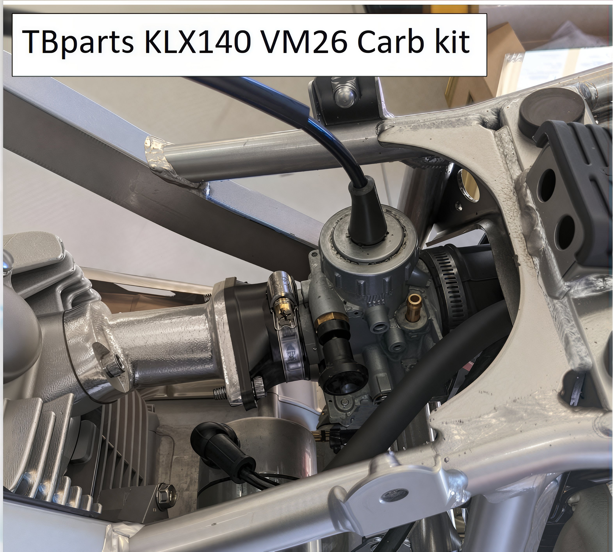
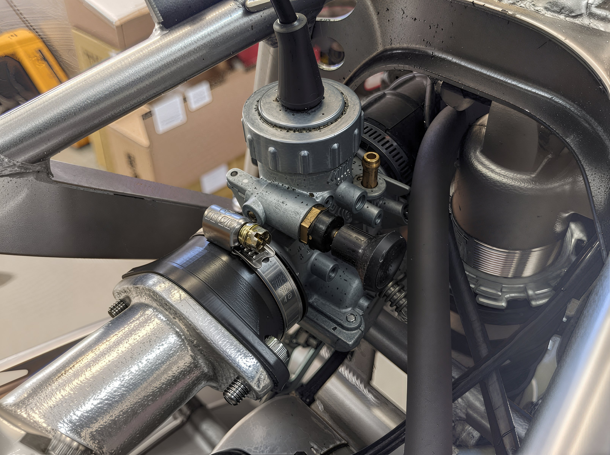
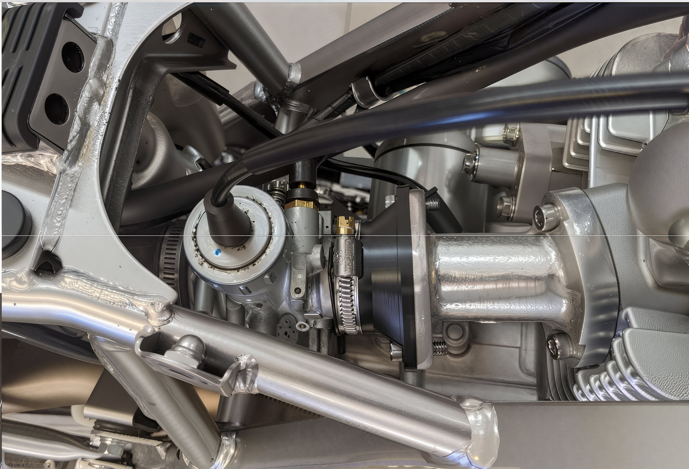
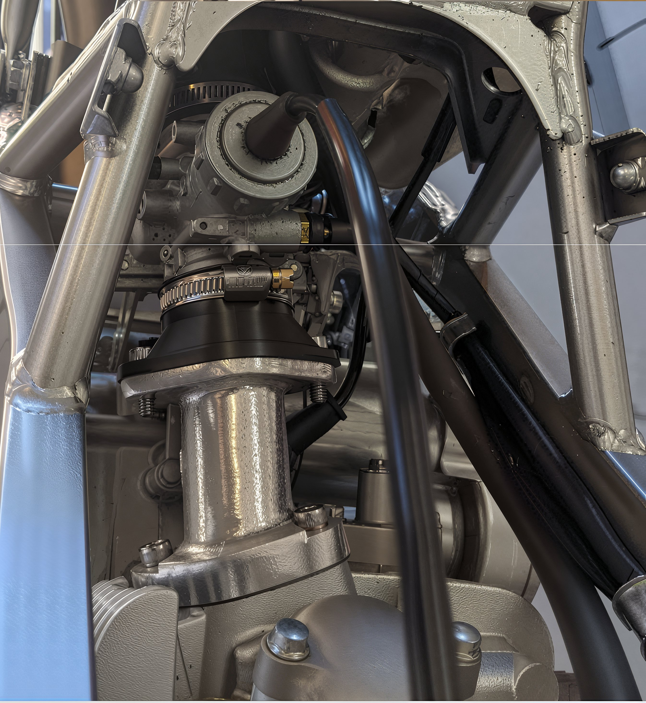
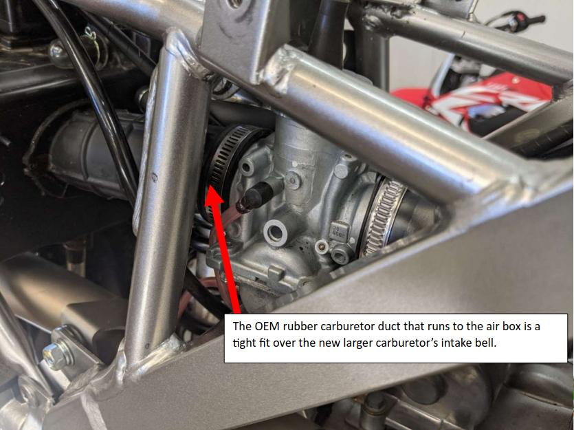
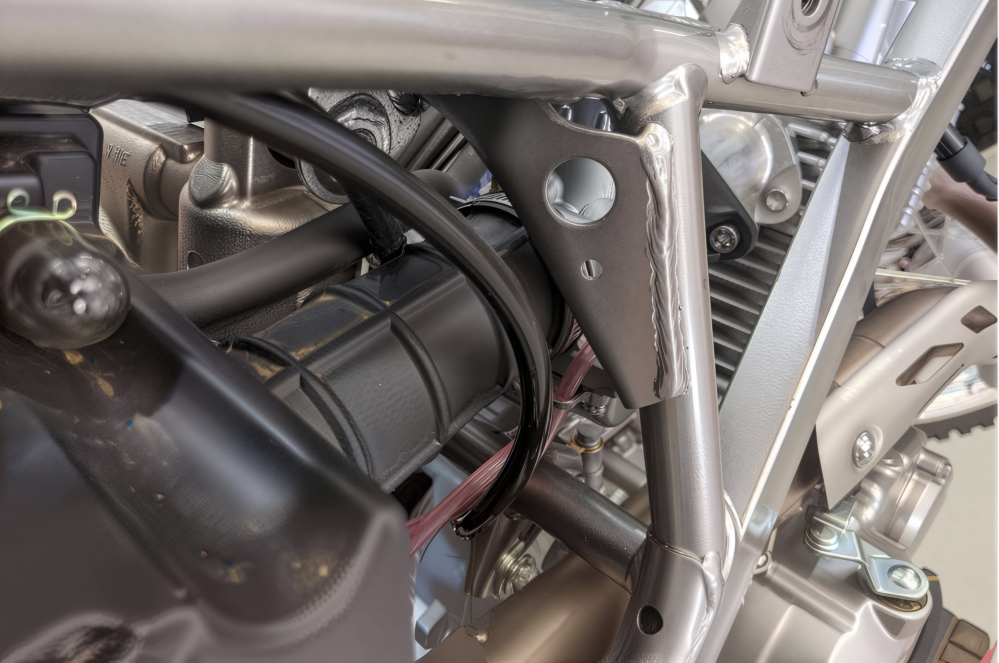

---
tags:
- carb
---

# KLX140 VM26 Carburetor Kit Installation Guide

### Baseline Jetting Specifications

- **Stock KLX140**: Pilot Jet - 22.5, Main Jet - 180
- **170cc Kit KLX140**: Pilot Jet - 22.5, Main Jet - 185

### Installation Tip

To facilitate the installation process, consider utilizing a heat gun or hair dryer to gently warm the air box boot, as it is designed to fit snugly.

### Installation Images

