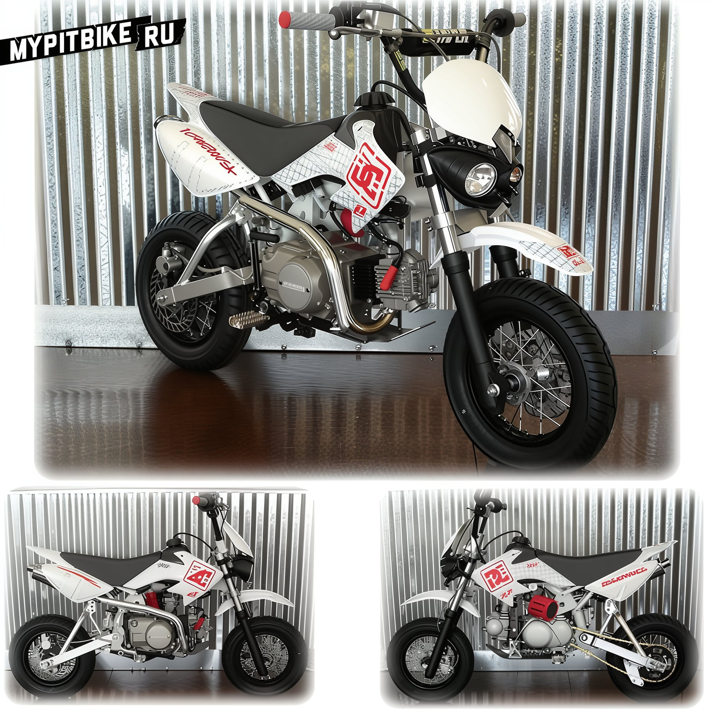

# Lighting kit for pit bike

On the pages of our website, we have previously discussed [how to install lights on a pit bike](http://mypitbike.ru/blog/tuning/17.html) and the available ready-made solutions. Recently, however, we came across this particular kit.  This is a complete set for installation on a Honda CRF50 or virtually any pit bike in existence. The kit includes:

- A headlight with high/low beam
- Mounting rubbers
- Wiring
- A handlebar switch control
- A voltage regulator
- and a **Generator with a lighting coil**

Thus, the kit is genuinely suitable for any four-stroke pit bike, even if the generator does not have a lighting coil. Here is how the headlight looks on a pit bike  [Priced at $174.99](http://www.ebay.com/itm/Headlight-Kit-Honda-CRF50-XR50-Head-lights-CRF-XR-50-CRF70-XR70-Pit-Bike-Pitbike-/390347849803#vi-desc)
