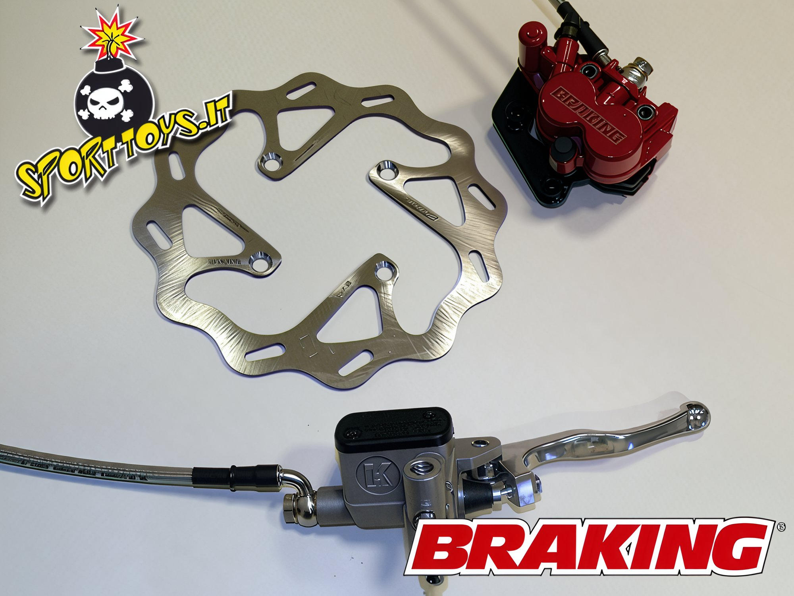
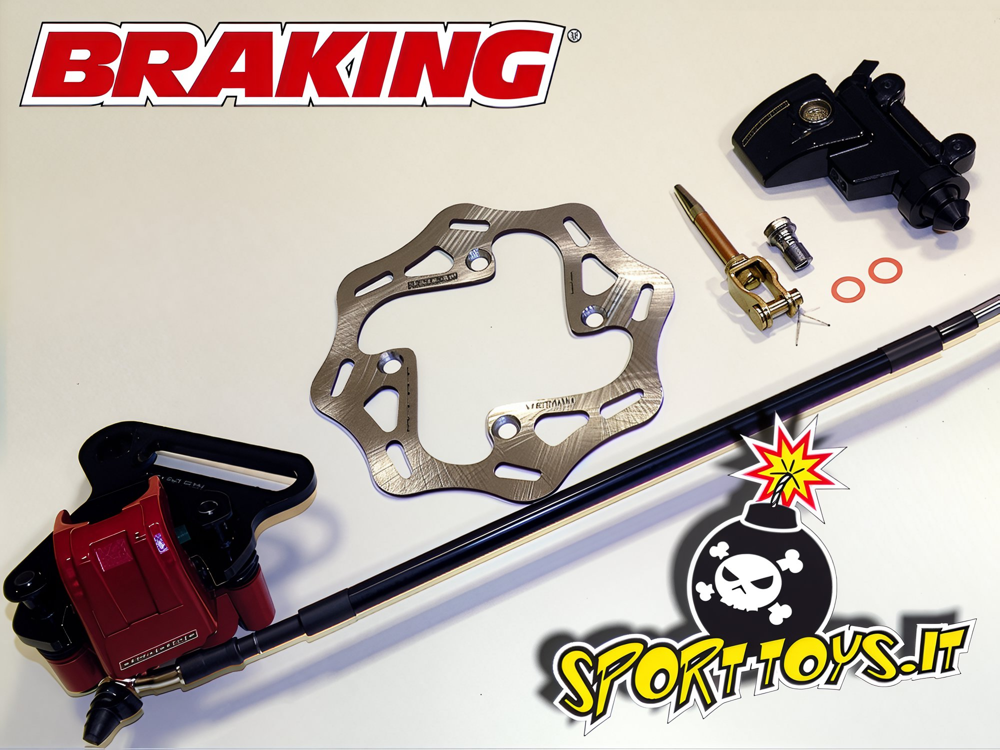
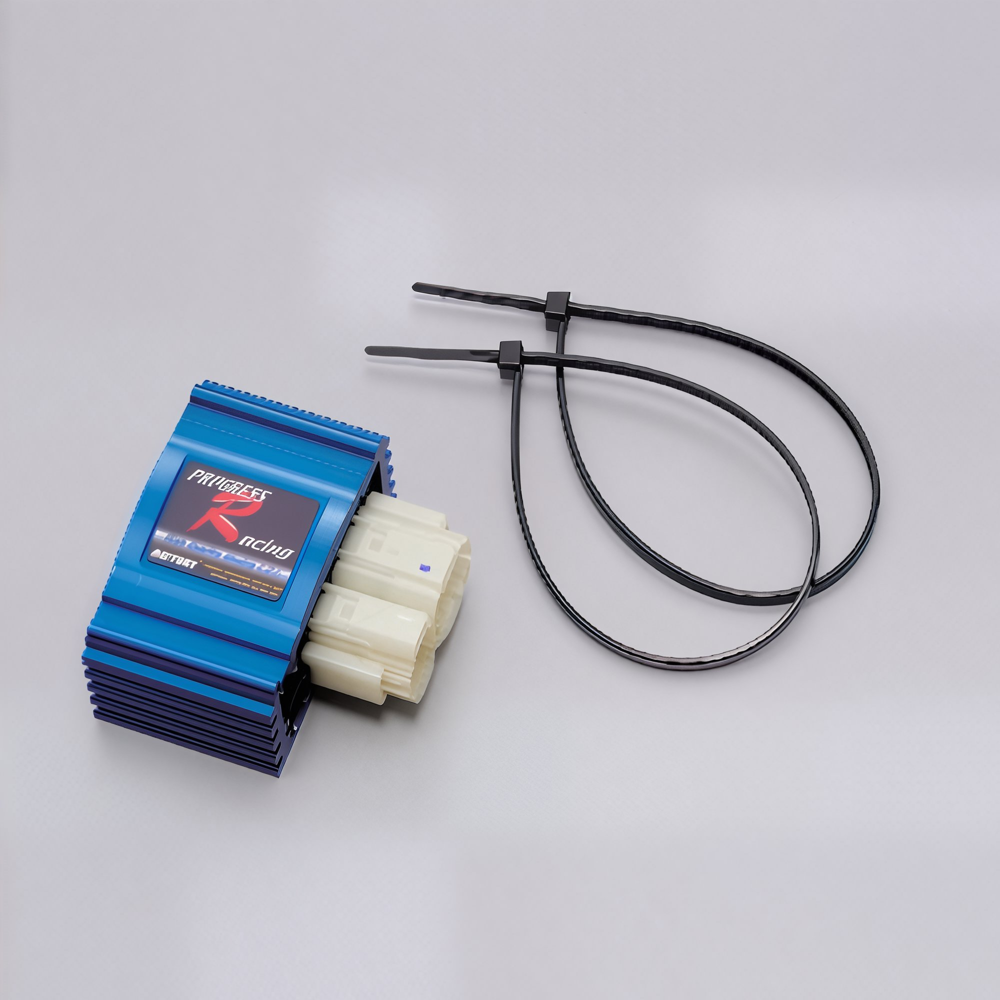
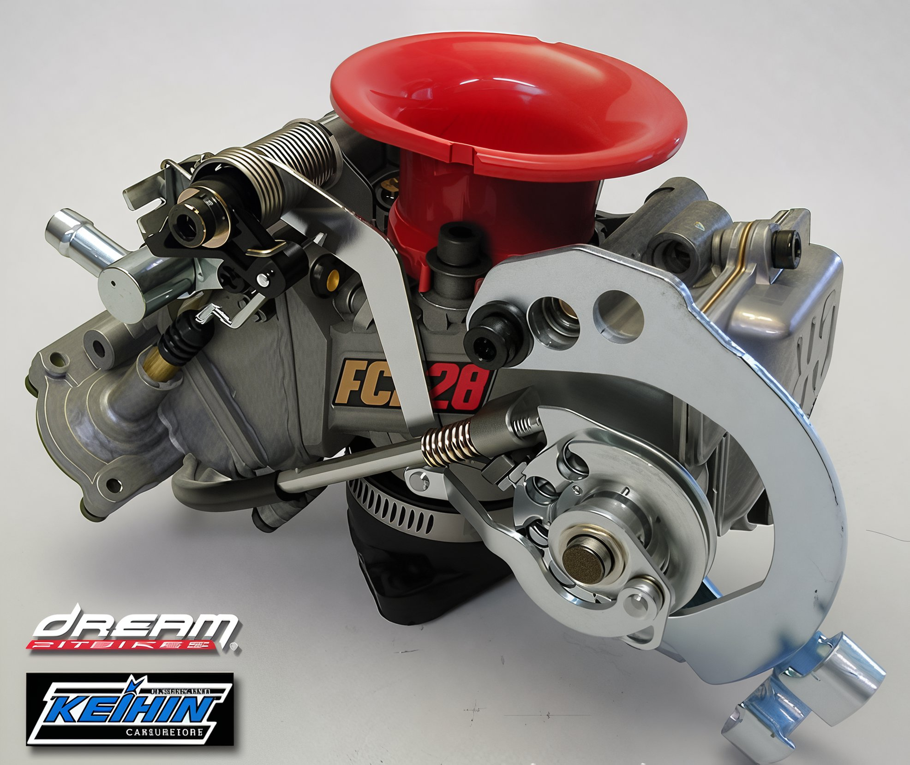
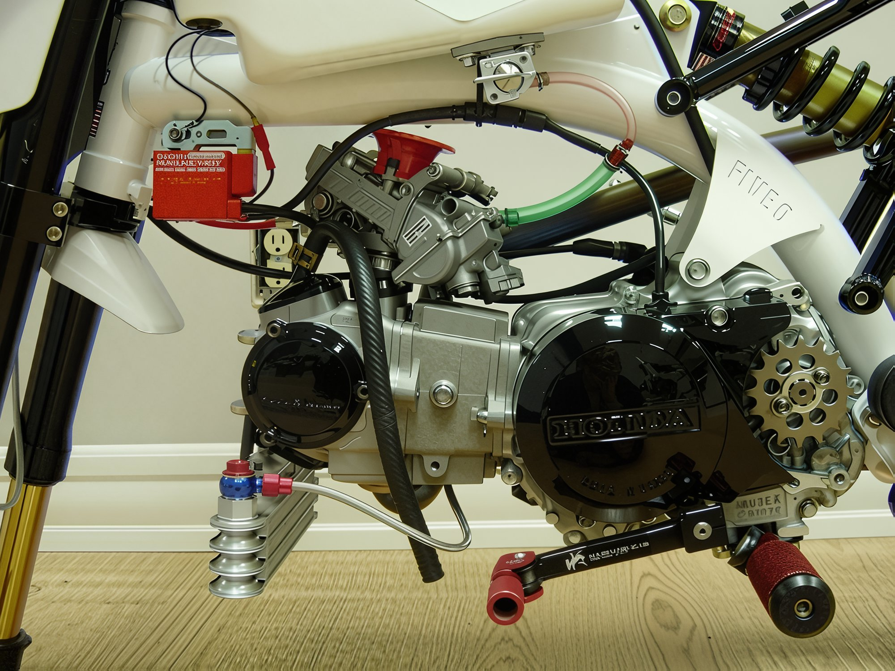
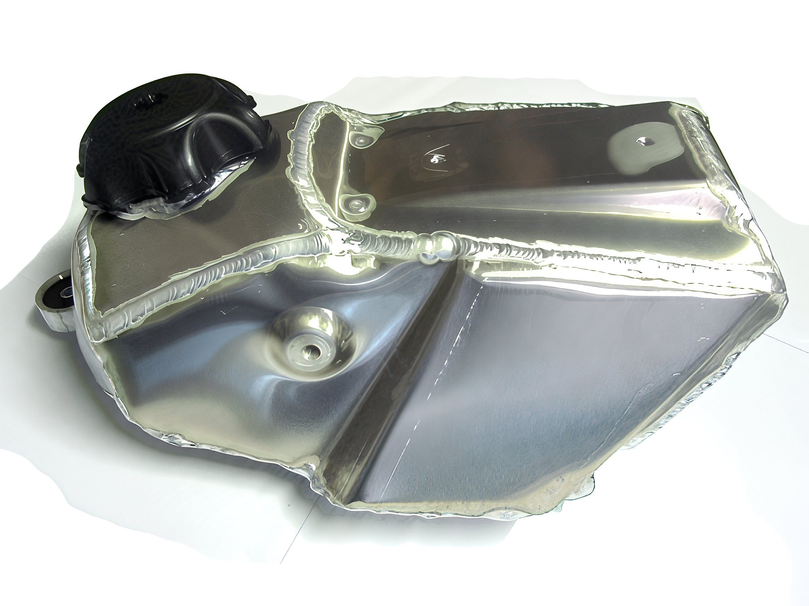
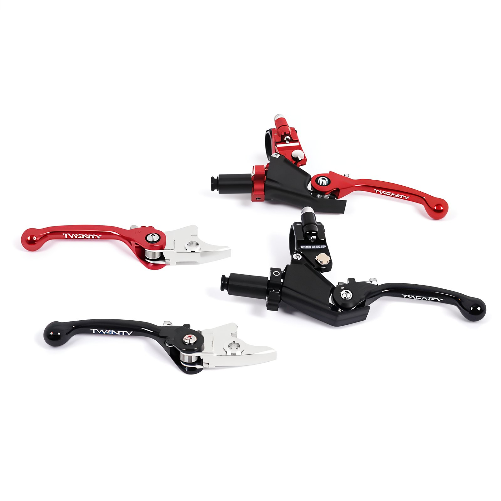

# Pit bike accessories

Small delightful pleasures that can uplift the owner's mood and enhance the pet's appearance and performance.  These cheerful, colorful chains are offered by the company **Renthal**.   This is a set comprising a master cylinder, caliper, and brake disc for superior stopping power for your pit bike, offered by the company **Braking**.  To increase RPMs and remove the limiter, **Daytona** produces racing CDI units **Progress Racing**, familiar to many from scooter tuning. The price is quite reasonable - **60 euros**.  After increasing engine capacity and RPMs, you must ensure the crankshaft can withstand the increased loads. For such cases, **Daytona** offers its reinforced crankshafts at a price of **195 euros**.  This is a decompression valve to facilitate engine starting. It costs **180 euros**.   The monstrous carburetor **Keihin** can prepare a sufficient amount of mixture for your souped-up engine.  A kit for converting a cross pit bike into a minimotard. It includes: low handlebars, grips, wheels with slick tires, a sprocket and enlarged brake disc, a two-piston caliper, and handguard protection.  I am not sure what needs might require an aluminum fuel tank. But such a tank exists for the **KLX** pit bike.  These handles will help give your pit bike a unique touch and won't break upon falling, thanks to their folding mechanism.
