# Pit bike engine tuning

If you type "Honda Super Cub" into a search engine, you'll find dozens of fan club websites for this machine. Their non-virtual love is fueled by an abundance of tuning firms supplying the necessary "hardware."

The market here is quite unique: scooterettes sell moderately well, "Monkeys," insanely popular in Britain and other countries, are virtually unknown, and the class of pit bikes has just started its journey on the tracks and has yet to gain widespread popularity. Mini-choppers like the Regal Raptor are somewhat popular, while the "Saxon" (in essence, Chinese) moped MadAss is off-putting because of its high price imposed by the Germans.

Mopeds are doing well, offered by half a dozen brands—AVM, C-Moto, GX, Irbis, Lifan, Reggy, Sagitta—which have already become "the first vehicle in many villages." What unites all these is the 50cc four-stroke engine, a clone of Honda's Super Cub, classified as a "moped" here. To recap, its size (cylinder diameter by stroke) is 39 x 41.5 mm.

Mopeds and scooterettes with larger displacements aren't imported because they fall under the "motorcycle" category and are subject to different customs duties. However, tuning parts and full kits for "Cub" engines started trickling in some time ago. While the selection remains limited, more options will likely become available over time. We covered a fairly simple and comparatively affordable tuning option for the "Cub" engine in the last issue. Now let's delve into the global market of "tuned fifties."

Although these engines and their tuning have existed for a long time, development continues along the path of "muscle building." Five years ago, an engine displacement of one-eighth liter (125cc) seemed the absolute limit. Today, equipment manufacturers have reached remarkable heights, and many components and parts are available for "simpler" engines.

For "fifties," kits (from the English "kit"—set) are available for increasing engine displacement, alongside high-tech options such as four-valve heads, or two-valve heads with "gigantic" valves, ceramic cylinders, and control units with adjustable settings. For those lacking time or the desire to tinker with kits, complete engines are produced by motorcycle manufacturers and tuning firms.

These can be divided into several types:
1. Genuine "Honda" engines, produced at numerous branches in Southeast Asia.
2. Chinese clones manufactured by over a dozen companies. These closely replicate the "Japanese" original source. Their displacement ranges from 50 to 125cc; engine cases differ in electric starter placement (on top, bottom, or absent). These engines boast a high degree of parts interchangeability, making them highly attractive for tuning, including in Russia.
3. New models from leading Chinese companies such as Lifan and Zongshen, and large Japanese tuning firms (Takegawa, Daytona, Yuminashi), and Germany's MSR. Their cases are initially designed for displacements above 125cc, yet retain a structure similar to the "Honda" bestseller, with many non-essential parts interchangeable.
4. Engines that resemble the original externally but are overhauled internally. Produced by such powerhouses as Yamaha and Kawasaki, as well as the smaller Italian Polini. These naturally have their own components and offer little interchangeability with Super Cub. Tuning availability is limited. They don't particularly matter to us...

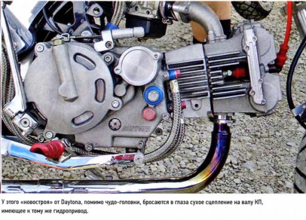

Chinese clones are diverse, as summarized in the table of main engine types. There's a plethora of kits, often negating the need for specialized sets by simply using stock parts from a higher-displacement engine. The simplest kit, designed for "fifties," involves a cylinder-piston group (CPG) of 47 mm, boosting displacement to 72cc. Apart from the piston and cast iron cylinder, the set includes a cylinder head with enlarged valve diameter and various gaskets, costing around 150 euros.

Without changing the stroke, you can reach 90cc; a cylinder diameter beyond 54 mm is constrained by the studs (72 mm between their axes). Such diameter cylinders come in various kinds, including aluminum with steel sleeves or even ceramic coating.

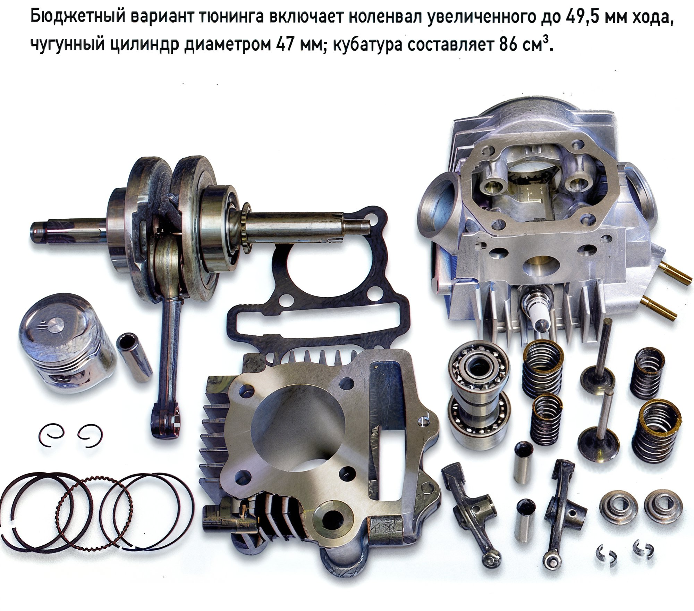

Then comes the step for those willing to replace the crankshaft for greater stroke (49.5 mm). Combined with an extremal-diameter cylinder (52.4 mm), you get 110cc displacement. Naturally, you must replace the cylinder head, timing chain, intake manifold, and install a larger diffuser carburetor. Such a set, which can be enhanced with a camshaft with extended phases, double valve springs, and larger valves, comes to about 500 euros.

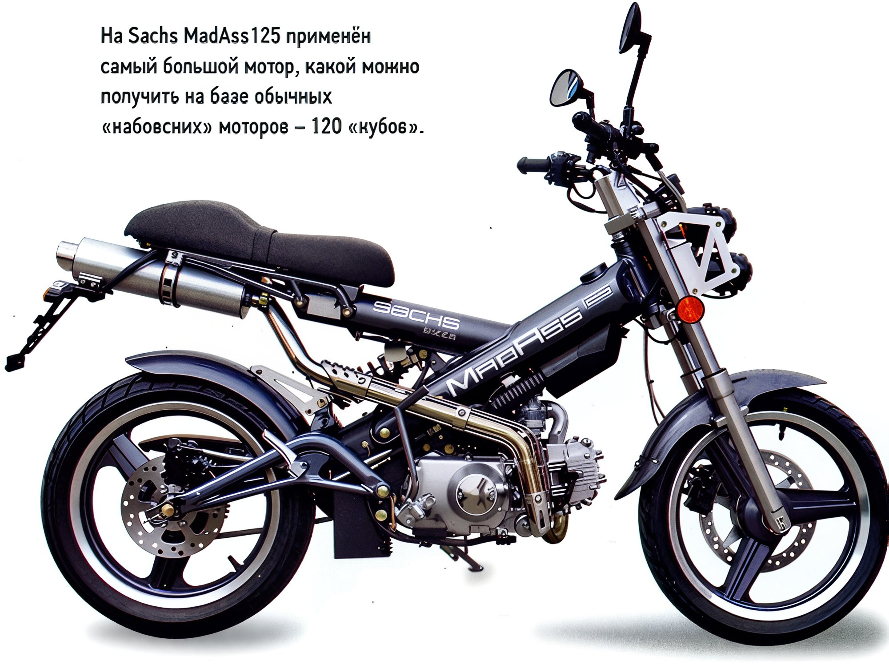

In some cases, fitting a crankshaft with an even longer stroke (54 or 55.5 mm) elevates displacement to a quarter-liter. An oil cooler becomes necessary. Such an engine by Chinese company FYM was briefly sold here and still serves its author well. As for tuning possibilities for standard "Cub" engines, the starting point is considered the original Honda Cub 90 engine (the "Chinese versions" don't quite fit here). Upgrading it to 110cc yields 8 hp, and upgrading to 125cc can reach 16 hp!

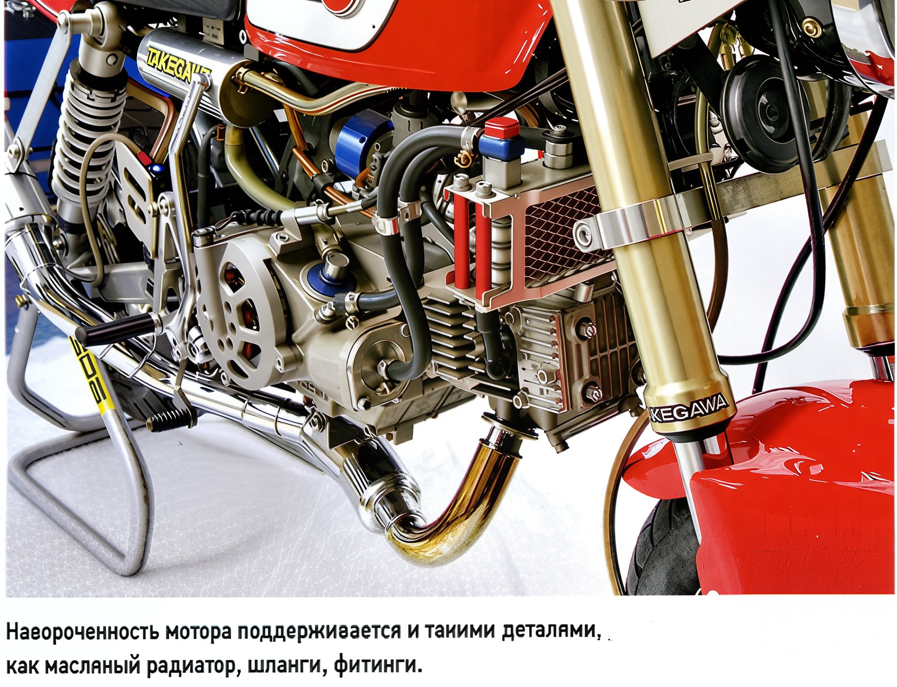

A breakthrough in tuning "Cub" engines, but in a different direction, was achieved by Chinese company Lifan (one of the recognized non-Japanese producers of such engines), which received European certification for a line of liquid-cooled 100/110/125cc engines. This "water-cooled" engine, with manual clutch and electric/kick starter, features a pump (on the right under the generator), thermostat, and radiator, which can be complemented with an electric fan.

These power units appear more impressive than "air-cooled" ones but have virtually zero tuning potential, and their stock power isn’t awe-inspiring: 6.8, 7.5, or 8.2 hp at 7500 rpm (compression ratio of 9.3). They'll likely settle into ATVs, where cooling is a significant concern. For "air-cooled" engines with standard engine cases, 125cc is the limit unless you employ cases initially designed for longer strokes and larger cylinder diameters. Furthermore, you must increase the lubrication system's efficiency and reinforce the clutch, typically mounted "properly" on the primary transmission shaft.

Basic motor specifications can be found in the table. It’s unsurprising that tuning has blossomed most in Japan, the homeland of "Cub" engines. The major companies Takegawa, Kitaco, Daytona have established production in Taiwan (often called New Japan), but you'll need to dismiss the idea of inexpensive modifications. However, the quality is outstanding!

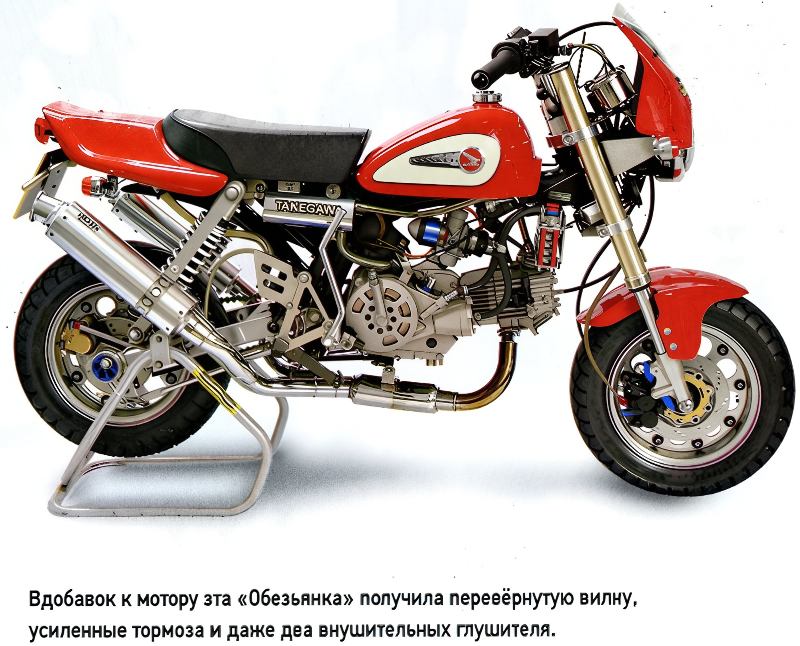

Takegawa became famous for "super heads"—with either two giant valves (sometimes made of titanium) or four valves. The company even developed a Guinness-Record-quality desmodromic four-valve DOHC head à la Ducati for the Honda Monkey, revealed at the Osaka motor show in 2003. However, due to its high price, it never reached market. For the Honda XR50R pit bike, a 125cc engine with a Superhead+R head—with two plugs and four valves, supported by roller rockers—is available.

Other engine highlights include dry clutch with hydraulic drive and a five-speed (!) close-ratio gearbox. The price—don't fall off your chair!—is approximately $5000.

Another Japanese firm, Daytona Corporation, boasts considerable experience (since 1972) in producing tuning motors for Monkey-type machines and pit bikes. Their "toys," in the form of pre-built engines starting at 125cc, are not cheap—owners of Monkey bikes are known to shell out up to 3000 pounds. The latest offering is a 150cc engine, which delivers 18 hp (at 10,000 rpm) in stock, notably at the wheel; the racing version reaches 23 hp.

But this isn't the limit—a 26 hp tune is already on the horizon! It’s the first to apply a four-valve DOHC cylinder head (valve diameters 21/18 mm), with a compression ratio of 12.5. An enhanced five-disc "manual" transmission clutch on the main gear shaft completes the package; engine start is kick-start only. For Daytona motors' ignition systems, the company offers a racing kit with a digital CDI block featuring two or four setup modes.

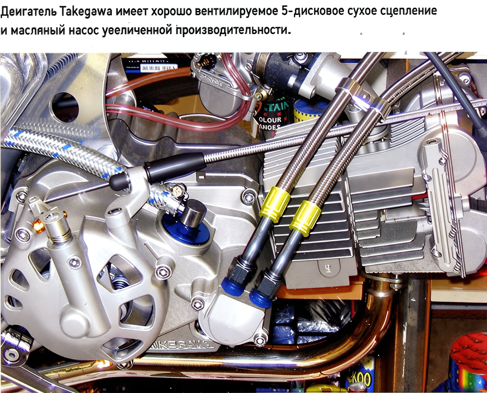

Another renowned Japanese tuning company is Yuminashi. Among its portfolio, the HK180R-HPL engine for monkey bikes stands out as one of the most "serious" models – rated at 181.67cc. It astounds not only in its "pot" capacity (64 mm diameter) but also with features like a four-valve head, Nikasil-coated cylinder, six-disc clutch, and a Keihin carburetor with a 026 mm diffuser...

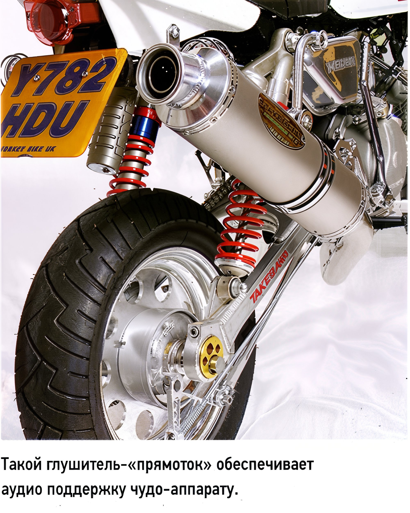

The Europeans may lag behind in terms of involved companies but excel in product quality. The most notable (and available in Russia) is the Bavarian MSR. It birthed three Monster Engine modifications. The first engine—displacing 138cc—generates just over 10 hp, retailing in Germany for 549 euros. Launched in late 2006, it acted as a springboard for further "muscle building." The more extreme Monster Engine III (141cc, 15 hp) features outlets for an oil cooler, and is equipped with Daytona's adjustable ignition. A kit is available for this engine (priced at 399 euros in Europe) to boost the displacement to 162cc.

The more advanced model, with a cylinder diameter of 67 mm, racing camshaft, ceramic cylinder, and reduced height piston, lightens the Bavarian racers' wallets by 999 euros. Another kit offers an enlarged CPG diameter of 59 mm and a crankshaft with a 64 mm stroke to achieve 175cc.

The latest "menacing" monster from MSR is the Monster Engine +R, launched in early 2008. Its capacity impressively stands at 187cc (67 x 53 mm dimensions). A compression ratio of 12 and the application of larger valves (30 mm intake and 24.5 mm exhaust) allow this engine to produce more than 20 hp at 10,000 rpm in standard trim. The price also impresses: 1899 euros in its homeland.

In the pipeline is a near-fantasy "Cub" engine (if it can still be named that) from M5K, displacing 220cc. The prototype was crafted by German Arno Schwendner, based on the 150cc MSR "monster."

Let's return to earth, focusing on native Chinese producers. In China, they aren't sleeping either: simultaneously, Lifan and Zongshen began producing large-displacement motors. The 150cc Zongshen features valves with diameters of 23 and 28 mm and a motorcycle-style external rack tensioner for the timing chain (all "Cubs" typically have the original hydraulic tensioner and guide roller).

The clutch remains on the crankshaft, actuated manually. The cylinder head comes with a larger adjustment hatch (oval, secured with two bolts instead of the usual threaded cap). Oil is fed to the head not through a channel in the cylinder and head body but via an external tube, improving reliability and eliminating seal issues. Naturally, it includes outlets for connecting an oil cooler.

Moreover, there's a record 195.6cc "water-cooled" engine, but it's intended solely for ATVs. Meanwhile, Lifan offers a 150cc version delivering 16 hp in stock (at 7500 rpm), employing a two-valve head (27/23 mm) and an aluminum cylinder with a ceramic coating. Also noteworthy are the five-disc "manual" clutch on the main transmission shaft, cartridge oil filter, and digital CDI ignition. Price - 400 euros.

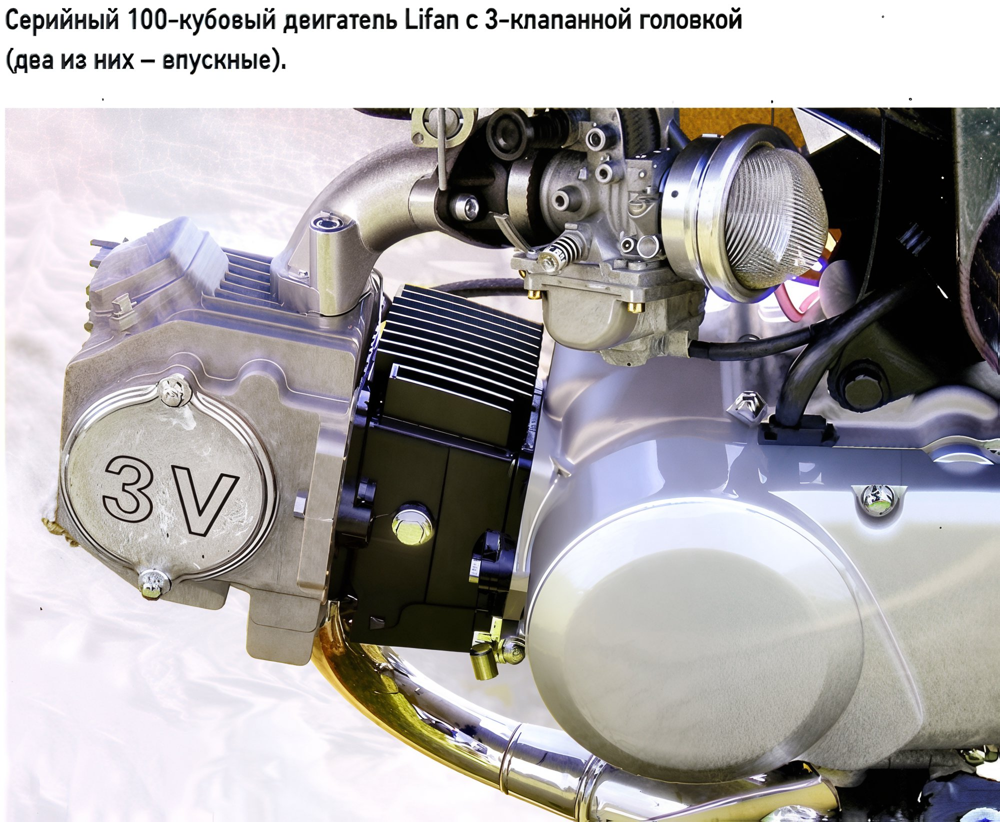

The main advantage of the "Chinese" market—affordability—is appreciated worldwide. Why spend thousands of dollars on tuning a small-displacement engine when you can buy a factory engine with inherently greater power and displacement? The main appeal is that all "Cub" engines, including the "monsters," possess identical installation dimensions, fitting perfectly even into the oldest "Monkeys" and pit bikes, as well as scooterettes. So they have a promising future, including in Russia.

*Moto Magazine 01/2010*

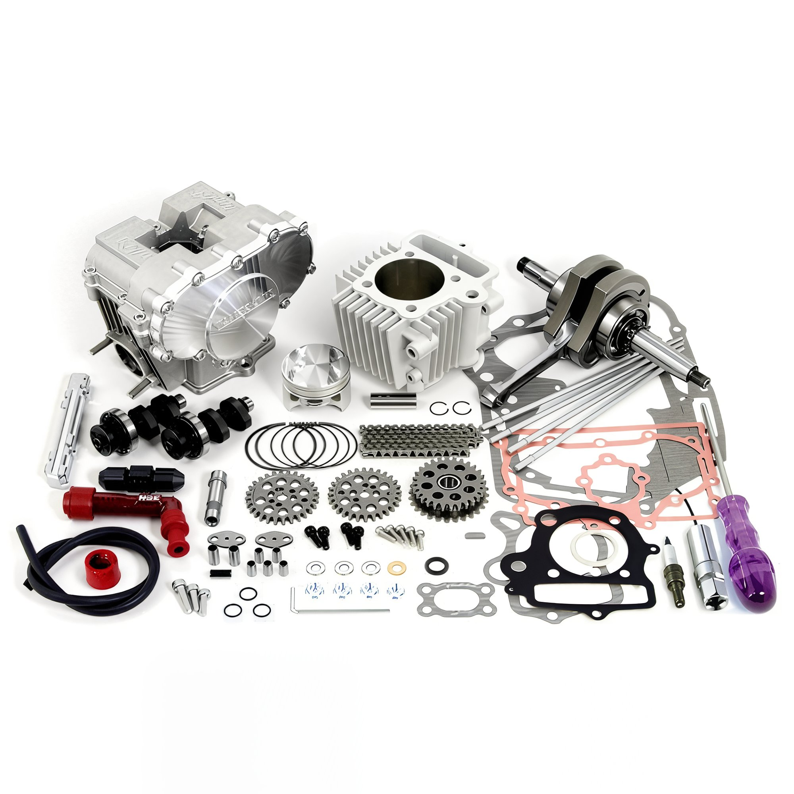

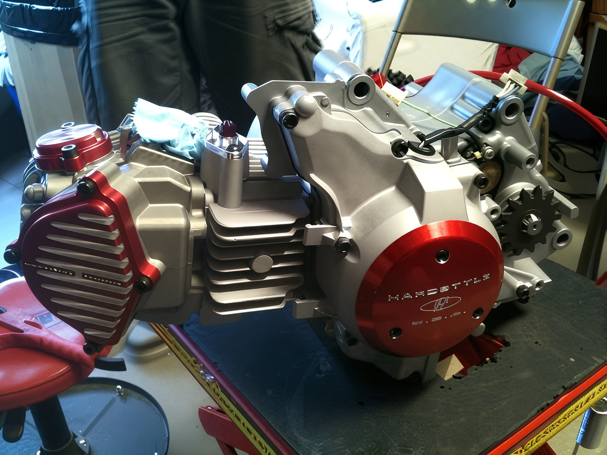

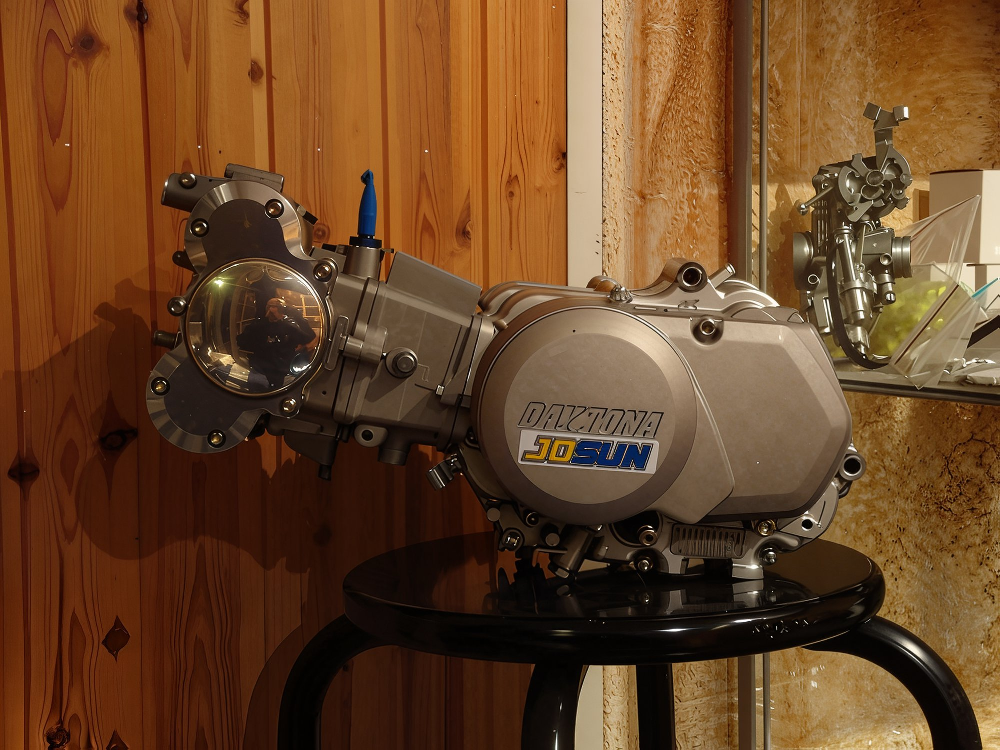

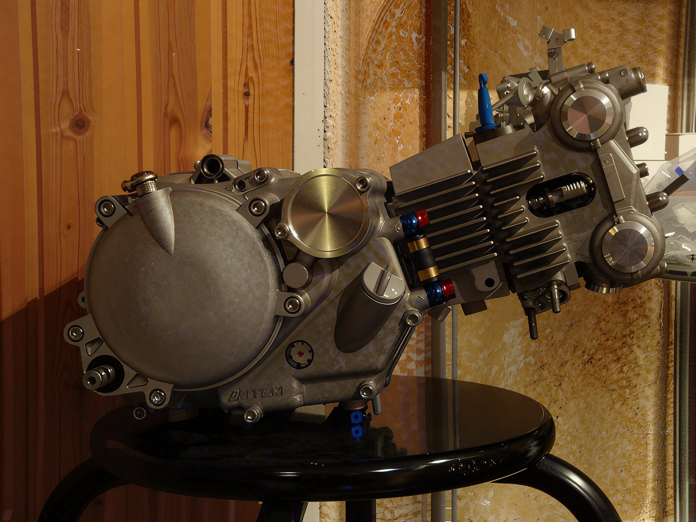
