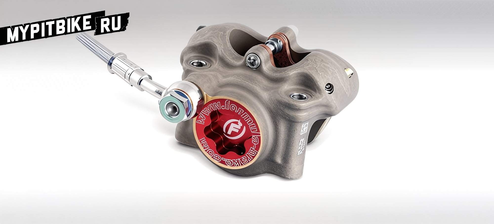
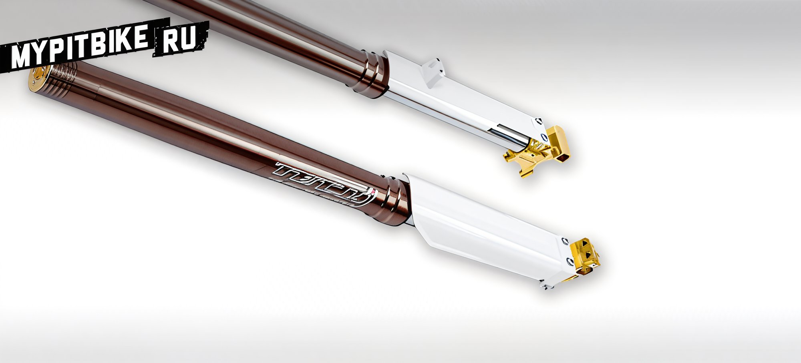

---
tags:
- brakes
- suspension
---

# Pit bike tuning components

The Italian company Formula has unveiled its tuning kits for pit bikes. Formula was established in 1987 by Andrea Becocci and Daniela Frati in the city of Prato, Italy. Initially, the company focused on manufacturing high-quality wheels and brake kits for motorcycles. However, in 1993, a pivotal decision was made to produce brake discs for mountain bikes, marking a turning point in the company's history. Today, Formula produces top-tier components (brake discs, fork tubes, wheels, etc.) for bicycles and motorcycles, successfully competing with leading manufacturers of tuning components. Currently, Formula offers the following tuning for pit bikes:

## Brake Master Cylinder and Caliper Kit

The Formula brake kit for pit bikes is designed exclusively for use on small motorcycles. Tested in races under various conditions, these powerful brakes have proven their reliability in the European and Italian championships.  

  

  

  

**Technical Specifications:**  

Front Brake Master Cylinder  
- 11 mm piston
- Cast body
- Forged lever with free play adjustment

Front Brake Caliper  
- Monolithic body
- Radial mounting
- New piston

Rear Brake Master Cylinder  
- Cast body
- Anodized piston
- Integrated fluid reservoir
- Inspection window

Rear Caliper  
- Monolithic body
- Radial mounting
- Two 22 mm pistons  

## Fork Tube Kit

Designed for mini motocross and pit bikes. The rigid 39 mm stanchions are paired with a lightweight aluminum alloy, race-inspired to deliver precise road feedback. From its inception, this kit has gained recognition among riders in classes such as supermoto and pit bike, becoming a leader in mini motocross competitions.

- Anodized aluminum cups
- Chromed metal tubes
- Forged and anodized aluminum mounts, also available for radial calipers
- Plastic guards included
- Adjustable compression and rebound
- High-quality oil for long-lasting service
- Low-friction bushings
- Specially designed seals for extreme conditions  

  

  

**Technical Specifications:**  

- Cross/motard/mini motocross variations
- Axial/radial caliper mounting
- Diameter 39 mm
- Compression and rebound settings
- Length 770 mm (720 mm in motard version)
- Travel 230 mm (180 mm in motard version)
- Weight 6.3 kg
