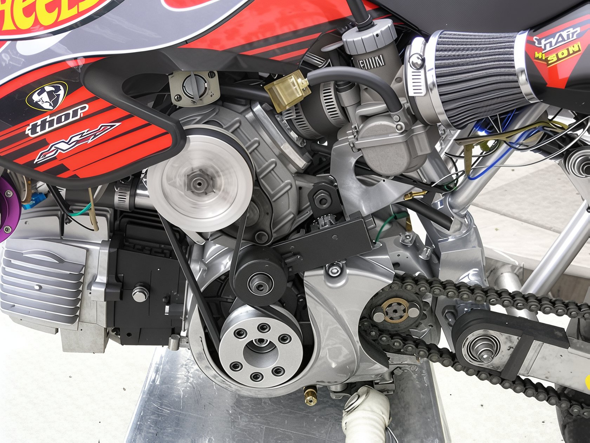
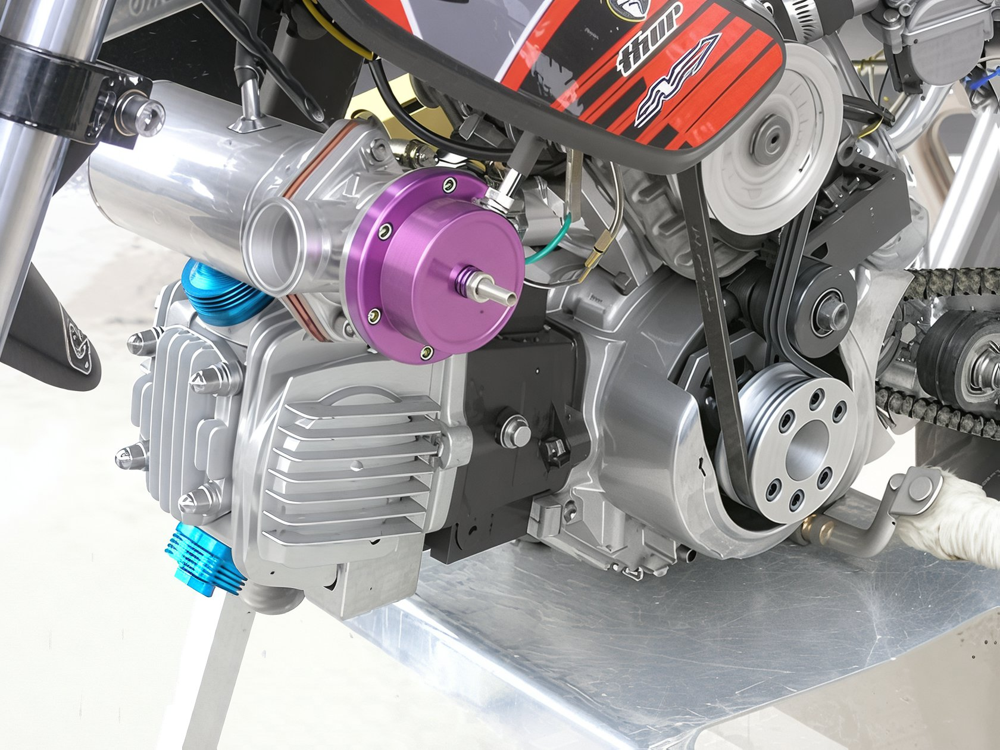

---
tags:
- engine
---

import YouTubeEmbed from '@site/src/components/YouTubeEmbed';

# Pit bike turbocharger

It seems that manufacturers have realized that further growth in volume is nearly impossible, and have decided to focus on extracting maximum power from the pit bike engine by any known means. The Japanese company **Daytona** has developed a mechanical supercharger (commonly known as a turbocharger) for the pit bike engine. It is designed to work with engines from the same manufacturer, but it is quite likely that it will also be compatible with Chinese-made engines.

The cost of this marvel and its release date remain unclear, but judging by the graphs, the supercharger promises an endless increase in power across the entire range of revolutions.

<YouTubeEmbed videoId="VTzB2w1GkCo" />

However, Daytona is not the only one making strides in this area. Ingenious enthusiasts have already adapted a supercharger to the Honda Cub engine.

