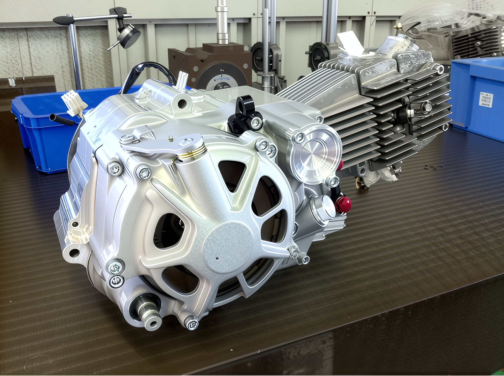
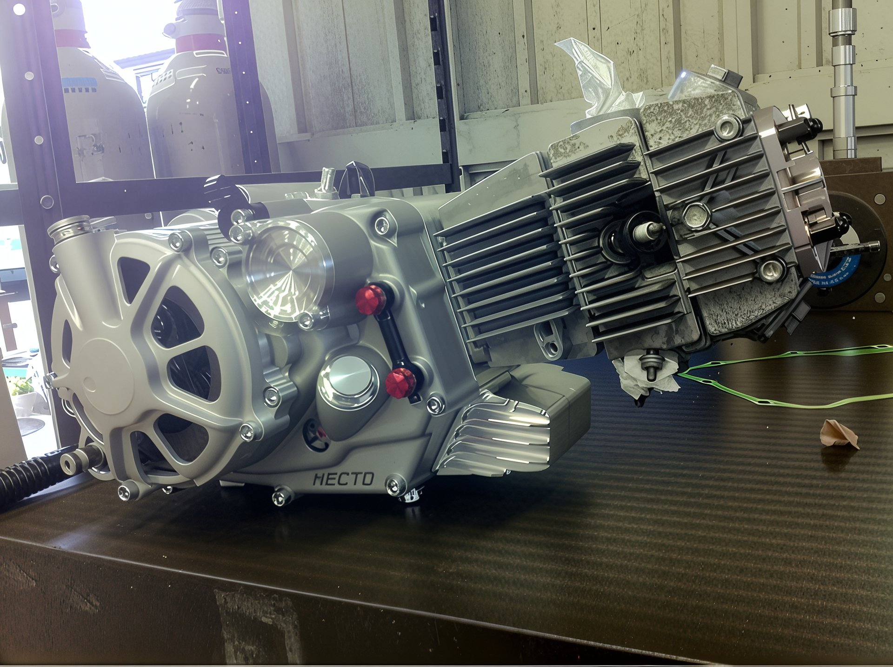
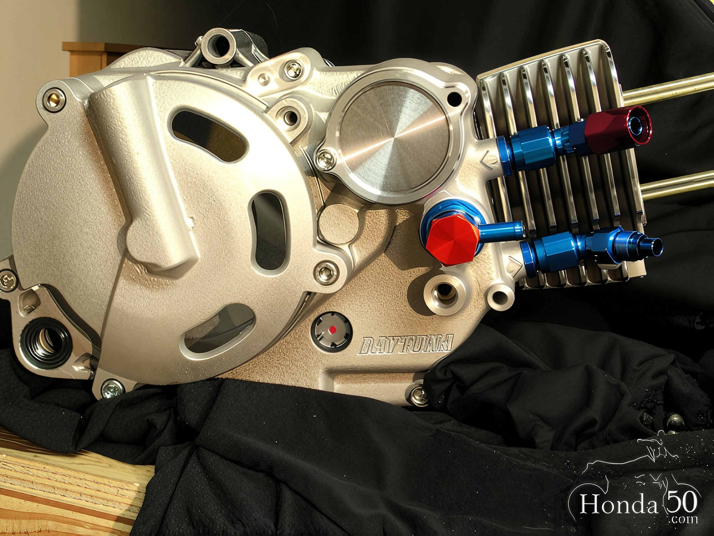
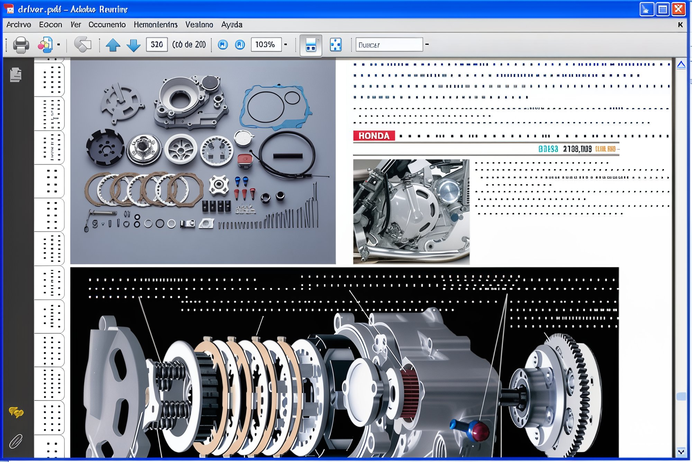
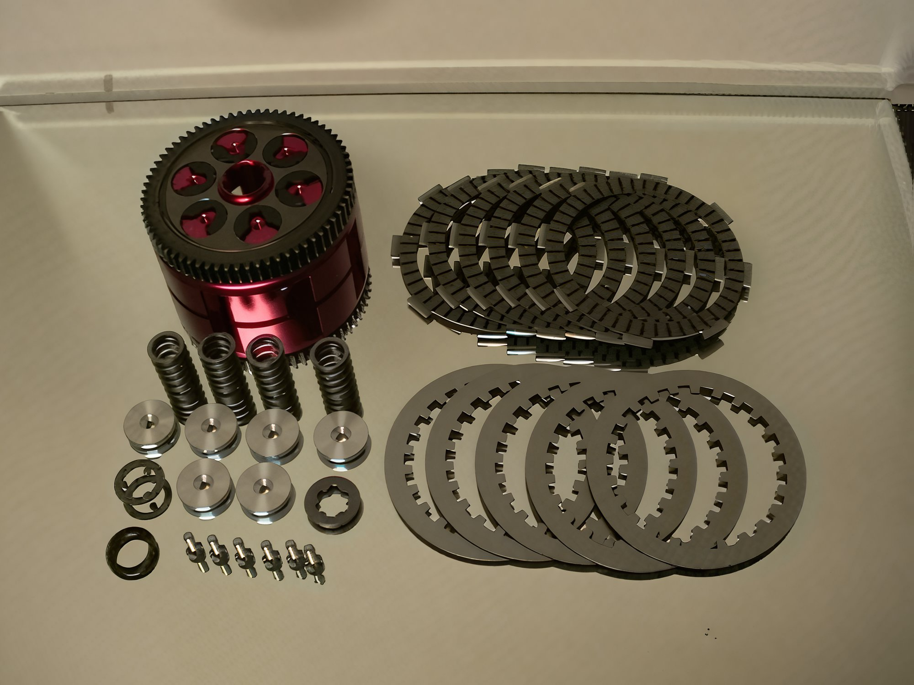
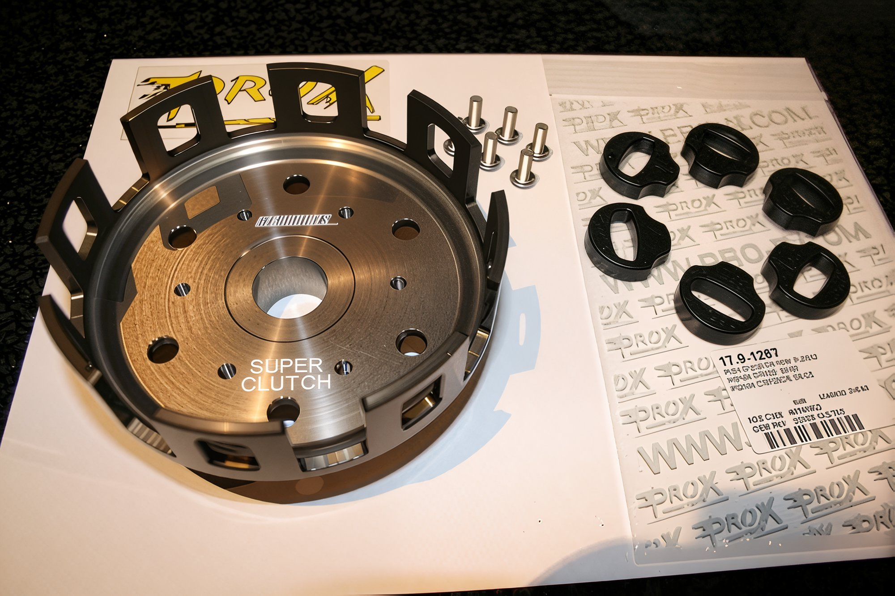

---
tags:
- clutch
---

# Refinement of Pit Bike Clutch

Leading manufacturers of pit bike tuning kits also offer clutch tuning sets.

The company **Takegawa** presents the **Necto** kit. The set includes: a clutch cover, housing, basket, five friction discs, transmission shafts, fork, and related items. This kit alters the lubrication system, and the clutch no longer operates in an oil bath but functions "dry."

A similar kit is offered by the company **Daytona**.

These are racing tuning components.

A six-disc sports clutch. Price **250 euros**.

Clutch components from the company **Prox**.

**Takegawa** offers its clutch kit for Chinese engines.

This special clutch cover, with an integrated piston connected to a lever mounted on the handlebar, converts the clutch disengagement from cable to hydraulic. Designed for **Lifan** engines. Priced at approximately **100 euros**.

A similar conversion from cable to hydraulic clutch disengagement, but for other types of engines. Cost **700 euros**.
