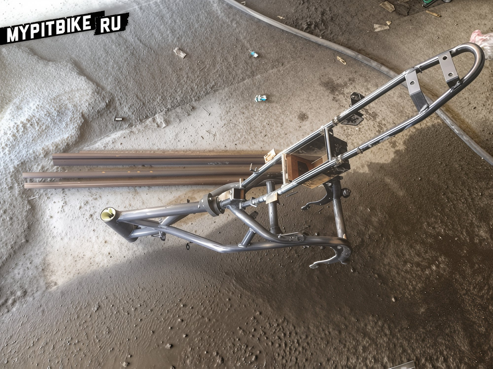
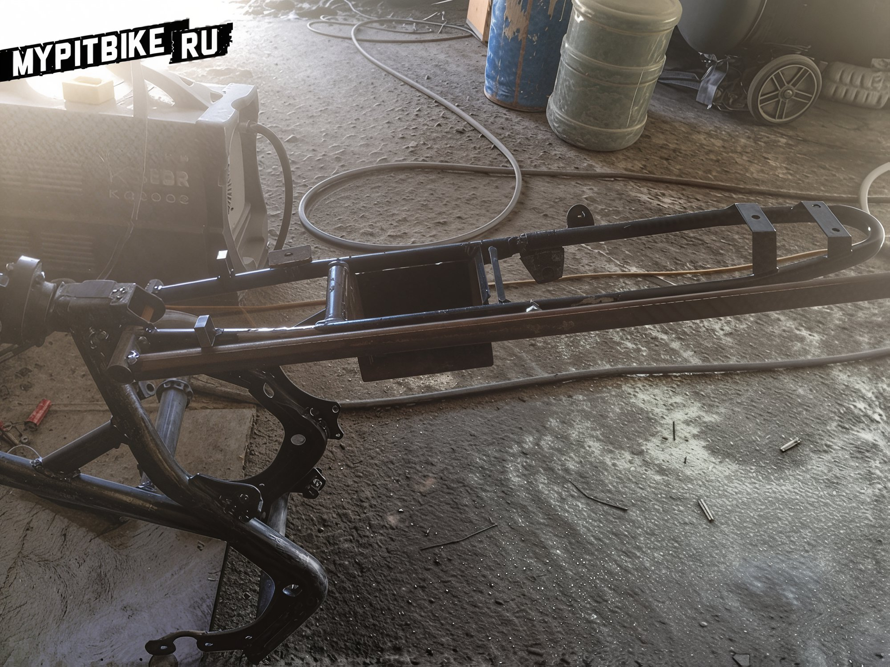
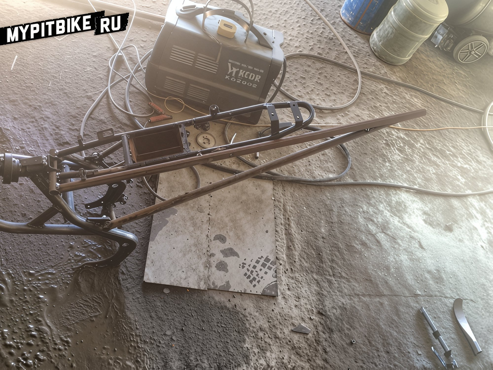
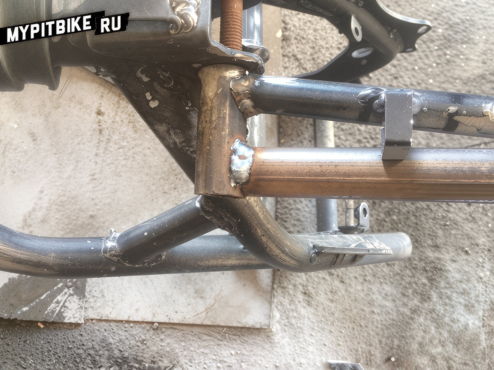
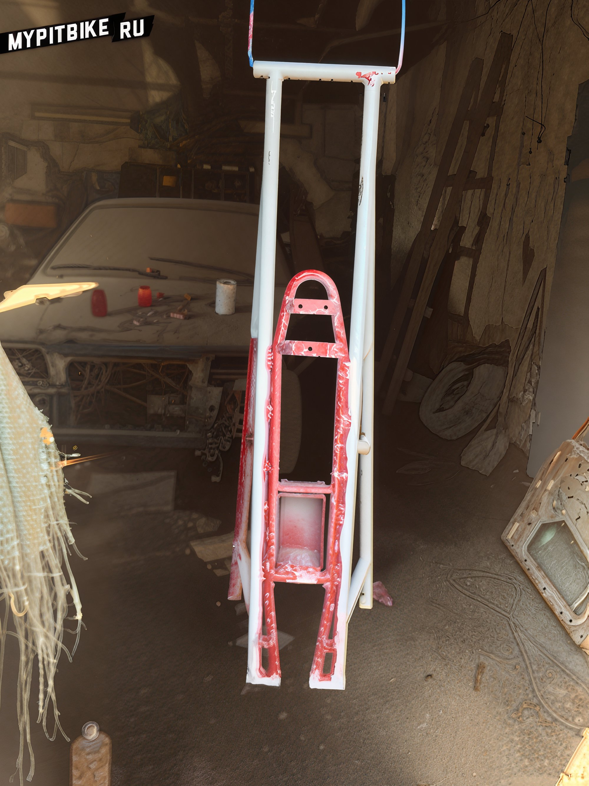
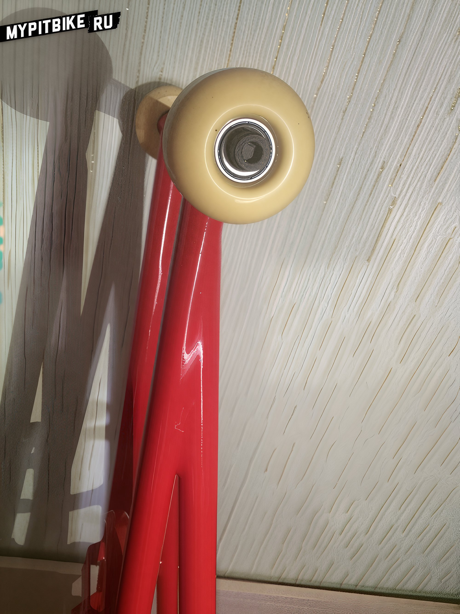
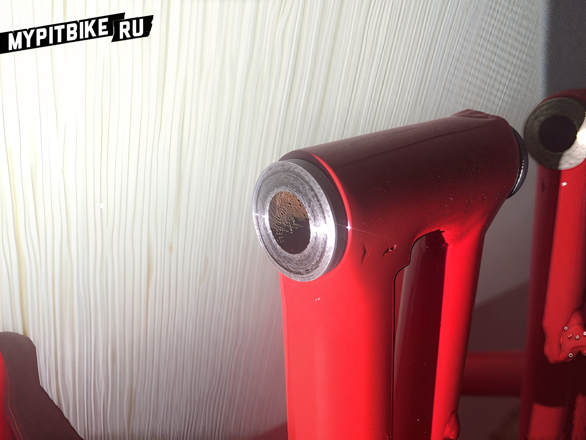
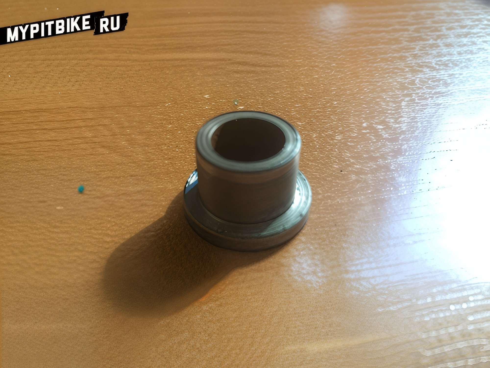
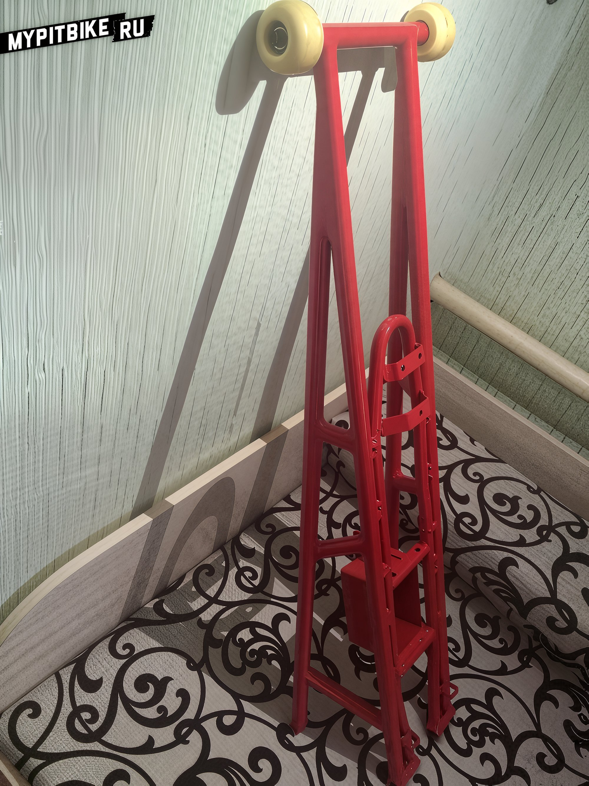

---
tags:
- chassis
- stunt
---

# Removable clamp for pit bike

**The inception of my grab rail commenced with the acquisition of a 6-meter pipe, possessing an internal diameter of 15 mm and an external diameter of 21 mm. Utilizing the upper section of the factory subframe as a foundation allowed us to avoid modifications to the mounting points for the seat plastic and battery box.**

Below, observe the fabrication process.

Initially, I tack-welded all joints prior to the final assembly of the entire structure.

Subsequently, I welded reinforcement ribs and affixed the nuts for wheel attachment. Use any nuts compatible with wheel bolts—mine were size 8 nuts.

Next, we clean the welds, apply putty, prime, sand, paint, and enjoy the results.

As you may have discerned, bushings had to be inserted into the upper mount of the grab rail; these were pre-machined by a turner, given that the internal diameter of the tubes is 15 mm while the bolt's external diameter is 10 mm.

