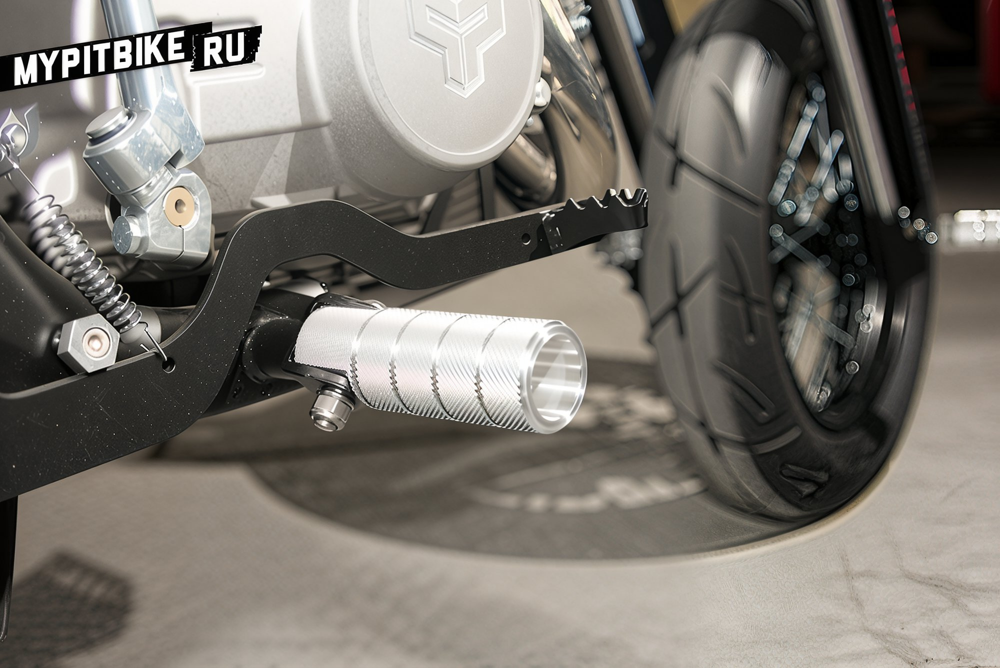
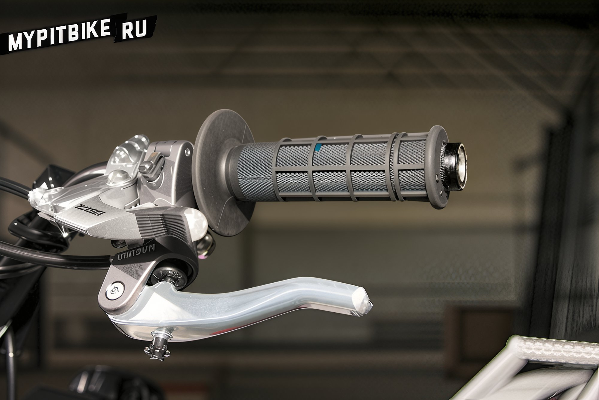

---
tags:
- chassis
- stunt
- brakes
- controls
---

# Stunt Kit for Pit Bike

The team at **ThisSideUp** has crafted a set of components to transform a pit bike into a stunt machine. This kit includes a reinforced subframe with a grab bar, aluminum rider footpegs, rear footpegs, an adapter for an additional brake caliper, pegs for the front and rear axles, and a device for easy clutch engagement.

Here is what they have to say about their kit:

Hello, we are pleased to present a set of tuning parts for preparing the **PitsterPRO** pit bike for stunt riding. The first pit bike of this series was developed in collaboration with professional riders **Marat Kankadze** and **Yura Verkhnikov** for stunt riding training at the PRT team school.

After a series of modifications and tests, we are ready to offer you a complete concept for preparing the PisterPRO pit bike for stunt riding. This model is suitable for both beginners and advanced riders. We are also finalizing the development of a PRO model for advanced riders.

Instead of the standard pit bike tail, a reinforced one made from seamless steel tubes is installed. The tail is equipped with mounts for rear footpegs, allowing for a variety of tricks to be performed on this pit bike. The footpegs themselves are made from D16T aluminum alloy. The footpeg pegs, like the grab bar, have a textured surface to prevent foot slippage during riding.

The standard rider footpegs are replaced with non-folding pegs, which are more convenient than the standard ones and serve to protect the pit bike in case of falls.

The hand brake or hydraulic rear brake duplicator allows for numerous tricks when it is impossible to control the rear brake with the foot. The front caliper from PitsterPRO is used as the second caliper. A device for easy clutch engagement is also installed.

If desired, pegs can be installed on the front and rear wheel axles, which not only allow for a variety of tricks but also provide additional protection in case of falls.

**And now, the cost of all this:**

- Tail with grab bar - 9900 RUB
- Rear footpegs - 6000 RUB
- Rider footpegs - 1200 RUB
- Adapter for additional caliper installation - 2500 RUB
- Axle pegs - 1200 RUB
- Axle for peg installation - 1300 RUB
- Easy clutch engagement device - 2000 RUB
