---
tags:
- carb
- piston
---

# Big Bore Kit Installation Guide

**Note:** The 88cc kits are engineered to maximize the size of the Honda 50. Consequently, the cylinder skirt is minimized and may fit snugly into the engine cases (spigot hole). It is advisable to test fit the cylinder prior to piston installation. You might encounter some surplus gasket material that needs removal. Additionally, it may be necessary to use a scotch brite pad on the cases (spigot hole) to ensure a proper fit. Ensure the cases and cylinder are well-lubricated.

## Installation Instructions

### Preliminary Step
Before proceeding with the installation of a big bore kit, it is recommended to first install a high-volume oil pump. This pump can deliver up to 300% more oil to the top end, significantly extending the engine's lifespan.

### Installation Steps

1. Place a clean rag behind the piston to seal off the crankcase.
2. Insert a c-clip into one side of the piston. Compress the c-clip just enough to fit it into the piston, and take note of its position once installed.

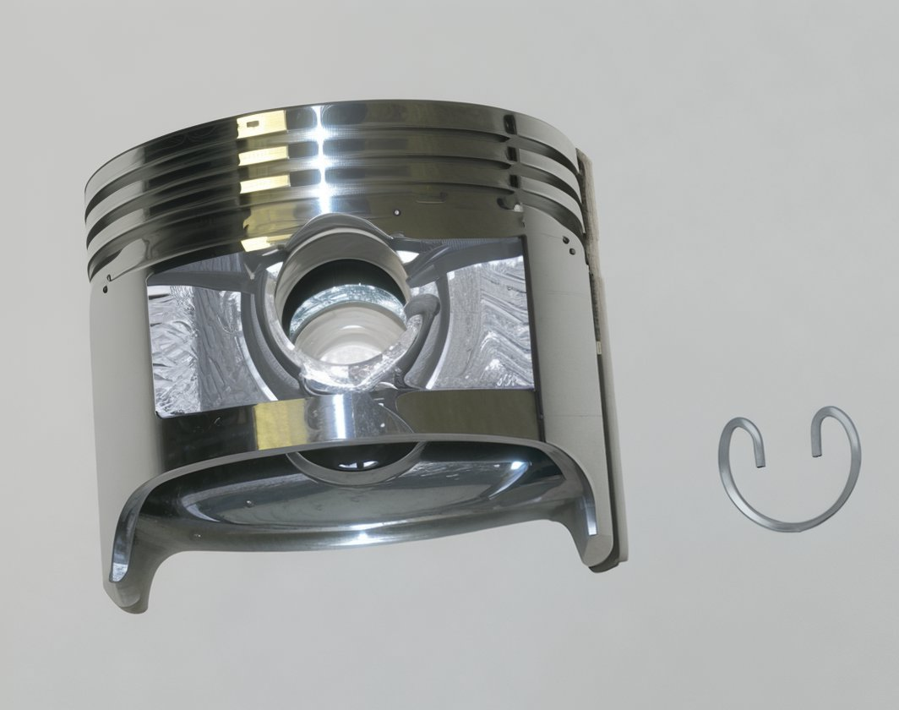 

3. Install the thin retaining rings and the wavy oil ring onto the bottom groove of the piston. Carefully slide one thin retaining ring on, followed by the wavy oil ring, and then the other thin retaining ring. Ensure that the gap on each ring faces the opposite direction as depicted.

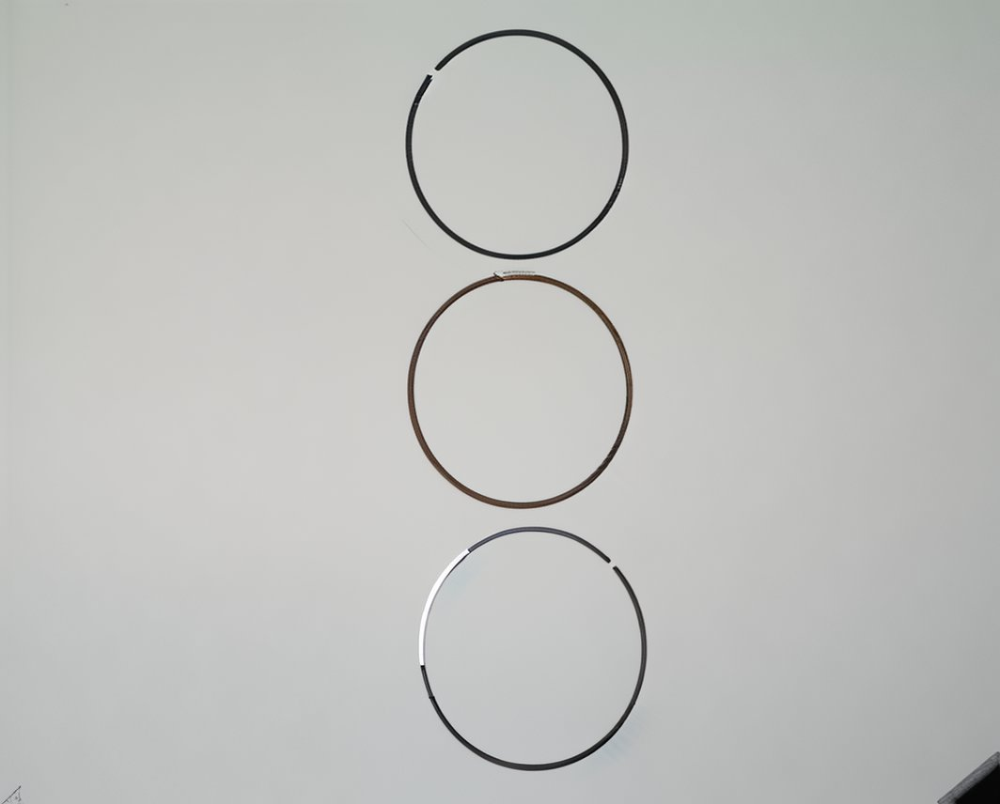 

4. Install the lower piston ring (flat black in color) onto the lower groove in the piston. Afterward, install the upper ring, which is shiny. Ensure the gap opening on each ring faces the opposite direction.

 

5. Lightly coat the wrist pin with clean motor oil.
6. Attach the piston onto the crankshaft and secure it with the wrist pin. Ensure the “IN” marking on the piston is facing upwards.

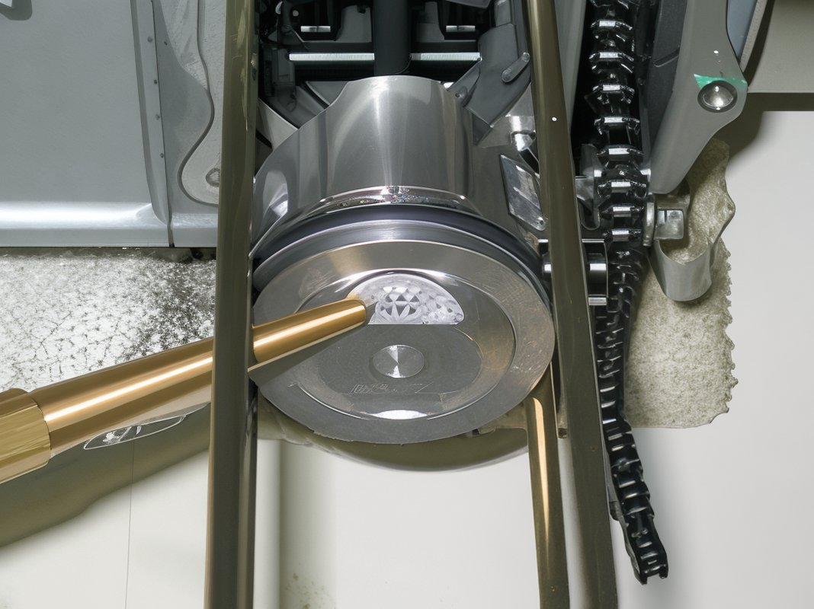 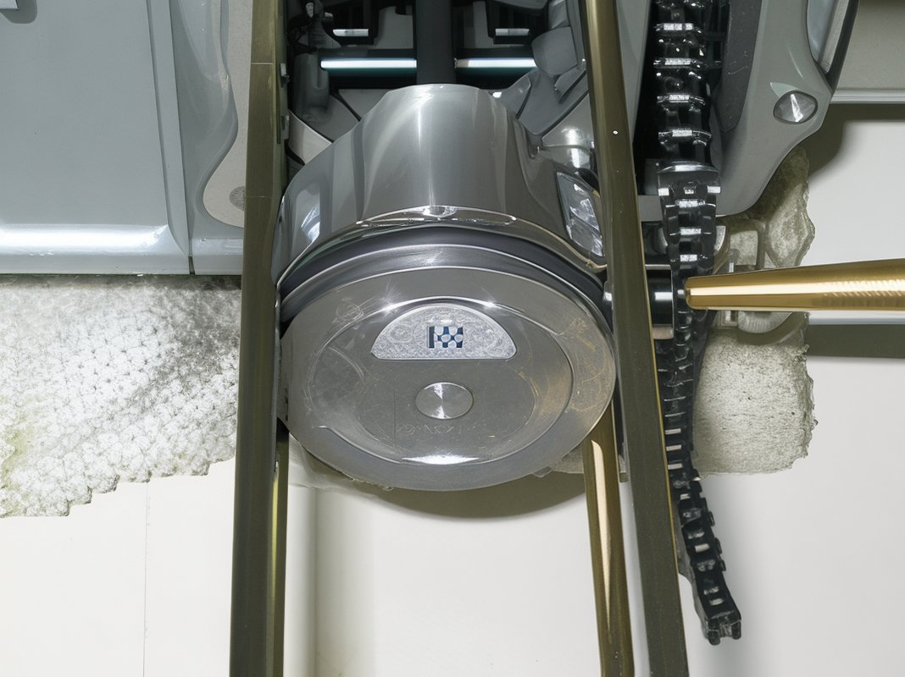

7. Carefully install the second c-clip onto the piston to lock it in place. Compress the c-clip just enough to secure it, and note its position.

8. Install the cylinder gasket.

9. Insert a small black seal into the lower hole.

10. Install two knock pins.

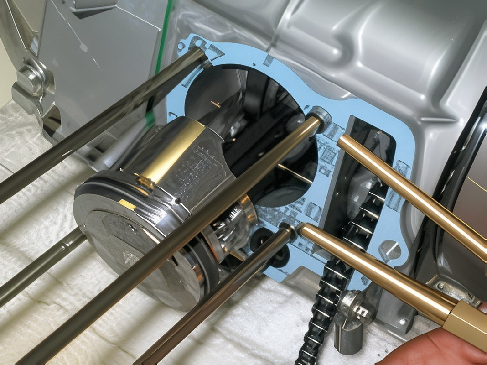

11. Apply a small amount of clean oil into the cylinder and slide the cylinder over the studs. Compress the first piston ring with one hand while carefully sliding the cylinder over the ring. Avoid forcing the cylinder into place. Repeat for each ring until the cylinder is properly seated.

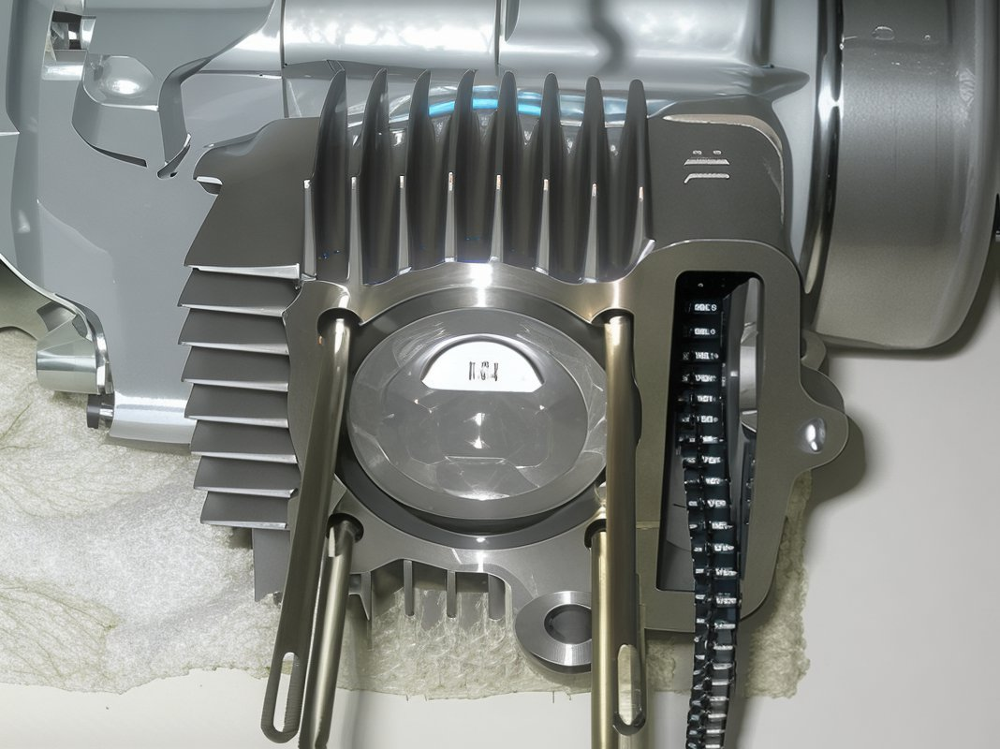

12. Install the black cam chain roller, the cam chain roller bolt (10mm), and the cylinder side bolt (10mm) finger tight.

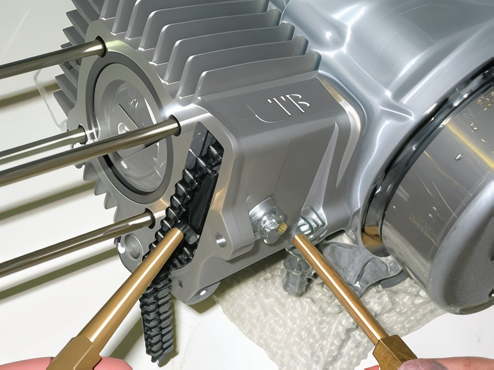

13. Remove the camshaft by loosening the tappets completely. Lightly screw one of the camshaft gear bolts into the camshaft and extract it.

 

14. Install the new camshaft, ensuring the cam lobes face downwards.

15. Insert two knock pins into the cylinder.

16. Install the cylinder head gasket.

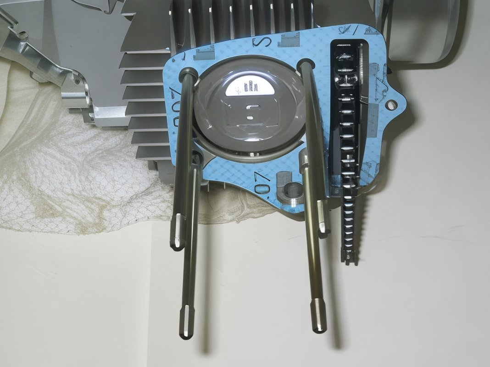

17. Place the green gasket onto the bottom left cylinder stud and insert a black gasket into the recessed hole.

18. Install the cylinder head. Ensure the cam chain is fully pulled through and temporarily secure it with a small screwdriver.

19. Install the cylinder head gasket and cover. Note the location of the copper washer. Torque each cylinder head bolt to 8 ft. lbs.

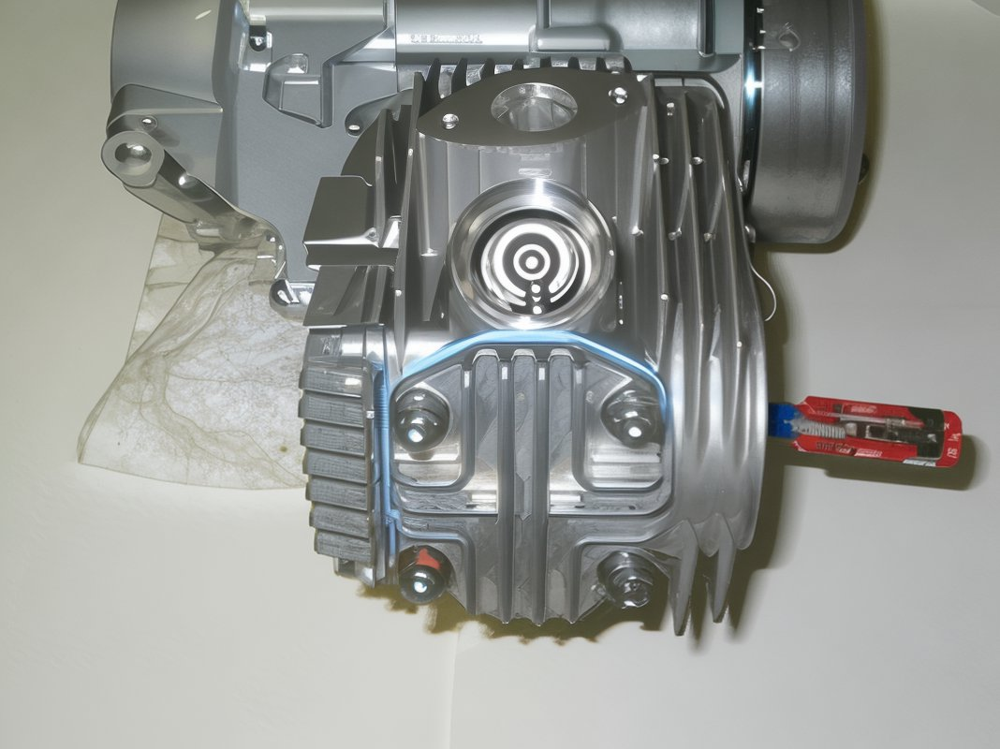

20. Tighten the cam chain roller bolt, the cylinder head side bolt, and the cylinder side bolt to 8 ft. lbs.

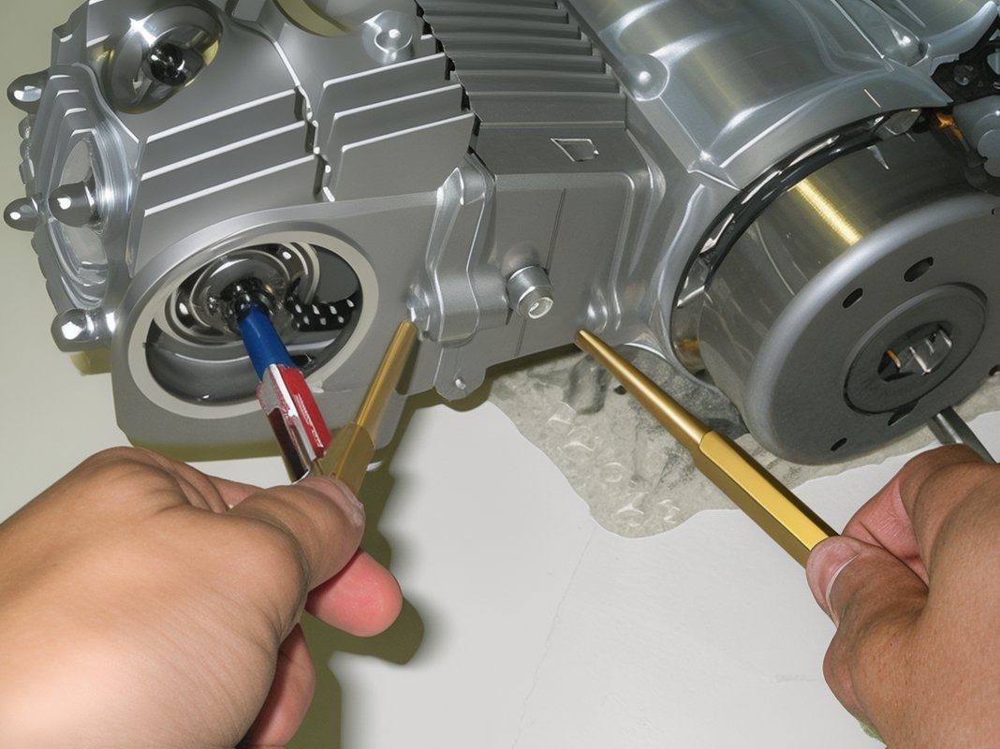

### Cam Gear and Valve Clearance

1. Prepare to install the cam gear and set the valve clearance. Ensure the engine is at top dead center by aligning the "T" on the flywheel with the notch on the engine case. Verify by looking into the spark plug hole with a flashlight to see the top of the piston. If aligned, proceed as follows:

2. Install the cam gear onto the camshaft, ensuring the “o” stamped on the cam gear aligns with the notch on the head (located around the 9:00 position). Aligning the cam gear can be challenging, so proceed with care.

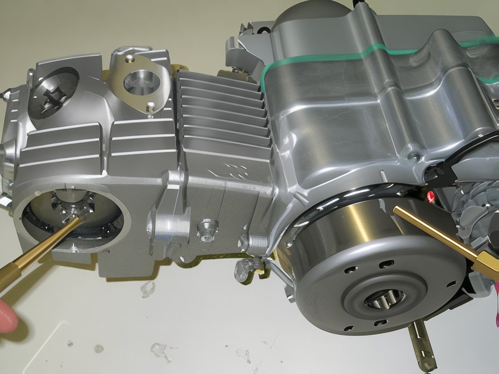

3. Starting with the upper tappet, use a .05mm (.002) feeler gauge to set the valve clearance. Once set, tighten the tappet bolt (9mm) to 80 in. lbs. Repeat for the lower tappet.

4. After setting the valve clearance, rotate the flywheel counterclockwise twice and recheck the valve clearance. There should be no gap clearance if done correctly. If a gap exists, repeat this step until no gap is present.
5. Install the upper and lower tappet covers (17mm).
6. Install a new gasket on the cam cover and secure the cam cover. Tighten the bolt (10mm) to 9 ft. lbs.

Congratulations! Your new top end is now complete.

## Carburetor Tuning

The TB 20mm carburetor is straightforward to tune from the outset. It is equipped with an 89 main and a 35 pilot jet, both of which can be purchased separately. As a baseline setting:

- Use a 90 or 92 main jet.
- Use a 38 pilot jet.
- Position the jet needle at the 3rd or 4th notch from the top.
- Set the air screw at 1.5 to 1.75 turns out from seated.

Adjust the air screw inward to enrich the mixture by 1.25 turns at a time and observe the bike's response. With some carburetors, it may be necessary to adjust to within 0.5 turns of being fully in to eliminate off-idle bog. Consider using a 40 pilot jet if needed. You may need to adjust the needle clip position depending on your altitude. These settings are optimized for sea level conditions.
