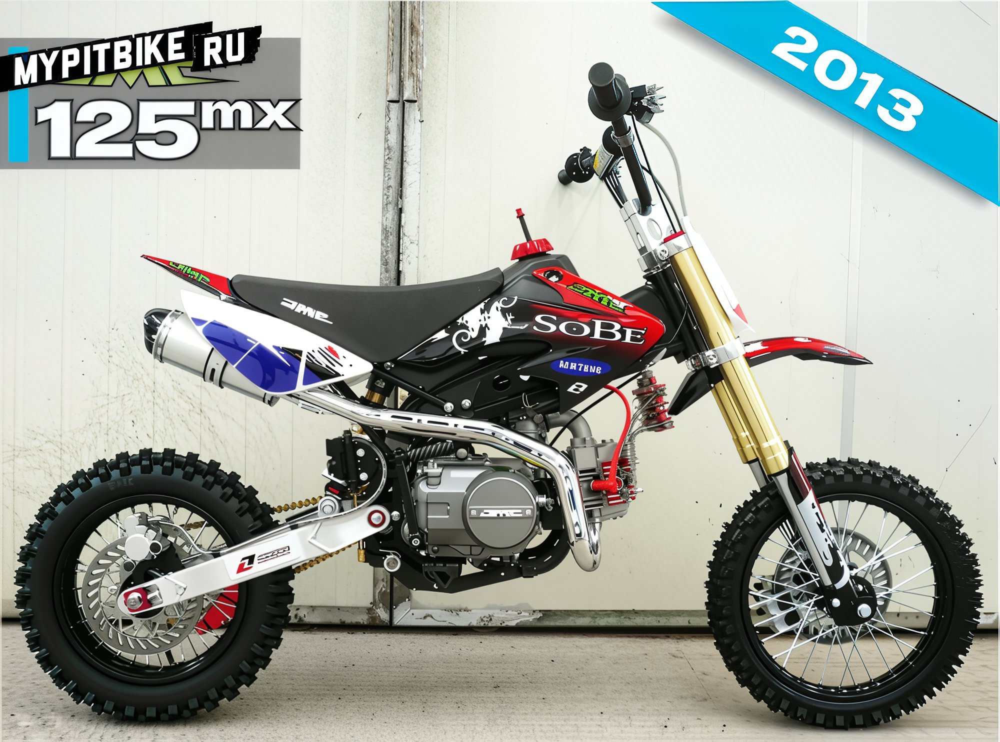
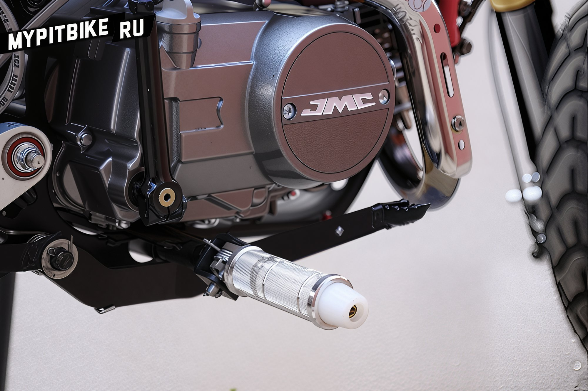
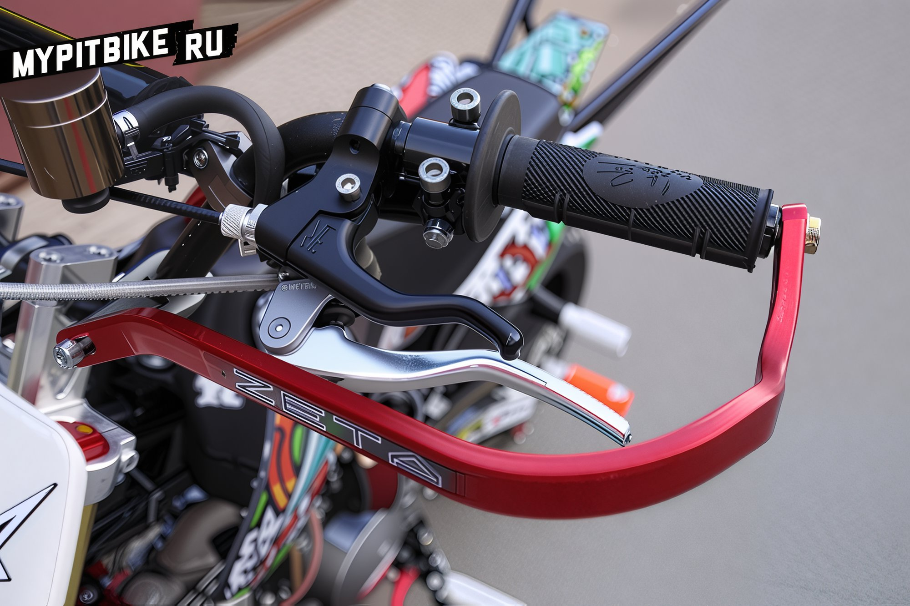
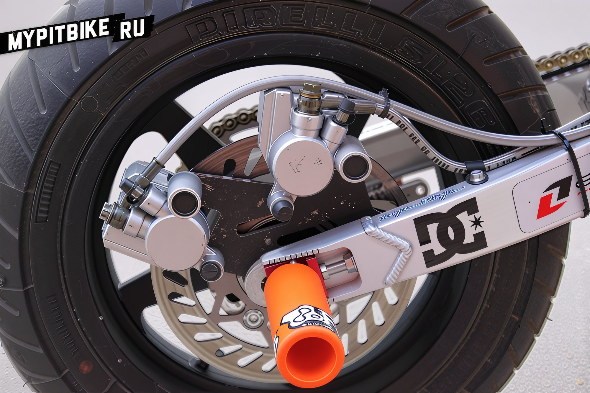
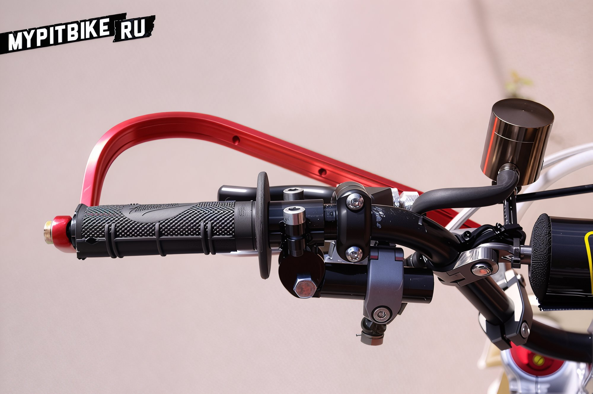
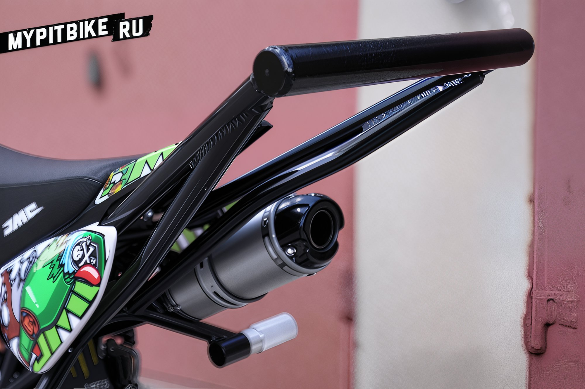
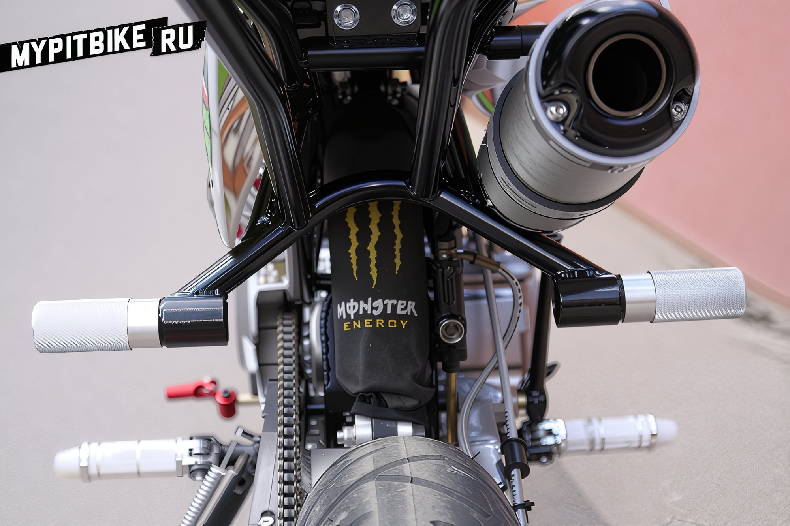
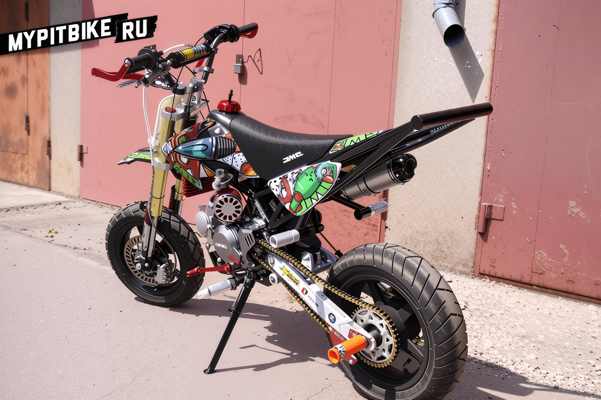
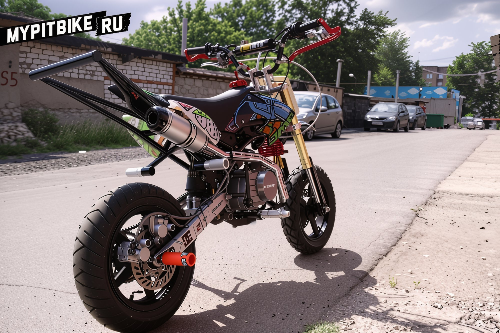

---
tags:
- brakes
- stunt
- chassis
- controls
---

# Transforming a Pit Bike for Stunt Riding

Transformation of a pit bike for stunting. The base model chosen was the JMC 125 MX 2013, but since it arrived only in May, right at the onset of the season, I had to expedite the modifications! To ensure this topic is as useful as possible, I will provide all possible links throughout the text to the parts I acquired, so let's get started...

1. The pit bike was purchased from the company [JMC](http://jazzmoto.ru/shop/pitbike/pitbayk-jmc-125-mx-2013/).

   

   The first issue was the wheels. The cast wheels fit, but the front washers needed to be filed down - adjustments had to be made by millimeters. The cast wheels were bought separately from the JMC store. I decided to opt for quality tires, with the rear being 120/70 R12 and the front 110/60 R12, purchased [here](http://www.moto-hobby.ru/tyres/kenda/page_scooter.html). Additionally, the plastic on the fork had to be removed or filed down to fit the tires - I chose to file it down.

2. **Protection**

   I delved into this matter because a cage is not typically installed on a pit bike, and in the event of a side fall, the caliper or brake disc could be damaged, so I decided to install inexpensive BMX pegs. They should withstand at least one good fall. The pegs were purchased in Sokolniki. They are mounted on an extended axle (15mm), which can be bought [here](http://pitbikeclub.ru/). However, there is one nuance. The pegs are fastened with a bolt from the inside, so you will need to buy an extended socket for the bolt and remove 1mm for the socket to fit inside the peg.

   

   Why is the protection only on the rear wheel? The answer is quite simple. Last season, because I installed pegs on the front wheel, during a fall, the fork tube cracked. After that, I stopped installing pegs on the front wheel. Plus, during a fall, the impact is on the handlebars, and the front caliper can only be damaged if it hits a curb. Instead of the stock footpegs, I installed pegs with sliders, which I bought [here](http://pitbikeclub.ru/). The stock footpegs are useless!

   

   I decided to install handlebar protection because sometimes I ride in the forest on cross tires, and the handguards save me in the woods. In stunt mode, the handguards are removed, leaving only the metal protection. The handlebar protection was purchased [here](http://1rmc.ru/).

3. **Clutch**

   As is well known, all stunters install a good clutch lever. Here, of course, you question whether to invest in a good clutch lever, which means spending money. But as it turned out in practice, during one training session, the clutch has to be engaged several hundred times, and the hand, to put it mildly, gets tired. Therefore, the decision was made to buy a clutch lever from RSC, purchased [here](http://stuntexshop.ru/catalog/20). It's an expensive option, but there are cheaper analogs of such levers: MSR, Wirtz.

   

4. **Rear Brake Duplicator**

   This stage took me more time than I anticipated. Finding a bracket for two calipers was difficult, and when buying brackets from Polini, I had to look for other calipers, so I delayed until I came across an offer for a bracket from Alexey Plotnikov for stock JMC calipers. In the end, a complete rear brake was purchased from the JMC store (as another guide was needed for the new bracket), a 1.7m hydraulic line was bought [here](http://www.moto-hobby.ru/parts/parts_moto/armirovannie.html), and a left-sided Magura 13mm was purchased [here](http://stuntexshop.ru/tormoznaya-mashinka-magura-radial-195).

   

   Elated with such a set of parts, I immediately began installing them on the pit bike. But when installing the brake lever, I encountered a problem - it didn't fit as comfortably as I would have liked! The clutch should be installed for one finger, and when the clutch is engaged, the middle finger should easily reach the duplicator. For me, it was different: either the clutch was uncomfortable, or I couldn't reach the duplicator with my finger. The decision was made to create an adapter for the duplicator, which was parallel to the handlebars and located directly under the clutch.

   

   Just what I needed! This adapter was made for me [here](http://www.rrka.ru/).

5. **Subframe with Subcage**

   Perhaps the most interesting part of the discussion. I couldn't find where to make a subframe for a long time, and since I understood that I couldn't do it myself, I started talking to guys who have been stunting on pit bikes for several seasons. In the end, there were many options, and they were all about the same price, the question was - who was better to do it with. I was lucky with this question, and it was done for me [here](http://www.rrka.ru/). To say it was done superbly is an understatement. The person did exactly as requested! The only downside - it's far to travel to him! The advantages: he made the subframe with subcage in a day, preserved the plastic, and kept the stock position of the muffler.

   

   

In the future, I plan to replace the fork with an adjustable one and analyze the carburetor's performance in the spark plug. The result was such a pit bike:

