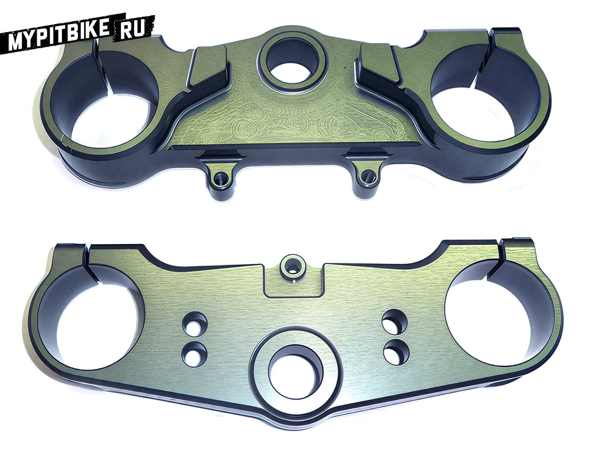
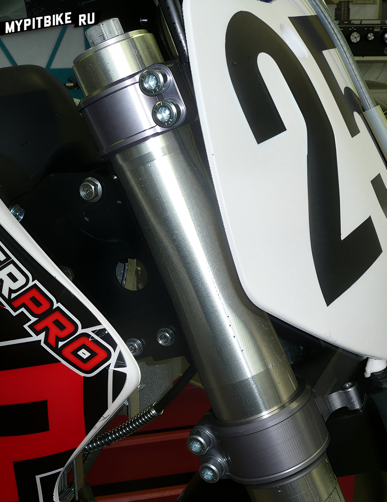

import YouTubeEmbed from '@site/src/components/YouTubeEmbed';

# Triple clamps lxr for installing forks from cr85

It is a well-known fact that the selection of suspension kits for the front fork of pit bikes is rather limited. Chinese forks like Fastace, DNM, replicas of Marzocchi, and the exotic TECH and ENGI are practically all that is available to the average pit biker. However, the main issue is the lack of consumables for repair and maintenance.  
  

Yet, with the growing popularity of pit bikes and mid-size motorcycles, companies that manufacture tuning parts for larger motocross bikes are beginning to notice this emerging market.  
  

The French manufacturer Neken offers a solution to this problem with their CNC triple clamps for the PitsterPro LXR, designed to accommodate Kayaba forks from the Honda CR85. These forks have a vast array of tuning options, replacement cartridges, repair kits, nipples, and more, allowing for precise suspension adjustments tailored to the rider.  
  

<YouTubeEmbed videoId="RYKBPJ-Cjow" />
