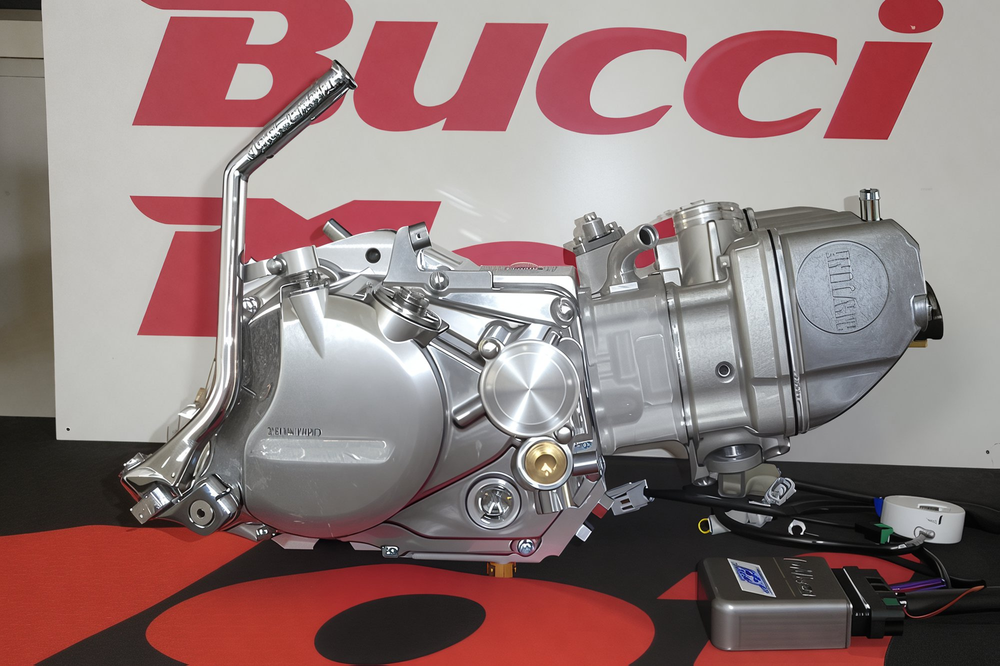

---
tags:
- engine
---

# Water-Cooled Engine by Bucci Moto

The Italian master engine builder, **Claudio Bucci** from Bucci Moto, has engineered a remarkable racing engine for the pit bike **Bucci Racing F4**. With a displacement of 150 cc, it features a Unicam head with four valves and **liquid cooling**!

Priced comparably to a new VAZ car - **5880 euros**!!!

**Technical Specifications:**

- 4-stroke, 4-valve SOHC engine with liquid cooling
- Displacement of 149 cc
- Maximum wheel power of **24 hp** at 11,600 rpm
- Maximum torque of 1.7 at 8,200 rpm
- Bore and stroke of 66 x 43.7
- Compression ratio of 12.5:1
- 4-speed gearbox 1-N-2-3-4
- Keihin 28 mm carburetor
- Yamaha Electronics ignition
- Ignition module with 3 setting maps
- Kickstarter ignition
- Five-disc wet clutch
- Water pump housed in the clutch case
- **Crankcase machined from aluminum**
- Dry weight of **18 kg**

**Tuning Options:**

- Capacity increase to 180 cc available
- Capacity increase to 220 cc available (includes crankshaft)
- Tuning kit with three camshafts of different timings
- Option to install a Keihin 32 mm carburetor

No reviews from actual owners could be found, presumably due to the price ;)
