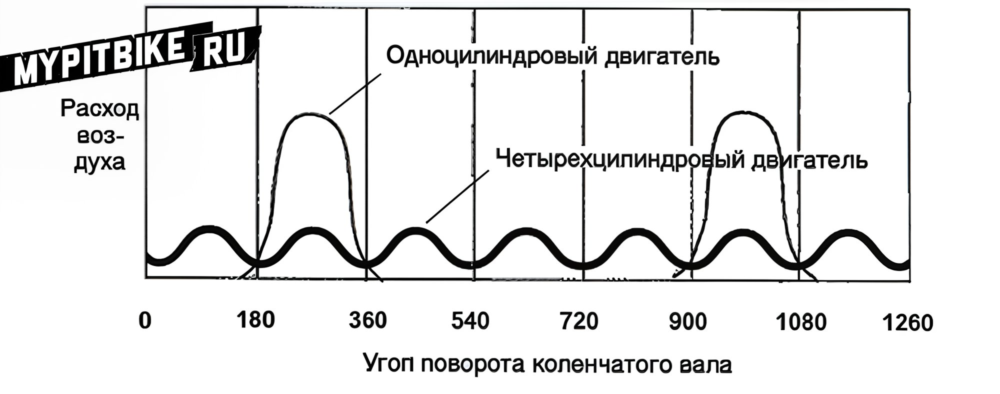
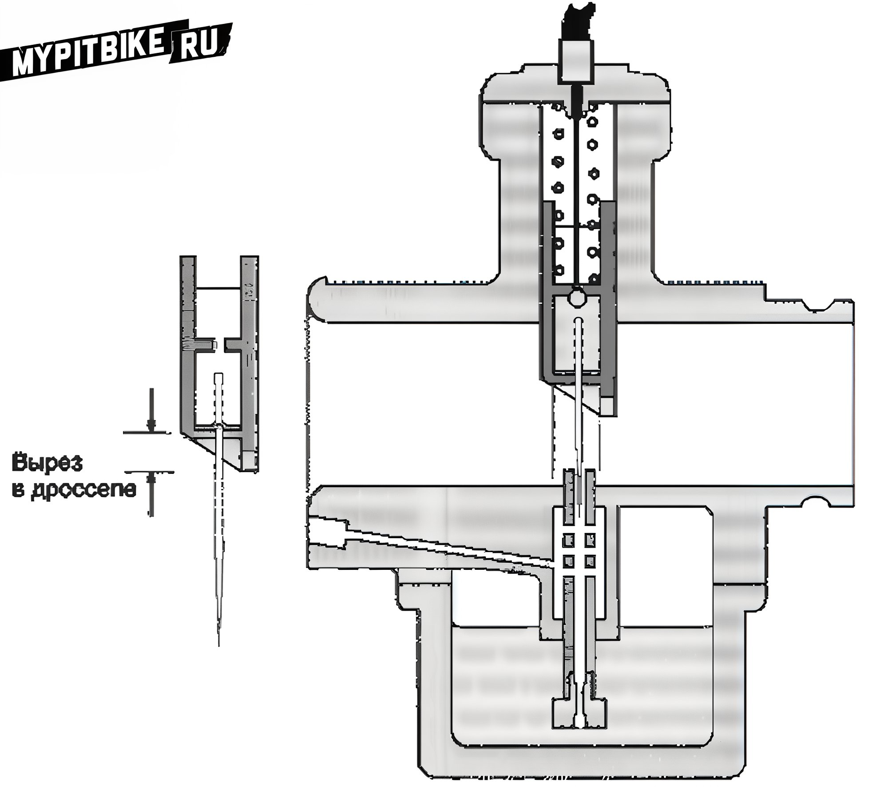
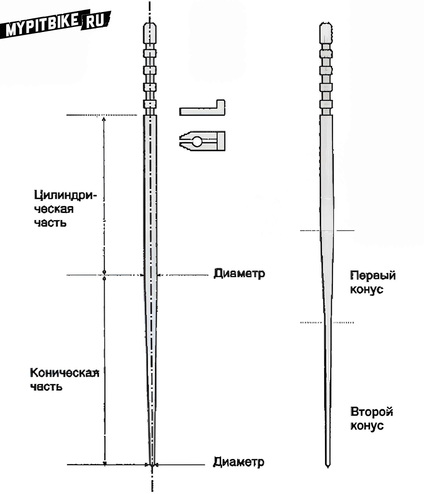
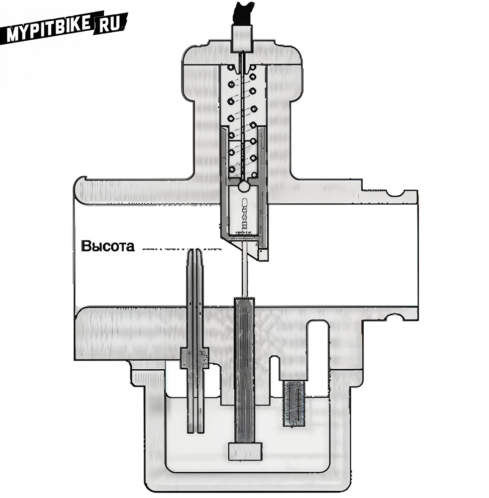
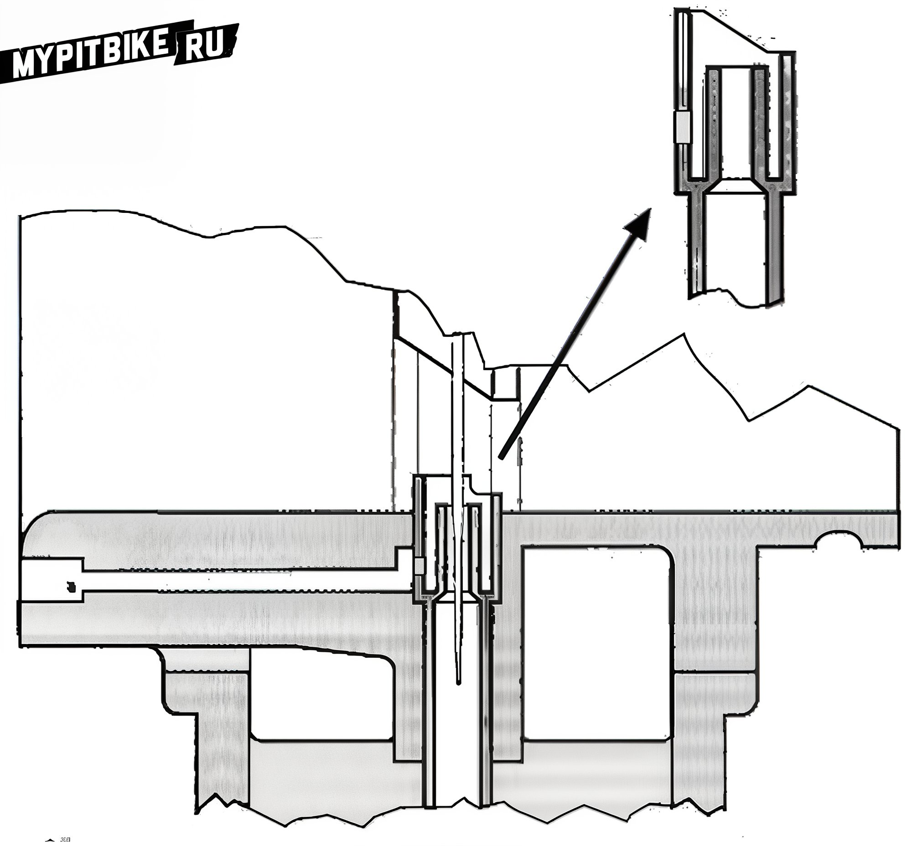
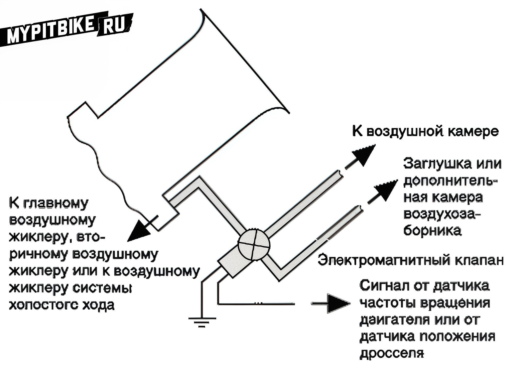

---
tags:
- carb
---

# Carburetor Mechanism (Part 2)

## Sliding Throttle Carburetor Systems

This section covers sliding throttle carburetors, commonly found on our motorcycles. I sincerely hope this article benefits our small community. The book also includes material on constant vacuum carburetors, which, although not used on pit bikes, prevail on road motorcycles. There's also content covering basic fuel system concepts, combustion theory, and mixture preparation recommendations. If any of this information proves useful to the pit bike enthusiast community, please share your thoughts in the comments.

## Partial Loads

The next step in carburetor design is installing a throttle valve controlled by the rider. This valve, known as the throttle, manages airflow into the engine ("full throttle" means the valve is entirely open). The most straightforward solution is a rotary valve that pivots, opening or closing the diffuser. Located behind the fuel nozzles, this valve regulates air intake, but not fuel supply; thus, it necessitates several nozzles progressively engaging as the throttle turns. Consequently, a set of jets, multiple drills, and tubes are required.

Such carburetors often populate automobiles but exhibit significant differences, particularly when compared to motorcycles manufactured 50 or 60 years ago. In cars, a single carburetor feeds air to four or more cylinders via a large intake manifold. Pressure pulsations from individual cylinders smooth out within the manifold and minimally feedback to the carburetor. Thus, engine and carburetor size are relatively large due to abundant under-hood space (concurrently, only one cylinder undergoes the intake stroke, necessitating a diffuser diameter sufficient for single-cylinder air supply) (Fig. 9).

> Fig. 9. A single-cylinder engine creates substantial pressure pulsations every two crankshaft revolutions. A four-cylinder engine generates smaller pulsations every half-revolution.

These carburetors incorporate many enhancements, such as internal diffusers, to manage fuel flow through each jet and ensure required performance levels. These additions impede airflow, so carburetors must be considerably larger than a simple non-regulated diffuser to meet engine power demands. Motorcycle engines typically consist of one cylinder, and carburetors mount directly onto engines due to limited space (motorcycle engines and carburetors are generally minimized in size).

Small carburetor bodies present numerous technical issues. A throttle plate's minimum thickness stems from essential strength criteria and secure attachment to the shaft. In carburetors with large diffuser diameters, the throttle edge effect is minimal. However, for motorbike carburetors under 25 mm diameter, such a valve becomes ineffective. Therefore, motorcycle engines typically employ sliding throttles, which have cylindrical forms matching the diffuser diameter and operate via cables and return springs (Fig. 10).

> Fig. 10. A sliding throttle regulates airflow in the diffuser. Early carburetor models featured cylindrical throttles, later transforming into the flat flap depicted. A conical needle affixed to the throttle may enter the fuel jet aperture, controlling fuel supply. The beveled throttle edge ensures air supply during idle and up to 1/8 throttle range.

This throttle installs directly above the fuel jet, managing airflow via throttle movement—altering the diffuser's cross-section. Concurrently, airspeed and vacuum above the jet shift. While maintaining fuel flow amid reduced air intake results in a richer mix, this maintains carburetor function at minimal airflow levels. As the throttle directly overlays the fuel jet and moves linearly, controlling fuel flow is straightforward by introducing a conical needle fixed to the throttle.

Consequently, fuel jets assume multiple tasks and acquire four or five additional adjustments. The fuel entry tube houses a main jet and emulsion tube mingling air and fuel, crafting a fuel stream injected into the diffuser, now accommodating a conical needle (frequently referred to as the needle jet, which we'll adopt). Beyond previous adjustments, the needle jet allows us to modify the needle's width relative to the thickest part, change the needle's conical portion length and angle (creating needles with varied cone angles, Fig. 11), adjust needle penetration depth into the jet and the air throttle's edge bevel angle.

> Fig. 11. Conical needles may vary in shape. Dimensions influencing fuel flow include (1) overall length, (2) cylindrical part diameter, (3) cylindrical part length, (4) starting diameter and cone angle, (5) starting diameter and additional cone angles, (6) grooves for mounting the needle.

At full throttle, only a narrow needle obstructs airflow (in some Amal carburetors, the needle may recede into the diffuser's wall to minimize air obstruction). This throttle design yields highly efficient carburetors, leading to widespread motorcycle application from the 1920s to the 1960s. The needle also enhances fuel supply control as it ascends along the needle surface, further breaking up fuel particles before merging with the airflow. Mixture adjustments during partial loads become nearly boundless.

The combination of jet diameter, throttle dimensions, needle length, and needle cone angles is so extensive that solutions necessitate practical experimentation rather than theoretical speculation, driven by engine optimization efforts. Fortunately, carburetor developers begin with simple models (like our primitive version), continuously refining them. Nonetheless, the mere mention of conical needles can still elicit amused smiles, even from seasoned carburetor engineers.

Even with full throttle opening, the needle must enter the jet aperture to prevent obstruction during throttle closure. Practically, this incurs two crucial carburetor parameters:

- The clearance between the needle's thinnest part and the jet must exceed the main jet area to avoid disturbing fuel supply when closed.
- Needle length and insertion depth depend on diffuser diameter.

Some developers opted to augment the main jet's well to extend needle length, realizing extended needles did not enhance engine power. Alternatively, if clearance is less than the main jet diameter, the main jet fails at peak loads. Solving this entails using a larger needle diameter; however, this alters mixture composition under partial load conditions, necessitating joint alterations in jet diameter to match the needle... though impossible without defining the main jet size. Consequently, carburetors either underperform potential capacities or undergo iterative refinements until optimization appears.

## Areas of Control

To simplify understanding, divide each component's function into operational areas and assess them logically. For instance, the main jet delivers mixture composition control across all engine speeds, though effective control occurs only with full throttle (see Note 2), with significant influence manifesting at three-quarters-open throttle (or even less).

Hence, when tuning mixture composition at around three-quarter throttle (or beyond half-throttle in design carburetors), adjust the main and primary air jet characteristics to maximize engine power across all speed ranges at full throttle. In the one-quarter to one-third throttle range, the needle jet dictates mixture formation. Initial parameter selection ensures non-interference—needle retention within jets at full throttle. Subsequently, optimize engine function by selecting needle cone angles for this range.

The lower (thinner) needle part operates between five-eighths and three-quarters throttle opening, while the upper needle part manages light loads. Partially loaded engines position the needle within jets to regulate fuel flow. Optimal settings facilitate fuel efficiency during low-speed, light-load operations and maximize power during heavier conditions. Open throttle below one-quarter triggers further fuel control by the needle, with the throttle nearly closing airflow. At this time, fuel corresponds to the throttle edge's cutout, defining mixture composition.

Such primary regulation is too crude for engine idling; hence, most carburetors include a complete idle system. The idle jet supplies fuel from the float chamber to the diffuser through an aperture, entering airflow via the throttle cutout (Fig. 12). Fully closed throttles induce manifold vacuum, sufficient to draw fuel via the idle system.

> Fig. 12. Idle System. An exclusive jet transfers fuel from the float chamber to the diffuser. Air transits through an air jet, mixing with fuel. The idle system includes a conical regulating screw controlling fuel or air or mixture supply.

The idle system features one or more bypass channels emptying into the diffuser near the throttle, ensuring smooth idle exit transitions. To aid air-fuel mixing, idle systems incorporate air jets enhancing mixture. A conical regulating screw modulates fuel-air mixture flow, reducing it when tightened. Depending on the system, this screw may enrich mixtures by restricting air or lean it by limiting fuel flow. Some systems rely solely on air and fuel jets to define mixtures, with regulating screws restricting mixture flow.

Idle system tuning hinges on exhaust CO concentration or crankshaft speed; in the latter, throttle stop screws adjust minimal engine speeds. Subsequently, mixture screws establish peak RPM (or minimal exhaust CO concentration). Throttle limiters reconfigure minimal RPM before repeating tuning, ceasing on achieving optimal results. Implement adjustments before developing low-load needle profiles and throttle cutouts, as idle systems keep supplying fuel throughout engine speed ranges. Despite diminished impact at full throttle, the idle system substantially influences mixtures at minor throttle openings.

Marked distinctions between idle and low-load operation impede seamless transition from idle jet to main supply, inducing sputters during throttle engagement. Smoothing this transition involves bypass channels connecting fuel supply lines to diffusers, typically emerging beneath or slightly ahead of throttles. Thus, slight throttle openings hasten airflow while fuel enters the diffuser through additional apertures, enabling seamless idle-to-main system transitions.

## Transitional Modes

Here, new phenomena arise. Previously, we explored engine utilities at consistent speeds and loads. Now, we endeavor smooth transitions across operational states, irrespective of throttle shift rates. Dubbed transitional modes, these significantly influence motorcycle riding comfort. Acceleration often demands mixture enrichment to offset increased airflow driven by lighter air rapidly outpacing heavier fuel particles.

Thus, carburetors must momentarily enrich mixtures, facilitating proper functioning. An emulsion tube encircling chamber aids transitions, hence many carburetors manage transitional modes predominantly via this chamber. Short, direct intake manifolds contribute to smooth transitions, mitigating fuel droplet retention and promoting cylinder delivery. Deficient fuel for enrichment necessitates auxiliary pumps. Such pumps typically feature springs and plungers within cylinders, engaged by throttle linkage cams. Cams may connect externally or internally within carburetors. Pumps draw fuel from float chambers; upon throttle activation, cam-driven plungers expel fuel into diffusers. Transition-assisting modifications abound among carburetors.

## Mixture Enrichment Devices for Full Load (Economizer)

The economizer jet lodges within float chambers, its nozzle entering the diffuser at specified heights, generally beyond half-throttle displacement (Fig. 13).

> Fig. 13. Full Load Mixture Enricher. Fed by float chamber-fueled jets (sometimes possessing air jets too), the nozzle traverses into the diffuser at definitive heights. Device operation commences once the throttle clears the nozzle edge, accelerating airflow and fueling further. Adjustable-height nozzles frequently equip spray devices.

Until throttle elevation surpasses the nozzle mouth, no chamber vacuum generates; thus, it remains idle. Throttle elevation above the nozzle tip induces airflow and initiates additional fuel flow to mixing chambers. This mechanism supplements fuel precisely when throttles near full load. Certain GP carburetors integrate multiple enrichers.

## Jet Nozzle Forms

Thus far, we've depicted jet nozzles as smooth pipe segments. Surrounding nozzles by small screens with 180° angles accentuates vacuum, subsequently increasing fuel supply. Manipulating screen dimensions and airflow toward emulsion tubes allows yet another fuel flow regulation method (Fig. 14).

> Fig. 14. Carburetor modification, styled as a primary flap carburetor, featuring a screen boosting fuel supply pre-sprayer nozzle. This design outperforms carburetors of similar sizes in fuel flow capacity, adapted for two-stroke engines with pronounced airflow variability.

Screen size and shape govern fuel flow control. Labeled primary flaps, these additions populate two-stroke carburetors, where fuel is air-fed through jets sans emulsion tube holes. Screens front nozzles in standard models, although Mikuni TDMR carburetors position posterior screens featuring fuel-passing apertures.

## Secondary Air Jet

Secondary jets function similarly to main air jets but receive blockage from throttles or computer-operated solenoid valves, offering dual flow gradients when activated precisely at specified throttle angles or engine speeds (Fig. 15).

> Fig. 15. Solenoid valves engage at defined engine speeds or throttle lifts, onboarding air via secondary jets or refocusing main jet sources across differential air chamber sections (with variable pressures). They may populate primary, secondary, or idle air systems (for emission purposes).

## Connection to the Air Chamber

Filter air directed to air jets shares equivalent pressure to engine-bound air, sourced from stationary air cleaner air. If air chamber pressure surges with movement, float chambers must mirror this pressure.

## Vacuum Connections

Diffuser pressure, subsisting below atmospheric levels, links to both engine speed and throttle position. Using the diffuser vacuum eases subtle throttle angle measurements during light brake test loads. Synchronizing multi-carburetor systems relies on vacuum measurements, aligning openings and closings. Pressure manipulation helps fuel valves, positioning diaphragms engaged by vacuum shifts to detach fuel channels, ceasing supply post-engine stop. Additionally, vacuum reduces float chamber pressure under low load, aiding mixture thinning and adopting alternative uptake gradients.

Some carburetors employ small diaphragms responding to intake manifold pressure (amplified post-throttle closure), regulating idle system air-fuel supply, curbing emissions. Vehicles have utilized vacuum advance in distributors, brake boost systems, windows-washers, and more.

## Auxiliary Main Jets

By the late 1970s, certain Honda models bore carburetors with primary and secondary main jets. Primary designs mirrored prior examples. Secondary jets mimicked design, with their own air jets yet lacked needles; their sprayers extended past throttle edges, doubling as idle system bypass ducts, affording wider fuel curve inclination range manipulation.

## Throttle Shape

The throttle's leading-edge cutout affects air throughput during slight throttle exposure (when throttles act as barriers). Even amid full throttle, energetically exiting the diffuser, airflow directing channels embedded in diffuser surfaces disrupt resonance potential in air paths. Amal faced intense development hurdles while crafting TT, GP, and later smooth intake tract carburetor designs. Although cylindrical throttles demanded complex machining, they enabled highly efficient carburetors. Their oversized counterparts yielded favorable comparative performance.

Mikuni's "smooth" VM series emerged pre-TM and VM series flat throttle innovation. Flat throttles, introduced by Gardner in 1970, thereafter appeared via American Lektron and El, reducing carburetor compactness. Testing revealed EI 34 mm diameter carburetors matched 36 mm Amal and Dell'Orto airflows. Additional benefits encompassed refined airflow management amplifying spray point pressure dynamics.

## Cold Engine Starting Devices

Initially, cold start mixture enrichment stemmed from throttles blocking carburetor inlets. Integrated sliding throttles sometimes harbored cable-driven throttles. Aerial valves between diffusers and air chambers emerged. Such prone-to-failure devices soon gave way to cold start jets. This system placed jets below throttles akin to idle system jets.

Cold start systems, sporting air jets, governed plunger-managed airflow jets. Start systems administered tiny cams lifting throttles, boosting idle speeds. This practice enabled easier cold engine operation at 2000-3000 RPM than standard 1200 RPM idle (partly due to camshaft oil scarcity amid thickened cold oil). Maintaining elevated speeds ensured rapid oil camshaft supply.

## Disadvantages

Carburetors discussed served motorcycles produced between 1950 and early 1970s. Fixed jet models (like Harley-Davidson) occasionally emerged, but sliding throttles prevailed. Notably, increasing diffuser diameter for engine power highlighted several flaws:

- While capabilities and enhancements abounded, abrupt throttle openings during low engine speeds hindered proper mixture delivery. Engine function suffered, with stalls, ignitions misfires, or cutoffs ensued.
- When throttles sharply opened at moderate speed, engines failed to respond positively. Instead of acceleration, power and speed decreased; carburetors floundered amid abrupt transitions, demanding rider vigilance and expertise ensuring maneuverability.
- Carburetor dimensions remained lofty. Throttles ascended matching diffuser diameters, with needled lengths exceeding lengths exceeding diameters. Throttles measuring 38 mm equated carburetor heights of 114 mm, excluding top rods and bottom float chambers.
- Vacuum effects promoted throttle guide wear and occasionally binding. Countermeasures included installing sturdy return springs. Flat-throttle roller-bearing competitors often proved unwieldy.
- Then ironies arose: though flat throttles promised simplicity, resulting designs proved intricate.
- Constructing rods lifting 38 mm throttles within quarter-turn control (optimal ergonomic rotation) proved formidable, particularly with robust return springs fitted. Consequently, controls presented either arduous operation or excessive rotations.
- Engine downscaling and inlet tract reduction began impinging on valve gear housing.
