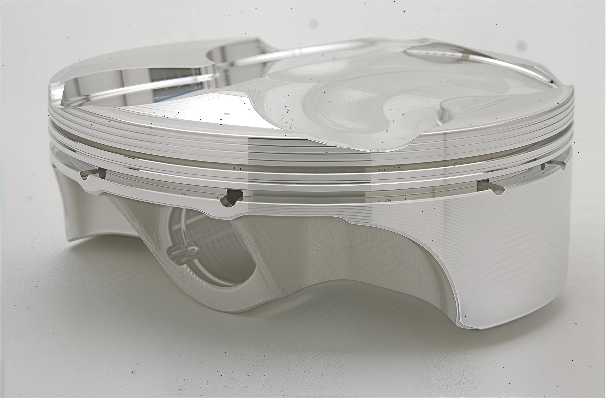

---
tags:
- engine
- piston
---

# Comprehensive Guide to Pistons

## Understanding Pistons: A Technical Guide

A piston compresses the fuel-air mixture, ignited by the spark plug, initiating an explosion that forcefully drives the piston downward, thus rotating the crankshaft. This rotary motion is transmitted through the crankshaft to the clutch, then to the transmission, the sprocket, and finally to the rear wheel, resulting in forward propulsion. Subsequently, the piston is thrust upwards by the rotational force of the crank, encountering another explosion in a continuous cycle.

## Piston Manufacturing: Cast vs. Forged

### Are All Pistons Cast?

Not all pistons are cast. Pistons can be manufactured through casting, forging, or semi-forging processes.

### Advantages of Cast Pistons

Cast pistons are cost-effective to produce, allowing for precise tuning of the aluminum alloy's composition. Silicone is a crucial component; an optimal amount ensures the piston retains its shape under extreme conditions. However, an incorrect mix can lead to brittleness, increasing the risk of cracking under stress.

### Downsides of Cast Pistons

If the alloy mix is imprecise, the material may become hard and brittle, prone to cracking under high stress or thermal spots.

### Forged Pistons Explained

Forged pistons differ, beginning as solid aluminum blocks shaped under immense pressure. This method aligns the molecular structure, resulting in a denser product capable of dissipating heat and enduring higher temperatures. Typically found in four-stroke engines, forged pistons exhibit twice the lifespan of cast counterparts.

### Downsides of Forged Pistons

Forged pistons are denser, delaying warming to operational temperature. They risk cold seizures; thus, additional clearances may be necessary, albeit causing increased noise. Due to its labor-intensive process, forging incurs higher production costs.

### Semi-Forged Pistons

Semi-forged pistons, sometimes called squeeze-forged, combine elements of casting and forging processes, providing the weight advantage of cast pistons with forged strength. They require less machining and are employed in some OEM four-stroke configurations.

## Specialized Pistons and other Considerations

### Billet Pistons

Billet pistons are machined from solid aluminum blocks for test purposes, offering custom specifications without the high setup costs of forging. While costly, they are invaluable for tailored applications.

### Importance of Piston Weight

Weight is crucial for pistons undergoing high-speed reciprocation; lighter pistons improve throttle response and agility but may reduce torque.

### Forged Piston Weight

Forged pistons are typically heavier due to their density, though modern designs can match cast piston weights through material reduction.

### Considerations on Piston Design

- **Piston Geometry:** Modern pistons exhibit a camshaft or non-round shape to resist rocking.
- **Piston Installation:** Pistons cannot be inverted due to tapering designs facilitating ring operation.

### Performance Piston Types

- **Flat-Top vs. Domed Pistons:** The preference depends on desired power delivery characteristics.
- **Ring Configuration:** Two-strokes vary, with single-ring designs favoring performance and double-ring setups ensuring durability.

### Piston Coatings

Break-in coatings minimize friction; some parts benefit from hard anodization for reduced wear, though skirts remain uncoated to maintain flexibility.

## Piston Maintenance and Lifespan

- **Wear Monitoring:** Pistons generally outlast rings; timely ring replacement maintains engine integrity.
- **Replacement Schedule:** Regular intervals depend on engine use; professional and casual schedules differ significantly.
- **Sizing and OEM Variants:** Pistons are available in incremental sizes ("A" to "C") to compensate for cylinder wear, ensuring optimal tolerance.

## Insights into High-Performance Pistons

- **Factory Configurations:** Factory teams typically employ forged or billet pistons, with some opting for semi-forged designs.
- **Innovations in Design:** Slipper pistons leverage reduced side-loading in four-strokes, optimizing weight and speed.
- **Four-Stroke Ring Systems:** Complex configurations ensure optimal sealing, though design variations exist for performance balance.

## Conclusion

Understanding the complexities of piston design, materials, and maintenance is crucial for achieving peak motorcycle performance and longevity. Regular inspections and considerate OEM recommendations provide a proactive approach to piston management, ensuring your bike's components operate efficiently and reliably.
