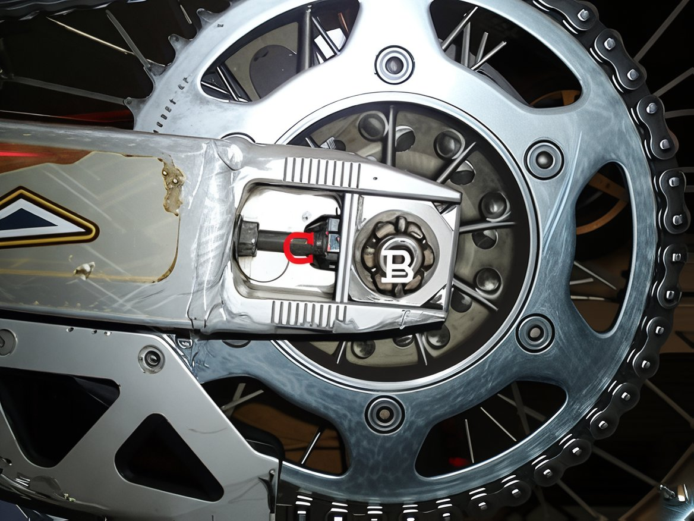

---
tags:
- chain
- wheels
---

# Drive Chain, Sprocket, and Gearing Information

## Introduction

New dirt bikes are equipped with drive chains that require replacement shortly after the initial break-in period. This is a well-established fact within the motorcycling community and applies universally across most brands. It is advisable to upgrade the drive chain to a high-quality option such as D.I.D, Renthal, or Magnum to prevent potential damage from a dislodged chain.

## Chain Specifications for Pit Bikes

Most pit bikes utilize a 420 chain, including brands like SSR, Piranha, and Pitster Pro. The 420 chains we offer are sufficiently long to accommodate nearly all builds but must be custom-cut to the appropriate length by the user. We provide a chain breaker tool, or alternatively, a bench grinder or hand grinder can be used. Each chain comes with a master link.

## Checking Chain Tension

To ensure optimal chain tension, follow these steps:

1. Use a tie-down to compress the rear suspension so that the front sprocket, swingarm pivot, and rear axle align. A piece of string from the center of the front sprocket to the rear sprocket can help identify this alignment. This is the point where the chain is at its maximum stretch.

   

2. Measure the slack in the middle of the chain, ensuring there is at least 20mm of movement (approximately 1 inch up and down in total).

   

**Tip:** A quick method to check chain tension is to place your three middle fingers stacked together between the chain and the rear of the rubber chain guide on the swingarm. Only these three fingers should fit. This method is a general guide and may not be accurate for everyone. Perform this check with the bike on a stand and the rear wheel elevated.

## Tightening Your Dirt Bike Chain

- Loosen the axle nut until it is only lightly tightened. Adjust the chain adjuster bolts evenly on both sides until the desired tension is achieved. The top of the chain will rise as you adjust the bolts.

- Once the correct tension is reached, ensure both sides are evenly spaced using the marker grooves on the adjuster blocks. Press the chain against the swingarm to hold everything in place and tighten the axle nut.

- Secure the chain adjuster lock nuts. Your bike is now ready for riding!

## Additional Tips

- Regularly verify that the sprocket bolts are secure, as they can loosen due to vibration over time.
- Clean and lubricate the chain. For sandy or dusty conditions, use WD40, CRC, or a silicon spray instead of thick chain lube, which can attract debris.
- Replace the chain and sprockets simultaneously, as chains stretch and sprocket teeth wear. Replacing them separately can reduce their lifespan.

## Final Drive Gearing Information

### For Faster Acceleration (Lower Gearing)

Lower gearing shortens each gear, necessitating quicker shifts. Use a smaller front sprocket or a larger rear sprocket. Changing one tooth on the front is equivalent to altering three teeth on the rear. This setup is ideal for tight trail riding or tracks with few long straights, such as Arenacross.

### For Faster Top Speed (Higher Gearing)

Higher gearing extends the use of each gear. Opt for a larger front sprocket or a smaller rear sprocket. Again, changes to the front sprocket have a more significant impact than the rear. This configuration suits high-speed environments like desert riding or sandy motocross tracks with minimal tight turns.

### General Guidelines for Pit Bikes

- On MX tracks, aim to stay in 3rd gear, dropping to 2nd on turns and reaching 4th on long straights.
- Many pit bikers prefer changing the front sprocket due to its cost-effectiveness.

### Sprocket Settings and Drive Ratios

Adjusting sprockets can modify your bike's low-end power or top speed, depending on your riding environment. The simplest and most economical method is to change the front sprocket, though changing both yields better results. Generally, altering one tooth on the front equates to changing approximately four teeth on the rear.

- A smaller front sprocket increases low-end power but reduces top speed, suitable for tight motocross or supercross tracks.
- A larger rear sprocket achieves the same effect.

