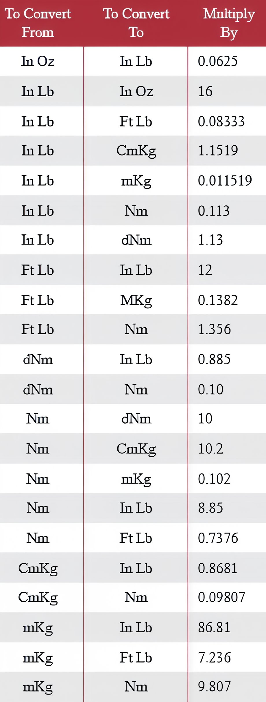

---
tags:
- rules
- legacy
---

# Key Performance Criteria

**Brake Mean Effective Pressure (BMEP)** is a highly effective metric for comparing the performance of one engine type against another of the same type, as well as for evaluating the justification for performance demands or conditions. BMEP is defined as the average pressure uniformly acting on the piston throughout its stroke, from the top to the bottom of each working cycle, to produce the measured brake output.

It's important to note that BMEP is a theoretical concept and has no direct relation to the actual cylinder pressure. It is simply a tool to evaluate the efficiency of a given engine in producing torque from a specific displacement. If you examine the equations given below, you'll easily see that BMEP is essentially torque per cubic inch of displacement, multiplied by a constant. Many talented engine designers use torque-per-cubic-inch instead of BMEP to avoid the multiplication process.

If you know your engine's torque and displacement, the simplest way to calculate BMEP is:

For four-stroke engines: "**BMEP (psi) = 150.8 x TORQUE (lb-ft) / DISPLACEMENT (ci)**"

BMEP (measured in pounds per square inch (psi), conveniently convertible to Bar/atm) = 150.8 x torque (lb-ft, convertible from Newton-meters (Nm)) / displacement (in cubic inches (ci), convertible from cubic centimeters (cc))

For two-stroke engines: "**BMEP (psi) = 75.4 x TORQUE (lb-ft) / DISPLACEMENT (ci)**"

*1 Bar = 14.5 Psi; 1 lb-ft = 1.355 Nm; 1 ci = 16.38 cc.*

If you are interested in the origins of these values, you can find more information below. A torque output of 1.344Nm per 16.38cc displacement in a four-stroke engine equals a mean effective pressure of 150.8Psi (10.4Bar). In a two-stroke engine, the same 1.344Nm x 16.38cc equals 75.4Psi (5.2Bar).

The rest of the article focuses on four-stroke engines, although the same principles apply to two-strokes with a factor of 75.4Psi instead of 150.8Psi. This tool is extremely effective in evaluating the performance of any particular engine. For instance: consider the average Lycoming IO-360 aero engine (200 HP, 360 CID) and the more powerful IO-540 (300 HP, 540 CID). Both engines reach their rated performance at 2700 RPM.

At 2700 RPM, the rated power requires 389 lb-ft for 200 HP and 548 lb-ft for 300 HP respectively. Based on these torque figures, the BMEP calculation formula for four-stroke engines shows that both operate at 163Psi BMEP or 12.25Bar (torque ratio of 1.09 lb-ft per cubic inch) at peak power. BMEP at peak torque is slightly higher.

For long-lived atmospheric, spark-ignition gasoline engines with two valves per cylinder, BMEP above 204Psi (14Bar, torque ratio of 1.35 lb-ft CID) is difficult to achieve, necessitating advanced development programs and highly specialized components. It’s worth noting that modern naturally aspirated engines with compression ignition can easily achieve 15Bar BMEP, and certain road-going turbocharged engines exceed 20.5Bar. BMEP is a convenient tool for comparing similar types of engines.

For reference, let’s look at what are considered the pinnacle of engineering: Formula 1 GP engines. The F1 engine is specially built and essentially unrestricted. For the 2006 season, regulations specified a 90° V8 engine with a 2.4-liter displacement (164 CID), a maximum cylinder bore of 98mm (3.858 inches), and a center-to-center distance of 106.5mm (4.193 inches). The required stroke to reach 2.4 liters was 39.75mm (1.565 inches), executed over 180° of crankshaft rotation.

Typical conrod length was 102mm (4.016 inches) with a rod length to stroke ratio of 65mm (2.57 inches). These engines feature a four-valve-per-cylinder layout with dual overhead camshafts and pneumatic valve springs. In addition to core restrictions, regulations prohibit using beryllium compounds, metal matrix composites, variable-length intake manifolds, no more than one injector per cylinder, and a maximum of one engine for every two race events.

By the end of the 2006 season, most F1 engines produced up to 20,000 RPM in race trim, generating approximately 750 HP, with 755 HP at a staggering 19,250 RPM. At this peak power level, torque was 206 lb-ft, and BMEP was 212Psi (14.63Bar). Peak torque was 214 lb-ft (290Nm) at 17,000 RPM for a BMEP of 220Psi (15.18Bar). This speaks volumes: 212Psi at 19,250 RPM is truly astounding.

However, let's check out NASCAR technology. In the NASCAR Cup, race engines are strictly restrained power units, allegedly derived from mass-production components. As of 2010, four primary manufacturers (Chevy, Dodge, Ford, Toyota) compete with engines built to specific NASCAR rules. Regulations allow for 5.87-liter (358CI) displacement, must be cast iron 90° V8 blocks with cylinder center-to-center distances of 114.3mm (4.500 inches) and steel 90° crankshafts.

The standard configuration includes a 4.185" bore with a 3.25" stroke and a 6.20" rod (R/S = 1.91). Cylinder covers are similarly advanced but limited to two valves per cylinder, with specific valve angles and port height restrictions. Valves are operated by a solid lifter single-camshaft block (roller bearings were allowed starting in 2015) and a pushrod-rocker-spring mechanism.

Adding further complexity, four-barrel carburetors (electronically ignited in their form) are mandatory, with electronic ignition regulation and minimal restrictions on valve gear and pistons. So how do they manage to produce a functioning unit? By the end of the 2014 season, engines from one of the primary manufacturers produced around 880 HP at 9000 RPM, functioning throughout a race at speeds up to 9400 RPM.

This RPM range is maximized in NASCAR regulations and limited by rear axle ratios for each track ("gear rule"). Where no such rule exists, engines perform well above 10,000 RPM during racing. Considering the facts, note that 880 HP at 9000 RPM requires 513 lb-ft of torque (695.5Nm), achieving a peak power BMEP of about 216Psi (14.92Bar, torque ratio of 1.43 lb-ft CID). Peak torque for this engine would be 535 lb-ft at 7800 RPM, for a peak BMEP over 226Psi (15.6Bar, torque ratio 1.50). That's genuinely impressive!

A slight disappointment comes from NASCAR's governing body, which introduced a restrictor between the throttle body and intake manifold in 2015, naturally limiting airflow and reducing engine power to 725 HP. While NASCAR officials discuss reducing race costs, this rule inherently led to enormous expenses for developing a new engine package (combustion chambers, ports, intakes, pluming, cam profiles, valve springs, etc.) to optimize performance.

Comparing F1 and NASCAR engines shows that NASCAR engineers are equally capable, if not superior, in certain respects. NASCAR engines can be used for an entire race, which includes two practice sessions, a qualifying session, and a race totaling about 600 miles. Penske-Dodge engineers designed engines that didn't suffer a single failure throughout the 2012 season (38 events).

The annual Engine Masters competition winner displayed an engine with a BMEP of 16.9Bar (torque ratio 1.63CID!), naturally aspirated, gasoline-powered, with two valves per cylinder and spark-ignition. Still, builders admit that due to aggressive cam geometry, high rocker ratios, harsh valve lifts, and other compromises for maximum BMEP, these engines have relatively short lifespans.

**Conclusions from BMEP equations.**

The definition of BMEP (Brake Mean Effective Pressure), as stated earlier, is: "Mean pressure that uniformly acts on the piston throughout its stroke, from top to bottom of each working cycle, producing the measured (brake) output power." Again, it's worth noting that BMEP is purely theoretical, unrelated to actual cylinder pressure. Let's express the definition mathematically:

HP = BMEP x piston area x (stroke / 12) x RPM x power-pulses-per-revolution / 33,000

Working this equation from the perspective of a single-cylinder engine, BMEP (in Psi) multiplied by piston area (in square inches) yields average force applied to the piston during its power stroke. Multiplying this force by stroke (inches divided by 12, converting units to feet) results in net work output (in lb-ft) produced during the piston's movement from TDC to BDC with BMEP acting throughout this motion. (This doesn't attempt to describe actual combustion chamber physics, as BMEP serves only as a comparison and engine performance evaluation tool, as earlier stated).

The next step is applying force over time. Multiply work (ft-lbs) by revolutions per minute (RPM), then multiply by power pulses per minute (PPR), producing net power (foot-pounds in this example) by one cylinder. (For a single-cylinder engine, PPR equals 1 if two-stroke, and 1/2 if four-stroke). One horsepower is defined as 33,000 foot-pounds-per-minute. Dividing work (ft-lbs) by 33,000 converts units from foot-pounds-per-minute to horsepower.

It's clear that multiplying stroke volume by piston area gives the displacement of one cylinder (cubic inches), then the equation simplifies to:

HP = BMEP x (displacement / 12) x RPM x PPR (for 2T=RPM for 4T= RPM/2) / 33,000

Horsepower is defined as:

HP = torque x RPM / 5252

Matching these equations gives:

torque x RPM / 5252 = BMEP x (displacement / 12) x RPM x PPR / 33,000

Simplifying this yields:

BMEP = (torque x 12 x 33,000 / 5252) / (displacement x PPR)

Evaluating the constant: 12 x 33,000 / 5252 = 75.39985, rounded off to 75.4. Simplifying the equation:

BMEP = (Torque x 75.4) / (Displacement x PPR)

Clearly, since the equation contains PPR, it can apply to engines of any cylinder count using overall displacement, total measured torque, and accurate PPR. Suppose a 125CC engine (7.624CID) single-cylinder two-stroke produces 14.45 lb-ft torque at 12,950 RPM, yielding 35.63 HP (approximately 285 HP per liter, quite impressive). BMEP also calculates:

BMEP = (14.45 x 75.4) / (7.625 x 1) = 142.9 psi (9.85 bar)

BMEP (9.85 bar) is sufficiently impressive for a piston ported two-stroke engine. Suppose someone achieves the same torque on a four-stroke 125CC engine at 12,950 RPM. Power remains identical (35.63 HP, or 285 HP per liter). Power density isn't alarming, as 2008's 2.4 F1 V8 engines reached 315 HP per liter. BMEP, however, would raise eyebrows:

BMEP = (14.45 x 75.4) / (7.625 x 1/2) = 285.8Psi (19.7Bar)

This is utterly absurd for an atmospheric engine. Some time ago, professor Gordon Blair claimed pressures exceeding 15Bar in atmospheric engines were impossible. Still, NASCAR engineers disproved this, displaying 15.6Bar on their engines. Essentially, the difference between two-stroke and four-stroke engines lies in the factor of 2, as 2T ignites once per rotation, and 4T once per two rotations. Equations simplify by removing PPR, fixed at 75.4, while for four-stroke engines using constant 2 x 75.4 = 150.8.

We get the equations shown earlier, using whole engine displacement and measured torque.

**BMEP = 150.8 x torque (lb-ft) / displacement (ci)** (Four-Stroke Engine)

**BMEP = 75.4 x torque (lb-ft) / displacement (ci)** (Two-Stroke Engine)

  
