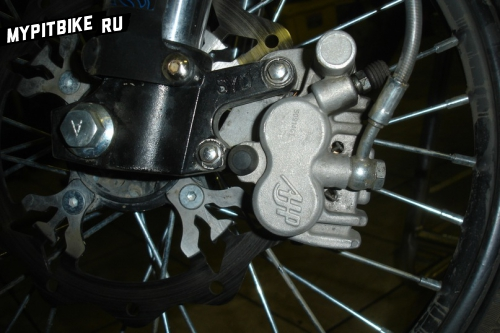

# Pitsterpro lx5 spare parts alternatives

How to Replace Parts When Original Components Are Unavailable.
Gathering Information Together.

###### Brakes

The front caliper can be adapted from a Honda Lead AF-48 with minor modifications.
Almost any front brake master cylinder will suffice, and one can be selected from a moped.
The complete front brake system from AJP, suitable for European mopeds (Derbi DRD, Aprilia RX/SX50 &gt;06, Derbi GPR125), is compatible. Replacement of the guides is necessary.

The rear brake pads are compatible with those from a Honda Dio.
The rear brake master cylinder, with slight modifications, can be adapted from a YAMAHA FZR 600.

###### Chain

17/14 cross - 420 chain with 116 links
14/12 cross - 420 chain
14/14 motard - 428 chain with 120 links
12/12 motard - 420 chain
