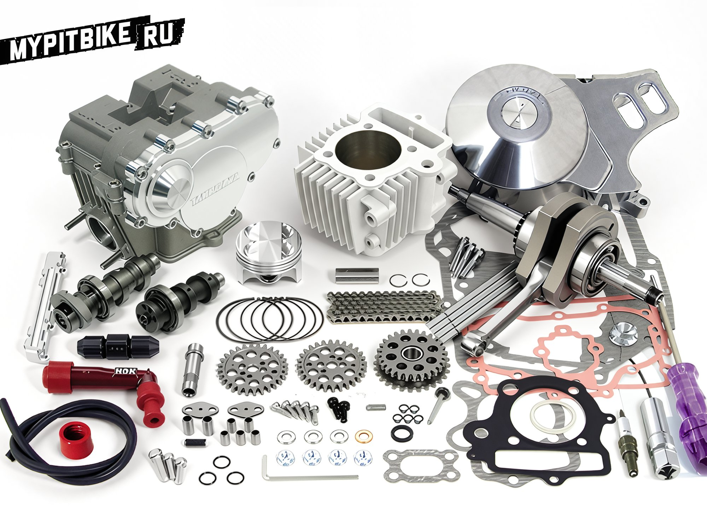
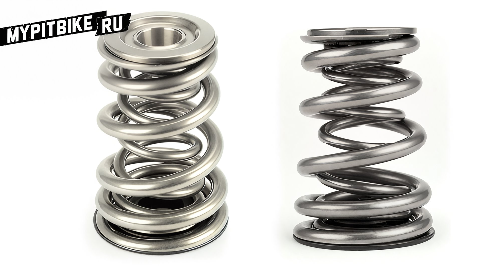
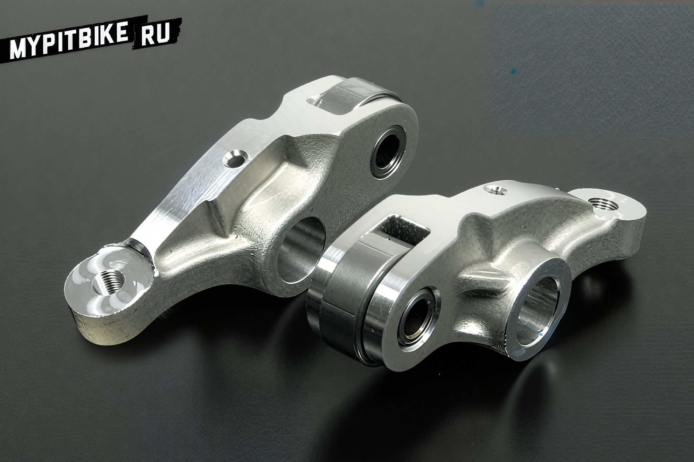
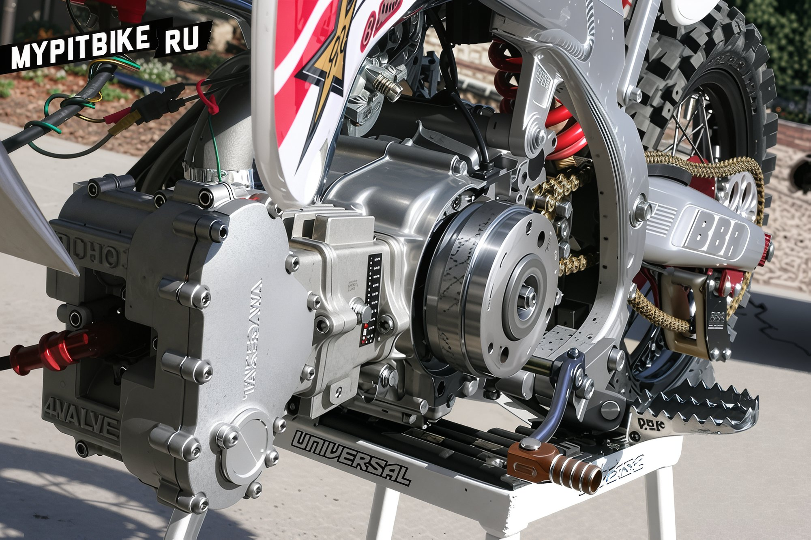

# Valvetrain or valve train mechanism

Valvetrain -- a combination of components that transmit motion. A traditional solution for internal combustion engines, utilizing valves to control air and fuel intake and exhaust from the cylinder, facilitating the combustion of their mixture. The valve mechanism of the gas distribution system. To achieve maximum engine efficiency, it is essential to assemble the correct combination of valvetrain components.

Engines operating at high RPMs with an aggressive camshaft require lightweight rocker arms and stiff springs. If the springs are not stiff enough, the valve will float, "bounce" on the seat, or hit the piston upon closing. However, if the springs are too stiff, it may lead to bending of the guides, overloading of the rocker arms, or accelerated wear of the camshaft, potentially causing overheating.
Lightening the valvetrain components reduces the pressure required by the springs to control the mechanism. Reducing weight on the valve side of the rocker arm, lightening the valve (thin stem or hollow stem, titanium), lighter retainers, springs with modified geometry (narrower at the top).
 The stiffness of the springs must be sufficient for the rocker arm to adhere evenly to the camshaft, allowing the valves to close without bouncing or floating, but no more than necessary.
Engines can be used for various purposes, from everyday use to racing mode.
When building a racing engine, the necessary specifications for the type of race are considered. There is no need for a high-revving engine when riding over rough terrain or long distances. Sometimes it is necessary to maintain fuel efficiency or reduce heat generation.
The prices of high-quality components from manufacturers also significantly influence.

Some types of rocker arms can be made of steel or aluminum, may include bearings or not, and have different lift ratios. The primary load on the rocker arm occurs when opening the exhaust valve, as it must withstand the pressure in the cylinder after combustion.
The most crucial aspect of tuning the valvetrain is understanding that it is an interconnected system. Each part is linked to another to achieve a single result. The parts should not be "the most expensive," but rather correctly selected. Unaccounted elements can lead to a loss of power, RPM, engine stability, or limit operability within a specific RPM range. The most balanced combinations make the engine flexible and powerful across the entire operating range.

