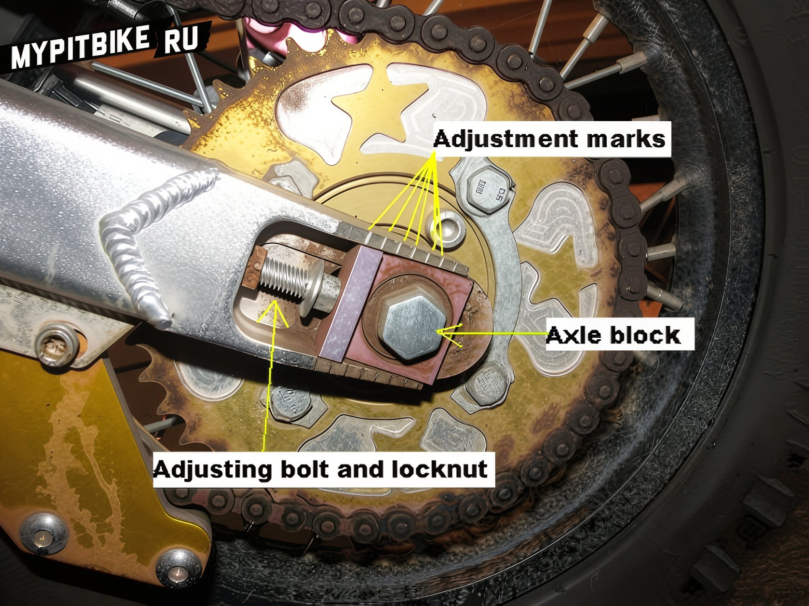

# How to adjust the chain on a pit bike

When purchasing a new bike, one of the initial tasks is to adjust the chain tension. This is a normal occurrence as the links tend to stretch slightly over time.

1. Loosen the nuts on the rear axle.  
   

2. Evenly pull (slide) the wheel backward. On pit bikes, there are special tension bolts in the swingarm for this purpose. After each adjustment, check the chain slack. On an unloaded bike, it should be about 3-4 cm. When it seems everything is ready, sit on the bike facing backward and check the chain tension. It will inevitably tighten as the swingarm changes position. In this position, it should not be too tight, as this is only 30-50% of the shock absorber's compression. At 80% compression (upon landing), the chain might break. Therefore, while sitting on the bike, the chain should still have a slight play.  
   

To simplify the process, **ask a friend to sit on the bike** while you adjust the chain.  
*An overtightened chain leads to rapid wear of the sprockets and the chain itself.*

It makes sense to add information on how to lubricate the chain.

1. Bourgeois option - Motul Off Road Lube. A special lubricant (with additives) for cross/enduro bikes. Expensive. Whether it works or not is uncertain. One hopes it does.

2. Thick/thin lubricants like lithol, teflon, silicone, etc.

Our task is first to remove dirt from the chain and sprockets. Wipe with a cloth (or better, with gasoline/diesel). Then lubricate the INNER side of the chain without overdoing it, ensuring the lubricant does not reach the brake disc. Remove excess lubricant (if it's thick like lithol). Our goal is to lubricate the inside of the chain (pins and links), not to smear everything indiscriminately. I wipe the side of the chain almost dry with a cloth, leaving lubricant on the inner side and just a little on the outer (usually what has seeped from the other side of the chain).

If the chain is left heavily lubricated, it will attract a kilo of sand, dirt, hair, etc. All of this acts as an excellent abrasive and will wear down the sprockets at an alarming rate.