# How to assemble a pit bike after delivery

The assembly procedure of a pit bike after delivery is relatively straightforward, though it may require certain skills, tools, and a helping hand. 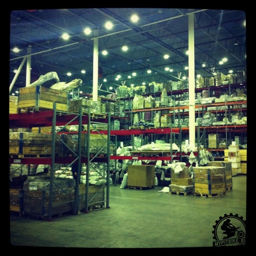 Of course, you can purchase a fully assembled and tuned motorcycle, but if purchasing a pit bike locally is not an option, you'll need to order one from the nearest city. In most cases, it will arrive in factory packaging and will need to be assembled by you. Moreover, not every motorcycle comes with detailed assembly instructions, and questions may arise or spare parts might be left at the end. To ensure the process goes smoothly and neatly, read carefully the order for **assembling a pit bike** (for PitsterPro example). **We will need:**

1. A pair of capable hands
2. A ratchet toolset with long sockets 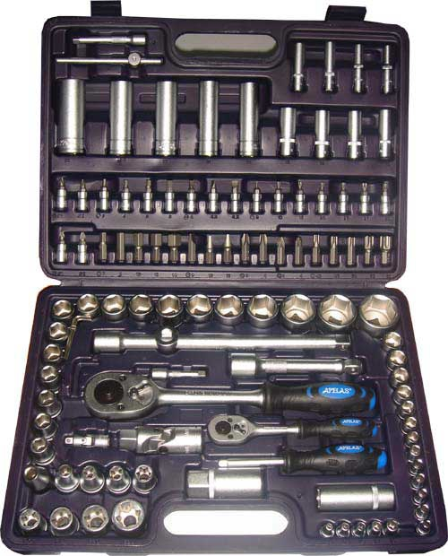
3. An open-end wrench set 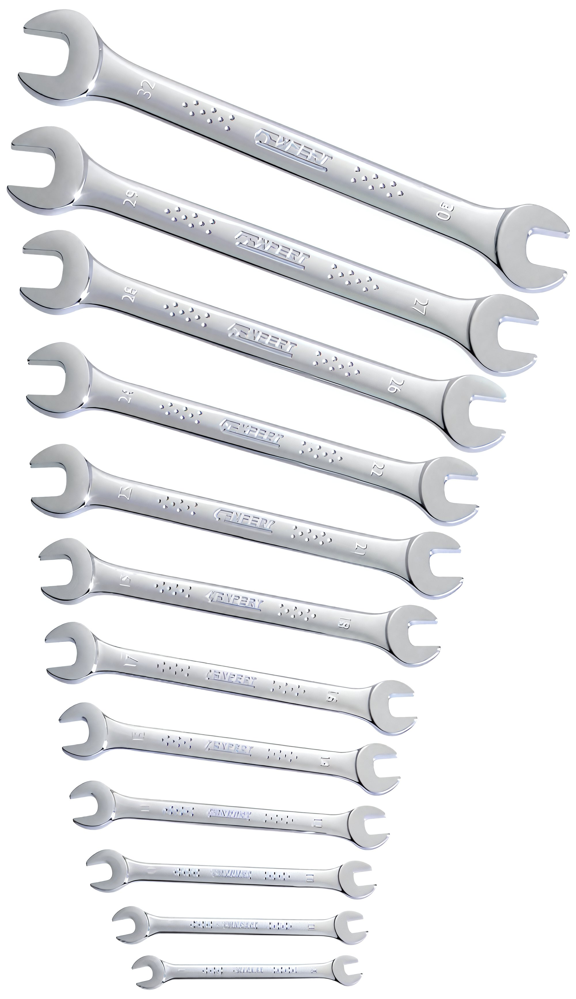
4. Wire cutters, pliers
5. Threadlocker, like Loctite or similar 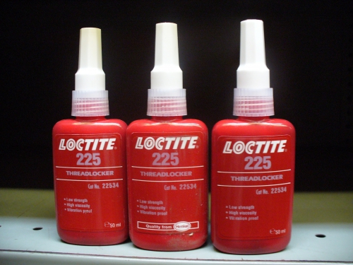
6. Grease, like Litol 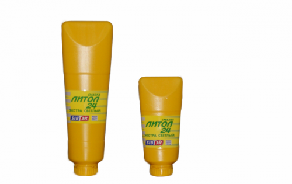
7. A stand for the pit bike, a stool will do

We'll skip the delivery and transportation challenges of the motorcycle box. Remember, **the box is quite large** and may not fit in every vehicle. Additionally, the metal crate adds weight; you'll need **a friend's help** for loading, and sharp edges might **damage a car's interior.** Now that the box with the eagerly awaited pit bike is in the room/garage, let's start the assembly. 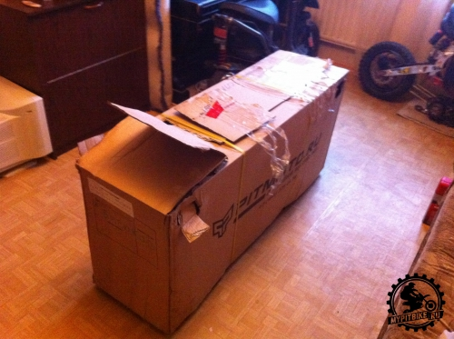 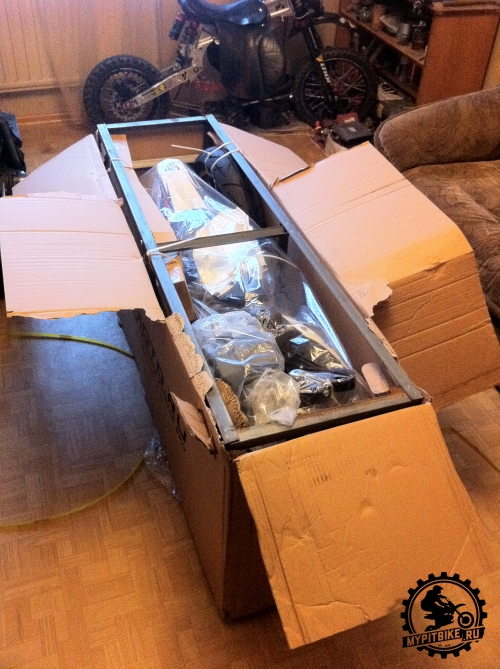

#### 1. Unpacking

Cut the securing straps and remove the cardboard box. Remove the protective film to reveal the contents. 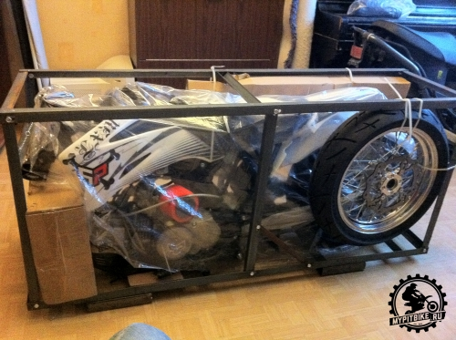 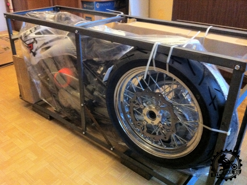 Using wire cutters, remove the ties securing the wheel and long cardboard box (fork legs). Pull out the larger box (containing the triple clamps and fastening elements). Set aside. 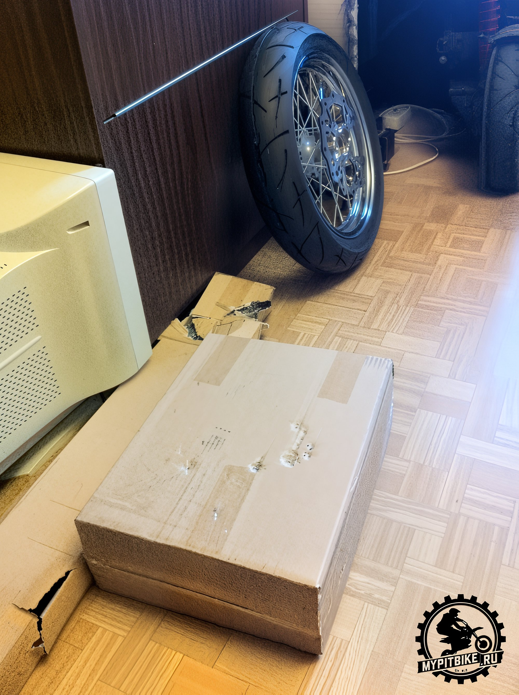 Proceed with dismantling the metal crate. Using a ratchet and open-end wrench, unscrew six bolts to remove the upper part. Cut the metal wires securing the triple clamp to the front wall of the crate. Then, unscrew all bolts on the transportation crate, removing the front, rear, and side walls. Here's what you'll see. 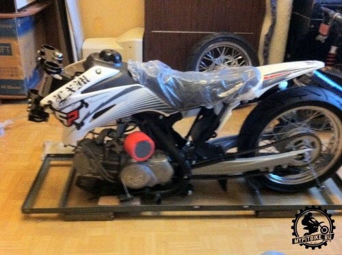 Cut the remaining two wires holding the rear wheel to the bottom of the crate. Be cautious to prevent the motorcycle from tipping over. Roll the motorcycle out of the crate. Cut a few more ties to detach the handlebars and remove the protective film. Set the parts of the crate aside; they're no longer needed. 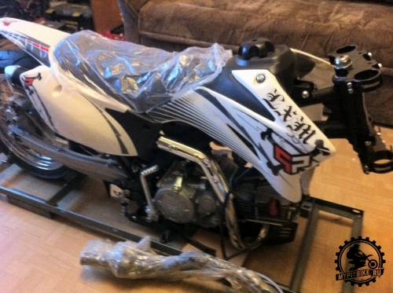 Open the smaller cardboard box to find the front fork legs, remove the packaging film, and place the legs on a table or any surface large enough for all parts. 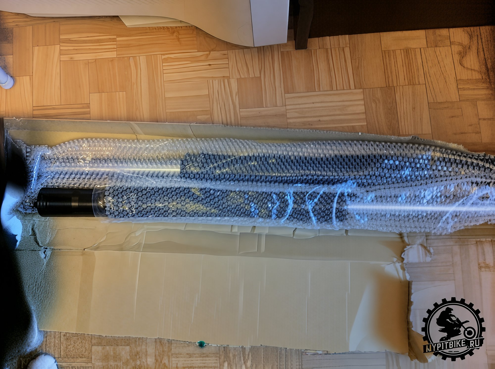 Open the large cardboard box. Take out the contents and remove the packaging films. Check all boxes for parts, screws, and bolts, ensuring they're empty before gathering and discarding them. Consider the unpacking process successfully completed. ;) 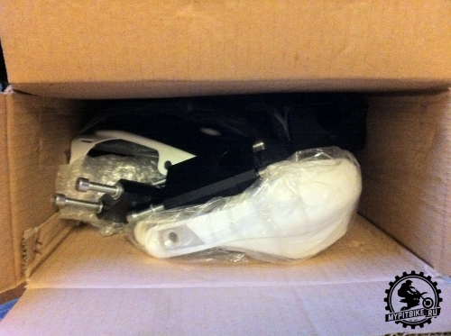 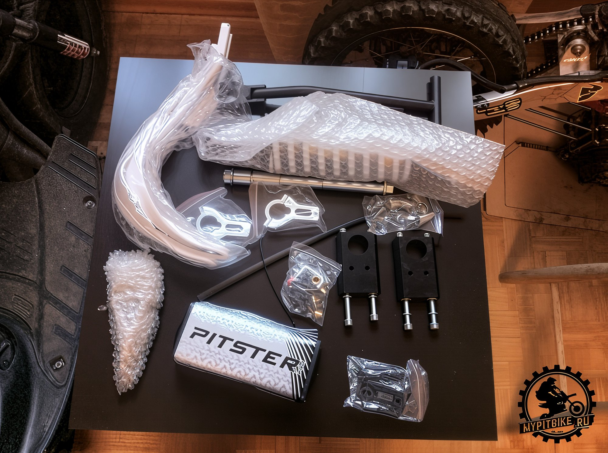

#### 2. Installing the Rear Shock Absorber

Place the pit bike half on a stool; you might need an assistant for this. 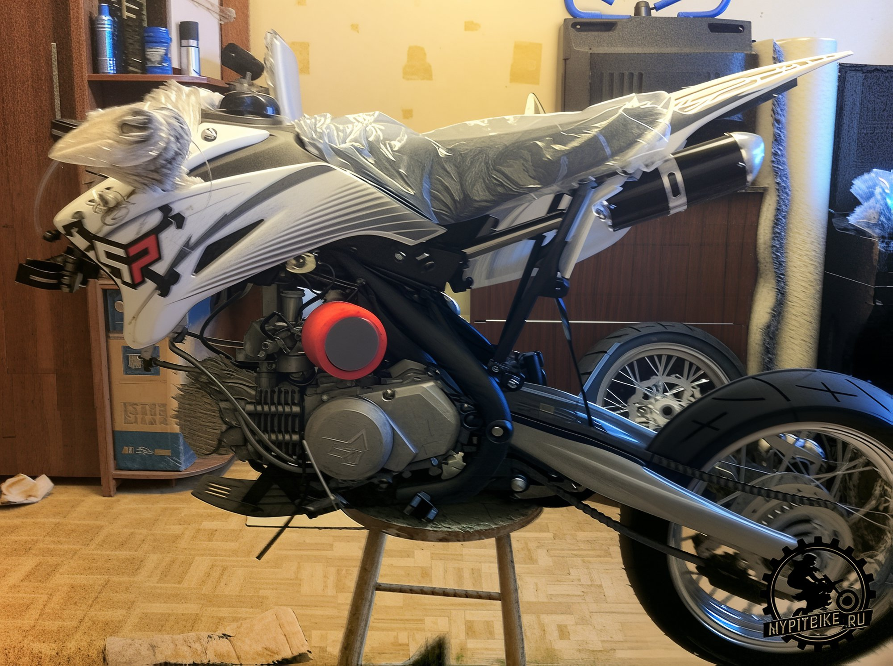 Remove the rear plastic covers, attached by two bolts each. For convenience, you might temporarily remove the rubber mudguard. Before installing the rear shock, **it's crucial to tightly secure the preload adjustment nut** and the locknut. 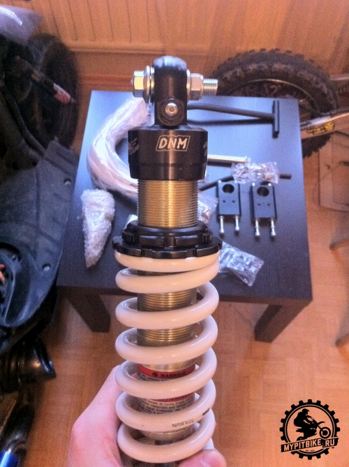 Cut the clamp at the bottom with wire cutters, securing two bushings, and install the shock absorber as shown in the photo. The top attaches to the mounting points on the frame, and the bottom to the swingarm. 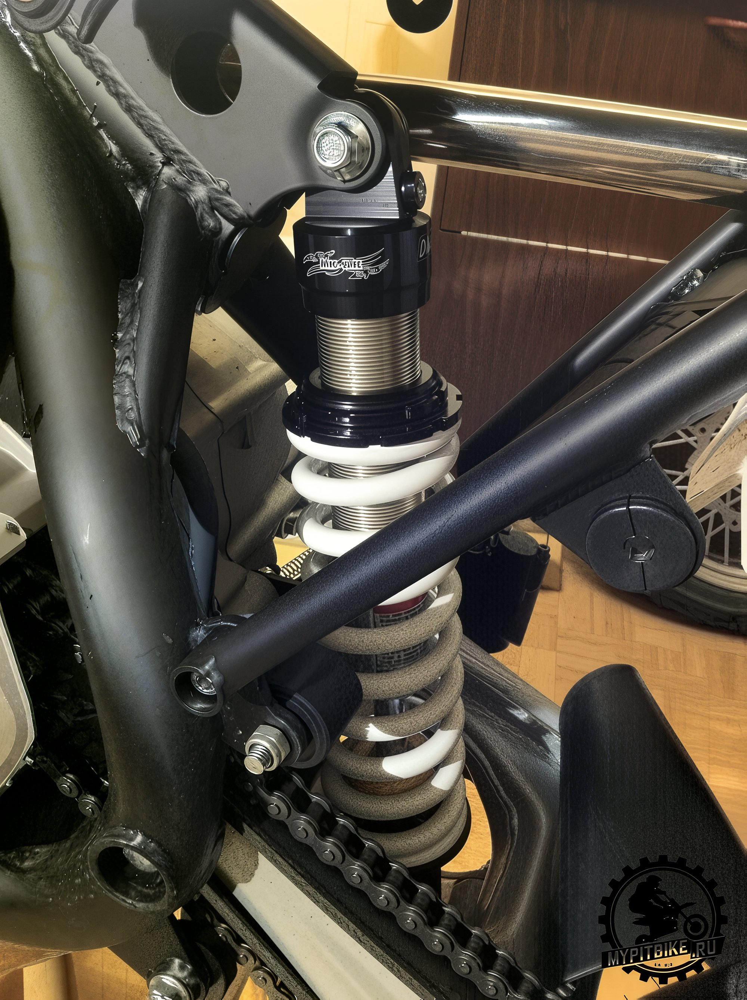 **Tip:** *Apply a drop of Loctite on each bolt to prevent the nut from loosening over time.* After installing the rear mono shock absorber, **return all parts to their places** in the reverse order.

#### 3. Installing the Rider Footpegs

Insert the footpeg into the special lugs, along with the spring, slide in the axle, attach a washer to the end, and secure everything with metal wire. Repeat on the other side. The footpegs should be facing upward with their teeth and should automatically return to place due to the spring. 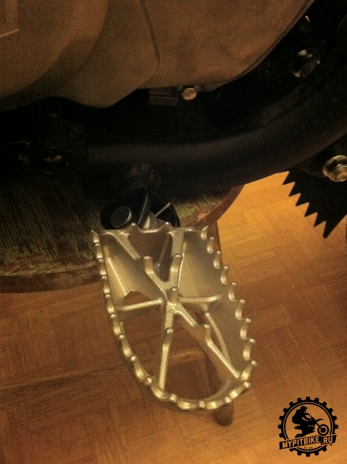

#### 4. Installing the Fork Legs

Here, **it's crucial not to mix up the fork legs**. The **left** leg in the direction of travel has lugs for attaching the brake caliper. The **right** leg has only the main wheel axle hole. Once the legs are identified, loosen the clamps on the triple tree, and sequentially insert each leg, tightening evenly the two bolts on the upper and two bolts on the lower triple tree. 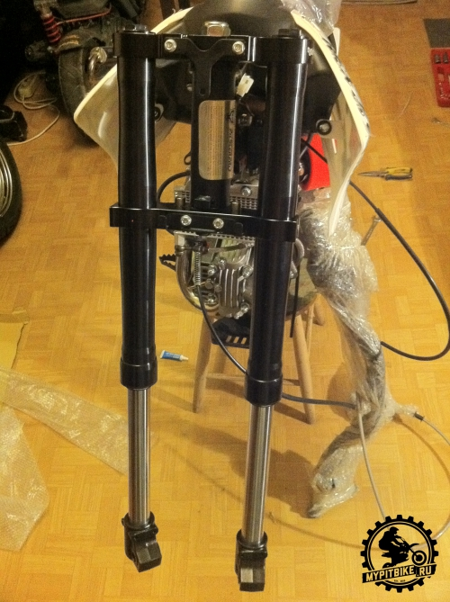 At the top of the legs, there are special notches, and when installing, ensure the legs are **at the same level** and protrude equally by the notches.

#### 5. Installing the Front Caliper

This step is fairly simple. First, remove the plastic spacer between the pads and attach the caliper with two bolts to the left fork leg. **Tip:** *Moderate your effort; the metal is quite soft in places and can easily strip the threads.*

#### 6. Installing the Front Wheel

Take the wheel, align it with the brake disc toward the caliper, and roll it into position. The task becomes more challenging as you need to fit two bushings and the wheel onto one axle so that the brake disc goes **between the caliper pads**. Don't mix up the bushings; they're different lengths. The **shorter** one should be on the **brake disc side**, and the **longer one on the opposite side** of the wheel. 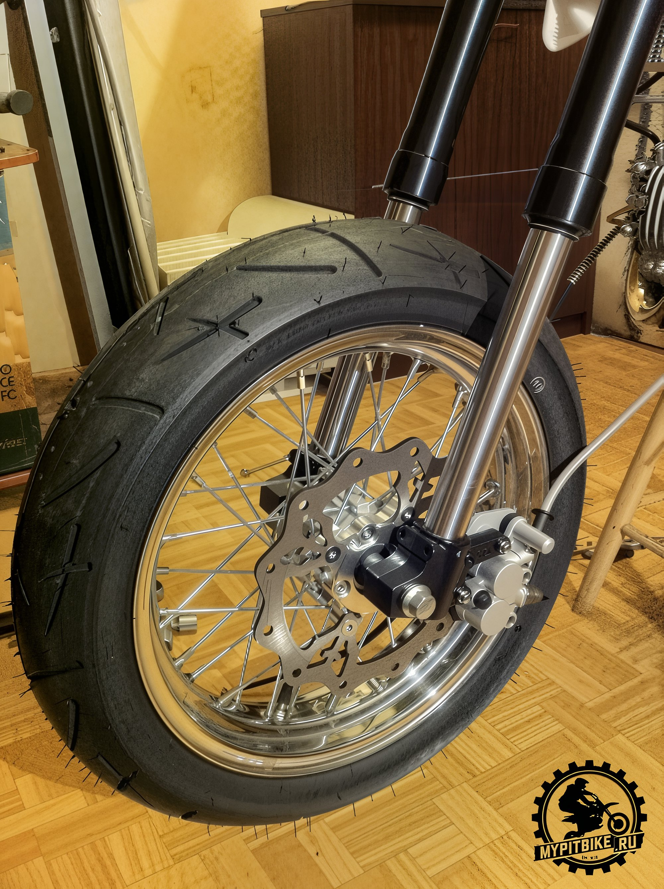 **Tip:** *Apply a thick layer of grease inside the wheel hub and on the axle. Remove any excess with a dry cloth.*

#### 7. Installing Handlebar Risers and the Handlebar

In the large box of parts, you'll find handlebar risers. Attach them as shown in the photo, from the underside of the upper triple tree. Each is secured by two bolts. Then, take the handlebar, orient it correctly toward the rider. **The clutch lever** should be on the **left**, and **the throttle grip and brake master cylinder** on the **right**. Install the handlebar and loosely secure it from above. **First, set it lightly**, center it, tilt to a comfortable angle, and tighten fully. 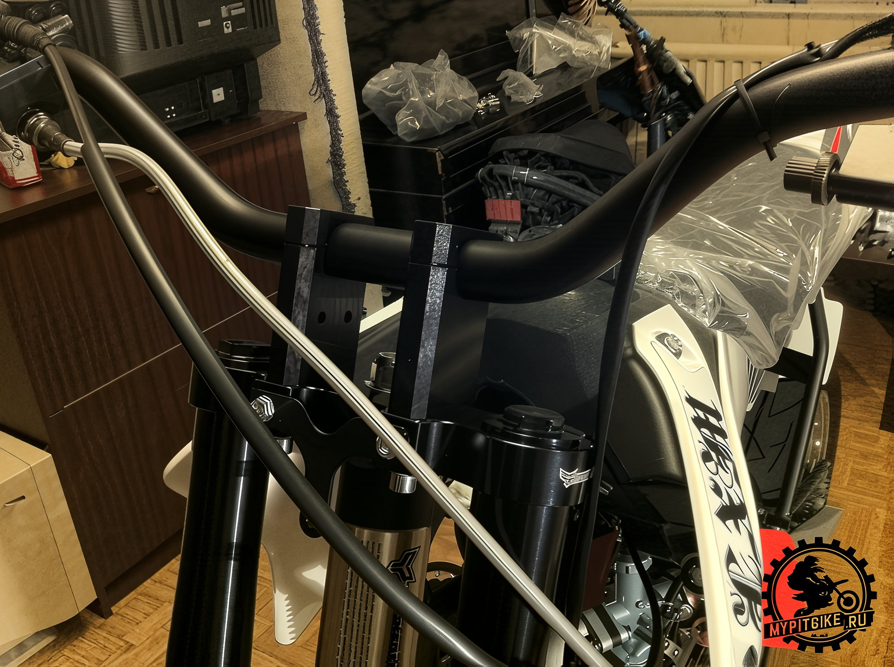 **Tip:** *Monitor the cables and wires, ensuring that when turning the handlebars from stop to stop, the cables have ample free movement.*

#### 8. Installing Plastic Panels

Start with the front fork. In the large cardboard box, there are two fork guards and six copper-colored metal bushings. Insert the bushings into the appropriate holes in the plastic guards and attach them to the triple trees using three bolts. 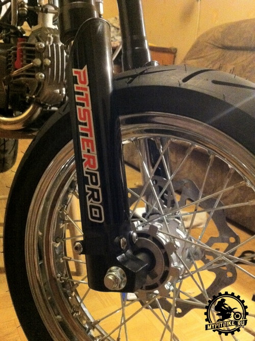 Then attach the front fender to the lower triple tree and install the front number plate. Route the brake hose from the master cylinder to the caliper, securing it with the appropriate clamps. Attach it to the plate with a plastic strap and use two metal clamps to secure it to the left fork's plastic protection. Fit the pad onto the handlebar. 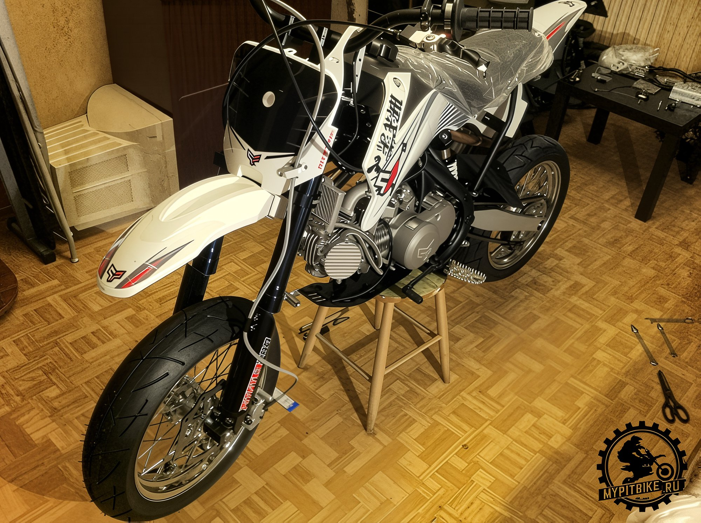 After completing these steps, you should have a fully assembled pit bike gleaming with new plastic. **The following parts should remain:** a bag of carburetor jets and the brake pedal safety cable (an odd cable with a red cap at the end). 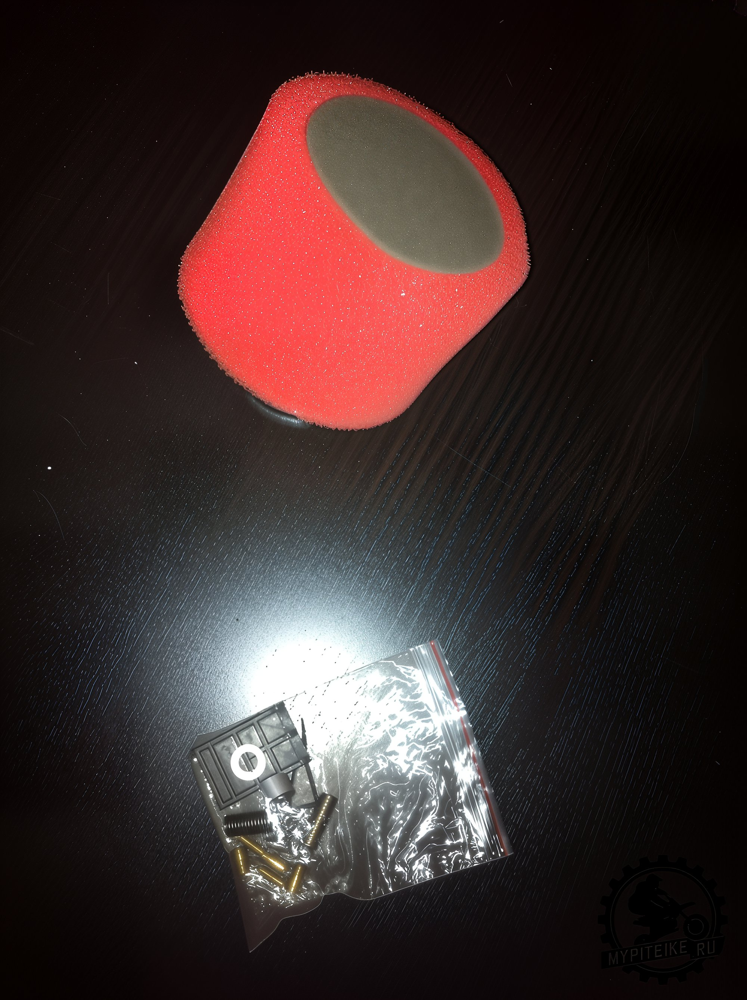 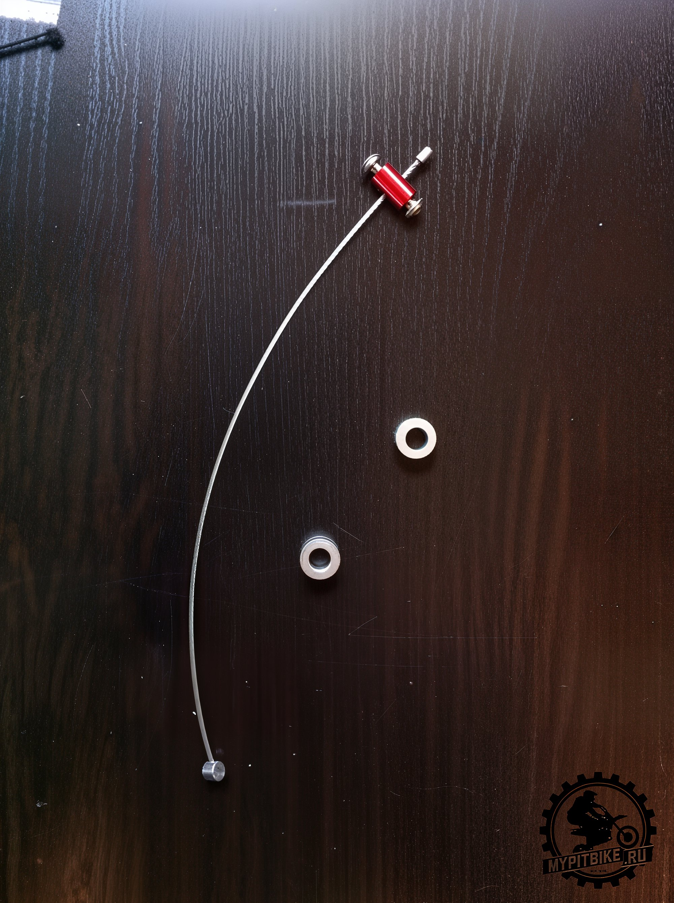

#### 9. Installing the Brake Lever Safety Cable

It's recommended to install this cable only **after the brakes have been bled**. Installation is straightforward as shown in the photo. Remove the red clip, pass it through the hole in the brake pedal, loop it around the engine guard hoop, and secure it with the red clip, leaving ample free movement. 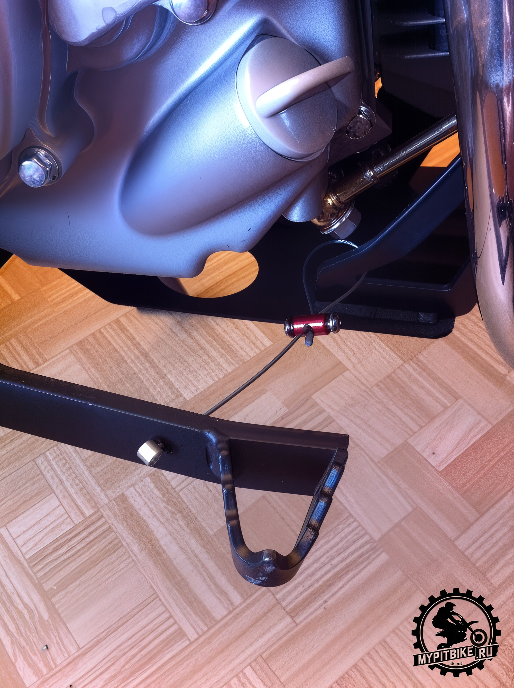 Before the first startup, thoroughly check fastenings [**according to instructions**](http://mypitbike.ru/blog/workshop/2.html), inspect chain tension, check cable free play, [**bleed the brakes**](http://mypitbike.ru/blog/workshop/10.html), and [**fill with quality oil**](http://mypitbike.ru/blog/workshop/4.html) and gasoline.

#### Additional Photos

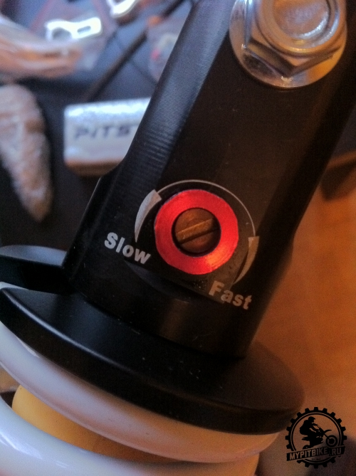 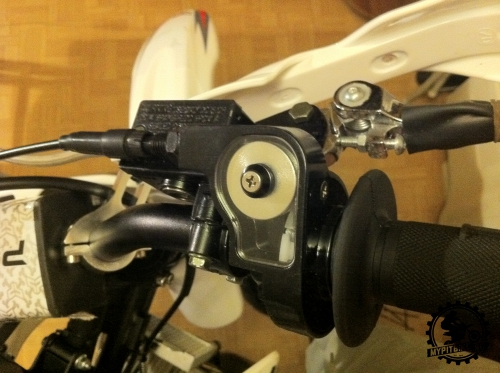 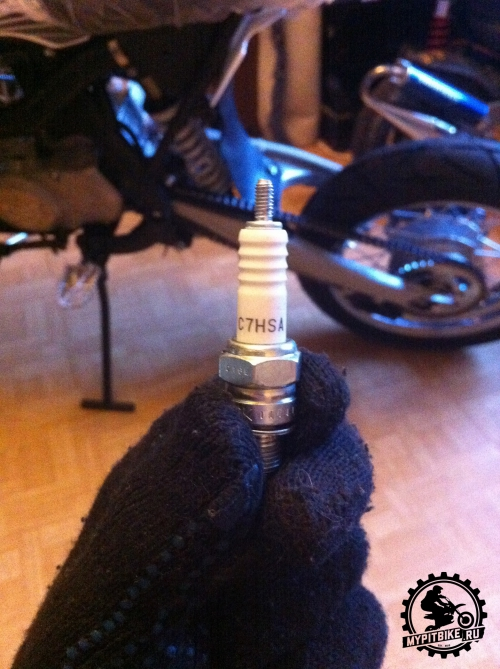 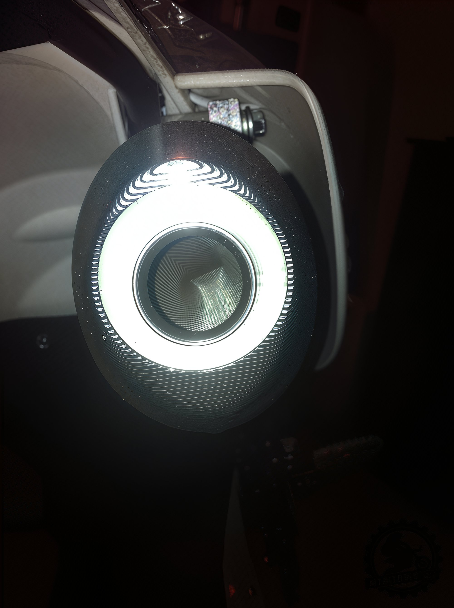 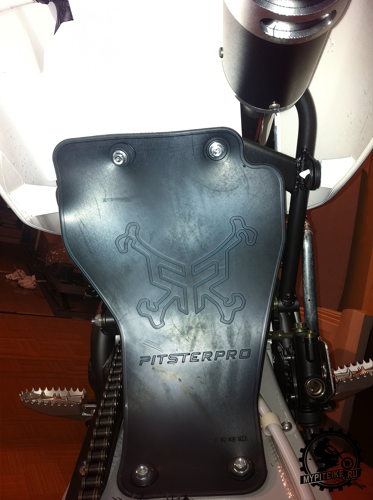 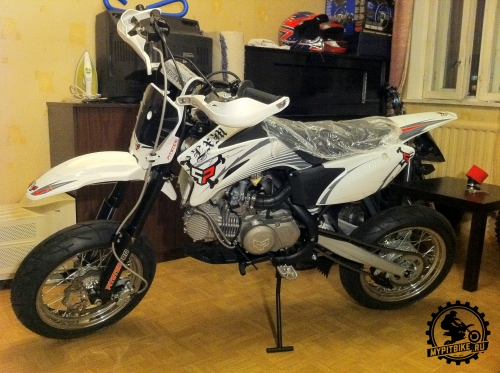 **If you have any questions during the assembly, feel free to leave a comment.**