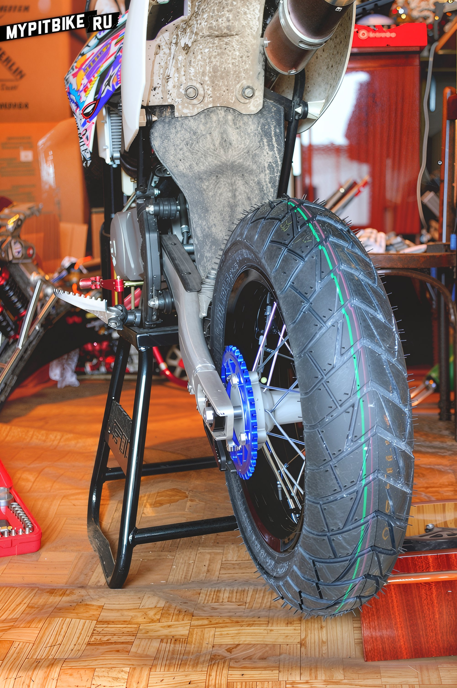
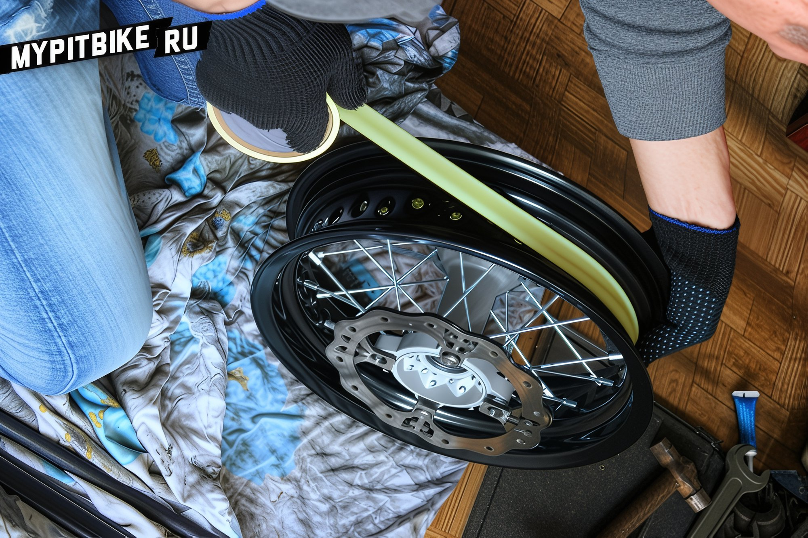
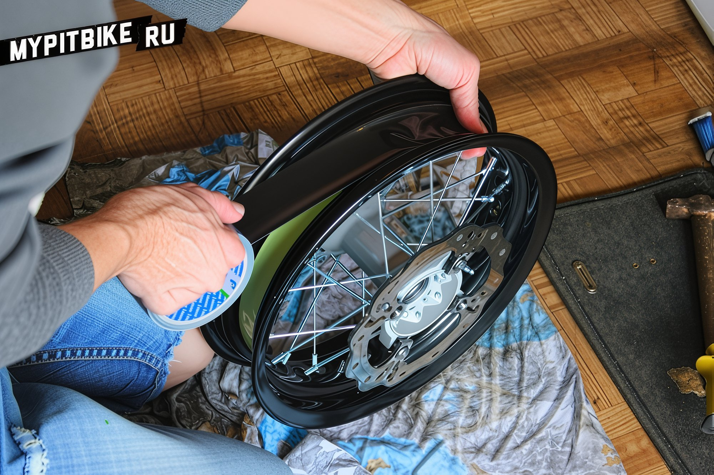
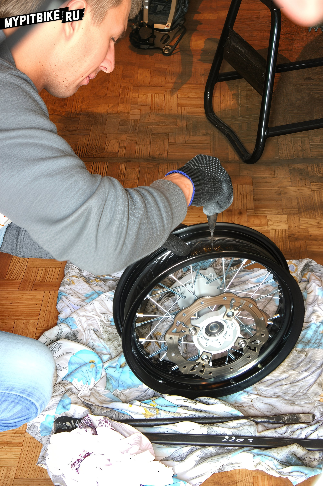
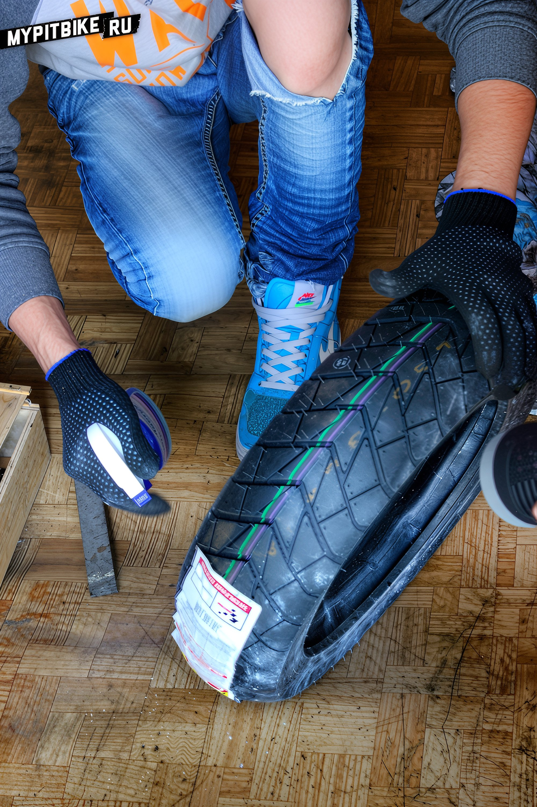
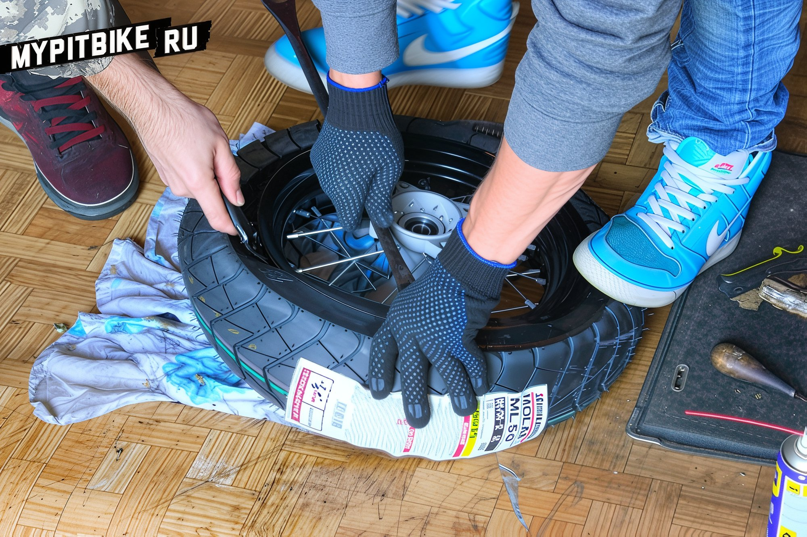
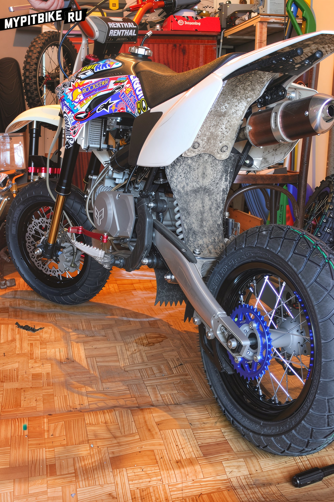

# Mounting a pit bike tire

Today, we will guide you on how to change tires on a pit bike. **Option 1.** Remove the wheel and take it to a tire service willing to work with small pit bike wheels. **Option 2.** Remove the wheel and do it yourself. Yes, it's challenging and might involve some colorful language, but anyone can master the mounting/demounting procedure. Let's assemble **12" supermoto wheels for the PitsterPro LXR**, although the specifics don't matter much. 

#### What's Needed:

- **Toolset** - you'll need to remove the wheel first.
- At least **2 tire irons**, preferably short motorcycle ones. But since we live in the second-largest city in Russia, where stores lack everything, car tire irons will do. Just make sure they're not two meters long.
- A **tire** of suitable diameter, width, and profile.
- An appropriate **inner tube** in matching diameter and width.
- **Talcum powder**, also known as baby powder.
- **Window cleaner** or soapy solution (many use WD-40).

#### Optional (what was additionally needed in our case):

- **Rim tape**, ideally rubber and of the correct diameter and width. Since we're in a wonderful city where nothing is available, sticky bicycle or reinforced tape will do.
- A **friend**, or several. You can manage alone, but a frayed nervous system is guaranteed.
- A **heat gun**, just in case.

Let me immediately caution you, this might deter you from buying Chinese tires or attempting to mount the tire yourself. The **main problem** is the small diameter and width of the rim and hence the tire. The second issue is the tube. The third is the rigid tire compound. On YouTube, there are plenty of video tutorials showing tires being mounted with fingers in under five minutes. Yes, if you have a 17-inch wheel; there's more tire to stretch; tire irons fit; and the rim is wide enough for the tire to fit comfortably. http://www.youtube.com/watch?v=DqiSV4WZb-c With pit bike wheels, it's a different story. Chinese tires, typically mounted on Chinese "plasticine" rims, usually have more plastic than rubber in the compound and are apparently mounted either with a 200-ton press or possibly heated directly from the mold. Removing such a tire without damaging the rim or ripping the tube is a challenge even for seasoned tire service pros. We've had plenty of experiences removing and remounting such tires with makeshift tools - it usually ended with curses, flung tools, cutting or heating the tire with a heat gun until it became tar-like. But for us, things should be much simpler. We ordered new **YCF** rims made of "7000-series" aluminum and the widest available on the market. We also invested in the softest road tire – **Bridgestone ML50**, and didn't skimp on tubes either. By now, it's clear that we'll skip the pit bike wheel removal and tire demounting process and jump straight to the interesting part. Let's go. We'll suggest that for ease of tire installation, remove anything unnecessary like the brake disc and sprocket. Wipe the inside of the rim with something like a degreaser, inspecting the spoke nipples simultaneously. Take the rim tape and carefully apply it, covering the spoke nipples, wrapping it in two layers, overlapping.   For added strength, wrap two additional layers of reinforced tape. If you don't have rim tape, you could manage without it. People often recommend electrical tape, fabric bandages, or simple office tape. Use a heated awl to make a hole for the valve.  Assuming the rim is prepared, set it aside and take the inner tube. Remove the nuts, unscrew the valve stem, apply light pressure to allow the tube to take shape, and disconnect the pump, ensuring the tube retains its shape and necessary air. Tighten the valve stem nut.  If the room is cold or the tire is rigid plastic-like Chinese, evenly heat the tire with a heat gun to make it more pliable. Take a handful of talcum powder and sprinkle it inside the tire, wiping the inner tube with the remainder. Talc or baby powder should be evenly distributed inside the tire, with excess blown out. Talc prevents the tube from sticking to the tire and allows it to be tucked in easily without folding.  Insert the inner tube into the tire; it will be easier this way than pushing it in and feeling around for the valve hole later. Next, **decide on the tire's direction**. Most branded or non-branded tires have an arrow indicating the rotation direction. Once the direction is determined, take the rim and place the tire with the tube inside on top, ensuring the valve aligns with the rim hole. Check that both the direction is right and the prep work was done correctly. Prepare the tire irons. If using standard car ones, **file down any sharp edges**, making them as smooth and gentle as possible without sharp thinning at the end. Wrap the working ends in several layers of tape to prevent puncturing the inner tube and damaging the rim paint.  Next, using a spray bottle with window cleaner or a soapy solution, thoroughly lubricate the sidewall closest to the rim. First, insert the valve into the rim hole and fix it with a nut turned a couple of times - it should move freely. Begin mounting the tire from the side of the valve. Press the tire from the valve side so it snaps onto the rim. You can usually get half to two-thirds of the tire on manually. Next, flip the wheel, insert the pair of tire irons a small distance apart, and using your foot, mount the remaining tire. **Here's a trick**: the tire bead barely stretches, so it may seem that the tire is smaller than the rim and can't possibly fit. On the mounted side, **depress the sidewall into the rim's center groove** (where spoke nipples are); this will drop the tire onto a smaller radius, freeing up millimeters for the tool. Usually, mounting one side poses no issues. If it's stubborn, add more lubricant, increase tire warming, and take smaller bites with the tire iron (the smaller, the better - more repetitions are required but with less leverage and risk of rim damage).   Okay, half the job is done. The inner tube is inside, valve inserted. Half the tire is on the rim. Continue with the same approach. Liberally coat the bead and start mounting from the valve. This side will be much harder since the rims are narrow, and the tire has nowhere to go. Here's where a friend, or better yet, two, comes in handy to hold the mounted side of the tire from slipping off the rim. **Insert the tool very gently and carefully**, just enough to grab the rim's edge. There's no room for haste here. Press a tire iron too firmly, and you'll puncture the tube, which means demounting everything again and heading to the store for a new one. Soon, you'll hit a point where it feels like the tire won't go any further; it's stretched on the rim, with most of it in and some out. There'll be about 10-15 cm left - this is the **hardest part, where everyone punctures tubes**. Here, you need two tools: one to flex the bead from the rim, the other to carefully, without force, slide under the tire and grip the wheel's rim edge (you can feel and control with fingers). Take the smallest possible bites, using your foot to stretch the remaining tire over the rim.  Once done, coat the mounted edges in lubricant and inflate to about 4 atmospheres, which will press the tire onto the rim seat. It might not sit on the first attempt; if so, deflate completely, tap around the tire's edge, lubricate, and try again. After the tire is seated, adjust the tire pressure as required. Secure the valve with nuts and tighten the cap. Install the brake discs and sprocket in their places.  **Our wheels amounted to:** Set of wide supermoto YCF 7116 wheels - 14,500 RUB Bridgestone ML50 120/70 R12 tires - 6,000 RUB SM-Parts 3.0/12 tubes - 700 RUB Rim tape - 500 RUB 37-tooth rear sprocket - 1,850 RUB **All parts provided by [Pitbike Store](http://pitbikestore.ru/)** 