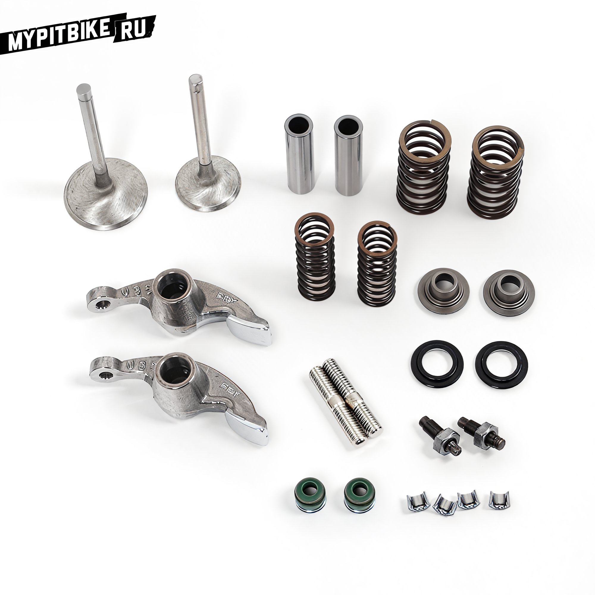

# Valve clearance adjustment for pit bikes

Adjusting valve clearances is not as daunting a task as it might initially seem. According to the maintenance schedule for a pit bike engine, it is recommended to adjust the clearances every 100 engine hours. We advise doing this more frequently, especially if the engine is new, as there is a risk of receiving an engine with overly tight valves. **What you will need:**

- A set of feeler gauges with the smallest possible increments
- A set of 8-9mm wrenches

 Where to begin? First and foremost, the engine must be completely cooled. If the engine has been repaired, it is convenient to perform the adjustment on the engine removed from the pit bike. Typically, the engine is equipped with a SOHC timing system, meaning a single camshaft in the cylinder head (though DOHC systems also exist). The clearances in the valve mechanism are adjusted using screws located at the ends of the rocker arms. The engine design includes special covers on the cylinder head for access to the adjustment screws. http://www.youtube.com/watch?v=HppcqVpnaFw Unscrew the cover on the left side of the cylinder head (underneath which is the timing gear), and the small covers on the top (near the carburetor intake) and bottom (near the exhaust). Unscrew the left cover on the engine, behind which is the generator (do not worry, there is no oil there). The clearances in the valve mechanism are checked and adjusted only when the valves are in a specific position – at the top dead center (TDC) of the end of the compression stroke. Marks on the timing chain sprocket and corresponding marks on the cylinder head, as well as marks on the generator bell, help establish this position. To align these marks, the engine's crankshaft must be rotated. This can be done by pressing the kick-starter or rotating the generator bell by hand or with a wrench on the nut. Rotating the crankshaft is easier with the spark plug removed. http://www.youtube.com/watch?v=QJciyJRJh8Q Rotate the crankshaft until the T mark on the generator and the notch on the engine assume their characteristic positions, and the timing drive marks on the head and sprocket align. In this position, if you grasp the ends of the rocker arms with your hand, you can feel their slight free play. Precisely determine the clearance size using flat feeler gauges. Insert feeler gauges of various thicknesses (bending them if necessary) into the gap between the valve tip and the adjustment screw on the timing drive rocker arm. The clearance is considered equal to the thickness of the gauge that enters with slight resistance (the next larger gauge should not fit into the gap). The clearances in the intake and exhaust valve drives of the engine are (on a cold engine) **.003" (0.08mm)** and **.005" (0.13mm) or .004" (0.1mm)** respectively (unless other recommendations are provided in the operating manual). If the actual clearance deviates by ± 0.005 mm, it needs to be adjusted. To do this, hold the square head of the screw with a special "3.5" wrench or pliers, and loosen the lock nut with a "9" box wrench. http://www.youtube.com/watch?v=hZjdJcIYdWo This is where the delicate work begins. Insert the required thickness gauge into the gap and, while slightly moving it, simultaneously rotate the adjustment screw until the gauge is lightly pinched. Remove the gauge and secure the screw in this position with the lock nut. Check the clearance again: if it is within the norm, reinstall the removed parts in reverse order. Properly adjusted clearances in the timing system will allow for long and happy riding!