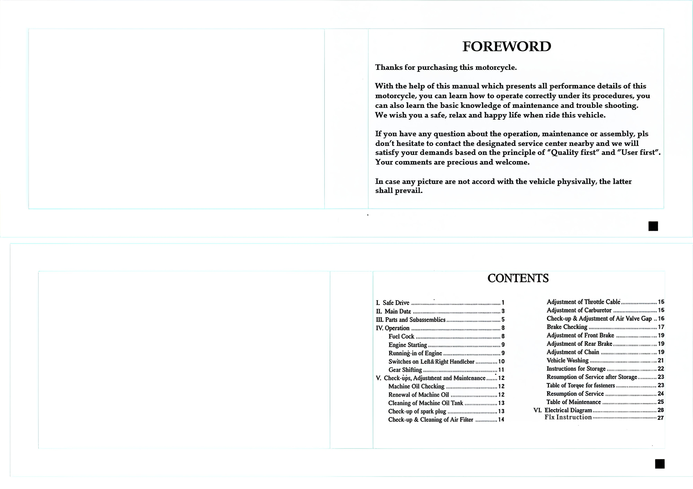
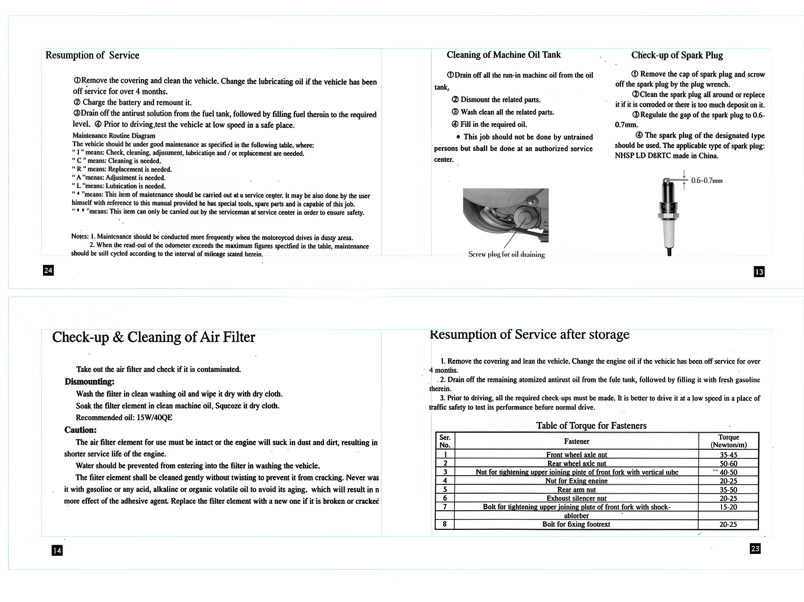
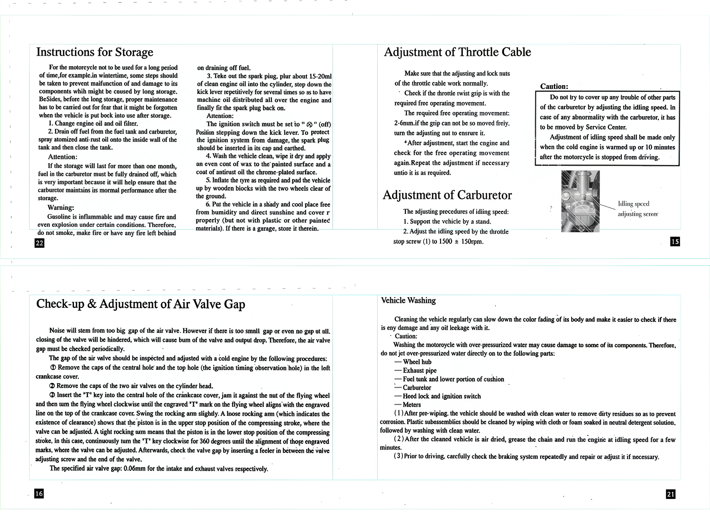

# Mikilon User Manual

## WARNING

- Operation of this ATV by children under the age of 16 poses a risk of severe injury or death.
- Adult supervision is required always.
- Never permit children under age 16 to operate ATV.
- Operator use only, passengers prohibited.
- This vehicle is designed and manufactured for OFF-ROAD use only.
- Driving on public streets, roads, or highways is illegal.
- Always wear a helmet and other protective equipment.
- Do not operate this vehicle after consuming alcohol or drugs.
- Gasoline is flammable; when refueling, please shut off the engine to avoid sparks and open flame.
- Read the owner's manual carefully before riding. Keep the owner's manual with the vehicle.

## FOREWORD

Thanks for purchasing this motorcycle. With the help of this manual, which presents all performance details of this motorcycle, you can learn how to operate it correctly under its procedures. You can also learn the basic knowledge of maintenance and troubleshooting. We wish you a safe, relaxed, and happy life when riding this vehicle. If you have any questions about the operation, maintenance, or assembly, please don't hesitate to contact the designated service center nearby, and we will satisfy your demands based on the principle of "Quality first" and "User first." Your comments are precious and welcome. In case any pictures do not match the vehicle physically, the latter shall prevail.

## SAFE DRIVE

### Rules For Safe Drive

Checks must be conducted before starting the engine to prevent mishaps and damage to components. Only the qualified person who has passed the driving examination with a driving license is permitted to drive the vehicle, and not anybody else without a driving license. Full attention is required during driving, paying attention to the following points to avoid any possible harm by other motorized vehicles:

- Do not drive too close to other vehicles.
- Never contend for a lane.
- Strictly observe the local traffic rules.

Driving at overspeed is the cause of many accidents; do not drive at a speed that the actual situation does not permit. Particular care should be exercised at the level crossings of roads, entrances, and exits of parking lots, or on automobile lanes. During the drive, grasp the left handlebar with the left hand and the throttle twist grip with the right hand, with feet on the footrests.

### Protective wear

1. Protective wear such as a helmet with a protective mask, dustproof glasses, and gloves should be worn during the drive for personal safety.
2. Loose clothes are not suitable for motorcycle driving or riding as they may get caught on the operating lever, kick lever, footrest, or wheel, resulting in danger.

### Modification of the vehicle

Caution: Any unauthorized modification of the vehicle or replacement of the original parts cannot ensure driving safety and is illicit. The user must observe the traffic control authorities' regulations. We are not responsible for any vehicle with unauthorized modifications.

## MAIN DATE

|                | 125cc      | 160cc      |                          | 125cc                | 160cc                 |
|----------------|------------|------------|--------------------------|----------------------|-----------------------|
| Overall length | 1660mm     | 1660mm     | Cylinder bore x stroke   | 56.5mm x 49.5mm      | 60mm x 55mm           |
| Overall width  | 720mm      | 720mm      | Compression ratio        | 9.5:1                | 11.5:1                |
| Overall height | 1065mm     | 1065mm     | Output, max              | 8.0kw/8500r/min      | 19.5kw/9500r/min      |
| Wheelbase      | 1190mm     | 1190mm     | Torque, max              | 8.7 N.m/7500r/min    | 11.5 N.m/8000r/min    |
| Dead weight    | 64.5kg     | 64.5kg     | Idling speed             | 1500 ±150 v/min      | 1400 ±150r/min        |
| Payload        | 77.5kg     | 77.5kg     | Displacement of cylinder | 125ml                | 155.5ml               |
| Front wheel    | 60/100-14' | 60/100-14' | Carburator               | PZ27                 | PZ22                  |
| Rear wheel     | 80/100-12' | 80/100-12' | Spark plug gap           | 0.6mm-0.7mm          | 0.6mm-0.7mm           |
| Speed, Max     | 80km/h     | 100km/h    | Cap of air Valve         | Intake Valve: 0.10mm | Exhaust Valve: 0.07mm |
| Brake distance | \<7m       | \<7m       |                          |                      |                       |
| Climb ability  | >18°       | >18°       | Ground clearance         | 300mm ±15mm          | 350mm ±15mm           |

|                       | 125cc  | 160cc  |                      | 125cc  | 160cc |
|-----------------------|--------|--------|----------------------|--------|-------|
| Capacity of fuel tank | 6L     | 6L     | Ignition means       | CDI    | CDI   |
| 1st gear              | 3.270  | 3.270  | 2nd gear             | 1.940  | 1.940 |
| 3rd gear              | 1.350  | 1.350  | 4th gear             | 1.050  | 1.050 |
| 5th gear              | -      | 1      | Final reduction      | -      | -     |
| 6th gear              | /      | /      |                      | -      | -     |

## OPERATION

### Fuel Cock

1. Fuel Filling

The capacity of the fuel tank is 5L in total. Open the lock cover of the fuel tank and fill fuel through the opening, then close the tank by aligning the cover properly.

2. Operation of the Fuel Cock (Valve of Fuel Tank)

- **ON**: With the handle of the fuel cock in the "ON" position, the fuel circuit is open for fuel supply.
- **OFF**: With the handle of the fuel cock in the "OFF" position, the fuel circuit is cut off and there is no supply.

### Engine starting

**Warning**
>Never start the engine in a closed place or warehouse as the exhaust gas from the vehicle contains toxic carbon monoxide.

1. Set the key of the ignition switch to "ON".
2. Ascertain the neutral gear.
3. Verify the amount of fuel in the tank.
4. Set the fuel cock handle to the "ON" position.

### To Start a Cold Engine

1. Pull up the choke bar of the carburetor (to close the choke).
2. Rotate the throttle twist grip by 1/8 to 1/4 turn.
3. Start the engine by electric or kick starting.
4. Slightly turn the throttle twist grip to increase the speed of the engine to warm it up.
5. Turn the carburetor choke bar downward to fully open the choke when the engine is sufficiently warmed up.

**Caution**: The engine can only be started after the neutral position is ascertained; otherwise, accidents can happen. Unnecessary idle running (especially at high speed) is harmful to the engine.

### Procedures for Stopping Engine

1. Release the throttle twist grip to slow down.
2. Shift to the neutral position.
3. Set the ignition switch key to "OFF" position.
4. Set the fuel cock handle to the "OFF" position.

### Running-In of Engine

The first 1000 km drive is for running-in of the vehicle. Attention should be paid to the following points:

1. It is strictly prohibited to drive while carrying goods or climbing steep slopes.
2. Do not drive continuously for more than 50 km; increase driving speed moderately.
3. The engine should be warmed up for 3-5 minutes prior to each drive to ensure running-in components are lubricated sufficiently.
4. The driving speed should not exceed 40 km/h maximum during the first 500 km, and not over 50 km/h maximum during the second 500 km.

### Ignition Switch

The ignition switch is located under the fuel tank, on the right-hand side.

- When the key is turned to the "OFF" position, the engine cannot be started or it stops during driving.
- When the key is turned to the "ON" position, and the neutral indicator is turned on, the engine can start and the vehicle can be driven.
- Press the kill switch to stop the engine from working.

## Check-ups, Adjustment and Maintenance

### Lubricating Oil Checking

The vehicle should be checked for engine lubrication oil before driving each day. The oil level should be between the upper and lower lines of the oil gauge fitted in a screw plug, which is on the right cover of the crankcase.

1. Set the motorcycle vertically on the ground, screw off the oil gauge plug, wipe the oil gauge rod clean, and then insert the unit into the crankcase again to check the oil level. To do this, there is no need to screw the oil gauge plug into its hole in the crankcase.

2. Add lubricating oil up to the upper line when needed, but do not overfill.

3. Finally, screw on the oil gauge plug tightly. For details, please see the attached chart. Lubricating oils of different viscosity shall be employed in different regions and at different temperatures.

**Caution:**
>Never start the engine when there is insufficient lubricating oil. Otherwise, it will cause harm to the engine.

### Lubricating Oil Recommendations

The lubricating oil is an important factor affecting the performance and service life of the engine. For this vehicle is used the gasoline engine lubricating oil fusually known as machine oil for vehicles) specified in China National Standard GB485-81. kis not permitted to use ordinary machine oil, vegetable oil or crude castor oil.

Lubricating oils of different viscos ity shall be cmployed in differcnt regions and at different temperatures.

For details please see attached chart.

| Items of Maintenance         | Frequency                | Odometer km (Note 2)                    | Remark    |
|------------------------------|--------------------------|-----------------------------------------|-----------|
|                              |                          | 1000km  | 4000km | 8000km | 12000km |           |
| Circuit of fuel system       |                          |         | 1      | 1      | 1       |           |
| Fuel filter                  |                          | C       | C      | C      | C       |           |
| Throttle operating system    |                          | 1       | 1      | 1      | 1       |           |
| Choke of Carburetor          |                          |         | 1      | 1      | 1       |           |
| Air filter element           | Note 1                   |         | C      | C      |         |           |
| Spark Plug                   |                          | 1       | 1      | 1      |         | C         |
| Air valve gap                |                          | 1       | 1      | 1      | 1       |           |
| Engine lubricating oil       | R-yearly                 | One replacement every 800km, 600km, 1000km, 2000km | | | 1 |  |
| Lubricating oil screen       | R-yearly                 |         |        |        |         |           |
| Tension of chain             |                          | A       |        | A      | C       |           |
| Idling speed of carburetor   |                          | 1       | A 1    | 1      | A 1     |           |
| Driving chain                |                          | 1.L     | 1.L    | 1.L    | 1.L     |           |
| Wear of brake shoes          |                          |         | 1      | 1      | 1       |           |
| Rear braking system          |                          | 1       | 1      | 1      | 1       |           |
| Front braking system         |                          | 1       | 1      | 1      | 1       |           |
| Clutch                       |                          | 1       | 1      | 1      | 1       |           |
| Sidestand                    |                          |         | 1      | 1      | 1       |           |
| Suspension                   |                          | 1       | One replacement every two years | | |         |
| Nuts, bolts & other fasteners|                          | 1       | 1      | 1      | 1       |           |
| Wheel/spokes                 |                          | 1       | 1      | 1      | 1       |           |
| Bearing of steering handle   |                          | 1       |        |        | 1       |           |

### Gear Shifting

A mode of gear shifting is employed for this motorcycle. The throttle shall be shut up before gear shifting and it is forbidden to shift gear with the throttle unclosed. Gears shall be shifted gently but precisely to the home position. It is not allowed to place your foot on the gear-shifting pedal during the drive to avoid damaging the clutch caused by sudden gear shifting accidentally.

Legend for the right figure:
1) 1st gear
0) Neutral gear
2) 2nd gear
3) 3rd gear
4) 4th gear
5) 5th gear

### Points for Attention during Drive

1. Avoid unnecessary idling of the engine, and it is not allowed, in particular, to have it idling at high speed. Otherwise, it will damage components seriously.
2. The clutch will be worn out soon if the motorcycle is driven with the clutch semi-disengaged.
3. Shift to a low-speed gear when feeling that the power is not strong enough when climbing.
4. It is forbidden to use the front brake only or to coast by the neutral gear, especially when descending or driving at high speed.
5. On braking, narrow the throttle, disengage the clutch at the same time, and then apply the brake.

## Resumption of Service

- Remove the covering and clean the vehicle. Change the lubricating oil if the vehicle has been off service for over 4 months.
- Charge the battery and remount it.
- Drain off the antirust solution from the fuel tank, followed by filling fuel therein to the required level.
- Prior to driving, test the vehicle at low speed in a safe place.

### Maintenance Routine Diagram

The vehicle should be under good maintenance as specified in the following table, where:

- "I" means: Check, cleaning, adjustment, lubrication, and/or replacement are needed.
- "C" means: Cleaning is needed.
- "R" means: Replacement is needed.
- "A" means: Adjustment is needed.
- "L" means: Lubrication is needed.
- "*" means: This item of maintenance should be carried out at a service center. It may also be done by the user himself with reference to this manual, provided he has special tools, spare parts, and is capable of this job.
- "**" means: This item can only be carried out by the serviceman at the service center in order to ensure safety.

**Notes:**
1. Maintenance should be conducted more frequently when the motorcycle drives in dusty areas.
2. When the read-out of the odometer exceeds the maximum figures specified in the table, maintenance should still be cycled according to the interval of mileage stated herein.

### Cleaning of Machine Oil Tank

1. Drain off all the run-in machine oil from the oil tank.
2. Dismount the related parts.
3. Wash clean all the related parts.
4. Fill in the required oil. This job should be done at an authorized service center.

### Check-up of Spark Plug

- Remove the cap of the spark plug and unscrew the spark plug with the plug wrench.
- Clean the spark plug all around or replace it if it is corroded or there is too much deposit on it.
- Dismount the related parts and wash them clean. Fill in the required oil. This job should not be done by untrained persons and should be carried out at an authorized service center.
- Regulate the gap of the spark plug to 0.6 - 0.7mm.
- The spark plug of the designated type should be used. The applicable type of spark plug: NHSP LD or DBRTC made in China.

### Check-up & Cleaning of Air Filter

Take out the air filter and check if it is contaminated.

**Dismounting:**

Wash the filter in clean washing oil and wipe it dry with a dry cloth. Soak the filter element in clean machine oil, then squeeze it with a dry cloth. Recommended oil: 15W/40QE

**Caution:**

The air filter element must be intact, or the engine will suck in dust and dirt, resulting in a shorter service life of the engine.

Water should be prevented from entering the filter when washing the vehicle.

The filter element shall be cleaned gently without twisting to prevent it from cracking. Never wash it with gasoline or any acid, alkaline, or organic volatile oil to avoid its aging, which will reduce the effectiveness of the adhesive agent. Replace the filter element with a new one if it is broken or cracked.

### Resumption of Service After Storage

1. Remove the covering and clean the vehicle. Change the engine oil if the vehicle has been off service for over 4 months.
2. Drain off the remaining atomized antirust oil from the fuel tank, followed by filling it with fresh gasoline.
3. Prior to driving, all required check-ups must be made. It is better to drive at a low speed in a place with traffic safety to test its performance before normal driving.

### Table of Torque for Fasteners

| Ser. No. | Fastener                                                                    | Torque (Newton-m) |
|----------|-----------------------------------------------------------------------------|-------------------|
| 1        | Front wheel axle nut                                                        | 35-45             |
| 2        | Rear wheel axle nut                                                         | 50-60             |
| 3        | Nut for tightening upper joining pin of front fork with vertical tube       | 40-50             |
| 4        | Nut for engine mount                                                        | 20-25             |
| 5        | Rear arm nut                                                                | 35-50             |
| 6        | Exhaust silencer nut                                                        | 20-25             |
| 7        | Bolt for tightening upper joining plate of front fork with shock absorber   | 15-20             |
| 8        | Bolt for fixing footrest                                                    | 20-25             |

## Instructions for Storage

When the motorcycle is not to be used for a long period, such as during winter, certain steps should be taken to prevent malfunction and damage to its components, which might be caused by prolonged storage. Besides, proper maintenance should be carried out before long-term storage to ensure it is not forgotten when the vehicle is put back into use.

1. Change engine oil and oil filter.

2. Drain off fuel from the fuel tank and carburetor. Spray atomized anti-rust oil onto the inside wall of the tank and then close the tank.

**Attention:**
If the storage will last for more than one month, fuel in the carburetor must be fully drained. This is very important because it will help ensure that the carburetor maintains its normal performance after storage.

**Warning:**
Gasoline is flammable and may cause fire and even explosion under certain conditions. Therefore, do not smoke, make fire, or leave any fire source nearby when draining off fuel.

3. Take out the spark plug, pour about 15-20ml of clean engine oil into the cylinder, depress the kick lever repetitively several times to distribute the machine oil all over the engine, and finally refit the spark plug.

**Attention:**
The ignition switch must be set to "off" position when stepping down the kick lever. To protect the ignition system from damage, the spark plug should be inserted in its cap and grounded.

4. Wash the vehicle clean, wipe it dry, and apply an even coat of wax to the painted surface and a coat of antirust oil to the chrome-plated surface.

5. Inflate the tires as required and elevate the vehicle using wooden blocks with the two wheels clear of the ground.

6. Place the vehicle in a shady and cool place free from humidity and direct sunshine, and cover it properly (but not with plastic or other airtight materials). If there is a garage, store it there.

### Adjustment of Throttle Cable

Ensure that the adjusting and lock nuts of the throttle cable work normally.

Check if the throttle twist grip has the required free operating movement.

The required free operating movement: 2-6mm. If the grip cannot be moved freely, turn the adjusting nut to ensure it.

After adjustment, start the engine and check the free operating movement again. Repeat the adjustment if necessary until it is as required.

### Adjustment of Carburetor

The adjusting procedures for idling speed:

1. Support the vehicle with a stand.
2. Adjust the idling speed using the throttle stop screw to 1500±150rpm.

**Caution:**
Do not try to cover up any trouble with other parts of the carburetor by adjusting the idling speed. In case of any abnormality with the carburetor, it must be addressed by a Service Center. Adjustment of idling speed should be made only when the cold engine is warmed up or 10 minutes after the motorcycle is stopped from driving.

### Check-up & Adjustment of Air Valve Gap

Noise will stem from too big a gap in the air valve. However, if there is too small a gap or even no gap at all, closing of the valve will be hindered, which can cause burning of the valve and a drop in output. Therefore, the air valve gap must be checked periodically.

The gap of the air valve should be inspected and adjusted with a cold engine by the following procedures:

1. Remove the caps of the central hole and the top hole (the ignition timing observation hole) in the left crankcase cover.
2. Remove the caps of the two air valves on the cylinder head.
3. Insert the 'T' key into the central hole of the crankcase cover, jam it against the nut of the flying wheel, and then turn the flying wheel clockwise until the engraved 'T' mark on the flying wheel aligns with the engraved line on the top of the crankcase cover.
4. Swing the rocking arm slightly.
    - A loose rocking arm (which indicates the existence of clearance) shows that the piston is in the upper stop position of the compressing stroke, where the valve can be adjusted.
    - A tight rocking arm means that the piston is in the lower stop position of the compressing stroke. In this case, continuously turn the 'T' key clockwise for 360 degrees until the alignment of those engraved marks, where the valve can be adjusted.
5. Afterwards, check the valve gap by inserting a feeler in between the valve adjusting screw and the end of the valve.

The specified air valve gap: **0.06mm** for the intake and exhaust valves, respectively.

### Vehicle Washing

Cleaning the vehicle regularly can slow down the color fading of its body and make it easier to check for any damage and any oil leakage.

**Caution:**
Washing the motorcycle with over-pressurized water may cause damage to some of its components. Therefore, do not jet over-pressurized water directly onto the following parts:

- Wheel hub
- Exhaust pipe
- Fuel tank and lower portion of cushion
- Carburetor
- Head lock and ignition switch
- Meters

1. After pre-wiping, the vehicle should be washed with clean water to remove dirty residues to prevent corrosion. Plastic subassemblies should be cleaned by wiping with cloth or foam soaked in neutral detergent solution.
2. After the cleaned vehicle is air dried, grease the chain and run the engine at idling speed for a few minutes.
3. Prior to driving, carefully check the braking system repeatedly and repair or adjust it if necessary.

### Greasing Procedures for the Driving Chain

1. Shut off the engine.
2. Add some machine oil or chain grease to the driving chain.

**Attention:**
When the rear wheel axle has moved to the back adjusting limit, if excess looseness is caused by wear to the driving chain, please replace it with a new one.

### Brake Checking

1. Pull up the front and rear brakes respectively and check for wear of the brake shoes. If the mark (^) on the brake drum cover aligns with that (^) on the brake cam, it means that the brake shoes are already worn to the limit and need to be replaced.
2. Replacement should be carried out at a designated service center, and it is recommended that parts made by our company are used.

#### Adjustment of Front Brake

1. The front brake lever has a free operating movement of 10-20mm as shown in the figure on the right side.
2. The adjustment shall be carried out by turning the adjusting nut beneath the front hub, clockwise to increase and counterclockwise to decrease the free operating movement.
3. It can also be adjusted by turning the front adjusting nut on the handlebar, clockwise to increase and counterclockwise to decrease the free operating movement.
4. The lock nut has to be tightened after adjustment.

#### Adjustment of Rear Brake

The vehicle should be supported for check by the side stand.

1. The rear brake pedal has a free operating movement of 20-30mm.
2. To make an adjustment, turn the rear adjusting nut clockwise to reduce and counterclockwise to increase the free operating movement of the brake pedal.

### Adjustment of Chain

1. When regulation is needed, loosen the rear axle nut.
2. Turn the chain adjusting nuts on the left and right sides to adjust the tension of the chain and to align the marking of the chain adjustor with the engraved lines in a similar position on both sides.
3. Tighten the lock nut and rear axle nut with a torque of 35-50 Nm.
4. Repetitively check the tension of the chain.
5. When the rear wheel is changed in position and the chain adjusted, the free operating movement of the rear brake pedal will be affected, which should therefore be checked thereafter and also regulated if necessary.

The document 'Mikilon User Manual' is available for download below

[Download the file](../../../static/file/MikilonUserManual.rar)
