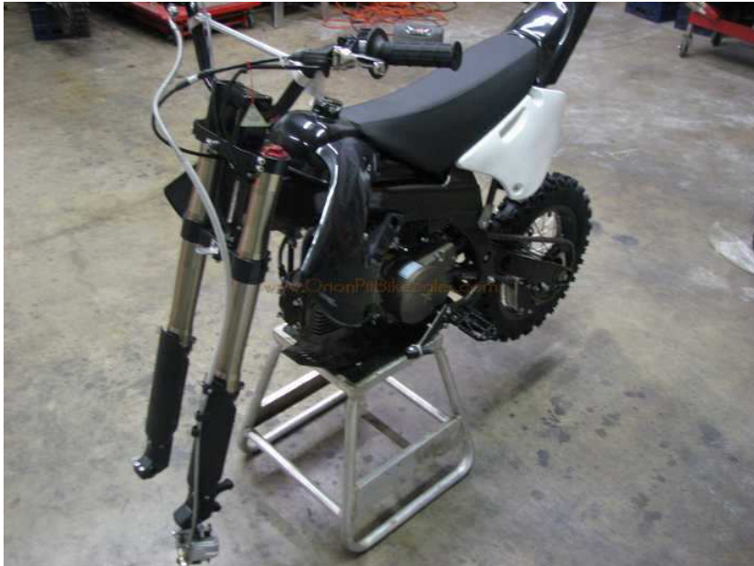

---
tags:
- orion
- instructions
---

import React from 'react';

# Orion Assembly Instructions

**Warning!** This dirt bike is a motorized vehicle. Use of this dirt bike by untrained riders may result in injury. This model is suitable only for day-time use on a closed track. Make reasonable demands on your dirt bike. These dirt bikes were not designed for high impact tricks or stunts. Damage caused by misuse of this vehicle, such as driving on public roads, off-road use, stunt driving, modification, over-use, and neglect, is not covered by our warranty. Proper maintenance of this product is essential to trouble-free operation. Please use caution when riding any motorized vehicle. Always wear a helmet. OrionPitBikeSales.com is not responsible for any injury in relation to this product. Your purchase constitutes your relinquishment of legal action of any kind against Orion Pit Bike Sales or any of its affiliates.

## TABLE OF CONTENTS

Section 1: Assembling your new bike
Section 2: Breaking in your new pit bike
Section 3: Clutch adjustment
Section 4: General Information
Section 5: Maintenance Schedule

## Assembling your new pit bike.

This is how your bike will arrive. (Boxing material and plastic removed for pictures)

### Step 1

The first step is to unbolt the top of the crate and remove. The following should be inside the crate: Bike, Front Wheel, Fender, # Plate, 2 Qts of Oil, and a box with extra parts (see next step for contents of the box). If you have ordered any extra pieces (graphics, handlebars, exhaust, etc.) they will also be in the crate or the extra box.

Here is what is inside the small box. Some bike models will have these parts already attached. In this example, we are assembling an X5R. The following should be inside the small box: rear shock, right foot peg, bar clamps (3 pieces), gas cap, gas cap breather tube, bar clamp nuts and bolts, top shock mount nut and bolt, bottom shock mount nut and bolt, suspension linkage knuckle bolt, extra spark plug, Loctite, and extra plastic bolts.

**NOTE:** The big bolt with the Allen head does not require a bolt. It will go into the left side of the swing arm and thread into the right side. If you are assembling a bike with linkage suspension, this bolt will go through the suspension knuckle. If you are assembling a model without linkage suspension then this bolt will go through the bottom shock mount hole. From this point, we recommend that you use Loctite on any bolts you assemble.
We will cover break-in and some general “getting started” tips later in this manual.

### Step 2

Assemble the handlebars and clamps with the 4 long bolts and nuts.

**NOTE:** Get all 4 nuts and bolts assembled and hand-tight before you tighten them all down.

This is a good place to remove the bike from the bottom crate and put on a stand. The bike will lift out of the crate once you remove the front axle and the wire from the rear wheel. Here is what it should look like.

### Step 3

Put on the front fender.

**NOTE:** The three bolts that hold on the front fender are already screwed into the bottom side of the bottom triple clamp. Remove these and reassemble with the front fender in place.

### Step 4

Put on the front # plate.

**NOTE:** The bolt that holds the # plate on is already screwed into the middle of the top triple clamp. There is also a spacer that goes in-between the # plate and the clamp when screwed on. Remove this bolt and spacer and reassemble with the # plate in place. You will also have to route the front brake line through the holder on the front # plate as shown in the picture below.

### Step 5

Put on the front wheel.

**NOTE:** When you removed the axle, there was the axle, the spacer, and the nut. The spacer goes on the left side (brake side) in-between the wheel and the left fork. Tighten the axle nut completely before you tighten the small Allen bolts on the right fork (Adjustable fork models only).

### Step 6

Put on the front brake.

**NOTE:** The 2 bolts that hold on the front brake are already screwed into the brake holder on the left fork tube. Remove and reassemble with the brake caliper in place. There should be a plastic spacer in-between the brake pads. Remove this piece and slide the caliper onto the disk (If the piece is missing you can gently pry the brake pads apart with a large flat-head screwdriver. The caliper goes on the inside of the mounts on the left fork tube (this may vary with different models).

### Step 7

Attach top and bottom shock bolts.

**NOTE:** These are the two nut and bolt assemblies that were included in the box. Only hand tighten these bolts for now. For models with linkage suspension, you will attach the bottom shock mount to the linkage knuckle. All other models require attaching the bottom shock mount into the swing arm. If your model requires the shock to be connected directly to the swing arm, you will need to use the long bolt with the Allen head on it, a lock washer, and no nut. This will go in from the left side of the swing arm and thread into the right side. There is no nut needed because the swing arm is threaded on the right side only. (See the next step for a picture)

### Step 8

Attach linkage knuckle to swing arm. (Linkage suspension models only. Skip this step if you do not have a linkage suspension model.)

**NOTE:** You will use the long bolt with the Allen head on it, a lock washer, and no nut. This will go in from the left side of the swing arm and thread into the right side. There is no nut needed because the swing arm is threaded on the right side only.
You will completely tighten this bolt then fully tighten the top and bottom shock mount nut and bolts.

### Step 9

Attach right foot peg.

**NOTE:** You will use the peg pin, spring, and cotter pin to attach the peg. The best way to do it is to insert the peg and fold it upward, then put the pin through. You may need to lightly tap on the pin to get it through.

Congratulations, you are done with assembly!!! Now it's time to move on to the break-in.

## Breaking in your bike

Don't let the excitement of your new purchase overwhelm your good sense. A new pit bike must be broken in correctly if you want the bike to function correctly. If you do not take the proper steps, you will dramatically decrease your engine's life and possibly kill it. We recommend using non-synthetic, 10w-40, and four-stroke motorcycle oil. This is the type we included in your starter kit.

### Step 1

CHANGE YOUR OIL BEFORE YOU START YOUR BIKE!

The oil that comes in your bike is low viscosity packing oil used to keep the internal parts from rusting during transit. NOTE: To change your oil, simply remove the 17mm bolt on the bottom side of the engine. If your bike comes with a skid plate, there will be a hole in the plate where this bolt is located. The motor oil only goes in one way, comes out one way, and lubricates the entire motor (transmission, head, clutches, etc.). Once you remove it, let the oil completely drain out. Also, remove the dipstick at this time. After the oil is finished draining, you can put the oil drain bolt back in. Do not overtighten this bolt; just get it very snug. Refill with oil and use the dipstick to determine the proper oil level. It should be at the top of the crosshair area on the end of the dipstick.

### Step 2

Start your bike and make sure the idle is not too high. If you start your bike and notice it is idling too high, stop your bike immediately and adjust the idle setting on your carburetor.

Let your bike idle, without putting it in gear, for about 5-10 minutes. After this time, the engine will be right below the normal operating temperature. Turn the engine off and let the bike cool down completely. Once the engine is cool, start your bike and let it run for another 10 minutes and then shut it down again to cool off completely. Do this process four to five times. DO NOT put the bike in gear during the "heat cycling" process!!

When you finish this process, run the bike at an easy pace, shifting through each gear. Do this in 10-15 minute intervals through the first tank of gas.

### Step 3

Change your oil again (2nd time).

You can now ride normally but avoid putting excess stress on the engine and avoid high RPMs for the first 4-8 hours of run time.

## Clutch Adjustment (manual shift models only)

Occasionally you will need to adjust your clutch on your pit bike. Here are signs it may be necessary:

- When you kick-start your bike, it will not get a compression kick.
- When you kick-start your bike, it feels like the kick starter is not catching.
- When you put your bike in gear, with the clutch pulled in, it creeps forward.

### Step 1

Remove the chrome dish on the right side (pipe side) of the motor. You can do this by removing the 2 Phillips head screws. This will expose a black stud with a flat head fitting on the end of the stud. The stud also has a lock nut around it.

### Step 2

Loosen the locknut and adjust the stud as needed. You can test the kick starter while the chrome dish is off. When you are finished, tighten the locknut and put the chrome dish back on. It is also a good idea to keep this area lubricated with general-purpose grease.

## General Information

The following information below is to help you get started with your new bike. It is not a training manual and does not guarantee any bike malfunctions. Make sure you keep up with normal maintenance for your pit bike just like you would a Honda, Yamaha, or any other brand. As always, Orion Pit Bike Sales provides free technical support to all of our customers. Please call us if you have any questions.

Below are a few tips to get you started.

1. When you first get your pit bike, make sure you go over every bolt on the bike to make sure that it is tight. We also recommend that you use Loctite on all of the main bolts. Make sure you check your bolts every 3-5 rides for safety purposes.
2. When you first get your pit bike out of the crate, it is important that you check and tighten the spokes if needed. You will also need to re-check the spokes after every 2-3 rides. To tighten the spokes, from the valve stem, tighten every third spoke, with just a few turns each until you work your way all the way around the wheel. Repeat this process until all the spokes are completely tight.
3. After your initial ride, your chain is going to stretch. It is important to keep your chain tightened to the appropriate tension to avoid a chain malfunction while riding. You will also want to check your chain every time before you go for a ride. You should be able to get 2-3 fingers under the chain on the top side of the swing arm right at the front of the rear wheel.
4. Your rear shock is adjustable (N/A on some models) by tightening and loosening your rear spring. You can do this by turning the two large main nuts on the top of the shock spring. There is also a set screw you can loosen to turn these two nuts.
5. Premium gas (91+ octane) is recommended. DO NOT use MIXED GAS!! We do not recommend using high octane (100+) race gas.

Orion Pit Bike Sales is not liable for injuries that may occur while riding. The information provided above is to help users get started with their new pit bike. You should always receive proper training before riding any motor vehicle and take the proper safety precautions before and while riding.

## Maintenance Schedule

- Engine Oil: Change every 20 hours of riding or every 3 months, whichever comes first.
- Air Filter: Clean every 2 rides. Clean every ride if you are riding in dusty conditions.
- Spark Plug: Change every 20-30 hours or as needed. (Spark plug gap is 0.06 ~ 0.07 mm)
- Fuel Filter: Change every 6 months or as needed.
- Throttle/Clutch Cable: Lubricate every 20 hours (cable lube). Change as needed.
- Carburetor: Clean every 6 months or as needed.
- Fuel Line: Change as needed.
- Chain: Change as needed. Keep properly lubricated (chain lube).
- Bearings (all): Change as needed. Keep properly lubricated (general-purpose grease).
- Clutch adjustment area: Keep lubricated (general-purpose grease).

## Download PDF

  <iframe
    src="/file/OrionAssemblyInstructions.pdf#toolbar=0&navpanes=0&scrollbar=0"
    style={{ position: 'absolute', top: 0, left: 0, width: '100%', height: '100%' }}
    frameBorder="0"
    scrolling="no">
  </iframe>

The document 'Orion assembly instructions' is available for download below

[Download the file](../../../static/file/OrionAssemblyInstructions.pdf)
