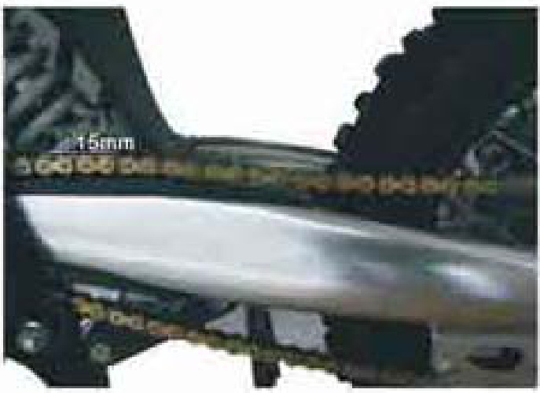

---
tags:
- pitsterpro
- instructions
---

import React from 'react';

# PitsterPro LXR 155R User Manual (USA Original)

## Quick Reference Guide

This Quick Reference Guide will Help you find the information you're looking for.

| General Information       |
| ------------------------- |
| Maintenance and Adjustment|
| Troubleshooting Guide     |
| Storage                   |

# WARNING

THIS VEHICLE IS AN OFF-ROAD VEHICLE ONLY AND WAS NOT MANUFACTURED FOR USE ON PUBLIC STREETS, ROADS, OR HIGHWAYS.
USE YOUR BIKE LEGALLY.
RESPECT THE ENVIRONMENT AND THE RIGHTS OF OTHER PEOPLE.

# IMPORTANT NOTE TO PARENTS ABOUT SAFE RIDING

Your youngster's safety will depend on your commitment to always provide a safe riding environment and a properly maintained vehicle. As with any moving vehicle, there are possible safety risks, be sure to heed these precautions.
1. Always equip your child with suitable protective gear and riding apparel. Be sure he or she always wears a helmet, over-the-ankle footwear or sturdy boots, eye protection, gloves, long pants, and a long-sleeved shirt while riding.
2. Never allow your child to carry a passenger. This motorcycle is designed for an OPERATOR ONLY.
3. This motorcycle is designed for off-road riding and should never be operated on public roads or paved surfaces.
4. This motorcycle was not designed for hard riding such as motocross.
5. Always obey local off-road riding laws and regulations. Obtain permission to ride on private property.
6. You, the parent and most likely riding instructor/mechanic as well, must be familiar with motorcycle controls and maintenance requirements plus riding techniques. Read and understand the owner's manual provided with the motorcycle. Review all instruction and warnings with your child.
7. You must determine your child's readiness to ride this off-road motorcycle. Your child should already be familiar with motorcycle controls location and function and basic riding techniques. Your child should also be physically large enough, and strong enough to be able to straddle the motorcycle and hold it up, plus be able to pick it up if it is on its side.
8. Your child's safety depends in part on the good mechanical condition of the motorcycle.# Safety Guidelines for Motorcycle Riding

1. Always wear appropriate safety gear, including a helmet, gloves, and protective clothing.
2. Teach your child the proper operation of the motorcycle. Be sure to follow the maintenance and adjustment requirements contained in the Periodic Maintenance Chart, Daily Pre-ride Inspection, and AfterRece Check Points.
3. Be sure your child understands the importance of checking all items thoroughly before riding the motorcycle. Also, familiarity with the motorcycle is important should a problem occur far from help.
4. Do not allow your child to ride unsupervised. He or she should always ride in the company of an experienced adult.
5. Encourage your child not to ride beyond his or her skill level or faster than conditions safely allow. Have them practice advanced riding maneuvers under controlled conditions.
6. Tell someone where you and your child are planning to ride and when you intend to return. Discuss the ride with your child before you leave so he or she will know in advance what riding techniques may be necessary to negotiate the terrain safely. If you are not familiar with the area, lead the way and reduce your speed.

## EMISSION CONTROL INFORMATION

To protect the environment, the manufacturer has incorporated emission control systems in compliance with applicable regulations of the Environmental Protection Agency and the California Air Resources Board.

## MAINTENANCE AND WARRANTY

Proper maintenance is necessary to ensure that your motorcycle will continue to have low emission levels. Those items identified by the Periodic Maintenance chart are necessary to ensure compliance with the applicable standards. The owner of this motorcycle has the responsibility to maintain their vehicle according to the instructions in this Owner's Manual. You should keep a maintenance record for your motorcycle. Pages 70-75 are provided in this manual.

## TAMPERING WITH EMISSION CONTROL SYSTEM PROHIBITED

Federal and California State law prohibits the following acts or the causing thereof:
1. The removal or rendering inoperative by any person other than for purposes of maintenance, repair, or replacement, of any device or element of design incorporated into any new motorcycle for the purposes of emission control prior to its sale or delivery to the ultimate purchaser or while it is in use.
2. The use of the motorcycle after such device or element of design has been removed or rendered inoperative by any person.

Among those acts presumed to constitute tampering are the acts listed below:

- Do not tamper with the original emission-related parts:
  - Carburetor and internal parts
  - Spark plug
  - Magneto ignition system
  - Air cleaner element

## TAMPERING WITH NOISE CONTROL SYSTEM PROHIBITED

Federal law prohibits the following acts or the causing thereof:
1. The removal or rendering inoperative by any person other than for purposes of maintenance, repair, or replacement, of any device or element of design incorporated into any new vehicle for the purpose of noise control prior to# FOREWORD

We thank you for choosing a Pitsterpro Motorcycle. It is the end product of advanced engineering, exhaustive testing, and continuous striving for superior reliability, safety, and performance.

Before starting to ride your motorcycle, please read this manual thoroughly in order to know your motorcycle's capabilities, its limitations, how to operate it safely.

Due to improvements in design and performance during production, in some cases there may be minor discrepancies between the actual vehicle and the illustrations and text in this manual.

# TABLE OF CONTENTS

## SPECIFICATIONS

## GENERAL INFORMATION

- Location of Parts 8
- Fuel 10
- Fuel Requirements 11
- Fuel Tap 13
- Engine Stop Switch 14
- Starting the Engine 15
- Moving Off 17
- Shifting Gear 17
- Stopping the Motorcycle 18
- Stopping the Engine 19
- Daily Pre-Ride Checks 20
- Break-in 22

## MAINTENANCE AND ADJUSTMENT

- Periodic Maintenance Chart 27
- Engine Oil 29
- Spark Plug 32
- Valve Clearance 34
- Air Cleaner 35
- Throttle Grip 36
- Carburetor 38
- Drive Chain 39
- Handlebar 44
- Brakes 46
- Front Brake Pad Replacement 47
- Rear Brake Pad Replacement 48
- Rear Brake Pedal Play Inspection 49
- Steering 50
- Front Suspension 52
- Rear Suspension 53
- Wheels 53
- Tires 53
- Spokes and Rims 54
- Rim Runout 54
- Tightening Torques of Nuts and Bolts 55
- Cleaning Your Motorcycle 58
- Lubrication 60
- TROUBLESHOOTING GUIDE 63
- STORAGE 66
- OWNER SATISFACTION 67
- REPORTING SAFETY DEFECTS 68
- ENVIRONMENTAL PROTECTION 69
- MAINTENANCE RECORD 70

## SPECIFICATIONS

For a full list of specifications, please go to [www.pitsterpro.com](www.pitsterpro.com) and look in our product section. You will find a list of specifications about your bike as well as all the dimensions.

| DIMENSIONS        |                  |
|-------------------|------------------|
| Overall length    | 1680mm (66.1in)  |
| Overall width     | 800mm (31.5in)   |
| Overall height    | 1130mm (44.5in)  |
| Wheelbase         | 1180mm (46.45in) |
| Road clearance    | 280mm (11.0in)   |
| Dry weight        | 74kg (162.8Ib)   |
| Fuel tank capacity| 3.8L (1.0US gal) |

| ENGINE                      |                                          |
|-----------------------------|------------------------------------------|
| Type                        | 4-stroke, single cylinder, SOHC air-cooled/oil-cooled |
| Parameter           | Value                |
|---------------------|----------------------|
| Bore                | 60x57mm              |
| Displacement        | 160ml                |
| Compression ratio   | 10.0:1               |
| Carburetor          | MOLKT                |
| Lubrication system  | Forced Splash Lurication |
| Type                | SAEAPI15W/40-SF      |
| Capacity            | 1.1L(1.2USq)         |
| Starting system     | Kick                 |
| Ignition system     | CDI                  |
| SparkPlug           | A7TC                 |
| Transmission type   | Up-4speed,No return shif |
| Clutch type         | Centrifugal & Wet.Multi disc |
| Driving system      | Manual Centrifugal &Wel.Multi d |

Gear ratio:
- 1st: 3.272
- 2nd: 1.35
- 3rd: 1.937
- 4th: 1.043
Primary reduction ratio: 3.722
Final reduction ratio: 2.616/39

Frame Type: Chromoly frame with engine cradle

Specifications:
|                    | LXR160R Fourteen | LXR160R Twelve | LXR160R | MXR110R | MX110R | LXT160R Fourteen | LXT160R Twelve |
|--------------------|-------------------|-----------------|---------|---------|--------|------------------|----------------|
| Wheels Front       | 1.40x17 Aluminum  | 1.40x14 Aluminum | 1.40x12" Aluminum | 1.40x14° Alumimum | 1.40x14 Aluminum | 1.40x17 Aluminum  | PLxOP'1 Aluminum |
| Wheels Rear        | 1.85x14 Aluminum  | 1.85x12 Aluminum | 185x10 Aluminum | 185x12 Auminum | L85x12 Aluminum | 185x14 Auminum  | 185x12 Aluminum |
| CNC-Aluminum Alloy Hubs | Yes           | No              | Yes            | Yes            | Yes           | Yes             | Yas             |
| Tires Front        | 2.75x17           | 2.75x14          | 2.75x12        | 2.75x14        | 2.75x14       | 2.7637          | 2.75元.14       |
| Tires Rear         | 3.0x14            | 3.0x12           | 3.0X10         | 3.0x6          | 3.0x12        | 30x14           | 30x12          |
| Wheels Front (cont)| X4R               | X4 Motard*       | X2             | X290cc         | XJR90dirt     | FXR150R         | FXR90R         |
| Wheels Rear (cont) | Aluminum          | 1.85x12          | 1.40x12        | 1.40x12        | 1.85x10       | 12°             | 12             |
| CNC-Auminum Alloy Hubs | Aluminum Yes  | No              | No             | No             | No            | Yes             | Yes            |
| Tires Front (cont) | 2.75x14           | 2.75x12          | 2.75x12        | 275x12         | 2.50x10       | 6.5x12          | 6.5x12         |

Specifications will vary between bike models. Specifications are subject to change without notice. Please see website for a complete list of specs.

# 8 GENERAL INFORMATION

## GENERAL INFORMATION

1. Front Brake Lever
2. Engine Stop Switch
3. Fuel Tank Cap
4. Handlebar
5. Throttle Grip
6. Clutch Lever

# 9 GENERAL INFORMATION

7. Front Fork
8. Fuel Tap
9. Muffler
10. Brake Line
11. Brake Disc
12. Front Brake Caliper
13. Left Shroud
14. Choke Knob
15. Air Cleaner
16. Gear Shifter
17. Engine Oil Drain Plug
18. Chain Slider
19. Swingarm
20. Drive Chain
21. Seat
22. Fuel Tank
23. Right Shroud
24. Rear Brake Disc
25. Rear Brake Caliper
26. Rear Shock
27. Kick Starter
28. Rear Brake Pedal
29. Skid Plate
30. Carburetor

# 10 GENERAL INFORMATION

## Fuel

The capacity of the fuel tank is 3.8 L (1.0 US gal). To open the fuel tank cap, pull out the breather hose from the hole in the number plate and turn the tank cap counterclockwise.

Avoid filling the tank in the rain or where heavy dust is blowing so that the fuel does not get contaminated.

**WARNING**: Gasoline is extremely flammable and can be explosive under certain conditions. Always stop the engine and do not smoke. Make sure the area is well ventilated and free from any source of flame or sparks; this includes any appliance with a pilot light. After refueling, make sure the fuel tank cap is closed securely. If gasoline is spilled on the fuel tank, wipe it off.

## Fuel Requirements

**Fuel Type**

Use clean, fresh unleaded gasoline with a minimum Antiknock index of 87. The Antiknock Index is posted on service station pumps in the U.S.A. The octane rating of gasoline is a measure of its resistance to detonation or knocking. The Antiknock Index is an average of the Research Octane Number (RON) and the Motor Octane Number (MON) as shown in the table below.

| Octane Rating Method            | Minimum Rating |
|---------------------------------|----------------|
| (RON + MON) Antiknock index     | 87             |
| Research Octane Number (RON)    | 91             |

**CAUTION**: Different brand of gasoline of a higher octane rating. If this condition is allowed to continue it can lead to severe engine damage. Gasoline quality is important. Fuels of low quality or not meeting standard industry specifications.Fuels Containing Oxygenates

Gasoline frequently contains oxygenates (alcohols and ethers especially in areas of the U.S. and Canada which are required to sell such reformulated fuels as part of a strategy to reduce exhaust emissions.

The types and volume of fuel oxygenates approved for use in unleaded gasoline by the U.S. Environmental Protection Agency include a broad range of alcohols and ethers, but only two components have seen any significant level of commercial use.

Gasoline f Alcohol Blends - Gasoline containing up to 10% ethanol alcohol produced from agricultural products such as corn, also known as gasohol is approved for use.

# 12 GENERAL INFORMATION

| CAUTION |
| --- |
| Avoid using blends of unleaded gasoline and methanol (wood alcohol) whenever possible, and never use gasohol containing more than 5% methanol. Fuel system damage and performance problems may result. |

Gasoline/Ether Blends - The most common ether is methyl tertiary butyl ether (MTBE). You may use gasoline containing up to 15% MTBE.

# NOTE

Other oxygenates approved for use in unleaded gasoline include TAME up to 16.7% and ETBE up to 17.2%. Fuel containing these oxygenates can also be used in your Pitsterpro.

| CAUTION |
| --- |
| Never use gasoline with an octane rating lower than the minimum specified by Pitsterpro. Never use “gasohol" with more than 10% ethanol, or more than 5% methanol. Gasoline containing methanol must also be blended with co-solvents and corrosion inhibitors. Certain ingredients of gasoline may cause paint fading or damage. Be extra careful not to spill gasoline or gasoline oxygenate blends during refueling. |

# Fuel Tap

The fuel tap has three positions: OFF, ON, and RES reserve. For normal operation, turn the fuel tap lever to the ON position. If the fuel runs out with the tap in the ON position, the last 0.5L (0.13 US gal) of fuel can be used by turning the tap lever to the RES position.

A. Fuel Tap C. OFF Position B. ON Position D. RES Position

Turn the fuel tap lever to the OFF position when the fuel tank is removed for maintenance and adjustments or the motorcycle is stored for a long time.

# NOTE

Since riding distance is limited when on RES, refuel at the earliest opportunity.
- Make certain that the fuel tap is turned to ON (not RES) after filling up the fuel tank.

# WARNING

Practice operating the fuel tap with the motorcycle stopped. To prevent an accident, you should be able to operate the fuel tap while riding without taking your eyes off the road.
Be careful not to touch the hot engine while operating the fuel tap.

# 14 GENERAL INFORMATION

# Engine Stop Switch

The engine stop switch is located on the left side of the handlebar. For ordinary engine stoppage and, if some emergency requires stopping the engine.
press the engine stopswitch.

## Starting the Engine

Shift the transmission into neutral by pushing the shift pedal down until the motorcycle rolls freely.

## NOTE

This motorcycle will start in gear. Disengage the engine by engaging the clutch or placing the transmission in neutral before starting.

Turn the fuel tap lever to the ON position.

# 16 GENERAL INFORMATION

## Choke Knob Kick the engine over, leaving the throttle closed.

## Kick Pedal Once the engine starts, wait until the engine is thoroughly warmed up, then push in the choke knob.

## NOTE

If the engine is already warm or on a hot day, open the throttle partway instead of using the choke knob. If the engine is flooded, kick the engine over with the throttle fully open until it starts.

# 17 GENERAL INFORMATION

## Moving Off

1. Shift into 1st gear.
2. Open the throttle slowly.

## Shifting Gears

1. Close the throttle completely.
2. Shift into the next higher or lower gear.
3. Open the throttle slowly.

## WARNING

When shifting down to a lower gear, do not shift at such a high speed that the engine rpm jumps excessively. Not only can this cause engine damage, but the rear wheel may skid and cause an accident.

# 18 GENERAL INFORMATION

## Stopping the Motorcycle

For maximum deceleration, close the throttle and apply both front and rear brakes. Independent use of the front or rear brake may be advantageous in certain circumstances. Shift down progressively to ensure good engine response at all speeds.

## Stopping the Engine

Shift the transmission into neutral position. After racing the engine slightly, close the throttle completely and push the engine stop switch.

## Daily Pre-Ride Checks

Check the following items each day before you ride. The time required is minimal, and habitual performance of these checks will help ensure a safe, reliable ride. If any irregularities are found during these checks, refer to the appropriate section and take the action required to return the motorcycle to a safe operating condition.

## WARNING

| Item           | Description                                         |
|----------------|-----------------------------------------------------|
| Engine Engine  | Engine oil level correct. No leakage                |
| Spark Plug     | Tighten to correct torque                           |
| Carburetor     | Adjusted properly                                   |
| Air Cleaner    | Idlespeed: Clean, properly installed. Apply oil to air cleanerelement |
| Muffler        | Not damaged                                         |
| Frame          |                                                     |
| Tires          | Check overall condition; wear, cuts and other damage |
|                | Check tire air pressure                              |
| Spokes         | Tighten the air valve cap securely                  |
| Drive Chain    | Check for any loose spokes. If necessary, adjust. Check overall condition and chain slack with pushed out from the hollow of the |
|                | chain guard is 0-5mm (0-0.2 in). Lubricate the drive chain if necessary |
| Brakes         | Front and rear brakes function properly                                |
|                | Brake pedal travel is 15~25mm (0.6-1.0 in). If necessary, adjust. Check brake lining wear |
| Throttle       | Functions properly. Returns smoothly                                   |
| Steering       | Action is smooth but not loose from lock to lock. No binding of control cables |
| Fuel Tank      | Mounted securely. No fuel leakage                                     |
| Engine stop switch Nuts, bolts, fasteners                              | Functions properly. Tighten any loose bolts and nuts                    |

## 22 GENERAL INFORMATION

## Break-In

The first one hour that the motorcycle is ridden is designed as the break-in period. If the motorcycle is not used carefully during this period, you may very well end up with a broken down instead of a broken in motorcycle.

Do not start moving or race the engine immediately after starting it, even if the engine is already warm. Run the engine for two or three minutes at idle speed to give the oil a chance to work up into all the engine parts.

Avoid quick acceleration or starting and drive prudently for the first one hour of operation. Let the motorcycle cool completely. The motorcycle is ready for regular operation after this procedure is carried out.

## MAINTENANCE AND ADJUSTMENT

The maintenance and adjustments outlined in this chapter must be carried out in accordance with the Periodic Maintenance Chart to keep the vehicle in good running condition. The initial maintenance is vitally important and must not be neglected.

With a basic knowledge of mechanics and the proper use of tools, you should be able to carry out many of the maintenance items described in this chapter. If you lack proper experience or doubt your ability, all adjustments, maintenance, and repair work should be completed by a qualified technician.

To protect the environment in which we all live, Pitsterpro has incorporated emission control systems in compliance with applicable regulations of the United States Environmental Protection Agency and California Air Resources Board.

# 1. Crankcase Emission Control System

This system eliminates the release of crankcase vapors into the atmosphere, instead, the vapors are routed through an oil separator to the intake side of the engine. While the engine is operating, the vapors are drawn into the combustion chamber, where they are burned along with the fuel and air supplied by the carburetor(s).

# 2. Exhaust Emission Control System

This system reduces the amount of pollutants discharged into the atmosphere by the exhaust of this vehicle. The fuel, ignition, and exhaust systems of this vehicle have been carefully designed and constructed to ensure an efficient engine with low exhaust pollutant levels.

# MAINTENANCE

Proper maintenance is necessary to ensure that your vehicle will continue to have low emission levels. This Owner's Manual contains maintenance operations recommended for your vehicle. Maintenance operations necessary to ensure compliance with the applicable emission standards are noted in the Periodic Maintenance Chart. As the owner of this vehicle, you have the responsibility to make sure that the recommended maintenance is carried out according to the instructions in this Owner's Manual at your own expense.

You should keep a maintenance record for your vehicle. To assist you in keeping this record, we have provided space on pages 70 through 75 of this manual where an authorized Pitster Pro dealer, or someone equally competent, can record the maintenance. You should also retain copies of maintenance work orders, receipts, etc., as verification of this maintenance.

# Warranty

This vehicle is designed, built, and equipped in compliance with applicable regulations of the United States Environmental Protection Agency (EPA) and California Resources Board (CARB) at the time of sale. The EPA and CARB require that your vehicle comply with certain emissions regulations during a portion of its useful life and is free from defects in material and workmanship which could cause the vehicle to fail to conform with applicable regulations. Please read your Pitster Pro Limited Emission Control Systems Warranty delivered with this Owner's Manual carefully and keep it valid by complying with the owner's obligations it contains. To obtain warranty service, the Pitster Pro Limited Emission Control System Warranty requires that you return your motorcycle to an authorized Pitster Pro dealer for remedy under warranty.

# TAMPERING WITH EMISSION CONTROL SYSTEM PROHIBITED

Federal regulations and California State law prohibit the following acts or the causing thereof: (1) the removal or rendering inoperative by any person other than for purposes of maintenance, repair, or replacement, of any device [Image: wifi_diagnostic_tool.png]## Emission Control

An element of design incorporated into any new motorcycle for the purposes of emission control prior to its sale or delivery to the ultimate purchaser or while it is in use, or the use of the motorcycle after such device or element of design has been removed or rendered inoperative by any person.

Among those acts presumed to constitute tampering are the acts listed below:

- Do not tamper with the original emission-related parts:
   - Carburetor or internal parts
   - Spark plug
   - Magneto ignition system
   - Air Cleaner element

## Maintenance and Adjustment

### Tampering with Noise Control System Prohibited

Federal law prohibits the following acts or the causing thereof: (1) the removal or rendering inoperative by any person other than for purposes of maintenance, repair, or replacement, of any device or element of design incorporated into any new vehicle for the purpose of noise control prior to its sale or delivery to the ultimate purchaser or while it is in use, or (2) the use of the vehicle after such device or element of design has been removed or rendered inoperative by any person.

Among those acts presumed to constitute tampering are the acts listed below:

- Replacement of the original exhaust system or muffler with a component not in compliance with Federal regulation.
- Removal of the muffler(s) or any internal portion of the muffler(s).
- Removal of the airbox or airbox cover.
- Modifications to the muffler(s) or air intake system by cutting, drilling, or other means if such modifications result in increased noise levels.

## Periodic Maintenance Chart

The maintenance and adjustments outlined in this chapter are easily carried out and must be done in accordance with the Periodic Maintenance Chart to keep the motorcycle in good running condition.

| FREQUENCY | OPERATION                   | Intial        | Every           | See Page |
|-----------|-----------------------------|---------------|-----------------|----------|
| ENGINE    |                             |               |                 |          |
|           | Engine oil-change           |               |                 | 29       |
|           | Spark plug-clean, gap check |               |                 | 32       |
|           | Valve clearance-check        |               |                 | 34       |
|           | Throttle grip play-check     |               |                 | 36       |
|           | Fuel tap-clean               |               |                 | 一       |
|           | Engine sprocket-check        |               |                 | 43       |
|           | Fuel hose connections-check  |               |                 | 二       |
|           | Brake camshaft-grease        |               |                 | 二       |
|           | Brake cable-check            | Every year    |                 | 二       |

# Chassis Maintenance Schedule

| Maintenance Item                   | Inspection/Service Interval |
|------------------------------------|----------------------------|
| Spoke tightness and rim runout    | 54                         |
| Drive chain wear                   | 43                         |
| Front fork                         | 52                         |
| Front oil                          | Every year                 |
| Nuts, bolts, fasteners             | 55                         |
| Steering play                      | 50                         |
| Steering stem bearing              | --                         |
| Rear sprocket                      | 43                         |
| General lubrication                | 59                         |
| Side stand                         | --                         |
| Wheel bearing                      | --                         |
| Swingarm pivots                    | --                         |
| Rear shock absorber                | 53                         |

*Note:* Replace, add, adjust, or torque if necessary.
*K:* Should be serviced by referring to the Service Manual or an authorized PitsterPro dealer.
*◯:* Emission-related.

# Engine Oil

The major elements of your motorcycle's engine, the transmission and clutch system, require oil to function at optimal levels. You must change the oil and oil filter in accordance with the Maintenance Schedule or your engine will become damaged. Adherence to the required maintenance schedule will prolong the life of your motor and reduce wear and tear.

### Recommended Oil

- Type: API SE, SF, or SG; API SH or SJ with JASO MA
- Viscosity: SAE 10W-40

**Warning:** The safe operation of your motorcycle will be impaired if proper engine oil maintenance is not carried out according to the Maintenance Schedule. Utilizing dirty or contaminated oil may result in engine or transmission seizure. This may lead to an accident that could cause serious injury or death.

## Oil Level Inspection

*Image description: A oil filler cap with dipstick (A), upper oil boundary mark (B), lower oil boundary mark (C)*

# Oil Maintenance Procedure

1. Place motorcycle on a flat work area.
2. Wipe down the oil filler cap/dipstick (A) and surrounding engine area.
3. Start the engine and let it idle for a few minutes. Stop the engine. Wait a few minutes until the oil resettles.
4. Unscrew and remove the oil filler cap/dipstick, then thoroughly wipe it down with a rag.
5. Tilt the motorcycle into an upright position.
6. Re-insert the dipstick until it seats, but do not screw it in.
7. Then remove the dipstick and inspect the oil level. If the oil is at or near the upper oil boundary mark (B), do not add oil. But if the oil is below or near the lower oil boundary mark (C), add the recommended oil until fully filled.
it reaches the upper oil boundary mark. Be sure not to put in so much oil that it surpasses the upper oil boundary mark.
8. Re-insert the dipstick and secure tightly.

# Changing Engine Oil IMAGE RIGHT SIDE

1. Warm up engine thoroughly, and then let sit for three minutes so engine oil can settle.
2. Place motorcycle on flat work area.
3. Place oil drainage pan beneath the motorcycle.
4. Remove the engine oil drain bolt (A) and allow the oil to drain. Tilt the motorcycle from side to side to ensure complete drainage.
5. Place new sealing washer (B) on oil drain bolt and tighten to specified torque: 16 BF.FT
6. Pour in new engine oil. The required amount is: 0.06 Us QT
7. Re-install the oil filler cap/dipstick.
8. Start engine and let run for five minutes, then stop engine and let sit for three minutes.
9. Re-check oil level and add if necessary.
10. Inspect all affected areas for leakage.

Warning

Motorcycle engine oil is toxic and must be disposed of properly. Contact your local refuse authorities to determine legal disposal options. Do not place used engine oil in your trash or garbage receptacle.

# Spark Plug

A. Gap B. Outer Electrode

The spark plug should be taken out in accordance with the Periodic Maintenance Chart for cleaning, inspection, and resetting of the plug gap. Measure the gap with a wire-type thickness gauge. If incorrect, adjust the gap to the specified value by bending the outer electrode.

# Spark Plug Gap

| NGKC7HS | 0.6-0.7 mm (0.024-0.028 in) |

# MAINTENANCE AND ADJUSTMENT33

If the plug is oily or has carbon built up on it, clean it (preferably with a sand-blaster) and then clean off any abrasive particles. The plug may also be cleaned using a high-flash point solvent and a wire brush or other suitable tool. If the spark plug electrodes are corroded, or damaged, or if the insulator is cracked, replace the plug. The standard spark plug is shown in the table below.

# Standard Spark Plug

| NGKC7HS |

Spark Plug Removal and Installation

Pull the spark plug cap off the plug before removing the spark plug. Apply a suitable wrench to the spark plug. Loosen and remove the spark plug. When reinstalling the spark plug, torque it to the specification.

# Spark Plug Tightening Torque

13 N-m (1.3 kgf-m, 113 inlb)

Fit the plug cap securely onto the spark plug, and pull the cap lightly to make sure that it is properly installed.

A. Plug Cap B. Spark Plug

# Valve Clearance

Valve and valve seat wear decreases valve clearance, upsetting valve t

CAUTION
If valve clearance is left unadjusted, wear will eventually cause the valves to remain partly open; which lowers performance, burns the valves and valve seats, and may cause serious engine damage.

Valve clearance for each valve should be checked and adjusted in accordance with the Periodic Maintenance Chart.

Inspection and adjustment should be done only by a competent mechanic following the instructions in the Service Manual.

# Air Filter

Lube your air filter with a Foam Filter Oil before riding. Foam filter oil can be found at a local auto parts store or motorcycle shop. This keeps debris from being sucked into the engine and causing loss of power and engine failure.

We recommend cleaning your air filter after every ride with a foam filter cleaner and then reapplying filter oil as directed on foam filter oil can. Please follow the directions printed on the can of cleaning agent as well as filter oil, misuse may destroy or ruin your air filter.

# Maintenance and Adjustment

## Throttle Grip

The throttle grip controls the throttle valve. If the throttle grip has excessive play due to either cable stretch or maladjustment, it will cause a delay in throttle response, especially at low engine speed. Also, the throttle valve may not open fully at full throttle. On the other hand, if the throttle grip has no play, the throttle will be hard to control, and the idle speed will be erratic. Check the throttle grip play in accordance with the Periodic Maintenance Chart, and adjust the play if necessary.

## Inspection

Check that the throttle grip turns smoothly and there is 2-3 mm (0.08-0.12 in) throttle grip play when lightly turning the throttle grip back and forth.

")

If there is improper play, adjust it.

## Throttle Cable Adjustment

Pull the rubber boot off the upper end of the throttle cable. Loosen the locknut on the upper end of the throttle cable and turn the adjuster to obtain the specified play.

Tighten the locknut. Reinstall the rubber boot.
- If the free play cannot be set with the adjuster on the upper end of the throttle cable, pull the rubber boot off the top of the carburetor and make the necessary free play adjustment with the adjuster on the lower end of the cable. Then, tighten the locknut and reinstall the rubber boot.

Check if the throttle grip moves smoothly from full open to close, and the throttle closes quickly and completely in all steering positions by the return spring. If not, check the throttle cable routing, grip free play, and cable damage. Then lubricate the throttle cable. With the engine idling, turn the handlebar both ways and check if hand.

# Idle Adjustment

The idle adjustment procedure is essential whenever the idle speed is disturbed.

1. Start the engine and warm it up thoroughly.

   !

## Idle Adjusting Screw

To avoid serious burns, never touch a hot engine or exhaust pipe during idle adjustment.

Adjust the idling speed to 1400-100 rpm by turning the idling adjusting screw.

Open and close the throttle a few times to ensure that the idling speed remains consistent. Readjust if necessary. When the engine is idling, turn the handlebar to each side. If the handlebar movement affects the idling speed, the throttle cable may be improperly adjusted or incorrectly routed, or it may be damaged. Make sure to correct any of these conditions before riding.

**WARNING:** Operation with a damaged throttle cable could lead to an unsafe riding condition.

# Drive Chain

The drive chain must be checked, adjusted, and lubricated for safety and to prevent excessive wear. If the chain becomes badly worn or adjusted incorrectly—either too loose or too tight—the chain could jump off the sprockets or break.

**WARNING:** A chain that breaks or jumps off the sprockets could snag on the engine sprocket or lock the rear wheel, severely damaging the motorcycle and causing it to go out of control.

## Chain Slack Inspection

Set the motorcycle up on a stand. Rotate the rear wheel to find the position where the chain is lightest because it wears unevenly, and measure the maximum chain slack as follows:

- Push on the chain midway between the engine sprocket and rear wheel's sprocket.
- The drive chain slack is correct when the chain can be pushed out within 1 to 2 inches from the hollow of the chain guard.

   !

    A. 1 inch - 2 inches (Chain Guard)
    B. Hollow
    C. Push Up
    D. Push Down

If the drive chain is either too tight or too loose, adjust the slack to ensure it falls within the standard value.

## Drive Chain Slack

It should be set at about 2 inches of total movement, from pushing the chain down against the swing arm and lifting up to a total height of about 2 inches.

## Chain Slack Adjustment

Remove the cotter pin from the torque link nut and loosen the torque link nut.

# Maintenance and Adjustment

If the inspection reveals an unacceptable amount of chain slack, then adjustment is necessary.
# Adjusting Drive Chain

It may be necessary to either tighten or loosen the drive chain. Please adhere to the following guidelines to adjust accordingly:

1. Axle nut
2. Block nut
3. Chain adjuster bolt

**Procedure:**

1. Loosen axle nut (A).
2. Loosen lock nut B on both sides of the motorcycle.
3. Turn the chain adjuster nuts C on both sides an equal number of turns to increase or decrease chain slack.
4. Tighten lock nuts on both sides of the motorcycle.
5. Recheck chain slack.

# Warning

A worn chain can lead to an accident by coming off the sprockets and hanging up on moving parts. Serious injury or death may occur.

# Drive Chain Maintenance

Checking your drive chain and associated parts is essential for proper maintenance. Please review the following information to ensure compliance with the Maintenance Schedule:

1. It is imperative to replace the chain if it stretches by 1/10 of its original length. The most effective means by which to measure the chain is by examining part of it (20 links).
2. Make sure the chain is tight using the chain adjusters.
3. Then measure 20 links. Take your measurement from the center of the first pin to the center of the 21st pin. If this measurement exceeds the service limit then it's time to replace the chain.

# Diagram of Chain Adjustment

Measure a span of 21 pins
- New Chain: 10.0 inches (254mm)
- Service Limit: 10.2 inches (259mm)

4. Examine the front and rear sprockets as well. If the chain is worn then replace the sprockets as well.
5. Also inspect the roller for wear and replace as needed.
6. Lubricate the chain thoroughly with each service using recommended Chain Lube, SAE 80 or 90 gear oil.

# Maintenance and Adjustment

## Drive Chain Removal and Cleaning

**Process:**

1. When the drive chain becomes extremely dirty from muddy or sandy conditions, it should be removed and cleaned to prolong life.
2. Remove the master link retaining clip (A) with pliers. Be sure not to damage the clip. Remove the master link. Remove the drive chain.
3. Thoroughly clean the chain with kerosene. Then allow it to dry.
4. Visually examine the drive chain to inspect for damage. If damaged, replace.
5. Lubricate the drive chain, including the rollers and bushings.
6. Thread the chain over the sprockets. Then connect the ends of the chain with the master link. For ease of assembly, hold the chain ends against adjacent rear sprocket teeth while inserting the master link. Install the master link retaining clip so that the closed end of the retaining clip will face the direction of forward wheel rotation.

Visually inspect the sprocket teeth and replace the sprocket if its teeth are worn or damaged.

## Chain Lubrication

Lubrication of the drive chain is necessary after riding in the rain or mud, or any time the chain appears dry. We recommend using a chain lube from a local motorcycle shop for optimal protection.

## NOTE

Sprocket wear is evaluated in the illustration below.

Apply oil to the side of the rollers so that it will penetrate to the roller and bushings. Wipe off any excess oil.

To keep the handlebar properly secured in place, it is necessary to install the handlebar clamps correctly.

Mount the handlebar clamps so that the arrows on the clamp face to the front. Align the gap at the rear with the punch mark on the handlebar.

Torque it to 25 Nm (2.5 kgf-m, 18 ft-lb), front first then rear. If the handlebar clamps are correctly installed, there will be no gap at the front and an even gap at the rear of the clamps after tightening the bolts.

## Brakes

Your Mini is equipped with state-of-the-art disc brakes both front and rear. The only procedure that you will need to execute is bleeding and replacing the pads. Proper maintenance according to Maintenance Schedule will ensure safe conditions for your brakes by following these guidelines:

### Brake Bleeding Front and Rear

Your disc brakes require bleeding if the brake system has been disassembled, the brake hose has been serviced, the brake fluid is low, or the brake operation is performing improperly. Please adhere to the following guidelines to bleed the brakes:

- Loosen caliper bleed screw (A) to remove oil. Place a small bucket beneath to catch oil.
- Refasten bleed screw. Fill reservoir (B) with approved brake fluid.
- Connect clear plastic tube to caliper bleed screw and place the other end in a container.
- Slowly engage brake lever or pedal.
- Pull in the lever or push down the pedal. Continue to hold the lever or pedal in engaged position.
- Loosen the caliper bleed screw, then allow the lever or pedal to reach its limit.
- Finally tighten the caliper bleed screw after fully engaging the lever or pedal, then release the lever or pedal.
- Repeat steps 5-8 as needed until all the air bubbles have been removed from the brake system.

## Warning

Maintaining proper brake adjustment is crucial to safe operation of your vehicle.

# Front Brake Pad Replacement

To change the front disc brake pads on your motorcycle, please adhere to the following guidelines:

LEFT SIDE

- Brake caliper-mounting bolts
- Caliper assembly
- Brake pad small
- Brake pad large

1. Remove caliper bolts from front fork (A).
2. Pop off large brake pad (D) and then small brake pad (C).
3. Place new small brake pad on piston.
4. Place new larger brake pad on inner side of caliper.
5. Place caliper assembly back into proper position on fork and tighten caliper bolts

# Warning

Maintaining proper brake adjustment is crucial to safe operation of your motorcycle. Improper adjustment may result in brake assembly damage and cause an accident. An accident may cause serious injury or death.

# 48 Maintenance and Adjustment

# Rear Brake Pad Replacement

To change the rear disc brake pads on your motorcycle, please adhere to the following guidelines:

- Caliper bolt dust caps (two)
- Caliper bolts (two)
- Caliper assembly
- Brake pad small
- Brake pad large

# Rear Brake Pad Replacement Procedure:

1. Remove rear wheel.
2. Remove both caliper bolt dust caps (A).
3. Remove both caliper bolts B.
4. Remove caliper assembly (C).
5. Pop off brake pad D and E.
6. Place brake pad on piston.
7. Place caliper assembly back into proper position and tighten caliper bolts.
8. Replace caliper bolt dust caps.

# Warning

Maintaining proper brake adjustment is crucial to safe operation of your motorcycle. Improper adjustment may result in brake assembly damage and cause an accident. An accident may cause serious injury or death.

# Rear Brake:

**Rear Brake Pedal Play Inspection**

The brake pedal play should be 20-30mm (0.8-1.2in) when the pedal is pushed down lightly by hand.

- Rear Brake Pedal 20-30mm (0.8-1.2in)

Rotate the wheel to check for brake drag. Operate the pedal a few times to see that it returns to its rest position immediately upon release. Check braking effectiveness. If braking needs to be adjusted, loosening the Allen bolt that holds the special offset hex nut makes moving the pedal up and down to get the right adjustment simple. Be sure not to adjust the pedal too low or it may bottom out on the foot peg mount, limiting braking capability. If the pedal has improper play, adjust it. Be sure to always check your brake fluid before riding. If you need to add fluid, use DOT4 or better fluid.

# Warning

Always maintain proper brake adjustment. If adjustment is small, the brake could drag and overheat. This could damage the brake assembly and possibly lock the wheel, resulting in loss of control.

# MAINTENANCE AND ADJUSTMENT

## Steering

The steering should always be kept adjusted so that the handlebar will turn freely but not have excessive play. The steering play must be checked in accordance with the periodic maintenance chart.

### Steering Inspection

To check the steering adjustment, raise the front wheel off the ground using a jack (special tool). Push the handlebar lightly to either side. If the handlebar continues moving under its own momentum, the steering is not too light. Squatting in front of the motorcycle, grasp the lower ends of the front fork at the axle, and push and rock the front fork back and forth as shown. If play is felt, the steering is too loose and needs to be adjusted.

### Steering Adjustment

Raise the front wheel off the ground using a jack (special tool). Remove the number plate. Remove the handlebar clamp bolts and take out the handlebar.

A. Handlebar Clamp Bolts
B. Handlebar

Loosen the steering stem head nut and front fork upper clamp bolts.

A. Stem Head Nut
B. Front Fork Upper Clamp Bolts

Turn the steering stem locknut with the stem nut wrench (special tool) to obtain the proper adjustment.

A. Stem Locknut
B. Stem Nut Wrench (P/N.57001-1100)

Apply the specified torques to the steering stem head nut and upper front fork clamp bolts.

### Steering Stem Head Nut Tightening Torque

45-55 N.m; 4.5-5.6 kgf.m; 33-41 ft.lb

### Upper Front Fork Clamp Bolt Tightening Torque

10-15 N.m; 1.0-1.5 kgf.m; 7-11 ft.lb

Install the handlebar and handlebar clamps (see Handlebar section). Check the steering again, and readjust it if necessary. Install the number plate.

## Front Suspension

The front fork oil change or the front fork inspection/cleaning should be done in accordance with the periodic maintenance chart. If there is any damage to the front fork or if front fork maintenance is necessary, it should be done by an authorized Pitster Pro dealer.

## Rear Suspension

The rear shock absorber inspection should be done in accordance with the periodic maintenance chart. If there is any damage to the rear shock absorber, it should be replaced by an authorized Pitster Pro dealer.

### WARNING

This unit contains high-pressure gas. Keep away from fire or flame.

## NOTE

- The installation and removal of the rear shock absorber should be done by an authorized Pitster Pro dealer.

## Wheels

### Tires

Tire pressure affects traction, handling, and tire life. Adjust the tire pressure to suit riding conditions.and rider preference, but do not stray too far from the recommended pressure.

When checking the tire pressure, remove the air valve cap, and make sure to tighten the cap securely after checking the tire pressure.

# NOTE

Tire pressure should be checked when the tires are cold before your ride.

| Track Condition                                                                                            | Tire Pressure                 |
| ---------------------------------------------------------------------------------------------------------- | ----------------------------- |
| When the track is wet, muddy, sandy, or slippery, reduce the tire pressure to increase the tire tread surface on the ground | 100kPa (1.0kgf/cm², 11psi)   |
| When the track is pebbly or hard, increase the tire pressure to prevent damage or punctures though the tires will skid more easily. | 125kPa (1.25kgf/cm², 14psi) |

# Spokes and Rims

The spokes on both wheels must all be tightened securely and evenly and not be allowed to loosen. Unevenly tightened or loose spokes will cause the rim to warp, hasten nipple and overall spoke fatigue, and may result in spoke breakage.

# Rim Runout

Set up a dial gauge on the side of the rim, and rotate the wheel to measure its axial runout. The difference between the highest and lowest readings is the amount of runout.

Set up the dial gauge on the inner circumference of the rim and rotate the wheel to measure its radial runout.

The difference between the highest and lowest dial readings is the amount of runout.

A certain amount of rim warpage or runout can be corrected by recentering the rim, that is, loosening some spokes and tightening others to change the position of certain portions of the rim. If the rim is badly bent, however, it should be replaced.

# NOTE

Where the rim is welded, the rim may show excessive runout. Disregard this when measuring runout.

# Torque of Nuts and Bolts

Location of the Nuts and Bolts

Before the first ride of each day of operation, check the tightness of the nuts and bolts shown below. Check also that all cotter pins are in place and in good condition. We recommend using a quality thread locker to prevent bolts from coming loose over time. This should be done as part of the set up of your new bike before riding.

1. Front Fork Clamp Bolts 15 ft-lbs
2. Handlebar Clamp Bolts 16 ft-lbs
3. Shroud Bolts 8 ft-lbs
4. Rear Shock Absorber Bolts 15 ft-lbs
5. Seat Mounting Bolts 15 ft-lbs
6. Air Cleaner Mounting Screws 8 ft-lbs
7. Crankcase Drain Bolt 35 ft-lbs
8. Front Axle Nut 40 ft-lbs
9. Brake Caliper Bolt 16 ft-lbs
10. Cylinder Head Nut or Bolts 12 ft-lbs
11. Fuel Tank Mounting Bolt 12 ft-lbs
12. Engine Oil Drain Plug 16 ft-lbs
13. Engine Guard Bolts 16 ft-lbs
14. Shift Pedal Bolt 12 ft-lbs
15. Engine Mounting Bolts and Nuts 15 ft-lbs
16. Chain Slider Bolts 8 ft-lbs
17. Chain Guard Mounting Bolts 16 ft-lbs
18. Chain Adjuster Locknut 8 ft-lbs
19. Side Cover Bolt 16 ft-lbs
20. Steering Stem Head Nut 35 ft-lbs
21. Brake Caliper Bolt 8 ft-lbsBolts15bs
21. Brake Lever Mounting Bolt - 25ftlbs
22. Front Fender Mounting Bolts - 12flbs
23. Rear Axle Nut - 40ftlbs
26. Kick Pedal Bolt - 15ftlbs
27. Pivot Shaft Nut - 35ftlbs
28. Muffler Mounting Bolts - 12ftlbs

# Torque Specification

| No. | Description                                           | Unit (N.m) | Unit (BF.FT) |
|----|-------------------------------------------------------|------------|--------------|
| 1 | Nut for Front Axle                                     | 55-70      | 41-52        |
| 2 | Swingarm Shaft                                         | 50-60      | 37-44        |
| 3 | Nut for Rear Axle                                      | 55-70      | 41-52        |
| 4 | Tightening Nut for Engine with Frame                   | 25-30      | 18-22        |
| 5 | Tightening Nut for Front Shock Absorber M8 (top triple clamp)  | 25-30 | 18-22 |
| 6 | Tightening Nut for Rear Shock Absorber                 | 25-30      | 18-22        |
| 7 | Tightening Nut for Handle Bar                          | 20-25      | 15-18        |
| 8 | Tightening Nut for Muffler                             | 25-30      | 18-22        |
| 9 | Nut for Brake Disk                                     | 28-35      | 21-26        |
| 10 | Sprocket                                              | 25-30      | 18-22        |
| 11 | Chain Guard                                           | 15-20      | 11-15        |
| 12 | Footpeg                                                | 18-25      | 13-18        |
| 13 | Sidestand                                             | 28-35      | 21-26        |
| 14 | Front Brake Caliper                                   | 20-25      | 15-18        |
| 15 | Front Brake Reservoir                                 | 8-12       | 6-9          |
| 16 | Lock Nut for Steering Stem                            | 45-55      | 33-41        |
| 17 | Tightening Nut for Front Shock Absorber M6 (lower triple clamp) | 8-12 | 6-9 |
| 18 | Lower Handle Bar Clamp                                | 30-35      | 22-26        |
| 19 | Oil Drain Bolt                                        | 20-25      | 15-18        |
| 20 | Foot Peg Engine Mount Bolt                            | 20-25      | 15-18        |

# Cleaning Your Motorcycle

## General Precautions

Frequent and proper care of your motorcycle will enhance its appearance, optimize overall performance, and extend its useful life. Covering your motorcycle with a high-quality, breathable motorcycle cover will help protect its finish from harmful UV rays, pollutants, and reduce the amounts of dust reaching its surfaces.

- Be sure the engine and exhaust are cool before washing.
- Avoid applying degreaser to seals, brake pads, and tires. Always use non-abrasive wax and cleaner/polisher. Avoid all harsh chemicals, solvents, detergents, and household cleaning products such as ammonia-based window cleaners.
- Gasoline, brake fluid, and coolant will damage the finish of painted and plastic surfaces: wash them off immediately.
- Avoid wire brushes, steel wool, and all other abrasive pads or brushes.
- Use care when washing the plastic parts as they can easily be scratched.
- Avoid using harsh chemicals on your motorcycle.
Using pressure washers water can penetrate seals and electrical components and damage your motorcycle.
Avoid spraying water in delicate areas such as in air intakes, carburetors, brake components, electrical components, muffler outlets, and fuel tank openings.

# Washing Your Motorcycle

Rinse your bike with cold water from a garden hose to remove any loose dirt.
Mix a mild neutral detergent (designed for motorcycles or automobiles) and water in a bucket. Use a soft cloth or sponge to wash your motorcycle. If needed, use a mild degreaser to remove any oil or grease buildup. After washing, rinse your motorcycle thoroughly with clean water to remove any residue (residue from the detergent can damage parts of your motorcycle). Use a soft cloth to dry your motorcycle. As you dry, inspect your motorcycle for chips and scratches. Do not let the water air dry as this can damage the painted surfaces.
Start the engine and let it idle for several minutes. The heat from the engine will help dry moist areas.
Carefully ride your motorcycle at a slow speed and apply the brakes several times. This helps dry the brakes and restores them to normal operating performance. Lubricate the drive chain to prevent rusting.

# NOTE

- After riding in an area where the roads are salted or near the ocean, immediately wash your motorcycle with cold water. Do not use warm water as it accelerates the chemical reaction of the salt. After drying, apply a corrosion protection spray on all metal and chrome surfaces to prevent corrosion.

# MAINTENANCE AND ADJUSTMENT

## Painted Surfaces

After washing your motorcycle, coat painted surfaces, both metal and plastic, with a commercially available motorcycle/automotive wax. Wax should be applied once every three months or as conditions require. Avoid surfaces with "satin or flat" finishes. Always use nonabrasive products and apply them according to the instructions on the container.

## Other Plastic Parts

After washing, use a soft cloth to gently dry plastic parts. When dry, treat the non-painted plastic parts with an approved plastic cleaner/polisher product.

CAUTION
Plastic parts may deteriorate and break if they come in contact with chemical substances or household cleaning products such as gasoline, brake fluid, window cleaners, thread-locking agents, or other harsh chemicals. If a plastic part comes in contact with any harsh chemical substance, wash it off immediately with water and a mild neutral detergent, and then inspect for damage. Avoid using abrasive pads or brushes to clean plastic parts, as they will damage the part's finish.

## Chrome and Aluminum

Chrome and uncoated aluminum parts can be treated with a chrome/aluminum polish. Coated aluminum should be washed with a mild neutral detergent and finished with a spray polish. Aluminum wheels, both painted and unpainted, can be cleaned with special non-acid-based wheel spray.

| CAUTION |
| --- |
| Plastic parts may deteriorate and break if they come in contact with chemical substances or household cleaning products such as gasoline, brake fluid, window cleaners, thread-locking agents, or other harsh chemicals. If a plastic part comes in contact with any harsh chemical substance, wash it off immediately with water and a mild neutral detergent, and then inspect for damage. Avoid using abrasive pads or brushes to clean plastic parts, as they will damage the part's finish. |

# Motorcycle Maintenance Guide

## Cleaning

### Bodywork

Use mild soap and water to clean the motorcycle's bodywork. Avoid abrasive cleaners.

### Leather, Vinyl, and Rubber

If your motorcycle has leather accessories, special care must be taken. Use a leather cleaner/treatment to clean and care for leather accessories. Washing leather parts with detergent and water will damage them, shortening their life.

Vinyl parts should be washed with the rest of the motorcycle and then treated with a vinyl treatment.

The sidewalls of tires and other rubber components should be treated with a rubber protectant to help prolong their useful life.

# Warning

Special care must be taken not to get any rubber protectant on the tire's tread surface when treating tires. This may decrease the tire's ability to maintain contact with the road surface, causing the rider to lose control.

## Maintenance and Adjustment

### Lubrication

Lubricate the areas shown in the illustrations of this section with either motor oil or regular grease, in accordance with the Periodic Maintenance Chart and whenever the vehicle has been operated under wet or rainy conditions, especially after using a high-pressure spray washer. Before lubricating a part, clean off any rust with rust remover and wipe off any grease, oil, dirt, or grime.

#### General Lubrication

Apply motor oil to the following pivots:
- Side Stand

- Rear Brake Rod Joints
- Kick Pedal

### Maintenance and Adjustment

## Drive Chain Lubrication

Apply grease to the following points:
- Upper end of throttle cable

### Drive Chain Lubrication

Lubrication is also necessary after riding through rain or on wet tracks, or any time that the chain appears dry. A heavy oil such as SAE 90 is preferred to a lighter oil because it will stay on the chain longer and provide better lubrication.

Apply oil to the side of the rollers so that it will penetrate to the rollers and bushings. Wipe off any excess oil.

## Linkage Maintenance

Linkage suspension requires special maintenance. Be sure to check the bolts and bearings on your new linkage suspension often. Make sure that the bearings are greased properly and are not worn out. Failure to check these things could result in injury.

## Troubleshooting Guide

### Note

This troubleshooting guide is not exhaustive and does not give every possible cause for each problem listed. It is meant simply as a quick guide to assist you in troubleshooting for some of the more common difficulties. If not available in the guide list below, the repair should be done only by a competent mechanic following the instructions in the Service Manual.

# Starting failure or difficulties: Compression low

1. Spark plug loose
2. Spark missing or weak
3. Spark plug faulty
4. Spark plug cap poorly connected or shorted
5. Fuel does not flow
6. No fuel in tank
7. Fuel hose clogged
8. Fuel tap clogged
9. Engine flooded
10. Starting technique faulty

### Poor low-speed performance:

- Spark weak
- Spark plug faulty
- Spark plug gap excessive

### Fuel-air mixture incorrect

- Idle adjusting screw improperly adjusted
- Air cleaner element clogged
- Compression low
- Spark plug loose

### Poor or no high-Speed performance

- Fuel-air mixture incorrect
- Air cleaner element clogged
- Misfiring
- Spark plug worn
- Spark plug cap poorly connected or shorted
- Knocking
- Fuel poor quality
- Other factors
  - Brakes dragging
  - Engine overheating
  - Clutch slipping
  - Throttle valve does not fully open
  - Engine oil quantity excessive
  - Engine oil viscosity too high

# TROUBLESHOOTING GUIDE

### Engine overheating

- Brakes dragging
- Clutch slipping

### Clutch not operating smoothly

- Clutch slipping
- Friction plates worn
- Clutch springs weak
- Clutch doesn't disengage properly
- Engine oil deteriorated
- Engine oil viscosity too high

### Poor handling or stability

- Handlebar hard to turn
  - Steering stem locknut too tight
  - Tire air pressure too low
  - Steering stem lubrication insufficient

- Handlebar vibrates or shakes
  - Swingarm bent
  - Front fork bent
  - Frame bent
  - Wheel alignment incorrect
  - Pivot shaft warped
  - Right/left front fork oil level uneven

- Shock absorption too hard
  - Tire air pressure too high

- Shock absorption too soft
  - Front fork spring worn
  - Suspension leaks oil

### Brakes Don't Grip

- Brake pads or rotors worn
- Brakes low on or devoid of fluid

# STORAGE

When the motorcycle is to be stored for any length of time, it should be prepared for storage as follows:

- Clean the entire vehicle thoroughly
- Run the engine for about five minutes to warm the oil, shut it off, and drain the engine oil.

## WARNING

Motor oil is a toxic substance. Dispose of used oil properly. Contact your local authorities for approved disposal methods or possible recycling.

- Install the engine oil drain plug and fill in fresh engine oil.
- Empty the fuel tank and empty the carburetor float bowl.
- Remove the spark plug and spray fogging oil directly into the cylinder. Kick the engine over slowly a few times to coat the cylinder wall. Install the spark plug.
- Lubricate the drive chain and all the cables.
- Spray oil on all unpainted metal surfaces to prevent rusting. Avoid getting oil on rubber parts or in the brakes.
- Lift the motorcycle on a box or stand so that both wheels are raised off the ground. (If this cannot be done, put boards under the front and rear wheels to keep dampness away from the tire rubber.)
- Place a plastic bag over the muffler and secure with a rubber band to prevent moisture from entering.
- Cover the motorcycle to keep dust and dirt away from it.**WARNING**

Gasoline is extremely flammable and can be explosive under certain conditions. Always stop the engine and do not smoke. Make sure the area is well-ventilated and free from any source of flame or sparks; this includes any appliance with a pilot light. Gasoline is a toxic substance. Dispose of gasoline properly. Contact your local authorities for approved disposal methods.

# To put the motorcycle back into use after storage

1. Remove the plastic bag from the muffler.
2. Make sure the spark plug is tight.
3. Fill the fuel tank with fuel.
4. Check all the points listed in the Daily Pre-ride Checks Section.
5. Perform the General Lubrication procedure.

# OWNER SATISFACTION

For Products Sold in the Continental United States of America Only

Your satisfaction is important to your authorized Pitster Pro dealer and to USA MOTORTOYS. LLC.U.S.A. If you have a problem concerning warranty or service, please take the following action:

Contact the owner and/or service manager of your authorized Pitster Pro dealer. Fully explain your problem and ask for assistance in resolving the situation. The owner of the dealership is concerned with your satisfaction and your future business. For this reason, the owner is in the best position to assist you. Also, all warranty and service matters are handled and resolved through the authorized Pitster Pro dealer network.

If you are unsatisfied after working with your Pitster Pro dealer and feel you still require further assistance, write to the address below. Please be certain to provide the model, product identification number, date of purchase, accessories, dates that events occurred, and what action has been taken by both you and your dealer. Include the name and address of the dealership. To assist us in resolving your inquiry, please include copies of related receipts and any other pertinent information including the names of the dealership personnel with whom you have been working in the resolution of your problem.

Upon receipt of your correspondence, we will contact the dealership and work with them in resolving your problem.

In order to provide a permanent record, all warranty and service resolutions take place only through written correspondence.

Please send your correspondence to:

# REPORTING SAFETY DEFECTS

For Products Sold in the Continental United States of America Only

If you believe that your vehicle has a defect which could cause a crash or could cause injury or death, you should immediately inform the Consumer Product Safety Commission (CPSC) in addition to notifying USA MOTORTOYS, LLC.

If the CPSC receives similar complaints it may open an investigation and if it finds that a safety defect exists in a group of vehicles, it may order a recall and remedy campaign. However, the CPSC cannot become involved in individual problems between you, your dealer, or USA MOTORTOYS, LLC, U.S.A.

# ENVIRONMENTAL PROTECTION

To protect our environment, properly discard used tires, engine oil.# MAINTENANCE RECORD

Owner Name
Address
Phone Number
Engine Number
Vehicle Number
Selling Dealer Name
Address
Dealer Phone Number
Warranty Start Date

Note: Keep this information.

## DOWNLOAD PDF

  <iframe
    src="/file/PitsterProLXR155ROwnersManual.pdf#toolbar=0&navpanes=0&scrollbar=0"
    style={{ position: 'absolute', top: 0, left: 0, width: '100%', height: '100%' }}
    frameBorder="0"
    scrolling="no">
  </iframe>

The document 'PitsterPro LXR 155R User Manual (USA Original)' is available for download below

[Download the file](../../../static/file/PitsterProLXR155ROwnersManual.pdf)
