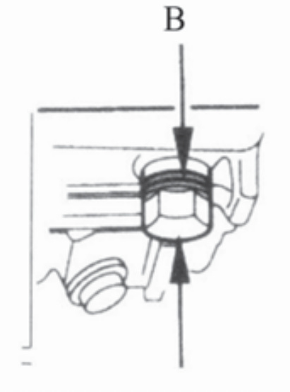

---
tags:
- pitsterpro
- instructions
---

import React from 'react';

# PitsterPro X4R Owners Manual

#### **WARNING**

This **WARNING** symbol identifies special instructions or procedures which, if not correctly followed, could result in personal injury or loss of life.

#### IMPORTANT

Responsible use of your off-road motorcycle will ensure unnecessary problems do not occur.

| **CAUTION**                                                                 |
|--------------------------------------------------------------------------|
| This **CAUTION** symbol identifies special instructions or procedures which, not strictly observed, could result in damage to or destruction of equipment. |

#### **WARNING**

This note symbol indicates points of particular interest for more efficient and convenient operation.

#### NOTE

THIS VEHICLE IS AN OFF-ROAD VEHICLE ONLY AND WAS NOT MANUFACTURED FOR USE ON PUBLIC STREETS, ROADS, OR HIGHWAYS.
USE YOUR BIKE LEGALLY.
RESPECT THE ENVIRONMENT AND THE RIGHTS OF OTHER PEOPLE.

#### IMPORTANT NOTE TO PARENTS ABOUT SAFE RIDING

Your youngster's safety will depend on your commitment to always provide a safe riding environment and a properly maintained vehicle. As with any moving vehicle, there are possible safety risks; be sure to heed these pre**CAUTION**s.

1. Always equip your child with suitable protective gear and riding apparel. Be sure he or she always wears a helmet, over-the-ankle footwear or sturdy boots, eye protection, gloves, long pants, and a long-sleeved shirt while riding.
2. Never allow your child to carry a passenger. This motorcycle is designed for an OPERATOR ONLY.
3. This motorcycle is designed for off-road riding and should never be operated on public roads or paved surfaces.
4. This motorcycle was not designed for hard riding such as motocross.
5. Always obey local off-road riding laws and regulations. Obtain permission to ride on private property.
6. You, the parent (and most likely "riding instructor/mechanic as well), must be familiar with motorcycle controls and maintenance requirements plus riding techniques. Read and understand the owner's manual provided with the motorcycle. Review all instruction and **WARNING**s with your child.
7. You must determine your child's readiness to ride this off-road motorcycle. Your child should already be familiar with motorcycle controls (location and function) and basic riding techniques. Your child should also be physically large enough and strong enough to be able to straddle the motorcycle and hold it up, plus be able to pick it up if it is on its side.
8. Your child's safety depends in part on the good mechanical condition of the motorcycle. Be sure to follow the maintenance and adjustment requirements contained in the Periodic Maintenance Chart, Daily Pre-rideInspection, and AfterRec Check Points. Be sure your child understands the importance of checking all items thoroughly before riding the motorcycle. Also, familiarity with the motorcycle is important should a problem occur far from help.

1. Do not allow your child to ride unsupervised. He or she should always ride in the company of an experienced adult.
2. Encourage your child not to ride beyond his or her skill level or faster than conditions safely allow. Have them practice advanced riding maneuvers under controlled conditions.
3. Tell someone where you and your child are planning to ride and when you intend to return. Discuss the ride with your child before you leave so he or she will know in advance what riding techniques may be necessary to negotiate the terrain safely. If you are not familiar with the area, lead the way and reduce your speed.

#### EMISSION CONTROL INFORMATION

To protect the environment, the manufacturer has incorporated emission control systems in compliance with applicable regulations of the Environmental Protection Agency and the California Air Resources Board.

## MAINTENANCE AND WARRANTY

Proper maintenance is necessary to ensure that your motorcycle will continue to have low emission levels.
Those items identified by the Periodic Maintenance chart are necessary to ensure compliance with the applicable standards. The owner of this motorcycle has the responsibility to maintain their vehicle according to the instructions in this Owner's Manual. You should keep a maintenance record for your motorcycle. Pages 70-75 are provided in this manual.

## TAMPERING WITH EMISSION CONTROL SYSTEM PROHIBITED

Federal and California State law prohibits the following acts or the causing thereof: (1) the removal or rendering inoperative by any person other than for purposes of maintenance, repair, or replacement, of any device or element of design incorporated into any new motorcycle for the purposes of emission control prior to its sale or delivery to the ultimate purchaser or while it is in use, or (2) the use of the motorcycle after such device or element of design has been removed or rendered inoperative by any person.
Among those acts presumed to constitute tampering are the acts listed below:

Do not tamper with the original emission-related parts:

- Carburetor and internal parts
- Spark plug
- Magneto ignition system
- Air cleaner element

Federal law prohibits the following acts or the causing thereof: (1) the removal or rendering inoperative by any person other than for purposes of maintenance, repair, or replacement, of any device or element of design incorporated into any new vehicle for the purpose of noise control prior to its sale delivery.
Tampering Prohibited
Try to sell the device or element of design which in any way tends to limit the noise emitted by a Motorcycle during operation in a manner which is not equivalent to the manner in which the device or element of design was set when it was shipped to the ultimate purchaser or while it is in use, or 2. The use of the vehicle after such device or element of design has been removed or rendered inoperative by any person. Among those acts presumed to constitute tampering are the acts listed below:
- Replacement of the original exhaust system or muffler with a component not in compliance with Federal regulations.
- Removal of the muffler or any internal portion of the muffler(s)
- Removal of the air box or air box cover.
- Modifications to the muffler or air intake system by cutting, drilling, or other means if such modifications result in increased noise level.

#### Foreword

We thank you for choosing a Pitsterpro Motorcycle. It is the end product of advanced engineering, exhaustive testing, and continuous striving for superior reliability, safety, and performance.

Before starting to ride your motorcycle, please read this manual thoroughly in order to know your motorcycle's capabilities, its limitations, how to operate it safely.

Due to improvements in design and performance during production, in some cases there may be minor discrepancies between the actual vehicle and the illustrations and text in this manual.

#### Specifications

- Dimensions
  - Overall length: 1640 mm (65.0 in)
  - Overall width: 778 mm (30.6 in)
  - Overall height: 1100 mm (43.3 in)
  - Wheelbase: 1165 mm (45.9 in)
  - Road clearance: 300 mm (12.0 in)
  - Dry weight: 65 kg (143.2 lb)
  - Fuel tank capacity: 3.8 L (1.0 US gal)
- Engine
  - Type: 4-stroke, single cylinder, SOHC, air-cooled/oil-cooled
  - Bore and stroke: 60x53 mm
  - Displacement: 149.8 ml
  - Compression ratio: 9.2:1
  - Carburetor: MICONI
  - Lubrication system: Forced Splash Lubrication
  - Type: SAE AP115W/40-SF
  - Capacity: 1.1 L (1.2 US qt)
  - Starting system: Kick
  - Ignition system: CDI
  - Spark plug: A7TC
- Transmission
  - Transmission type: Up-4speed, No return shift
  - Clutch type: Centrifugal & Wet multi dis

#### Manual Centrifugal & Wet Multi-disc

Gear ratio:
1. 1st 2.833
2. 2nd 1.706
3. 3rd 1.238
4. 4th 0.958
Primary reduction ratio 4.058
Final reduction ratio 2.6(39/15)

Frame Type: Backbone
Steering angle: 45 to either side
Castor: 25.5
Trail: 54 mm (2.1 in)
Tire size:
- Front 2.75-14 4PR
- Rear 3.00-12 4PR
Suspension:
- Front Telescopic fork
- Rear Swingarm
Front suspension stroke: 204 mm (8.0 in)
Rear wheel travel: 209.6 mm (8.3 in)

Brakes Type: Front and Rear Disk
Effective disc diameter:
- Front 210mm (8.2 in)
- Rear 185mm (7.2 in)

Specifications subject to change without notice.

## GENERAL INFORMATION

1. Front Brake Lever
2. Engine Stop Switch
3. Fuel Tank Cap
4. Handlebar
5. Throttle Grip
6. Clutch Lever
7. Front Fork
8. Fuel Tap
9. Muffler
10. Brake Cable
11. Brake Disk
12. Front Brake Caliper
13. Left Shroud
14. Air Cleaner
15. Choke Knob
16. Shift Pedal
17. Engine Oil Drain Plug
18. Chain Slapper
19. Swingarm
20. Drive Chain
21. Seat
22. Fuel Tank
23. Right Shroud
24. Rear Brake Disk
25. Rear Brake Caliper
26. Rear Shock
27. Kick Pedal
28. Rear Brake Pedal
29. Engine Guard
30. Carburetor

### Fuel

The capacity of the fuel tank is 3.8 L (1.0 US gal). To open the fuel tank cap, pull out the breather hose from the hole in the number plate and turn the tank cap counterclockwise.

Avoid filling the tank in the rain or where heavy dust is blowing so that the fuel does not get contaminated.

#### A **WARNING**

Gasoline is extremely flammable and can be explosive under certain conditions. Always stop the engine and do not smoke. Make sure the area is well ventilated and free from any source of flame or sparks; this includes any appliance with a pilot light. After refueling, make sure the fuel tank cap is closed securely. If gasoline is spilled on the fuel tank, wipe it off immediately.

### Fuel Type

Use clean, fresh unleaded gasoline with a minimum Antiknock index of 87. The Antiknock Index is posted on service station pumps in the USA. The octane rating of a gasoline is a measure of its resistance to detonation or "knocking." The Antiknock Index is an average of the Research Octane Number (RON) and the Motor Octane Number (MON) as shown in the table below.

| Octane Rating Method        | Minimum Rating |
|-----------------------------|----------------|
| (RON + MON) Antiknock index | 87             |
| Research octane Number (RON)| 91             |

**CAUTION**: different brand of gasoline of a higher octane rating. If this condition is allowed to continue, it can lead to severe engine

#### Fuels Containing Oxygenates

Gasoline frequently contains oxygenates (alcohols and ethers) especially in areas of the U.S. and Canada which are required to sell such reformulated fuels as part of a strategy to reduce exhaust emissions.

The types and volume of fuel oxygenates approved for use in unleaded gasoline by the U.S. Environmental Protection Agency include a broad range of alcohols and ethers, but only two components have seen any significant level of commercial use.

Gasoline/Alcohol Blends - Gasoline containing up to 10% ethanol (alcohol produced from agricultural products such as corn), also known as "gasohol" is approved for use.

**CAUTION**
Avoid using blends of unleaded gasoline and methanol (wood alcohol) whenever possible, and never use gasohol containing more than 5% methanol. Fuel system damage and performance problems may result.

Gasoline/Ether Blends - The most common ether is methyl tertiary butyl ether (MTBE). You may use gasoline containing up to 15% MTBE.

**NOTE**

Other oxygenates approved for use in unleaded gasoline include TAME (up to 16.7%) and ETBE (up to 17.2%). Fuel containing these oxygenates can also be used in your Pitsterpro.

**CAUTION**
than the minimum specified by Pitsterpro. Never use "gasohol" with more than 10% ethanol or more than 5% methanol. Gasoline containing methanol must also be blended with co-solvents and corrosion inhibitors. Certain ingredients of gasoline may cause paint fading or damage. Be extra careful not to spill gasoline or gasoline oxygenate blends during refueling.

### Fuel Tap

The fuel tap has three positions: OFF, ON, and RES (reserve). For normal operation, turn the fuel tap lever to the ON position. If the fuel runs out with the tap in the ON position, the last 0.5 L (0.13 US gal) of fuel can be used by turning the tap lever to the RES position.

A. Fuel Tap C. OFF Position B. ON Position D. RES Position

Turn the fuel tap lever to the OFF position when the fuel tank is removed for maintenance and adjustments or the motorcycle is stored for a long time.

**NOTE**

Since riding distance is limited when on RES, refuel at the earliest opportunity.
Make certain that the fuel tap is turned to ON (Not RES) after filling up the fuel tank.

**WARNING**

Practice operating the fuel tap with the motorcycle stopped. To prevent an accident, you should be able to operate the fuel tap while riding without taking your eyes off the road. Be careful not to touch the hot engine while operating the fuel tap.

### Engine Stop Switch

The engine stop switch is located on the left side of the handlebar. For ordinary engine stoppage a# Starting the Engine

Shift the transmission into neutral by pushing the shift pedal down until the motorcycle rolls freely.

**NOTE**

This motorcycle will start in gear. Disengage the engine by engaging the clutch or placing transmission in neutral before starting.

Turn the fuel tap lever to the ON position.

A. Choke Knob

Kick the engine over, leaving the throttle closed.

A. Kick Pedal Once the engine starts wait until the engine is thoroughly warmed up then push in the choke knob.

**NOTE**

- When the engine is already warm or on a hot day, open the throttle partly instead of using the choke knob.
- If the engine is flooded, kick the engine over with the throttle fully open until it starts.

### Moving Off

1. Shift into 1st gear.
2. Open the throttle slowly.

### Shifting Gears

1. Close the throttle completely.
2. Shift into the next higher or lower gear.
3. Open the throttle slowly.

**WARNING**

When shifting down to a lower gear, do not shift at such a high speed that the engine r/min (rpm) jumps excessively. Not only can this cause engine damage, but the rear wheel may skid and cause an accident.

### Stopping the Motorcycle

For maximum deceleration, close the throttle and apply both front and rear brakes. Independent use of the front or rear brake may be advantageous in certain circumstances. Shift down progressively to ensure good engine response at all speeds.

### Stopping the Engine

Shift the transmission into neutral position. After racing the engine slightly, close the throttle completely and push the engine stop switch.

### Daily Pre-Ride Checks

Check the following items each day before you ride. The time required is minimal, and habitual performance of these checks will help ensure a safe, reliable ride. If any irregularities are found during these checks, refer to the appropriate section and take the action required to return the motorcycle to a safe operating condition.

**WARNING**

Engine oil
| Component       | Condition                                  |
|-----------------|--------------------------------------------|
| Engine oil level| Correct. No leakage.                       |
| Spark Plug      | Tighten to correct torque.                 |
| Carburetor      | Adjusted properly. Idle speed:             |
| Air Cleaner     | Clean, properly installed.                 |
| Muffler         | Apply oil to air cleaner element. Not damaged.|
| Frame           |                                            |
| Tires           | Check overall condition; wear, cuts and other damage. Check tire air pressure.|
| Spokes          | Tighten the air valve cap securely.        |
| Drive Chain     | Check for any loose spokes. If necessary, torque. Check overall condition and chain slack with pushed out from the hollow of the|

1. Throttlee
2. Steering
3. Fuel Tank
4. Engine stop swich
5. Nuts, bolts, fasteners
6. Front and rear brakes function properly.
7. Brake lever play is 4~5 mm (0.16~0.20 in). If necessary, adjust.
8. Brake pedal travel is 15~25 mm (0.6~1.0 in). If necessary, adjust.
9. Check brake lining wear.
10. Functions properly, returns smoothly.
11. Action is smooth but not loose from lock to lock. No binding of control cables.
12. Mounted securely, no fuel leakage.
13. Functions properly.
14. Tighten any loose bolts and nuts.

### Break-In

The first one hour that the motorcycle is ridden is designed as the break-in period. If the motorcycle is not used carefully during this period, you may very well end up with a broken down instead of a broken in motorcycle.

Do not start moving or race the engine immediately after starting it, even if the engine is already warm. Run the engine for two or three minutes at idle speed to give the oil a chance to work up into all the engine parts.

Avoid the quick acceleration or starting and drive prudently for the first one hour of operation. Let the motorcycle cool completely. The motorcycle is ready for regular operation after this procedure is carried out.

## MAINTENANCE AND ADJUSTMENT

The maintenance and adjustments outlined in this chapter must be carried out in accordance with the Periodic Maintenance Chart to keep the vehicle in good running condition. The initial maintenance is vitally important and must not be neglected.

With a basic knowledge of mechanics and the proper use of tools, you should be able to carry out many of the maintenance items described in this chapter. If you lack proper experience or doubt your ability, all adjustments, maintenance, and repair work should be completed by a qualified technician.

Please note that Pitsterpro cannot assume any responsibility for damage resulting from incorrect or improper adjustment done by the owner.

## EMISSION CONTROL INFORMATION

To protect the environment in which we all live, Pitsterpro has incorporated emission control systems in compliance with applicable regulations of the United States Environmental Protection Agency and California Air Resources Board.

#### 1. Crankcase Emission Control System

The system eliminates the release of crankcase vapors into the atmosphere. Instead, the vapors are routed through an oil separator to the intake side of the engine. While the engine is operating, the vapors are drawn into the combustion chamber, where they are burned along with the fuel and air supplied by the carburetor(s).

#### Exhaust Emission Control System

This system reduces the amount of pollutants discharged into the atmosphere by the exhaust of this vehicle. The fuel, ignition, and exhaust systems of this vehicle have been carefully designed and constructed to ensure an efficient engine with low exhaust pollutant levels.

#### Maintenance

Proper maintenance is necessary to ensure that your vehicle will continue to have low emission levels. This Owner's Manual contains maintenance operations recommended for your vehicle. Maintenance operations necessary to ensure compliance with the applicable emission standards are noted in the Periodic Maintenance Chart. As the owner of this vehicle, you have the responsibility to make sure that the recommended maintenance is carried out according to the instructions in this Owner's Manual at your own expense.

You should keep a maintenance record for your vehicle. To assist you in keeping this record, we have provided space on pages 70 through 75 of this manual where an authorized Pitster Pro dealer, or someone equally competent, can record the maintenance. You should also retain copies of maintenance work orders, receipts, etc. as verification of this maintenance.

#### Warranty

This vehicle is designed, built, and equipped in compliance with applicable regulations of the United States Environmental Protection Agency (EPA) and California Resources Board (CARB) at the time of sale. The EPA and CARB require that your vehicle comply with certain emissions regulations during a portion of its useful life and is free from defects in material and workmanship which could cause the vehicle to fail to conform with applicable regulations. Please read your Pitster Pro Limited Emission Control Systems Warranty delivered with this Owner's Manual carefully and keep it valid by complying with the owner's obligations it contains. To obtain warranty service, the Pitster Pro Limited Emission Control System Warranty requires that you return your motorcycle to an authorized Pitster Pro dealer for remedy under warranty.

## TAMPERING WITH EMISSION CONTROL SYSTEM PROHIBITED

Federal regulations and California State law prohibit the following acts or the causing thereof:
1. The removal or rendering inoperative by any person other than for purposes of maintenance, repair, or replacement, of any device or element of design incorporated into any new motorcycle for the purposes of emission control prior to its sale or delivery to the ultimate purchaser or while it is in use.
2. The use of the motorcycle after such device or element of design has been removed or rendered inoperative by any person.

Among those act

As presumed to constitute tampering are the acts listed below:
Do not tamper with the original emission related parts:
- Carburetor or internal parts
- Spark plug
- Magneto ignition system
- Air Cleaner element

### Periodic Maintenance Chart

The maintenance and adjustments outlined in this chapter are easily carried out and must be done in accordance with the Periodic Maintenance Chart to keep the motorcycle in good running condition.

| OPERATION | Intial | Every 5hours (1month) | Every 50 hours (6months) | Every 100hours (12months) | See Page |
|-----------|--------|------------------------|---------------------------|----------------------------|----------|
| ENGINE    |        |                        |                           |                            |          |
| Engine oil-change                  |        |                        |                           |                            | 29       |
| Spark plug-clean, gap             |        |                        | O                         |                            | 32       |
| Valve clearance-check              |        |                        |                           |                            | 34       |
| Throttle grip play-check           |        |                        |                           |                            | 36       |
| Fuel tap-clean                     |        |                        |                           |                            | 二       |
| Engine sprocket-check              |        | O                      |                           |                            | 43       |
| Fuel hose connections-check       |        |                        |                           |                            | 一       |
| Brake camshaft-grease             |        |                        |                           |                            | 一       |
| Brake cable-check                  |        | Every year             |                           |                            | 一       |

## TAMPERING WITH NOISE CONTROL SYSTEM PROHIBITED

Federal law prohibits the following acts or the causing thereof:
1. The removal or rendering inoperative by any person other than for purposes of maintenance, repair, or replacement, of any device or element of design incorporated into any new vehicle for the purpose of noise control prior to its sale or delivery to the ultimate purchaser or while it is in use.
2. The use of the vehicle after such device or element of design has been removed or rendered inoperative by any person.

Among those acts presumed to constitute tampering are the acts listed below:
- Replacement of the original exhaust system or muffler with a component not in compliance with Federal regulation.
- Removal of the muffler(s) or any internal portion of the muffler(s).
- Removal of the air box or air box cover.
- Modifications to the muffler(s) or air intake system by cutting, drilling, or other means if such modifications result in increased noise levels.

| OPERATION | Intial | Every 5hours (1month) | Every 50hours (6 months) | Every 100hours (12 months) | See Page |
|-----------|--------|------------------------|---------------------------|----------------------------|----------|
| Spoke tightness and rim runout-check     |        |                        |                           |                            | 54       |
| Drive chain wear-check                  |        |                        |                           |                            | 43       |
| Front fork-inspect/clean               |        |                        |                           |                            | 52       |

| Item                        | Action                   | Required   |
|----------------------------- |-------------------------- |------------|
| Front oil check             |                          | Every year |
| Nuts, bolts, fasteners check |                          | 55         |
| CHASSIS Steering play check |                          | 50         |
| Steering stem bearing grease |                          |            |
| Rear sprocket check         |                          | 43         |
| General lubrication perform |                          | 59         |
| Side stand check            |                          |            |
| Wheel bearing check         |                          |            |
| Swingarm pivots check       | Rear shock absorber check | 53         |

Replace, add, adjust, or torque if necessary.
*Should be serviced by referring to the Service Manual or an authorized PitsterPro dealer.
O: Emission-related.*

### Engine Oil

The major elements of your motorcycle's engine, the transmission, and clutch system, require oil to function at optimal levels. You must change the oil and oil filter in accordance with the Maintenance Schedule or your engine will become damaged. Adherence to the required maintenance schedule will prolong the life of your motor and reduce wear and tear.

**Recommended Oil**
- Type: API SE, SF, or SG; API SH, or SJ with JASO MA
- Viscosity: SAE 10W-40

**WARNING**

The safe operation of your motorcycle will be impaired if proper engine oil maintenance is not carried out according to the Maintenance Schedule. Utilizing dirty or contaminated oil may result in engine or transmission seizure. This may lead to an accident that could cause serious injury or death.

### Oil Level Inspection

(A) oil filler cap with dipstick
(B) upper oil boundary mark
(C) lower oil boundary mark

### Oil Maintenance Procedure:

1. Place motorcycle on flat work area
2. Wipe down the oil filler cap/dipstick (A) and surrounding engine area.
3. Start the engine and let it idle for a few minutes. Stop the engine. Wait a few minutes until the oil resettles.
4. Unscrew and remove the oil filler cap/dipstick, then thoroughly wipe it down with a rag.
5. Tilt the motorcycle into an upright position.
6. Re-insert the dipstick until it seats, but do not screw it in.
7. Then remove the dipstick and inspect the oil level. If the oil is at or near the upper oil boundary mark (B), do not add oil. But if the oil is below or near the lower oil boundary mark (C), add the recommended oil until it reaches the upper oil boundary mark. Be sure not to put in so much oil that it surpasses the upper oil boundary mark.
8. Re-insert the dipstick and secure tightly.

### Changing Engine Oil

#### Warm up engine thoroughly, and then let sit for three minutes so engine oil can settle

1. Place motorcycle on flat work area.
2. Place oil drainage pan beneath the motorcycle.
3. Remove the engine oil drain bolt (A) and allow the oil to drain. Tilt the motorcycle from side to side to ensure complete drainage.
4. Place new sealing washer (8) on oil drain bolt and tighten to specified torque: 16 BF.FT.
5. Pour in new engine oil. The required amount is: 0.6 US QT.
6. Re-install the oil filler cap/dipstick.
7. Start the engine and let run for five minutes, then stop the engine and let sit for three minutes.
8. Re-check oil level and add if necessary.
9. Inspect all affected areas for leakage.

****WARNING**:**
Motorcycle engine oil is toxic and must be disposed of properly. Contact your local refuse authorities to determine legal disposal options. Do not place used engine oil in your trash or garbage receptacle.

### Spark Plug

- A. Gap
- B. Outer Electrode

The spark plug should be taken out in accordance with the Periodic Maintenance Chart for cleaning, inspection, and resetting of the plug gap. Measure the gap with a wire-type thickness gauge. If incorrect, adjust the gap to the specified value by bending the outer electrode.

### Spark Plug Gap

| NGK C7HS | 0.6 - 0.7 mm (0.024 - 0.028 in) |

If the plug is oily or has carbon built up on it, clean it (preferably with a sand-blaster) and then clean off any abrasive particles. The plug may also be cleaned using a high-flash point solvent and a wire brush or other suitable tool. If the spark plug electrodes are corroded, or damaged, or if the insulator is cracked, replace the plug. The standard spark plug is shown in the table below.

### Standard Spark Plug

NGK C7HS

### Spark Plug Removal and Installation

1. Pull the spark plug cap off the plug before removing the spark plug.
2. Apply a suitable wrench to the spark plug.
3. Loosen and remove the spark plug.
4. When reinstalling the spark plug, torque it to the specification.

### Spark Plug Tightening Torque

13 N-m (1.3 kgf-m, 113 in-lb)

Fit the plug cap securely onto the spark plug, and pull the cap lightly to make sure that it is properly installed.

- A. Plug Cap
- B. Spark Plug

### Valve Clearance

Valve and valve seat wear decreases valve clearance, upsetting valve timing.

**CAUTION**: If valve clearance is left unadjusted, wear will eventually cause the valves to remain partly open; which lowers performance, burns the valves and valve seats, and may cause serious engine damage. Valve clearance for each valve should be...

### Air Cleaner

Inspect and adjust in accordance with the Periodic Maintenance Chart.

Inspection and adjustment should be done only by a competent mechanic following the instructions in the Service Manual.

An air cleaner that is dirty or clogged can cause a plethora of problems including poor air intake, low engine power, increased fuel usage, and an increased incidence of fouled spark plugs.

To clean and service the air cleaner, please adhere to the following guidelines:

1. Remove the housing cover by unfastening the attaching clamp screw (A)
2. Remove air cleaner
3. Thoroughly wash with dish soap. Remove excess liquid and let dry for 24 hours prior to reinstallation.
4. Visually examine the air cleaner. If damaged, replace with a new air cleaner.
5. Once dry, apply a thin layer of approved air cleaner oil. Remove the excess oil.
6. Reinstall the air cleaner by fastening the attaching clamp screw.

**WARNING**

A clogged air cleaner may enable dirt and other residue to enter the carburetor and negatively affect the throttle. A malfunctioning throttle may cause injury and even death.

- A. Dust cover
- B. Adjuster C. Locknut

Tighten the locknut. Reinstall the rubber boot. If the free play cannot be set with the adjuster on the upper end of the throttle cable, pull the rubber boot off the top of the carburetor and make the necessary free play adjustment with the adjuster on the lower end of the cable. Then, tighten the locknut and reinstall the rubber boot.

Check if the throttle grip moves smoothly from full open to close, and the throttle closes quickly and completely in all steering positions by the return spring. If not, check the throttle cable routing, grip free play, and cable damage. Then lubricate the throttle cable. With the engine idling, turn the handlebar both ways and check if handlebar movement changes the idling speed. If so, the throttle cable may be improperly adjusted or incorrectly routed, or damaged. Be sure to correct any of these conditions before riding.

### Throttle Grip

The throttle grip controls the throttle valve. If the throttle grip has excessive play due to either cable stretch or maladjustment, it will cause a delay in throttle response, especially at low engine speed. Also, the throttle valve may not open fully at full throttle. On the other hand, if the throttle grip has no play, the throttle will be hard to control, and the idle speed will be erratic. Check the throttle grip play in accordance with the Periodic Maintenance Chart, and adjust the play if necessary.

### Inspection

Check that the throttle grip turns smoothly and there is 2-3 mm (0.080-0.12 in) throttle grip play.

After making these clarifications and formatting adjustments, the text should be ready for display.En lightly turning the throttle grip back and forth.

- A. Throttle Grip
- B. 2-3mm (0.08-0.12 in)

If there is improper play, adjust it.

### Throttle Cable Adjustment

Pull the rubber boot off the upper end of the throttle cable. Loosen the locknut on the upper end of the throttle cable and turn the adjuster to obtain the specified play.

### Carburetor

The following procedure covers the idling adjustment, which should be performed whenever the idle speed is disturbed.

### Idling Adjustment

Start the engine and warm it up thoroughly.

**WARNING**

Never run the motorcycle in a closed area, such as a garage. Exhaust gases contain carbon monoxide; a colorless, odorless, poisonous gas.

# A. Idling Adjusting Screw

**WARNING**

To avoid a serious burn, never touch a hot engine or exhaust pipe during idling adjustment.

Adjust the idling speed to 1400 ± 100 r/min (rpm) by turning the idling adjusting screw. Open and close the throttle a few times to make sure that the idling speed does not change. Readjust if necessary. With the engine idling, turn the handlebar to each side. If handlebar movement changes the idling speed, the throttle cable may be improperly adjusted or incorrectly routed, or it may be damaged. Be sure to correct any of these conditions before riding.

**WARNING**

Operation with a damaged throttle cable could result in an unsafe riding condition.

### Drive Chain

The drive chain must be checked, adjusted, and lubricated for safety and to prevent excessive wear. If the chain becomes badly worn or misadjusted—either too loose or too tight—the chain could jump off the sprockets or break.

**WARNING**

A chain that breaks or jumps off the sprockets could snag on the engine sprocket or lock the rear wheel, severely damaging the motorcycle and causing it to go out of control.

- A. D: 5mm (0.2 in)
- B. Hollow
- C. Chain Guard
- D. Push Up

### Chain Slack Inspection

Set the motorcycle up on its side stand. Rotate the rear wheel to find the position where the chain is tightest (Because it wears unevenly) and measure the maximum chain slack as follows. Push up the chain midway between the engine sprocket and rear wheel sprocket. The drive chain slack is that the drive chain is pushed out within 0.5 mm (0.2 in) from the hollow of the chain guard.

If the drive chain is too tight or too loose, adjust it so that the chain slack will be within the standard value.

### Drive Chain Slack

| Standard | 0-5mm (0-0.2 in) |

### Chain Slack Adjustment

Remove the cotter pin from the torque link nut and loosen the torque link nut.

### Drive Chain Adjustment

1. Loosen axle nut (A).
2. Loosen lock nut (B) on both sides of motorcycle.
3. Turn the chain adjuster nuts (C) on both sides an equal number of turns to increase or decrease chain slack.
4. Tighten lock nuts on both sides of motorcycle.
5. Recheck chain slack.

**WARNING**

A worn chain can lead to an accident by coming off the sprockets and hanging up on moving parts. Serious injury or death may occur.

Checking your drive chain and associated parts is essential for proper maintenance. Please review the following information to ensure compliance with the Maintenance Schedule:

1. It is imperative to replace the chain if it stretches by 2% of its original length. The most effective means by which to measure the chain is by examining part of it (20 links).
2. Make sure the chain is tight using the chain adjusters.
3. Then measure 20 links. Take your measurement from the center of the first pin to the center of the 21st pin. If this measurement exceeds the service limit then it's time to replace the chain.

**Diagram of Chain Adjustment**

Measure a span of 21 pins New Chain: 10.0 inches (254 mm) Service Limit: 10.2 inches (259 mm)

4. Examine the front and rear sprockets as well. If the chain is worn then replace the sprockets as well.
5. Also inspect the roller for wear and replace as needed.
6. Lubricate the chain thoroughly with each service using recommended Chain Lube, SAE 80 or 90 gear oil.

### Drive Chain Removal and Cleaning

Chain removal and cleaning can be accomplished by utilizing the following guidelines:

(A) master link retaining clip

### Drive Chain Removal Process

1. When the drive chain becomes extremely dirty from muddy or sandy conditions, it should be removed and cleaned to prolong life.
2. Remove the master link retaining clip (A) with pliers. Be sure not to damage the clip. Remove the master link Remove the drive chain.
3. Thoroughly clean the chain with kerosene. Then allow it to dry.
4. Visually examine the drive chain to inspect for damage. If damaged, replace.
5. Lubricate the drive chain, including the rollers and bushings.
6. Thread the chain over the sprockets. Then connect the ends of the chain with the master link. For ease of assembly, hold the chain ends against adjacent rear sprocket teeth while inserting the master link. Install the master link retaining clip so that the closed end of the retaining clip willface the direction of forward wheel rotation.

- A. Chain Slipper
- B. Swingarm

### Sprocket

Sprocket Wear inspection: Visually inspect the sprocket teeth and replace the sprocket if its teeth are worn or damaged.

**NOTE**

Sprocket wear is exaggerated in the illustration.

### Chain Lubrication

Lubrication of the drive chain is necessary after riding in the rain or mud, or any time the chain appears dry. A heavy oil such as SAE90 is preferred to a lighter oil because it will stay on the chain longer and provide better lubrication.

Apply oil to the side of the rollers so that it will penetrate the rollers and bushings.
Wipe off any excess oil.

### Handlebar

To keep the handlebar properly secured in place, it is necessary to install the handlebar clamps correctly.

Mount the handlebar clamps so that the arrows on the clamp face the front.
Align the gap at the rear with the punch mark on the handlebar.

- A. Front
- B. Punch Mark
- C. Handlebar Clamps
- D. Gap
- E. Arrow Mark

Torque it to 25N-m (2.5 kgf-m, 18 ft-lb), front first, then rear. If the handlebar clamps are correctly installed, there will be no gap at the front and an even gap at the rear of the clamps after torquing the bolts.

- A. No Gap
- B. Gap

# Brakes

Your Mini is equipped with state-of-the-art disc brakes both front and rear. The only procedure that you will need to execute is bleeding and replacing the pads. Proper maintenance (according to Maintenance Schedule) will ensure safe conditions for your brakes by following these guidelines:

Brake Bleeding (Front and Rear)

Your disc brakes require bleeding if the brake system has been disassembled, the brake hose has been serviced, the brake fluid is low, or the brake operation is performing improperly. Please adhere to the following guidelines to bleed the brakes:

A. Caliper bleed screw
B. Brake fluid reservoir
C. Brake fluid hose

1. Loosen caliper bleed screw to remove oil. Place a small bucket beneath to catch oil.
2. Refasten bleed screw. Fill reservoir with approved brake fluid.
3. Connect a clear plastic tube to the caliper bleed screw and place the other end in a container.
4. Slowly engage the brake lever or pedal.
5. Pull in the lever or push down the pedal. Continue to hold the lever or pedal in the engaged position.
6. Loosen the caliper bleed screw, then allow the lever or pedal to reach its limit.
7. Finally, tighten the caliper bleed screw after fully bleeding the brakes.engaging the lever or pedal, then release the lever orpe
8. Repeat steps 5-8 as needed until all the air bubbles have been removed from the brake system.

**WARNING**

Maintaining proper brake adjustment is crucial to safe operation of your motorcycle. A dangerous loss of braking performance may occur if the brake system is not properly bled. Improper adjustment may result in brake assembly damage and cause an accident. An accident may cause serious injury or death.

### Front Brake Pad Replacement

To change the front disc brake pads on your motorcycle, please adhere to the following guidelines:

#### LEFTSIDE

1. brake caliper-mounting bolts
2. caliper assembly
3. brake pad small
4. brake pad large

1. Remove caliper bolts from front fork (A).
2. Pop off large brake pad (D) and then small brake pad (C).
3. Place new small brake pad on piston.
4. Place new larger brake pad on inner side of caliper.
5. Place caliper assembly back into proper position on fork and tighten caliper bolts.

**WARNING**

Maintaining proper brake adjustment is crucial to safe operation of your motorcycle. Improper adjustment may result in brake assembly damage and cause an accident. An accident may cause serious injury or death.

### Rear Brake Pad Replacement

To change the rear disc brake pads on your motorcycle, please adhere to the following guidelines:

1. caliper bolt dust caps (two)
2. caliper bolts (two)
3. caliper assembly
4. brake pad small
5. brake pad large

### Rear Brake Pad Replacement Procedure

1. Remove rear wheel.
2. Remove both caliper bolt dust caps (A).
3. Remove both caliper bolts (B).
4. Remove caliper assembly (C).
5. Pop off brake pad (D) and (E).
6. Place brake pads on piston.
7. Place caliper assembly back into proper position and tighten caliper bolts.
8. Replace caliper bolt dust caps.

**WARNING**

Maintaining proper brake adjustment is crucial to safe operation of your motorcycle. Improper adjustment may result in brake assembly damage and cause an accident. An accident may cause serious injury or death.

### Rear Brake Pedal Play Inspection

The brake pedal play should have 20-30 mm (0.8-1.2 in) when the pedal is pushed down lightly by hand.

A. Rear Brake Pedal
B. 20-30 mm (0.8-1.2 In)

Rotate the wheel to check for brake drag.
Operate the pedal a few times to see that it returns to its rest position immediately upon release.
Check braking effectiveness.
If the pedal has improper play, adjust it.

**WARNING**

Always maintain proper brake adjustment. If adjustment is small, case improper brake could drag and over.# 50 MAINTENANCE AND ADJUSTMENT

### Steering

The steering should always be kept adjusted so that the handlebar will turn freely but not have excessive play. The steering play must be checked in accordance with the periodic maintenance chart.

### Steering Inspection

To check the steering adjustment, raise the front wheel off the ground using a jack (special tool).

Push the handlebar lightly to either side. If the handlebar continues moving under its own momentum, the steering is not too tight.

Squatting in front of the motorcycle, grasp the lower ends of the front fork at the axle, and push and rock the front fork back and forth as shown.

If play is felt, the steering is too loose and needs to be adjusted.

### Steering Adjustment

Raise the front wheel off the ground using a jack (special tool).

Remove the number plate.

Remove the handlebar clamp bolts and take out the handlebar.

- A. Handlebar Clamp Bolts
- B. Handlebar Loosen the steering stem head nut and front fork upper clamp bolts.

- A. Stem Head Nut
- B. Front Fork Upper Clamp Bolts Turn the steering stem locknut with the stem nut wrench (special tool) to obtain the proper adjustment.

### Rear Suspension

The rear shock absorber inspection should be done in accordance with the periodic maintenance chart. If there is any damage to the rear shock absorber, it should be replaced by an authorized Pitster Pro dealer.

**WARNING**

This unit contains high-pressure gas. Keep away from fire or flame. Do not disassemble.

**NOTE**

The installation and removal of the rear shock absorber should be done by an authorized Pitster Pro dealer.

### Tires

Tire pressure affects traction, handling, and tire life. Adjust the tire pressure to suit riding conditions and rider preference, but do not stray too far from the recommended pressure.

When checking the tire pressure, remove the air valve cap, and make sure to tighten the cap securely after checking the tire pressure.

**NOTE**

Tire pressure should be checked when the tires are cold before your ride.

| Track Condition                                                                                                    | Tire Pressure                       |
|--------------------------------------------------------------------------------------------------------------------|-------------------------------------|
| OWhen the track is wet, muddy, sandy, or slippery, reduce the tire pressure to increase the tire tread surface on the ground. | 100kPa (1.0kg/cm², 11 psi)  |
| OWhen the track is pebbly or hard, increase the tire pressure to prevent damage or punctures, though the tires will skid more easily. | 125kPa (1.25 kg/cm², 14 psi) |

- A. Stem Locknut
- B. Stem Nu# T Wrench (P/N.57001-1100)

Apply the specified torques to the steering stem head nut and upper front fork clamp bolts.

### Steering Stem Head Nut Tightening Torque

- 45-55 N.m (4.5-5.6 kgf.m, 33-41 ft lb)

### Upper Front Fork Clamp Bolt Tightening Torque

- 10-15 N.m (1.0-1.5 kgf.m, 7-11 ft lb)

Install the handlebar and handlebar clamps (see Handlebar section).
Check the steering again, and readjust it if necessary.
Install the number plate.

### Front Suspension

The front fork oil change or the front fork inspection/cleaning should be done in accordance with the periodic maintenance chart. If there is any damage to the front fork or if front fork maintenance is necessary, it should be done by an authorized Pitster Pro dealer.

### Spokes and Rims

The spokes on both wheels must all be tightened securely and evenly and not be allowed to loosen. Unevenly tightened or loose spokes will cause the rim to warp, hasten nipple and overall spoke fatigue, and may result in spoke breakage.

### Rim Runout

Set up a dial gauge on the side of the rim and rotate the wheel to measure its axial runout. The difference between the highest and lowest readings is the amount of runout.

Set up the dial gauge on the inner circumference of the rim and rotate the wheel to measure its radial runout.

The difference between the highest and lowest dial readings is the amount of runout.

A certain amount of rim warpage (runout) can be corrected by recentering the rim, that is, loosening some spokes and tightening others to change the position of certain portions of the rim. If the rim is badly bent, however, it should be replaced.

**NOTE**

Where the rim is welded, the rim may show excessive runout. Disregard this when measuring runout.

### Torque of Nuts and Bolts

**Location of Nuts and Bolts**

Before the first ride of each day of operation, check the tightness of the nuts and bolts shown below. Check also that all cotter pins are in place and in good condition.

1. Front Fork Clamp Bolts
2. Handlebar Clamp Bolts
3. Shroud Bolts
4. Rear Shock Absorber Bolts
5. Seat Mounting Bolts
6. Air Cleaner Mounting Screws
7. Spokes

**Torque Specification**

| No. | Unit               | Unit (N.m) | Unit (BF.FT) |
|-----|--------------------|------------|--------------|
| 1   | Nut for Front Axle | 55-70      | 41-52        |
| 2   | Swingarm Shaft     | 50-60      | 37-44        |
|     | Nut for Rear Axle  | 55-70      | 41-52        |

### Cleaning Your Motorcycle

#### General Precautions

Frequent and proper care of your motorcycle will enhance its appearance, optimize overall performance, and extend its useful life. Covering your motorcycle with a high-quality, breathable motorcycle cover will help protect its finish from harmful UV rays, pollutants, and reduce the amount of dust reaching its surfaces.

Be sure the engine and exhaust are cool before washing.
Avoid applying degreaser to seals, brake pads, and tires.
Always use non-abrasive wax and cleaner/polisher.
Avoid all harsh chemicals, solvents, detergents, and household cleaning products such as ammonia-based window cleaners.
Gasoline, brake fluid, and coolant will damage the finish of painted and plastic surfaces: wash them off immediately.
Avoid wire brushes, steel wool, and all other abrasive pads or brushes.
Use care when washing the plastic parts as they can easily be scratched.
Avoid using pressure washers; water can penetrate seals and electrical components and damage your motorcycle.
Avoid spraying water in delicate areas such as in air intakes, carburetors, brake components, electrical components, muffler outlets, and fuel tank openings.

### Washing Your Motorcycle

Rinse your bike with cold water from a garden hose to remove any loose dirt.
Mix a mild neutral detergent (designed for motorcycles or automobiles) and water in a bucket. Use a soft cloth or sponge to wash your motorcycle. If needed, use a mild degreaser to remove any oil or grease buildup.
After washing, rinse your motorcycle thoroughly with clean water to remove any remaining soap residue or dirt particles that could scratch the surface.

| No. | Part                               | Nm     | ft-lbs |
|-----|------------------------------------|--------|--------|
| 1   | Front Axle Nut                    | 78-98  | 58-72  |
| 2   | Rear Axle Nut                     | 78-98  | 58-72  |
| 3   | Axle Pinch Bolt for Forks         | 16-20  | 12-15  |
| 4   | Tightening Nut for Engine with Frame | 25-30 | 18-22 |
| 5   | Tightening Nut for Front Shock Absorber M8 (top triple clamp) | 25-30 | 18-22 |
| 6   | Tightening Nut for Rear Shock Absorber | 25-30 | 18-22 |
| 7   | Tightening Nut for Handlebar      | 20-25  | 15-18  |
| 8   | Tightening Nut for Muffler        | 25-30  | 18-22  |
| 9   | Nut for Brake Disk                | 28-35  | 21-26  |
| 10  | Sprocket                          | 25-30  | 18-22  |
| 11  | Chain Guard                       | 15-20  | 11-15  |
| 12  | Footpeg                           | 18-25  | 13-18  |
| 13  | Sidestand                         | 28-35  | 21-26  |
| 14  | Front Brake Caliper               | 20-25  | 15-18  |
| 15  | Front Brake Reservoir             | 8-12   | 6-9    |
| 16  | Lock Nut for Steering Stem        | 45-55  | 33-41  |
| 17  | Tightening Nut for Front Shock Absorber M6 (lower triple clamp) | 8-12 | 6-9 |
| 18  | Lower Handlebar Clamp             | 30-35  | 22-26  |
| 19  | Oil Drain Bolt                    | 20-25  | 15-18  |
| 20  | Foot Peg Engine Mount Bolt        | 20-25  | 15-18  |

Make sure to follow the specified torque settings when working on your motorcycle to ensure everything is securely fastened and safe for operation.sidue (residue from the detergent can damage parts of your motorcycle).

Use a soft cloth to dry your motorcycle. As you dry, inspect your motorcycle for chips and scratches. Do not let the water air dry as this can damage the painted surfaces.

Start the engine and let it idle for several minutes. The heat from the engine will help dry moist areas.

Carefully ride your motorcycle at a slow speed and apply the brakes several times. This helps dry the brakes and restores them to normal operating performance.

Lubricate the drive chain to prevent rusting.

**NOTE**

After riding in an area where the roads are salted or near the ocean, immediately wash your motorcycle with cold water. Do not use warm water as it accelerates the chemical reaction of the salt. After drying, apply a corrosion protection spray on all metal and chrome surfaces to prevent corrosion.

### Painted Surfaces

After washing your motorcycle, coat painted surfaces, both metal and plastic, with a commercially available motorcycle/automotive wax. Wax should be applied once every three months or as conditions require. Avoid surfaces with satin or flat finishes. Always use nonabrasive products and apply them according to the instructions on the container.

Other Plastic Parts

After washing use a soft cloth to gently dry plastic parts. When dry, treat the non-painted plastic parts with an approved plastic cleaner/polisher product.

**CAUTION**

Plastic parts may deteriorate and brake if they come in contact with chemical substances or household cleaning products such as gasoline, brake fluid, window cleaners, thread-locking agents, or other harsh chemicals. If a plastic part comes in contact with any harsh chemical substance, wash it off immediately with water and a mild neutral detergent, and then inspect for damage. Avoid using abrasive pads or brushes to clean plastic parts, as they will damage the

### Chrome and Aluminum

Chrome and uncoated aluminum parts can be treated with a chrome/aluminum polish. Coated aluminum should be washed with a mild neutral detergent and finished with a spray polish. Aluminum wheels, both painted and unpainted can be cleaned with special non-acid based wheel spray cleaners.

### Leather, Vinyl, and Rubber

If your motorcycle has leather accessories special care must be taken. Use a leather cleaner/treatment to clean and care for leather accessories. Washing leather parts with detergent and water will damage them, shortening their life.

Vinyl parts should be washed with the rest of the motorcycle and then treated with a vinyl treatment.

The sidewalls of tires and other rubber components should be treated with a rubber protectant to help prolong their useful life.

**WARNING**

Special care must be taken not to get any rubber protectant on the tire's tread surface when treating tires. This may decrease the tire's ability to maintain contact with the road surface causing the ride# 60 MAINTENANCE AND ADJUSTMENT

### Lubrication

Lubricate the areas shown in the illustrations of this section with either motor oil or regular grease in accordance with the Periodic Maintenance Chart and whenever the vehicle has been operated under wet or rainy conditions, especially after using a high-pressure spray washer. Before lubricating a part, clean off any rust with rust remover and wipe off any grease, oil, dirt, or grime.

### General Lubrication

Apply motor oil to the following pivots:
- Side Stand

- Rear Brake Rod Joints
- Kick Pedal

Apply grease to the following points:
- Upper end of throttle cable

### Drive Chain Lubrication

Lubrication is also necessary after riding through rain or on wet tracks, or any time that the chain appears dry. A heavy oil such as SAE 90 is preferred to a lighter oil because it will stay on the chain longer and provide better lubrication. Apply oil to the side of the rollers so that it will penetrate to the rollers and bushings. Wipe off any excess oil.

## TROUBLESHOOTING GUIDE

**NOTE**

- This troubleshooting guide is not exhaustive and does not give every possible cause for each problem listed. It is meant simply as a quick guide to assist you in troubleshooting for some of the more common difficulties. If not available in the below guide list, the repair should be done only by a competent mechanic following the instructions in the Service Manual.

#### Starting failure or difficulties:
1. Compression low
2. Spark plug loose
3. Spark missing or weak
4. Spark plug faulty
5. Spark plug cap poorly connected or shorted
6. Fuel does not flow
7. No fuel in tank
8. Fuel hose clogged
9. Fuel tap clogged
10. Engine flooded
11. Starting technique faulty

#### Poor low-speed performance:
- Spark weak
- Spark plug faulty
- Spark plug gap excessive
- Fuel-air mixture incorrect
- Idle adjusting screw improperly adjusted
- Air cleaner element clogged
- Compression low
- Spark plug loose

#### Poor or no high-speed performance:
- Fuel-air mixture incorrect
- Air cleaner element clogged
- Misfiring
- Spark plug worn
- Spark plug cap poorly connected or shorted
- Knocking
- Fuel poor quality
- Other
- Brakes dragging
- Engine overheating
- Clutch slipping
- Throttle valve does not fully open
- Engine oil quantity excessive
- Engine oil viscosity too high
- Engine overheating
- Brakes dragging
- Clutch slipping
- Clutch not operating smoothly
- Clutch slipping
- Friction plates wornClutch springs weak
- Clutch doesn't disengage properly
- Engine oil deteriorated
- Engine oil viscosity too high

#### Poor handling or stability

- Handlebar hard to turn
- Steering stem locknut too tight
- Tire air pressure too low
- Steering stem lubrication insufficient
- Handlebar vibrates or shakes
- Swingarm bent
- Front fork bent
- Frame bent
- Wheel alignment incorrect
- Pivot shaft warped
- Right/left front fork oil level uneven
- Shock absorption too hard
- Tire air pressure too high
- Shock absorption too soft
- Front fork spring worn
- Suspension leaks oil

Brakes Don't Grip:
1. Brake pads or rotors worn
2. Brakes low on or devoid of fluid

## STORAGE

When the motorcycle is to be stored for any length of time, it should be prepared for storage as follows:

Clean the entire vehicle thoroughly.
Run the engine for about five minutes to warm the oil, shut it off and drain the engine oil.

**WARNING**:

Motor oil is a toxic substance. Dispose of used oil properly. Contact your local authorities for approved disposal methods or possible recycling.

Install the engine oil drain plug and fill in fresh engine oil. Empty the fuel tank and empty the carburetor float bowl. (The fuel will deteriorate if left for a long time.)

Remove the spark plug and spray fogging oil, directly into the cylinder. Kick the engine over slowly a few times to coat the cylinder wall. Install the spark plug.

Lubricate the drive chain and all the cables.
Spray oil on all unpainted metal surfaces to prevent rusting. Avoid getting oil on rubber parts or in the brakes.

Lift the motorcycle on a box or stand so that both wheels are raised off the ground. (If this cannot be done, put boards under the front and rear wheels to keep dampness away from the tire rubber.)

Place a plastic bag over the muffler and secure with a rubber band to prevent moisture from entering.
Cover the motorcycle to keep dust and dirt away from it.

**WARNING**:

Gasoline is extremely flammable and can be explosive under certain conditions. Always stop the engine and do not smoke. Make sure the area is well ventilated and free from any source of flame or sparks; this includes any appliance with a pilot light. Gasoline is a toxic substance. Dispose of gasoline properly. Contact your local authorities for approved disposal methods.

#### To put the motorcycle back into use after storage:

Remove the plastic bag from the muffler.
Make sure the spark plug is tight.
Fill the fuel tank with fuel.
Check all the points listed in the Daily Pre-ride Checks Section.
Perform the General Lubrication procedure.

## OWNER SATISFACTION ##

(For Products Sold in the Continental United States of America Only)

Your satisfaction is important to your authorized Pitster Pro dealer and to USA, MOTORTOYS.LLC. U.S.A. If you have a problem concerning warranty or service, please take the following action: Contact the owner and/or service manager of your authorized Pitster Pro dealer. Fully explaIn your problem and ask for assistance in resolving the situation. The owner of the dealership is concerned with your satisfaction and your future business. For this reason, the owner is in the best position to assist you. Also, all warranty and service matters are handled and resolved through the authorized Pitster Pro dealer network.

If you are unsatisfied after working with your Pitster Pro dealer and feel you still require further assistance, write to the address below. Please be certain to provide the model, product identification number, date of purchase, accessories, dates that events occurred, and what action has been taken by both you and your dealer. Include the name and address of the dealership. To assist us in resolving your inquiry, please include copies of related receipts and any other pertinent information including the names of the dealership personnel with whom you have been working in the resolution of your problem.

Upon receipt of your correspondence, we will contact the dealership and work with them in resolving your problem.

In order to provide a permanent record, all warranty and service resolutions take place only through written correspondence.

Please send your correspondence to:

## REPORTING SAFETY DEFECTS

(For Products Sold in the Continental United States of America Only)

If you believe that your vehicle has a defect which could cause a crash or could cause injury or death, you should immediately inform the Consumer Product Safety Commission (CPSC) in addition to notifying USA MOTORTOYS, LLC.

If the CPSC receives similar complaints, it may open an investigation and if it finds that a safety defect exists in a group of vehicles, it may order a recall and remedy campaign. However, the CPSC cannot become involved in individual problems between you, your dealer, or USA MOTORTOYS, LLC, U.S.A.

## ENVIRONMENTAL PROTECTION

To protect our environment, properly discard used tires, engine oil, or other vehicle components that you might dispose of in the future. Consult your authorized Kawasaki dealer or local environmental waste agency for their proper disposal procedures.

## MAINTENANCE RECORD

Owner Name
Address
Phone Number
Engine Number
Vehicle Number
Selling Dealer Name
Address
Dealer Phone Number
Warranty Start Date

Note: Keep this information.

## DOWNLOAD PDF

  <iframe
    src="/file/PitsterProX4ROwnersManual.pdf#toolbar=0&navpanes=0&scrollbar=0"
    style={{ position: 'absolute', top: 0, left: 0, width: '100%', height: '100%' }}
    frameBorder="0"
    scrolling="no">
  </iframe>

The document 'PitsterPro X4R Owners Manual' is available for download below

[Download the file](../../../static/file/PitsterProX4ROwnersManual.pdf)
