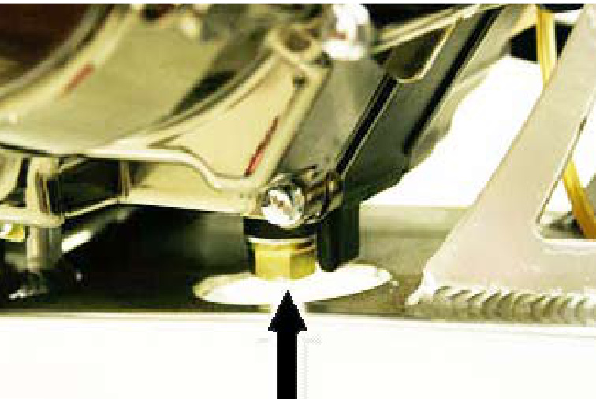
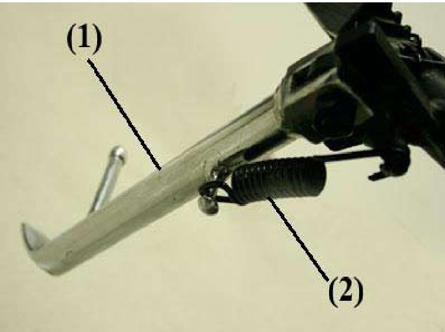

import React from 'react';

# SSR Owners Manual  

Congratulations on choosing an SSR Motorsports pit bike, and welcome to our powersports family. Your new SSR Motorsports pit bike is designed, engineered, and manufactured to be the best in its class.

We have prepared this manual to acquaint you with the proper procedures for operating, caring for and maintaining, and, if necessary, troubleshooting your new pit bike. This manual also contains important safety information. We recommend you follow these instructions and recommendations to obtain maximum performance from your SSR pit bike and to maximize your enjoyment and biking safety.

Thoroughly read this manual before riding your SSR pit bike for the first time. Be certain that you understand how to operate the bike and that you are familiar with the locations of each control, what it does, and how it operates. This Owner's Manual contains operations and minor maintenance instructions. Major repairs may require the attention of a skilled technician and/or special tools and equipment.

While enjoying your SSR Motorsports pit bike, please be sure to ride safely and defensively. Always wear an approved helmet, proper safety eyewear, and protective clothing appropriate for the conditions and terrain. Never ride under the influence of alcohol or drugs.

Thank you for selecting an SSR Motorsports pit bike. We wish you fun miles and years of enjoyable riding.

PLEASE NOTE! SSR Motorsports offers over 30 distinct models of pit bikes, from entry level to full rac Photographs in this manual are of representative examples and show various levels of equipment. Photographs of a specific component may differ from the component on your bike, but will function the same way. In instances where certain components on various models operate differently, we show the different types of components.

# CONTENTS

FORWARD
ABLE OF CONTENTS

COMPONENT LOCATIONS
CONTROLS, BRAKES
  - Front Brake Lever
  - Rear Brake Pedal

CONTROLS, CLUTCH AND TRANSMISSION
  - Clutch Lever
  - Gearshift Lever

CONTROLS, MISCELLANEOUS AND HANDLEBAR
  - Kick-Starter
  - Manual Choke and Fuel Petcock
  - Throttle
  - Engine On/Off Switches
  - Side Stand

OPERATION
  - Before Riding, Riding Safely
  - Pre-Ride Inspection
  - Tires, Wheels and Spokes
  - Leaks
  - Engine Oil
  - Fuel
  - Drive Chain
  - Cables
  - Nuts and Bolts
  - Spark Plug and Ignition Wire
  - Throttle
  - Brakes
  - Starting and Riding
  - Starting the Engine
  - Shifting Gears
  - Braking
  - Stopping and Parking

# SERVICE MAINTENANCE, LUBRICATION AND ADJUSTMENTS

## Why Proper Maintenance Is Important
Breaking-in the Engine
Safety Precautions
Recommended Service and Maintenance Schedule
Fuel Recommendations
Engine Oil: Checking and Adding, Changing, Recommendations
Throttle Control Free Play
Engine Idle Speed
Air Filter
Spark Plug: Specifications, Removing and Replacing

## CONTENTS (cont.)

Suspension Inspection, Front and Rear
Suspension Adjustments, Front and Rear
Brakes, Front and Rear
Brakes, Wear, Inspections and Lubrication
Wheels, Inspection
Wheel Removal, Front
Tires and Tubes, Air Pressure, Inspection, Replacing
Side Stand
Drive Chain, Inspection and Adjustment
Drive Chain, Lubrication, Removal, Cleaning and Re-installing, and Replacement
Cleaning Your Pit Bike
Transporting Your Pit Bike
Storing Your Pit Bike

# TROUBLESHOOTING

Engine Does Not Start, Is Hard to Start
Engine Starts, Runs Erratically or Misses, Spark Plug Fouled
Engine Detonates (Pings or Knocks), Overheats
Engine Vibrates Excessively, Leaks Oil
Transmission Shifts Hard or Jumps Out of Gear, Clutch Slips
Clutch Drags or Does Not Release, Chatters
Brakes Do Not Stop or Hold Properly

# YOU AND THE ENVIRONMENT

# BEING PREPARED FOR THE UNEXPECTED

General Guidelines
If Your Engine Quits or Won’t Start
If You Get a Flat Tire
If You Crash
If a Part Fails

# TECHNICAL INFORMATION

Vehicle Identification Numbers
High Altitude Carburetor Adjustment
Emission Control Systems
Warranty Compliance
Sources of Emissions
Exhaust Emission Control System
Crankcase Emission Control System
Noise Emission Control System
Problems That May Affect Motorcycle Emissions
Oxygenated Fuels and Your SSR Pit Bike

# LEFT SIDE

(1) Clutch Lever (2) Carburetor (3) Fuel Petcock (4) Air Filter (5) Drive Chain
(6) Rear Sprocket (7) Chain Adjuster Block (8) Chain Guide (9) Chain Slider (10) Chain Roller (11) Foot Peg
(12) Engine and Stator Cover (13) Gearshift Lever (14) Engine Skidplate (15) Front Brake Caliper (16) Front Brake Rotor

# RIGHT SIDE

(1) Rear Brake Rotor
(2) Rear Brake Caliper
(3) Muffler
(4) Fuel Filler Cap
(5) Breather Tube and Breather Cap
(6) Throttle
(7) Front Brake Lever
(8) Front Brake Master Cylinder
(9) Auxiliary Oil Cooler
(10) Exhaust Pipe
(11) Rear Brake Pedal and Lever
(12) Foot Peg
(13) Oil

# Filler Cap and Dipstick
- Kick Starter
- Rear Swing Arm

## CONTROLS, BRAKES
### Front Brake Lever

## Rear Brake Pedal

The front brake lever is located on the right side of the handlebar and operates the front brake only. It is operated by the fingers of the right hand, by pulling the lever to the rear.

The brake pedal, which is located on the right side a few inches forward and slightly inboard of the right foot peg, operates the rear brake only, by pressing downward with the right foot. Apply the front and rear brakes smoothly to prevent locking up a wheel.

## CONTROLS, CLUTCH AND TRANSMISSION
### Clutch Lever

The clutch lever is located on the left end of the handlebar and is operated by the fingers of the rider's left hand. The clutch is disengaged by pulling the lever in against the handlebar grip. After shifting gears, the clutch is re-engaged by slowly releasing the lever and allowing it to return to the outward position.

### Gearshift Lever

The gearshift lever is located on the left side of the bike, ahead and inboard of the left foot peg, and is operated with the toe of the left foot. The gear shift pattern on nearly all SSR models is "one down/ three up," and neutral is between 1st and 2nd gears; a select few models feature a "four-up" gear shift pattern with neutral below 1st gear.

### CONTROLS, CLUTCH AND TRANSMISSION (cont.)
To start any "one down/three up" bike from a full stop, pull the clutch lever in against the grip and push the gearshift lever firmly all the way down. To upshift from 1st to 2nd, 2nd to 3rd, or 3rd to 4th, pull the clutch lever back against the grip, place the toe of the left boot beneath the shifter peg and lift firmly upward until it stops, then release the gearshift lever, and re-engage the clutch while gradually opening the throttle. Repeat this for each upshift. To downshift, from 4th to 3rd, 3rd to 2nd, or 2nd to 1st, place the toe of the left boot on top of the shifter peg disengage the clutch by pulling the clutch lever against the grip, press the gearshift lever firmly downward, release the gearshift lever, and re-engage the clutch. Do not fully close the throttle between downshifts; this will help eliminate engine drag and smooth the transition to lower gears. Repeat this procedure for each downshift. Remember, lifting the gearshift lever upward always engages a higher gear and pushing the gearshift lever down engages a lower gear. Neutral is 12% stroke up from 1st or down from 2nd.

Bikes with a "four up" gear shift pattern are operated the same as "one down/three up" models except for the 1st gear location being above neutral in theShift pattern.

Warning! Always fully disengage the clutch before shifting gears. Shifting gears without the clutch fully disengaged can cause severe clutch and/or transmission damage. When shifting to lower gears with the bike in motion, do not downshift with the engine running at high speeds; doing so can cause severe damage to the transmission and/or engine, and can cause the rear wheel to lock up, lose traction and lead to loss of control which could cause serious injury or death.

# CONTROLS, HANDLEBAR & MISCELLANEOUS

Kick-Starter

All SSR pit bikes are kick-start only, with the exception of the SR125-AUTO model, which is equipped with an electric start and continuously variable automatic transmission. The kick-start lever is located on the right side of the engine case, just to the rear of the right foot peg. The kick-start lever features a peg that rotates 90-degrees, from a front-to-back position when the bike is running or at rest to pointing outward to the right for kick-starting the bike.

# Manual Choke and Fuel Petcock

All SSR pit bikes utilize carburetors with manual chokes to assist cold starts. On most models, the choke lever is attached to the left side of the carburetor and has two positions (fully "ON" or fully "OFF"). The choke on several models is attached to the right side of the carburetor and features three positions (fully "ON," "DETENT," a halfway position, and fully "OFF"). Fuel feed to the carburetor from the fuel tank is controlled by use of a manually operated, three-position petcock, or regulator valve, that is located on the left side. The three positions are "ON," "OFF," and "RES" (reserve).

# Throttle

The throttle controls the engine speed (RPM) and is operated by rotating the hand grip on the right side of the handlebar. To increase engine speed, the grip is rotated rearward toward the rider; to reduce engine (and vehicle) speed rotate the grip forward away from the rider. The throttle is spring-loaded and will, unless improperly adjusted, return to the closed (engine idle) position when released.

# Engine ON/OFF Switches

SSR pit bikes are equipped with one of two types of on/off or engine-off switches. The first is a simple momentary-style engine stop (ignition kill) switch, a button that is pressed to stop the engine.
is a two-position ON/OFF rocker-style switch; the engine can be started only in the "run" position and to shut off the engine, the switch is pushed into the "off" position.

# CONTROLS, HANDLEBAR & MISCELLANEOUS (cont.)

Side Stand

# Side Stand Up

# Side Stand Down

The side stand is used to support the bike in an upright, slightly leaning position while parked. The side stand is located on the left side of the bike either directly behind or, on select models,

below the left foot peg. The side stand is raised or lowered with the left foot.

NOTE: Some competition models are not equipped with a side stand.

# OPERATION

## Before Riding

Before each ride, be certain that both you and your SSR pit bike are ready to ride. Make sure that you are in good physical and mental condition, that you are not under the influence of alcohol or drugs, and that you are wearing proper safety gear. We want to keep you as a customer, so for your safety, we strongly urge you to wear an approved helmet, high-quality eye protection, and protective clothing that includes, at a minimum, motorcycle gloves and boots, durable long pants, and a long-sleeved shirt.

A helmet reduces the possibility of serious head injury or death in a crash. An open-face helmet offers good protection, but a full-face helmet offers much more. Always be certain that any helmet has a DOT (Department of Transportation) certification sticker. For even better protection, get a helmet that is both DOT and Snell (Snell Memorial Foundation, which has more rigorous standards than the DOT) certified. A helmet should fit your head comfortably but snugly and have an

adjustable chinstrap that can be tightened securely.

To maximize your safety when riding, you should wear a face shield or, preferably, high-quality goggles designed for off-road use. Off-road motorcycle boots will provide better protection for your feet, ankles, and lower legs than boots intended for street riding. The same holds true for gloves. For the utmost protection, also wear riding pants with knee and hip pads, a riding shirt or jersey with padded elbows, and a chest or shoulder protector.

Before each ride, thoroughly inspect your bike and if you discover any problems, correct them. Off-road riding is very tough on any vehicle, and you don't want to experience a mechanical problem miles from help. Using an improperly maintained bike or failing to correct a problem can cause a crash in which the rider could be seriously injured or killed. Always perform a pre-ride inspection!

## Before Riding (cont.)

Include a tool kit, tire repair material and tools, and spare front and rear tire and tubes. Naturally, bring along an extra, approved can or two of gasoline.

A safe and enjoyable ride begins with good planning and preparation. It's safe - It’s a good idea – and usually the most fun – to ride with at least one other person. If one of you has a problem, the other person can help. Always let someone know where you’re going and when you expect to return. Before riding in an unfamiliar area, find out if any permits are needed, get maps so you can familiarize yourself with the terrain, and talk to other riders who may know the area. The U.S. Forest Service, Bureau of Land Management, state and regional natural resources and parks departments, riding clubs, and off-road magazines are all good sources of information.

It’s a good idea to take some tools, spare parts (including a drive chain and master link, control levers, cables, a spark plug, wire, duct tape, and rope), and supplies along with your pit bike and riding gear. See “Troubleshooting” for tips about what sorts of difficulties you might encounter. You should always take lots of water, food, a first aid kit, and this owner’s manual. Other items you should take.

What you take along on the ride depends on the kind of terrain, how long you expect to ride, how far you might go from your starting point, and how experienced you and/or your companions are at making repairs. If you do decide to take some tools, spare parts, and other supplies on the ride, plan ahead of time on how you will carry them safely, and know how to use them. Do not exceed the bike’s maximum weight capacity and pack your load carefully so it doesn’t negatively affect riding safely.

# Pre-Ride Inspection

Check the following items before every ride:

Tires. Use a quality tire pressure gauge to check the air pressure when the tires are cold (before riding) and add or remove air as necessary to meet the manufacturer’s recommended cold tire air pressure. Also inspect both tires for any sign of excessive wear or damage. If a tire is damaged or excessively worn, replace it with a new tire of the correct size and type.

Wheels and spokes. Inspect the wheel rims for damage. Do not use if the rim is cracked or bent. With the bike on a stand rotate each wheel; if a wheel appears to wobble, it is either out of round or not “true.” If the wheel wobble is noticeable, see your dealer. Also make sure the spokes are tight.

# Operation

Pre-Ride Inspection (cont.)

Leaks. Inspect the engine/transmission case and the fuel tank for leaks. Look beneath the bike for signs of leaking fluids. If the bike has an auxiliary oil cooler, check lines and fittings to be sure that there is no leakage. If there is any leakage, clean and tighten fittings as necessary.

# Dipstick Location

Engine oil. Check oil level using the dipstick on the right side of the engine/transmission case, and add oil if necessary. Be sure to use the correct type and weight oil as specified in this manual. Be sure the dipstick is properly and securely refitted into the engine/transmission case.

For more information see “Engine Oil, Checking and Adding” in the “SERVICE MAINTENANCE, LUBRICATION AND ADJUSTMENTS” section.

# OPERATION

## Pre-Ride Inspection (cont.)

# Filler Neck & Fuel Cap

Fuel. Check the fuel level and add more if necessary, filling to the bottom of the filler neck. Be sure to use 90 (or higher) octane unleaded pump gasoline.

# Fuel Cap, Breather Tube & Cap

Make certain that the fuel filler cap is securely fastened and that the breather tube is properly seated on the cap and in good condition.

# Drive Chain

Drive Chain. Check the chain for condition and correct tension (“slack”). The chain may break if too tight (not enough “slack”); excessive chain “slack” can cause accelerated wear, kinked or binding links, loose pins, and/or damaged rollers.

# Chain Slider & Roller

Check the chain slider (located on the forward portion of the left side of the swing arm) for excessive wear and replace if necessary.

## Pre-Ride Inspection (cont.)

# Throttle Cable

Cables. The clutch and throttle are actuated by cables from the handlebar levers. Check the cable housings for wear and the fittings for looseness, and replace or tighten as necessary.

# Clutch Cable at Transmission Case

If a cable does not operate freely it may need to be lubricated.

Nuts and bolts. Using appropriate-size wrenches, be sure that all accessible nuts and bolts are tight. And tighten if necessary.

# Spark Plug

Spark plug and ignition wire. Make sure that spark plug is not loose in cylinder head; tighten if necessary.

# Spark Plug

Be certain that the ignition wire terminals fit securely onto the spark plug and ignition coil.

## Pre-Ride Inspection (cont.)

# Throttle Closed

Throttle Open

Check the throttle control for free play and adjust if necessary.

# Front Brake Control

Test front and rear brake controls for normal operation. If either feels soft, check the appropriate master cylinder fluid reservoir and add DOT 3 or 4 fluid as needed to fill.

# Rear Brake Control

Adjust mechanical free play in front and rear levers and linkages, if necessary.

# Starting and Riding

1. Starting the engine. Be sure the transmission is in neutral and that (if applicable) the two-position on/off switch is in the ride (on) position. Turn the three position fuel petcock to the “ON” position. If the bike’s engine is cold, lift the choke lever up to the fully “ON” position. Next, shift the transmission into neutral, and for added safety, pull the clutch in against the handlebar grip to disengage the clutch, then hold the throttle slightly open and follow the following directions to operate the kick-starter.

Petcock RESERVE

Petcock ON

Petcock OFF

# Choke Lever

If the air temperature is between 50 and 90 degrees F, swing the kick-start lever’s foot peg out from its stored position and with your right foot rotate the lever down and to the rear until you feel resistance. Then, with a rapid and continuous motion, “kick” the lever down through its stroke until it stops at the bottom. Do not allow the kick-starter to return or snap back freely as it can damage the engine/transmission case. If your bike has the two-position choke on the left side, allow the engine to run for approximately 15 seconds after it starts, then push the choke lever all the way down to the fully “OFF” position. If the bike has the three-position choke on the right side of the carburetor, push the choke lever down partway to the “DETENT” position immediately after the engine starts and, after about 15 seconds, push the choke lever the rest of the way down to the fully “OFF” position. If the bike’s idle is unstable, open the throttle slightly until the idle evens out.

If the air temperature is below 50 degrees F, follow the same steps outlined above and warm up the engine by slightly opening and closing the throttle until it responds smoothly with the choke fully “OFF.” If the air temperature is over 90 F or the bike is fully warmed up, do not use the choke.

If the engine will not start after several tries, it may be “flooded” with excess fuel. To clear the engine on bikes with the two-position off/ride switch, turn the switch to the "off" position, push the choke lever all the way down (fully "OFF"), hold the throttle fully open, and turn the engine over several times with the kick-starter. Then, turn the off/run switch to the "run" position and follow

# Starting and Riding

the instructions for a warm engine or high-temperature start.

WARNING! Do not start or run the bike in an enclosed area or any area without good ventilation. The exhaust contains carbon monoxide and other toxic gases that can collect quickly in confined areas and cause illness and even death.

WARNING! Running the engine for an extended period with the choke open may cause damage to the piston and cylinder walls, which could necessitate rebuilding or replacing the engine.

Shifting gears. See the "Gearshift Lever" in the "CONTROLS, CLUTCH AND TRANSMISSION" section of this manual, pages 11-12.

Braking. To slow or stop the bike, apply the front and rear brakes smoothly while downshifting to match the engine speed to the bike’s forward speed. Gradually increase braking pressure as you slow down. As the bike slows to a stop, put your left foot down then, when you are through using the rear brake, put your right foot down.

For maximum braking, close the throttle and firmly apply the front (lever) and rear (pedal) controls to the threshold of wheel lock-up. Applying the front and/or rear brakes too hard may cause the wheel to lock up and slide, reducing or eliminating control of the bike. If this happens, momentarily release the brake controls, steer straight ahead until regaining control, and reapply the brakes with less pressure.

Beginning or novice riders should always apply the brakes as evenly and smoothly as possible. Slightly more pressure on the front brake than on the rear gives better control for less experienced riders; more rear brake pressure can cause a loss of rear tire traction and result in losing control of the bike. Experienced, skilled riders can vary the proportions of front-to-rear brake pressure to compensate for riding conditions and speeds.

All riders except those who are experienced, with expert-level skills, should reduce speed and finish braking before entering a turn. Riders should avoid braking or closing the throttle abruptly while turning; either action can cause one or both wheels to lose traction, and a loss of traction at either wheel will cause a reduced or complete loss of control.

Riding on wet or loose surfaces reduces the ability to maneuver and stop. All control inputs must be smooth under these conditions. Hard acceleration, braking, or turning may cause loss of control. Always exercise extreme caution when accelerating, braking, or turning on slippery or loose surfaces.

When descending long, steep grades, or any grades with loose or slippery surfaces, use enginline compression braking by downshifting to the lowest applicable gear and applying the brakes gently and intermittently.

# Starting and Riding (Part 2)

## Stopping and Parking

After coming to a complete stop, lower the side stand. Shut off the engine. Depending on how your specific bike is equipped, this is accomplished by either pressing the button on the momentary-style engine stop (ignition kill) switch or, if equipped with a two-position, rocker-style switch, from the “run” to the “off” position. If the bike is not going to be run again within a few minutes, also turn the fuel petcock to the “OFF” position.

## Post-ride Inspection

After completing a day of riding, clean the bike as thoroughly as conditions allow. Remove all dirt, mud, brush, rocks, and/or other objects that you may have picked up along the ride. After cleaning, carefully inspect the bike for any damage or leaks. Repair any damage that might affect the safe operation of the bike before its next use. Be sure to lubricate the drive chain if possible before the bike’s next use.

# Service Maintenance, Lubrication and Adjustments

## Why Proper Maintenance is Important

Keeping your pit bike well maintained is essential to your safety as well as being a good way to protect your investment, realize its maximum performance, avoid breakdowns, and have fun.

To help you keep your new pit bike in top condition, this section includes a Service Intervals Schedule, simple and easy-to-follow instructions for specific maintenance work, safety precautions, information and recommendations for oils, plus tips to keep your bike looking its best.

## Breaking-in the Engine

While the engine in your new SSR pit bike does not require a formal “break-in” procedure, we recommend you follow the following tips to get the best performance and longevity from your bike. Note: None of the pit bikes covered in this manual are equipped with speedometers or odometers, so you will need to “guesstimate” both your speed and miles traveled.

1. Start your engine and let it idle for four to five minutes, blipping the throttle occasionally. Shut off the engine and allow it to cool completely. Repeat this “heat cycle” process four more times.

2. Warm up the engine again and ride the bike for about five minutes at an easy pace. Vary the rpm, do not ride at more than 1/3 of maximum throttle or rpm. Let the engine cool completely and repeat the cycle two more times.

3. Ride the bike for five to ten minutes at a moderate pace, varying the rpm and not going over 75% throttle or rpm. Let the engine cool completely and repeat this secondary break-in two more times.

4. Complete the break-in by riding aggressively for about 15 minutes. Ride hard without revving the engine fully, vary the rpm and do not “cruise” at part throttle. By the time you complete the break-in process, you will probably have used at least one and maybe as much as two gallons of gasoline.

In addition, for the first five hours do notUse the bike to climb steep slopes, do not ride more than two hours at a time without shutting the engine off and allowing it to cool, and vary the engine speed regularly.

# SERVICE MAINTENANCE, LUBRICATION AND ADJUSTMENTS (continued)

Why Proper Maintenance is Important (continued)

Allow the engine to warm up for three to five minutes before each ride; this gives all internal components a chance to become fully and thoroughly lubricated. For the first five hours try to observe a maximum speed no more than 25 mph, and not more than 35 mph during the second five hours.

Cause serious and painful burns – let the engine and exhaust cool before touching.

Read all instructions before beginning any maintenance or adjustment procedures. Be sure you have the necessary tools, skills, and experience to successfully complete whatever work you start.

To help prevent the bike from falling over, which can cause damage to the bike and injure any persons hit by it, park it on a solid and level surface and use the bike’s side stand or a maintenance lift/stand designed specifically for motorcycles to provide proper support.

# Safety Precautions

The engine must be off before beginning any service, maintenance, or repair operation, unless the instructions specifically state that it is to be running. Do not run the engine in an enclosed area or any area without adequate ventilation. The exhaust contains carbon monoxide and other toxic gases which can collect quickly in confined areas and can cause illness and even death. Hot engine parts can 34

Always be careful when working around gasoline to reduce the possibility of a fire or explosion. Use only a non-flammable (high flashpoint) solvent such as kerosene or a specially-prepared cleaning product for washing parts. Keep all fuel system-related parts away from any sources of heat, sparks, or flame. Never smoke around gasoline or other flammable materials.

# Recommended Service & Maintenance Schedule

| SERVICE OPERATION           | Every 3 Hours | Every 5 Hours | Every 10 Hours | Every 15 Hours |
|-----------------------------|---------------|---------------|----------------|----------------|
| Valve Adjustment            |               |               |                | X              |
| Engine Oil                  |               | R             |                |                |
| Engine Oil Strainer Screen  |               | R             |                |                |
| Drive Chain                 | L/A           |               |                |                |
| Brake Fluid Reservoir Levels|               | I             |                |                |
| Brake Fluid Condition       |               |               |                | R              |
| Brake Lines                 |               | I             |                |                |
| Brake Pads                  |               |               |                | I              |

A – Adjust I – Inspect and, if necessary, clean, correct, fill or replace L – Lubricate R – Change or replace T – Tighten to proper torque X -- Perform *Inspect and service your SSR Pit Bike more frequently if ridden hard or in dusty# Recommended Service & Maintenance Schedule

| SERVICE OPERATION         | Every 3 Hours | Every 5 Hours | Every 10 Hours | Every 15 Hours |
|---------------------------|---------------|---------------|----------------|----------------|
| Carburetor, Idle Speed    | (as needed)   | (as needed)   | (as needed)    | (as needed)    |
| Air Filter                | I             |               |                |                |
| Spark Plug                |               |               |                | I              |
| Clutch and Throttle Cables|               | A/I/L         |                |                |
| Wheel Spokes, Tightness   |               | I             |                |                |
| Wheel Bearings            |               |               | L              |                |
| Fasteners                 |               | I             |                |                |
| Suspension Fluids         |               |               |                | R              |

A – Adjust
I – Inspect and, if necessary, clean, correct, fill or replace
L – Lubricate
R – Change or replace
T – Tighten to proper torque
X – Perform

Inspect and service your SSR Pit Bike more frequently if ridden hard or in dusty, hot, or other extreme conditions. Regardless of hours of riding, always perform all service operations prior to storage or annually.

Unless the owner is an experienced and skilled mechanic and has a good selection of the proper tools and equipment, he or she should never attempt to perform these service operations. In all other instances, service operations should only be performed by your dealer or by a qualified powersports technician.

Fuel Recommendations. For optimum performance run unleaded pump gasoline with an R+M/2 (US standard) octane rating of at least 90. To meet clean air standards, much of the gasoline used in the United States and Canada is oxygenated, meaning it’s blended with alcohol or ether compounds to help reduce exhaust emissions. Do not use a gasoline with higher percentages of any of the following oxygenates than listed as follows:

- ETHANOL (ethyl or grain alcohol) up to 10-percent by volume.
- MTBE (Methyl Tertiary Butyl Ether) up to 15-percent by volume. Because of its extreme toxicity its use has declined significantly in the US and Canada.
- METHANOL (methyl or wood alcohol) up to 5-percent by volume. Do not use gasoline oxygenated with methanol if does not also contain co-solvents and corrosion inhibitors to protect the fuel system.

Use of a lower than recommended gasoline can cause “pinging,” which is also called “spark knock”." or "pre-ignition" (an occasionally loud rapping or rattling noise) which can, if severe or persistent, lead to extensive engine damage. Light pinging experienced under a heavy load, such as climbing a steep hill, is not a cause for concern. If pinging occurs at steady speeds under normal loads, change brands of fuel. If the pinging persists, see your dealer.

WARNING! Gasoline is highly flammable and explosive. You can be severely burned or injured when handling fuels. Always stop the engine and keep gasoline away from sources of heat, sparks, and flame. Only handle gasoline outdoors. Wipe up spills immediately. Do not use as a solvent or cleaner.

# SERVICE MAINTENANCE, LUBRICATION AND ADJUSTMENTS (cont.)

## Safety Precautions (cont.)

Engine oil. Using the proper oil, plus regularly checking the oil level, adding additional oil if needed, and changing the oil as recommended will all help extend the life of your bike’s engine. Remember, the engine in this pit bike is cooled by outside air flowing over the engine, and the oil circulating within the engine. Even the best oil gradually wears out, reducing its lubricity. It also picks up dirt and other contaminants from the inside of the engine and becomes more and more contaminated as the miles of use add up. Old and/or dirty oil can damage your engine or cause accelerated wear on moving parts; running the engine with insufficient oil can cause serious damage to the engine and transmission.

Oil Recommendation
API Classification SF or SG
Viscosity (weight) SAE 10W-40
Suggested Oil: 4-stroke oil (USA & Canada) or equivalent

\*For continued use with ambient air temperatures above 90-95-degrees F, and not dropping below 50-degrees F, use SAE 20W-50 viscosity SF or SG oil for air-cooled motorcycles.
\*\*Be sure to use oil manufactured specifically for use in air-cooled motorcycle engines. Do not use oils with graphite or molybdenum additives as such additives can have an adverse effect on clutch operation and clutch life.

# Checking & Adding Oil

## Dipstick / Oil Filler Cap Location

Park your motorcycle on a firm, level surface. Remove the oil cap/dipstick and check the oil level. If the oil is at or near the upper level mark (see photo) you do not have to add oil.

## Lower (1) and Upper (2) Oil Level Marks

If the oil is below or near the lower level mark (see photo), add oil of the recommended specifications until it reaches the upper level mark. Do not overfill. Insert the dipstick and screw it in tightly. Check for oil leaks.

# SERVICE MAINTENANCE, LUBRICATION AND ADJUSTMENTS (cont.)

## Changing Engine Oil

1. If the engine is cold, start it and let it idle for three to five minutes. Turn the en- Change "frm" to "firm" in step 2.
- Remove the extra space in steps 3 to 13.
- Fix the ordered list in steps 9 and 10 by removing spaces before the numbers.
- Add alt text to the images.
- In step 14, combine the list item with the preceding one to avoid an empty line before the new heading.
- Remove the special character `★` in the heading "Throttle Control Free Play".
- Ensure the list in the "Throttle Control Free Play" section is surrounded by blank lines.
- Combine the two "Adjustment" headings and remove the special character in the last heading.
- Add spaces around the heading "MORE ABOUT ENGINE OIL".

1. Turn the engine off and wait two to three minutes for the oil to settle.
2. Park your motorcycle on a firm, level surface.
3. Remove the oil filler cap/dipstick.
4. Place a drain pan under the crankcase.
5. Remove the oil drain bolt.
6. After most of the oil is drained, gently tilt the motorcycle from side to drain the remaining oil.
7. Pour the drained oil into a suitable container and dispose of it in an environmentally-safe manner. Most auto parts stores accept used engine oil for recycling.
8. Remove the old sealing washer from the drain bolt and install a new sealing washer.
9. Install the oil drain bolt and tighten it to the specified torque, 18 lb-ft.
10. Pour approximately 0.6 US quart (0.57 liter) of the recommended oil into the crankcase.
11. Install the oil filler cap/dipstick securely.
12. Start the engine. Let it idle for two to three minutes, then turn it off.
13. With the motorcycle held upright on a level surface, check the oil level. If needed, add oil until it reaches the upper level mark on the dipstick. Do not overfill!
14. Check for oil leaks.

# MORE ABOUT ENGINE OIL

Whenever you buy oil for your bike, check the label on the container to make sure it matches recommended specifications.

Engine oil has a major influence on both the performance and the service life of the engine. Non-detergent, vegetable, or castor-based racing oils are not recommended. Aftermarket oil additives are not needed and can negatively affect the bike’s engine. Use the recommended oil.

# Throttle Control Free Play

Check free play. Free play is the amount the throttle control will move before starting to open the throttle on the carburetor. Free play should be between 5/64 and 5/32-inch (2.0mm to 4.0mm) movement at the grip. Adjust, if necessary, to bring free play within the specified range using the following instructions:

1. Loosen the locknut (1) on the throttle cable mechanism.
2. Turn the adjuster (2) to reduce or increase throttle free play.
3. Tighten the lock nut. Return the dust cover to its normal position.
4. After making the necessary adjustments, check the throttle grip to ensure it rotates smoothly from fully closed to open at any steering (handlebar) position. If you cannot adjust throttle free play within the specified range, contact your dealer.

# Adjustment

1. Slide the rubber dust cover off of and away from the locknut.

# SERVICE MAINTENANCE, LUBRICATION AND ADJUSTMENTS

Engine Idle Speed

The engine must be at normal operating temperature to make accurate idle speed adjustments. Ten minutes of stop-and-go riding should be sufficient. Do not attempt to compensate for faults in other systems by adjusting idle speed. See your dealer for regularly scheduled adjustments.

1. Warm up the engine, shift into neutral, and rest the bike securely on its side stand.
2. Connect a tachometer, following the tachometer manufacturer’s instructions.
3. Adjust the idle speed using the throttle stop screw (arrow). Idle speed should be 1400 rpm, plus/minus 100 rpm.

Note: SSR pit bikes are equipped with a variety of different carburetors depending on the models. The photos are representative of what is on your bike.

# Air Filter

Inspect the air filter regularly. When it becomes dirty or contaminated, discard it and replace it with an equivalent new part. If the air filter is a reusable washable type, wash the dirt out with a mild detergent, rinse thoroughly, and dry with a clean towel.

Soak the filter element in foam/paper filter oil or clean machine oil (15W/40Q is recommended), squeeze out excess oil in an absorbent cloth, and reinstall the filter element.

# SERVICE MAINTENANCE, LUBRICATION AND ADJUSTMENTS

(cont.)

## Spark Plug Recommendation

The recommended standard spark plug is satisfactory for most riding conditions. However, If you plan to ride for extended periods at high speeds or near maximum power (high engine rpm) in hot climates, or plan extended riding in cold climates, a “colder” or “hotter” heat range plug may be recommended.

NOTICE: Using spark plugs with an improper heat range can cause engine damage. Use only the recommended type of spark plugs in the recommended heat range.

1. Side electrode
2. Spark plug gap
3. Center electrode

## Removing or Replacing the Spark Plug

1. Tighten the spark plug about 1/8 to 1/4 turn after it seats, if the old plug is good, or about 1/2 turn after it seats if installing a new plug.

## NOTICE

1. Before removing the spark plug, clean any dirt from around the spark plug base.
2. Carefully disconnect the spark plug wire cap. Do not pull on the wire as this may damage the conductor within the wire causing high resistance and reduced firing voltage.
3. Remove the spark plug with a spark plug wrench.
4. Inspect the spark plug electrodes for wear. The center electrode should have square edges. The side electrodes should not be eroded. The insulator should not be cracked or chipped.
5. Check the spark plug gap, using a wire-type feeler gauge. If an adjustment is necessary, bend the side electrode carefully to open or close the gap, which should be 0.024- to 0.028-in. (0.60 to 0.70mm). Make sure the plug washer is in good condition. If you need to install a new spark plug, check and, if necessary, adjust the gap.
6. With the plug washer attached, thread the spark plug inton by hand (to prevent cross-threading).
Do not force-fit the plug.

Improperly tightened spark plugs can cause damage to the engine. A loose plug can cause a burned piston; over-tightening the plug can damage or strip the threads in the cylinder head.

# SERVICE MAINTENANCE, LUBRICATION AND ADJUSTMENTS

(cont.)

## Suspension

Loose, worn, or damaged suspension components may adversely affect the handling and stability of your motorcycle. If any suspension components appear worn or damaged, see your dealer for further inspection. Your dealer is qualified to determine whether or not replacement parts or repairs are needed.

## Front Suspension Inspection

1. Check fork operation. Pull the front brake lever in to lock the brake. Then push up and down on the fork legs several times. The suspension should function smoothly. There should be no oil leakage.
2. Check to be sure that the fork mounting bolts and handlebar riser mounting nuts are tight. If any front suspension components appear worn or damaged, see your dealer for further inspection.

## Rear Suspension Inspection

(1) Swing arm bushing

1. Place the bike on a maintenance stand. Either strap securely in place or have a helper hold the bike while you push hard against the side of the rear wheel and feel for any free play which indicates worn swing arm bushings (1). Do not ride with worn swing arm bushings.
2. Check that the fasteners for the shock absorber attachment points (2) are secure.

(2) Shock absorber attachment points (3) Shock absorber bushing

3. Check that the shock absorber bushings (3) are not worn, check for oil leaks in the shock absorber. If any rear suspension components appear worn or damaged, see your dealer for further inspection.

# SERVICE MAINTENANCE, LUBRICATION AND ADJUSTMENTS (cont.)

### Rear Suspension Inspection (cont.)

Front Suspension Adjustments Some SSR pit bikes are equipped with adjustable front and/or rear suspensions.

The simplest adjustable front suspensions are forks that are adjustable for rebound.

This adjustment is made using a knob on the top of each fork leg, turning toward $(-)$ for “slower” rebound towards the $(+)$ for “faster” rebound.

Double or two-way adjustable front forks are adjusted for rebound at the top of the fork and compression at the bottom. To increase compression turn the screw inward (clockwise); to decrease compression turn the adjusting screws outward (counter-clockwise).

# Rear Suspension Adjustments

The suspension on "entry level" pit bikes uses a coilover shock absorber with adjustable preload. This shock absorber will have a notched collar that allows the rider to adjust the rear suspension from soft to firm.

# Adjustable Preload Shock Absorber

The simplest truly adjustable rear suspension uses a one-way or single adjustable coilover shock and allows the rider to reset the rebound from "faster" or "slower". This is usually done at the bottom (swing arm end) of the shock with either a hand-turned knob or wheel. "Faster" rebound allows the shock to extend or open more quickly after being compressed (closed); "slower" retards the shock's extension after being compressed.

# One-Way Adjustable Shock Absorber

Two-way or double-adjustable coilover shocks have separate adjustments for both compression and rebound. Rebound is usually reset in the same manner as a one-way (single-adjustable) shock. Compression is generally reset at the top of a two-way shock. Most two-way shocks use a pressurized inert gas like nitrogen as the compression adjusting medium, and adjustments are made from soft to hard using a knob on the pressurized gas reservoir that is externally mounted on the top of the shock.

# SERVICE MAINTENANCE, LUBRICATION AND ADJUSTMENTS (cont.)

Brakes

Front Brake Lever Free Play

(1) Front Brake Lever Free Play

1. Check free play by pulling in slowly on the front brake lever (1) until the brake starts to engage. Free play should be between approximately 3/8 to 13/16 inch (10-20mm).
2. If necessary, adjust to the specified range. To do this find the brake adjusting nut on the lower portion of the brake caliper. Using a hex-head wrench, turn the bolt clockwise to increase free play or counterclockwise to reduce free play.

Brake Caliper Free Play Adjusting Nut

# Rear Brake Pedal Free Play

# Rear Brake Pedal Free Play

1. Rest the bike securely on its side stand.

2. Check free play by slowly depressing the brake pedal (1) until the brake starts to engage. Free play should be between 3/8 to 13/16 inch (10-20mm). If necessary, adjust to the specified range. To do this, find the adjusting nut at the bottom of the rod connecting the rear brake pedal and linkage to the master cylinder. Turn the nut clockwise to reduce free play, or counterclockwise to increase free play.

# Brake Wear Inspection
The front and rear brakes should be checked for wear after every 15 hours of riding. We recommend that this inspection be performed by your dealer.

# Other Inspections & Lubrication

Check that the front lever and rear pedal assemblies are positioned properly and that all fasteners are tight.

Check the front brake hydraulic fluid line for kinks or signs of wear or abrasion that could cause sticking or failure.

Front: Make sure the front brake lever, spring, and fasteners are in good condition.

Rear: Make sure the rear brake pedal arm, spring, and fasteners are in good condition.

# SERVICE MAINTENANCE, LUBRICATION AND ADJUSTMENTS

(cont.)

Wheels

Maintaining correct spoke tension and trueness (roundness) of the wheels is critical to safe motorcycle operation.

During the first hour or two, spokes will loosen rapidly due to the initial “seating” of the parts. Excessively loose spokes may result in instability at moderate and high speeds leading to a possible loss of control. It’s also important that the rim locks are secure to prevent tire slippage.

It is not necessary to remove the wheels to perform the recommended services in the Maintenance Schedule. However, information for wheel removal is provided for emergency situations.

1. Inspect the rims and spokes for damage.

2. Tighten any loose spokes.

3. Rotate the wheel slowly to check for signs of wobble. If the wheel appears to wobble, the rim is out of round or not “true.” If the wobble is noticeable, see your dealer for inspection.

# FRONT WHEEL REMOVAL

## Removal

1. Raise the front wheel off the ground by placing a maintenance stand or support block under the engine. Secure the rear of the motorcycle with tie-down straps.
2. Remove the front axle nut and front axle.
3. Remove the wheel. Do not get any grease, oil, or dirt on the brake pad surfaces. This can cause poor or erratic brake performance or rapid brake pad wear after reassembly.

## Installation

1. Reverse the removal procedure.
2. Torque the axle to 35 lb-ft.
3. Check front brake adjustment.

If a torque wrench was not used to re-install the wheel, have your dealer inspect the bike as soon as possible to verify proper assembly. Improper reassembly may lead to loss of front braking function.

To safely operate your pit bike, the tires must be of the proper type (for off-road use only) and size, in good condition with adequate tread, no cuts, or other visible signs of damage, and correctly inflated.

# TIRES and TUBES

WARNING! Using a tire that is excessively worn or improperly inflated can lead to a loss of control which could result in serious injury or death. Follow all instructions in this owner’s manual regarding tire inflation and maintenance.

# Tire Air Pressure

Properly inflated tires provide the best combination of handing, tread life, and riding comfort.
Over-inflated tires wear unevenly which adversely affects handling. Under-inflated tires are more likely to fail from overheating. Under-inflated tires may also cause wheel damage in rocky terrain.

Over-inflated tires will make your motorcycle ride more harshly, are more prone to being damaged by surface hazards and wear unevenly.

# SERVICE MAINTENANCE, LUBRICATION AND ADJUSTMENTS

Tire Air Pressure

## Check Tire Pressure Cold

Always check tire air pressure when the tires are cold. Tire pressure measurements will be inaccurate, inconsistent and always higher if the air pressure is checked when the tires are warm or hot, which happens even if the motorcycle has only been ridden for a few miles. If you let air out of warm or hot tires to match the recommended cold air pressures, the tires will be under-inflated. Make sure the valve stem caps are secure. If a cap is damaged or missing install a new cap.

| Front | 25 psi (1.8 kgf/cm 2) |
|-------|------------------------|
| Rear  | 25 psi (1.8 kgf/cm 2) |

## Recommended Tire Pressure, COLD

If you decide to adjust tire pressure for a particular riding condition, make changes a little at a time.

## Inspection

A flat tire is inconvenient at best and may cause an accident.

Carefully inspect your bike’s tires and wheels every time before you ride. Look for bumps or bulges in the tire sidewall and tread. Replace any tire that has a bump or bulge.

Look closely for cuts, slits, or cracks in the tires. Replace the tire if you can see any fabric or cord anywhere on the tire. Check for rocks or other objects embedded in the tire or tread. Remove any objects.

Measure the tread depth. Replace the tire before tread depth at the center is 1/8-inch (3mm) or less, or any time you begin to notice a reduction in traction.

Check the position of the valve stems on both wheels. A tilted valve stem indicates the tube is slipping inside the tire or the tire is slipping on the rim. See your dealer.

## Tire Replacement

The tires that came on your pit bike were engineered to provide the optimum combination of handling, braking, durability, and comfort.

Use a replacement tire equivalent to the original.

Replace the tube any time you replace a tire. The old tube will probably be stretched and, if installed in a new tire, could fail.

## Tube Replacement

If a tube is punctured or damaged, you should replace it as soon as possible. A repaired tube may not be as reliable as a new one, and it could fail while you are riding. For information on making a temporary repair, see page 73.

We recommend that tires and tubes be replaced by your dealer.

Always use a replacement tube that is equivalent to the original. We recommend that tubes be replaced by your dealer. Replacing a tube requires removing and re-installing the wheel.

Tires replaced, carefully inspect the tire.

WARNING: Installing improper tires can negatively affect handling and stability. This can lead to a loss of control, which could cause serious injury or death. Always use the size and type of tires recommended in this owner’s manual.

# SERVICE MAINTENANCE, LUBRICATION AND ADJUSTMENTS

### Side Stand

1. Check the side stand spring for damage and loss of tension.
2. Check the side stand assembly to be sure it moves freely.
3. If the side stand is stiff or squeaky, clean the pivot area and lubricate the pivot bolt with a few drops of clean engine oil.

**Note:** Most SSR Motorsports competition model pit bikes are NOT equipped with a side stand.

# Drive Chain

The service life of the chain depends on proper lubrication and adjustment. Poor maintenance can cause premature wear or damage to the drive chain or sprockets.

Under severe usage, or when the motorcycle is ridden in unusually dusty or muddy areas, more frequent maintenance will be necessary.

Before servicing the drive chain, turn the engine OFF, lower the side stand, and make sure that the transmission is in neutral. It is not necessary to remove or replace the drive chain to perform the recommended service in the Maintenance Schedule.

## Drive Chain Inspection

With the bike’s wheels on the ground, check slack in the lower drive chain approximately halfway between the sprockets. Correct drive chain slack (vertical free play) at the midpoint of the lower chain should be between 9/16 and 1 inch when moved by hand.

Next, check drive chain slack at several points along the chain. The slack should remain constant.

If it isn’t, some links may be kinked and binding. Lubricating the chain will often eliminate binding and kinking.

### Drive Chain Inspection (cont.)

NOTICE: Excessive chain slack may allow the drive chain to damage the engine cases.

(1) Pin (2) Roller (3) Link

Inspect the drive chain for damaged rollers, dry or rusted links, excessive wear, kinked or binding links, or loose pins.

If the drive chain has damaged rollers, loose pins, or kinks that cannot be freed, the chain should be replaced. Lubricate the drive chain if it appears to be dry or shows signs of rust. Lubricate any kinked or binding links and work them free. Adjust chain slack if needed (see “Replacing the Drive Chain” immediately following).

Check the chain slider for wear. If the ridge in the center of the slider is worn, have your dealer replace the chain slider.

Adjusting the Drive# Chain Adjustments

1. Loosen the rear axle nut (3).
2. Loosen the lock nuts (2) on both sides of the swing arm.
3. Turn the adjusting nuts (1) on the right and left chain adjusters an equal number of turns to increase or decrease chain slack.
4. Torque the rear axle nut to: 35 lb-ft. If a torque wrench was not used for this installation, have your dealer inspect the bike as soon as possible to verify proper assembly. Improper re-assembly may lead to premature chain and/or sprocket wear, chain or sprocket failure, damage to the bike, and loss of control which could result in injury or death.
5. Tighten the adjusting nuts lightly. Then, while holding the adjusting nuts with a wrench, tighten the lock nuts.
6. Recheck drive chain slack.
7. Check rear brake pedal free play and adjust as necessary. Free play may be affected when the rear wheel is repositioned to adjust drive chain slack.

# SERVICE MAINTENANCE, LUBRICATION AND ADJUSTMENTS (cont.)

## Lubricating the Drive Chain

### Master Link Retaining Clip

### Removing, Cleaning and Re-installing the Drive Chain

When the drive chain becomes extremely dirty, it should be removed and cleaned prior to lubricating.

1. Remove the master link retaining clip (1) with pliers. Do not bend or twist the clip. Remove the master link, then remove the drive chain.
2. Clean the drive chain with a non-flammable (high flash point) solvent such as kerosene and allow it to dry.
3. Inspect the drive chain for possible wear or damage. Replace the drive chain if it has damaged rollers, loose fitting links, or otherwise appears unserviceable.
4. Inspect the sprocket teeth for wear or damage. We recommend replacing the sprocket whenever a new chain is installed.
5. Lubricate the drive chain.
6. Pass the chain over the sprockets and join the ends of the chain with the master link. For ease of assembly, hold the chain ends against adjacent rear sprocket teeth while inserting the master link. Install the master link retaining clip so that the closed end of the retaining clip faces the direction of forward wheel rotation.

### Replacing the Drive Chain

If the drive chain slack exceeds specifications when the rear axle is moved to the farthest limit of adjustment the drive chain must be replaced. Excessive slack indicates the chain is worn beyondTo check the chain's service limit, remove the drive chain. Then measure the distance between a span of 100 pins, from pin center to pin center. If the distance exceeds the service limit, the drive chain is worn out and should be replaced.

Measure a span of 100 pins
New Chain: 25 - inches (638mm)
Service Limit: 25.4 - inches (648mm)

# SERVICE MAINTENANCE LUBRICATION AND ADJUSTMENTS

## Replacing the Drive Chain

NOTICE Use of a new chain with worn sprockets will cause rapid chain wear
Inspect the front and rear sprocket teeth for
excessive wear or damage. If necessary, have your dealer replace a worn sprocket.

# More About the Drive Chain

The master link is the most critical element of drive chain security. Master links are reusable, as long as they remain in excellent condition. We recommend installing a new master link retaining clip whenever the drive chain is disassembled and reassembled.

You may find it easier to install a new chain by connecting it to the old chain with a master link and pulling the old chain to position the new chain on the sprockets.

# Cleaning Your Pit Bike

Frequent cleaning and polishing will keep your new pit bike looking like new for a long time.

Frequent cleaning also identifies you as an owner who values your bike and keeps it well-maintained.

A pit bike that is kept clean is easier to clean up after usage, and a clean bike is also easier to inspect and more pleasant to service.

While you're cleaning the bike, be sure to look for damage, worn parts, and gasoline or oil leaks.

# General Recommendations

To clean your motorcycle, you may use

1. water only
2. a product made specifically for washing cars and motorcycles
3. a mild neutral detergent such as a dishwashing liquid and water
4. a mild spray-and-wipe cleaner/polisher
5. a mild spray-and-rinse cleaner/degreaser and water

Avoid all products that contain harsh detergents, chemical solvents, or abrasives; these cleansers could damage the metal, paint, and plastic finishes on your bike.

If your pit bike is still warm from recent usage, give the engine and exhaust system time to cool off.

We recommend the use of a garden hose to wash your motorcycle. High-pressure washers (like those at coin-operated car washes) can damage certain parts of your motorcycle. If you must use a high-pressure washer, avoid spraying the wheel hubs, muffler outlet, the under-seat area, and the engine off or off/run switch.

Always cover or plug the end of the muffler, and cover the air filter if it is exposed.

NOTICE High-pressure water (or air) can damage certain parts of your pit bike.

# SERVICE MAINTENANCE LUBRICATION AND ADJUSTMENTS

## Washing Your Motorcycle with a Mild Detergent

1. Rinse your motorcycleThoroughly wash the motorcycle with cool water to remove loose dirt. Do not wash it in direct sunlight.

Fill a bucket with cool water. Mix in a mild, neutral detergent, such as dishwashing liquid or a product made especially for washing motorcycles or automobiles. We strongly recommend you use a car- and motorcycle-specific product.

Wash your motorcycle with a sponge or a soft towel. As you wash, check for heavy grime. If necessary, use a mild cleaner/degreaser to remove the grime.

After washing, rinse your motorcycle thoroughly with plenty of clean water to remove any residue.

Thoroughly dry your motorcycle with a chamois (real or synthetic) or a soft towel.

Lubricate the drive chain to prevent rusting.

Start the engine and let it idle for several minutes. The engine heat will help dry moist areas.

As a precaution, ride at a low speed and apply the brakes several times. This will help dry the brakes and restore normal braking performance.

# Transporting Your Pit Bike

If you use a truck or a motorcycle trailer to transport your motorcycle, we recommend that you follow these guidelines:

1. Use a loading ramp.
2. Make sure that the fuel petcock is in the "OFF" position.
3. Secure the motorcycle in an upright position, using motorcycle tie-down straps. Do not use rope, which can loosen and allow the motorcycle to fall over. To secure your motorcycle, brace the front wheel against the front of the truck bed or trailer rail; a wheel chock, available at many motorcycle and powersports shops as well as RV and towing equipment parts suppliers, works better but must be bolted to the truck bed or trailer floor.
4. Attach the lower ends of two straps to the tiedown hooks on your vehicle. Attach the upper ends of the straps, one on each side of the handlebar close to the fork and handlebar risers.
5. Check that the tie-down straps do not contact any control cables or electrical wiring.
6. Tighten both straps until the front suspension is compressed about halfway.
7. Use one or two additional tie-down straps to keep the rear of the motorcycle from moving.
8. Do not transport your bike on its side. This can damage the bike and leaking gasoline or oil can create hazardous conditions.

# SERVICE MAINTENANCE, LUBRICATION AND ADJUSTMENTS

(cont.)

Storing Your Pit Bike

If you won’t be riding your bike for an extended period, such as during the winter, thoroughly inspect your bike and correct any problems before storing it. That way, needed repairs won’t be forgotten, and it will be easier to put your motorcycle back in service come riding season.

We suggest you perform the following procedures to keep your motorcycle in top condition. These storage procedures will reduce the deterioration that can occur during storage.

Preparation for Storage

1. Change the engine oil.
2. Be absolutely certain that the fuel petcock is in the "OFF" position.
3. Drain the carburetor into an

This should address the corrections and formatting adjustments needed.Approved gasoline container and dispose of it in an approved manner or pour into the fuel tank.

4. Fill the fuel tank and make certain that the cap is properly fitted and completely closed. If the bike is going to be stored for more than one month, drain the carburetor. This will help assure the bike performs well when it’s time to ride again.

WARNING! Gasoline is highly flammable and explosive. You can be burned or seriously injured when handling fuel. Stop the engine and keep heat, sparks and flame away. Do not handle fuel indoors. Wipe up any spills immediately.

5. Wash and dry your motorcycle.

6. Lubricate the drive chain.
7. Inflate the tires to the recommended air pressure.
8. Store your motorcycle in an unheated area, free of dampness, away from sunlight, with a minimum of temperature variation.
9. Cover your motorcycle with a porous material. Avoid using plastic or similar non-breathable, or coated materials that restrict airflow and allow heat and moisture to accumulate.

# Removal from Storage

1. Uncover and clean your motorcycle.

2. If your motorcycle has been stored for more than four months, change the engine oil.
3. If your motorcycle has been stored for more than two months, drain and replace the fuel.
4. Lubricate the drive chain.
5. Check tire inflation and add air, if needed, to return inflation to specifications.
6. Perform a pre-ride inspection, then test-ride your motorcycle at low speeds.

# TROUBLESHOOTING

Engine Does Not Start

1. Fuel tank is empty.

2. Fuel petcock is turned off.

3. Fuel petcock is clogged.

4. Fouled spark plug

5. Spark plug cable connectors loose or in bad condition and are shorting.

6. Engine flooded with fuel from over-enrichening (excessive use of the choke).

7. Throttle held too open when using the choke.

# Engine Starts Hard

1. Spark plug is in bad condition, has improper gap or is partially fouled.

2. Spark plug cable is in bad condition.

3. Carburetor is not adjusted correctly.

4. Fuel tank vent is plugged or the fuel line to the carburetor is closed off, restricting fuel flow.

5. Carburetor flooded by excessive “pumping” of hand throttle.

6. Water or dirt in the fuel system and/or carburetor

# Engine Starts But Runs Irregularly or Misses

1. Spark plug is in bad condition or partially fouled.

2. Spark plug cable is in bad condition.

3. Spark plug gap is too close or too wide.

4. Intermittent short circuit due to damaged wire insulation.

5. Water or dirt in the fuel system or carburetor.

6. Fuel system vent is plugged or the fuel line to the carburetor is partially obstructed.

# Spark Plug Fouls Repeatedly

1. Excessive use of choke.

2. Fuel mixture is too rich.

3. Incorrect spark plug.

# Pre-ignition or Detonation (Knocks or Pings)

1. Incorrect fuel (not high enough octane rating or blend of additives incorrect for bike engine)

# Spark Plug Heat Range for Type of Usage

## Overheats

1. Insufficient oil supply or the oil is not circulating properly.
2. Heavy carbon deposits from “lugging” the engine. See your dealer.
3. Insufficient air flow over cylinder head from idling too long or obstructed by mud and debris.

## Engine Leaks Oil

1. Loose parts. Check for loose bolts and nuts, or see your dealer.
2. Bad seal(s) and/or gaskets.

## Excessive Vibration

1. Engine mounting bolts loose.
2. Broken frame. See your dealer.
3. Drive chain and/or sprocket badly worn, or links tight from insufficient lubrication.
4. Wheel(s) and/or tire(s) damaged. See your dealer.
5. Bike is not properly aligned. See your dealer.

## Troubleshooting (Cont.)

Transmission Shifts Hard or Jumps Out of Gear

1. Clutch controls not adjusted correctly.
2. Shifter forks (inside transmission) are worn. See your dealer.
3. Worn shifter “dogs” in transmission. See your dealer.

## Clutch Slips

1. Clutch controls not adjusted correctly.
2. Worn friction discs. See your dealer.
3. Insufficient clutch spring tension. See your dealer.

Clutch Drags or Does Not Release

1. Clutch controls not adjusted correctly.
2. Insufficient clutch spring tension. See your dealer.
3. Clutch disc(s) warped. See your dealer.

## Clutch Chatters

1. Clutch discs worn or warped.

## Brakes Do Not Hold Normally

1. Front or rear master cylinder(s) low on fluid. Check for visible leaks. Add fluid if no leaks found.
2. Brake line contains air bubbles. Bleed brakes or see your dealer for service.
3. Front or rear master cylinder piston worn. See your dealer.
4. Brake pads contaminated with grease or oil. Replace pads and clean rotors before using.
5. Brake pads badly worn. Replace or see your dealer for service.
6. Brake rotor badly worn or warped. Replace or see your dealer for service.
7. Brakes fade because of heat build-up. Excessively hard use of brakes or brake pads are dragging. If brake pads are dragging see your dealer for service.
8. Brake pads drag due to insufficient hand lever free play. Adjust free play or see your dealer for service.

## You and The Environment

Owning and riding a motorcycle can be enjoyable, but you must do your part to protect nature. When you show respect for the land, wildlife, and other people, you also help preserve the sport of off-road riding.

Following are tips on how you can be an environmentally-responsible motorcycle owner.

Choose Sensible Cleaners. Use a biodegradable detergent when you wash your motorcycle. Avoid aerosol spray cleaners that contain chlorofluorocarbons (CFCs) which damage the atmosphere’s protective ozone layer. Don’t throw cleaning solvents away, see the following guidelines for proper disposal.

Tread Lightly. Stay on existing roads and trails, avoid surfaces that are easily damaged and ride only in areas approved for off-road vehicles.

**Noise Down**

Loud motorcycles can be offensive. Ride as quietly as possible.

**Recycle Wastes**

It's illegal and thoughtless to put used engine oil in the trash, down a drain, or on the ground. Used oil, gasoline, and cleaning solvents contain poisons that can hurt refuse workers and contaminate our drinking water, lakes, rivers, and oceans. Before changing your oil, make sure you have the proper containers. Put oil and other toxic wastes in separate sealed containers and take them to a recycling center. Call your local or state office of public works or environmental services to find a recycling center in your area and get instructions on how to dispose of non-recyclable wastes.

Don't remove your spark arrester, and don't modify the muffler or any other part of your air intake and exhaust systems. Such modifications not only increase noise, they also reduce engine performance and may be illegal.

# Being Prepared For The Unexpected

With all the challenges you can encounter off-road, there's always a chance that something may go wrong. This section gives practical advice to help you deal with a wide range of problems. Take time to read this section before you ride. Also, review the tips in 'Preparing for a Ride' pages 17-18.

# General Guidelines

If something goes wrong during a ride, the first thing to do is stop as soon as you safely can. Do not continue riding if you have a flat tire, or you hear an unusual noise, or your motorcycle just doesn't feel right. If you continue riding, you could cause more damage and endanger your own safety.

After a stop, take time to assess the situation. Carefully inspect your motorcycle to identify the problem, then consider your options before you decide what to do.

If a problem is relatively minor and you have the tools, supplies, and skills to make a permanent repair, you may be able to fix it on the trail and continue riding. Or, you may be able to make a temporary repair that allows you to slowly ride back to your base where you can make a permanent repair or get help.

When a problem is more serious -- or you don't have the tools, supplies, experience, or time to deal with it, you need to choose the safest way to get yourself and your motorcycle back to base. For example, if you are close enough, you (or you and another person) might be able to push it back.

Whatever the problem, the most important rules are:

1. Always put personal safety first.
2. If the problem is relatively minor and you have the tools, supplies, and skills to make a temporary repair, be sure to have permanent repairs made as soon as possible.
3. Do not continue riding if you are hurt or your motorcycle is not in safe riding condition.

Additional recommendations for specific problems follow.

If Your Engine Quits or Won't Start

If the engine wasn't making any unusual noises before it quit running, and it feels normal when you operate the kick-starter, you.You can probably rule out a major mechanical problem.

The next area to check is the fuel system. See 'Troubleshooting' pages 68-69.

If the fuel system appears to be okay, check the ignition system (this requires a spark plug wrench):

1. Check that the spark plug cap isn't loose or disconnected. Disconnect the spark plug cap and remove the spark plug. Connect the spark plug cap to the spark plug and ground the threaded portion of the spark plug on the cylinder head. Operate the kick-starter while you watch the spark plug. If it sparks, the CDI (ignition system) is probably working. If there is no spark, install a new spark plug if you have one with you. If there is still no spark, there is a problem in the ignition system. Also see 'Troubleshooting' page 68-69.

If you cannot identify or correct the problem, you will have to push your motorcycle back to your base or get some help.

# If You Get a Flat Tire

How you handle a fat tire on the trail depends on how serious the tube or tire damage is, and what tools and supplies you have with you. If you have a slow leak or a minor puncture there are two ways to try making a temporary repair:

- Use an aerosol tire sealer to seal the puncture and inflate the tube. (This can be done without removing the tire or wheel.)

- Use a tube patch kit to repair the puncture. (This requires removing the tire and wheel.)

If the leak is more serious, or a temporary repair doesn't work, the inner tube must be replaced. The tire will also need to be replaced if it is damaged. Replacing a tube or tire involves removing and reinstalling the wheel, see pages 53-55.

If you are unable to repair a flat tire on the trail, you will need to push the motorcycle back to your base or send for help. We strongly recommend that you do not try to ride with a flat tire. The motorcycle will be hard to handle, and if the tire comes off the rim it may lock up the wheel and can cause you to crash.

# If You Crash

Personal safety is your first priority after an accident. If you or anyone else has been injured, take time to assess the severity of the injuries and whether it is safe to continue riding. If you cannot ride safely, send someone for help. Do not ride if you risk further injury.

If you decide you are capable of riding safely, carefully inspect your motorcycle for damage and determine if it is safe to ride. Check the tightness of critical nuts and bolts securing such parts as the handlebar, control levers, brakes, and wheels.

If there is minor damage, or you are unsure about possible damage but decide to try riding the motorcycle back to your base, ride slowly and cautiously.

Sometimes, crash damage is hidden or not immediately apparent. When you get home, thoroughly check your motorcycle and correct any problems you find. Also, be sure to have your dealer check the frame and suspension after any serious crash.

# If a Part Fails

The drive chain, master link, brake lever.or pedal, control cables, and other components can be damaged as you ride in dense brush or over rocky terrain. Making a trailside repair depends on how serious the damage is and what tools and supplies you have with you.

If the drive chain comes off because the master link clip gets knocked off, you may be able to put the chain back on with a new master link. However, if the chain breaks or does other damage when it comes off, you may not be able to make a trailside repair.

If any component of the front brake system is damaged, you may be able to ride carefully back to your base using the rear brake for slowing or stopping.

If you damage a throttle cable or other critical component, your motorcycle may be unsafe to ride. Carefully assess the damage and make any repairs that you can. If there is any doubt, it’s best to be conservative and safe.

# Technical Information

This section contains dimensions, capacities, and other technical data, plus information on government requirements and how to break-in your motorcycle.

# Vehicle Identification Numbers

The frame (PIN - Product Identification Number, or VIN - Vehicle Identification Number) and engine serial numbers are required when you register your motorcycle. They may also be required when ordering replacement parts. You can record these numbers in the back of the manual.

The frame number is stamped on the right side of the steering head, or on an etched or stamped tag riveted to the steering head.

The engine number is stamped on the left side of the engine.

# Technical Information (cont.)

Break-in Guidelines

Help assure your motorcycle’s future reliability and performance by paying extra attention to how you ride during the first five to 10 hours of operation. During this period, avoid full-throttle starts and rapid acceleration. See pages 33-34 for detailed break-in guidelines.

# High Altitude Carburetor Adjustment

When operating this motorcycle at high altitude, the air-fuel mixture becomes overly rich. Above 6,500 feet (2,000m), drivability and performance may be reduced and fuel consumption increased. The carburetor can be modified to compensate for this high altitude richness. However, the carburetor must be returned to standard factory specifications when lower altitude riding is desired. See your dealer for high altitude modification.

NOTICE: Sustained operation at altitudes below 5,000 feet (1,500m) with high altitude carburetor modifications may cause engine overheating and damage.

# Emission Control Systems

# Exhaust Emission Requirements

Your motorcycle will comply with applicable exhaust emissions standards during its useful life, when operated and maintained according to the instructions provided.

# Noise Emission**Requirements**

The EPA also requires that motorcycles built after January 1, 1983 comply with applicable noise emission standards for one year or 1,865 miles (3,000km) after the time of sale to the ultimate purchaser when operated and maintained according to the instructions provided.

# Warranty Compliance

Compliance with the terms of the SSR Motorsports Factory Limited Warranty for the Motorcycle Emission Control Systems is necessary in order to keep the warranty in effect. The Vehicle Emission Control Information Label is attached to the inside of the left fuel tank shroud.

# Sources of Emissions

The combustion process produces carbon monoxide and hydrocarbons. Control of hydrocarbons is very important because under certain conditions they react to form photochemical smog when subjected to sunlight. Carbon monoxide does not react in the same way, but it is toxic. SSR Motorsports utilizes very exacting carburetor jetting and other systems to make your pit bike emissions legal and to reduce carbon monoxide and hydrocarbon emissions.

# Exhaust Emission Control System

The exhaust emission control system is composed of precise carburetor jetting and fuel mixture, and no adjustment should be made except idle speed adjustment with the throttle stop screw. The exhaust emission control system is separate from the crankcase emission control system.

# Crankcase Emission Control System

The engine is equipped with a closed crankcase system to prevent discharging crankcase vapors into the atmosphere. Blow-by gas is returned to the combustion chamber through the air cleaner and the carburetor.

# Noise emission control system

TAMPERING WITH THE NOISE CONTROL SYSTEM IS PROHIBITED: Federal law strictly prohibits, and Canadian provincial laws may prohibit, the following acts or the causing thereof:

1. The removal or rendering inoperative by any person, other than for purposes of maintenance, repair, or replacement, of any device or element of design incorporated into any new vehicle for the purpose of noise control prior to its sale or delivery to the ultimate purchaser or while it is in use; or...

2. The use of the vehicle after such device or element of design has been removed or rendered inoperative by any person.

# Technical Information (cont)

Emission Control Systems (cont.)

AMONG THOSE ACTS PRESUMED TO CONSTITUTE TAMPERING ARE THE ACTS LISTED BELOW:

1. Removal of or puncturing the muffler, baffles, header pipes, or any other component which conducts exhaust gases.
2. Removal of or puncturing of any part of the intake system.
3. Lack of proper maintenance.
4. Replacing any moving parts of the vehicle or parts of the exhaust or intake system with parts other than those specified by the manufacturer.

# Problems That May Affect Motorcycle Emissions

If you are aware of any of the following symptoms, have the vehicle inspected and repaired by your local Motorcycle Dealer:

1. Hard starting

# Oxygenated Fuels and Your SSR Pit Bike

Some conventional gasolines are being blended with alcohol or an ether compound. These gasolines are collectively referred to as oxygenated fuels to help reduce emissions. If you use an oxygenated fuel, be sure it is unleaded and meets the minimum octane rating requirement. Before using an oxygenated fuel, try to confirm the fuel’s contents. Some states and/or provinces require this information to be posted on the pump.

The following are the EPA-approved percentages of oxygenates:

ETHANOL (ethyl or grain alcohol) - 10% by volume. You may use gasoline containing up to 10% ethanol by volume. Gasoline containing ethanol may be marketed under the name ”Gasohol”.

MTBE (Methyl Tertiary Butyl Ether) - 15% by volume. You may use gasoline containing up to 15% MTBE by volume.

METHANOL (methyl or wood alcohol) - 5% by volume. You may use gasoline containing methanol containing up to 5% methanol by volume as long as it contains co-solvents and corrosion inhibitors to protect the fuel system. Gasoline containing more than 5% methanol by volume may cause starting and/or performance problems. It may also damage metal, rubber, and plastic parts of your fuel system.

## DOWNLOAD PDF

  <iframe
    src="/file/SSROwnersManual.pdf#toolbar=0&navpanes=0&scrollbar=0"
    style={{ position: 'absolute', top: 0, left: 0, width: '100%', height: '100%' }}
    frameBorder="0"
    scrolling="no">
  </iframe>

The document 'SSR Owners Manual' is available for download below

[Download the file](../../../static/file/SSROwnersManual.pdf)
