---
tags:
- thumpstar
- instructions
---

import React from 'react';

# Thumpstar Service Manual

## IMPORTANT SAFETY NOTICE

**WARNING:** Indicates a strong possibility of severe personal injury or death if instructions are not followed.
**CAUTION:** Indicates a possibility of equipment damage if instructions are not followed.
**NOTE:** Gives helpful information.

Detailed descriptions of standard workshop procedures, safety principles, and service operations are not included. It is important to note that this manual contains some warnings and cautions against some specific service methods which could cause PERSONAL INJURY to service personnel or could damage a vehicle or render it unsafe. Please understand that those warnings could not cover all conceivable ways in which service whether or not recommended by manufacturer might be done, or of the possibly hazardous consequences of each conceivable way, nor could a manufacturer investigate all such ways. Anyone using service procedures or tools, whether or not recommended by the manufacturer, must satisfy himself thoroughly that neither personal safety nor vehicle safety will be jeopardized by the service methods or tools selected.

## HOW TO USE THIS MANUAL

This service manual describes the service procedures for the Thumpstar Off Road Range.

Follow the Maintenance Schedule (Section 3) recommendations to ensure that the vehicle is in peak operation condition and the emission levels are within the standards set by the California Air Resources Board.

Performing the first scheduled maintenance is very important. It compensates for the initial wear that occurs during the break-in period.

Sections 1 and 3 apply to the whole motorcycle. Section 2 illustrates what may be required to perform service described in the following sections. Sections 4 through 14 describe parts of the motorcycle, grouped according to location.

Find the section you want on this page, then turn to the table of contents on the first page of the section.

Most sections have an assembly or system illustration, service information, and troubleshooting for the section.

The subsequent pages give detailed procedures. If you don't know the source of the trouble, go to section 16, troubleshooting.

ALL INFORMATION, ILLUSTRATIONS, DIRECTIONS, AND SPECIFICATION INCLUDED IN THIS PUBLICATION ARE BASED ON THE LATEST PRODUCT INFORMATION AVAILABLE AT THE TIME OF APPROVAL FOR PRINTING. THUMPSTAR MOTOR INC RESERVES THE RIGHT TO MAKE CHANGES AT ANY TIME WITHOUT NOTICE AND WITHOUT INCURRING ANY OBLIGATION WHATEVER. NO PART OF THIS PUBLICATION MAY BE REPRODUCED WITHOUT WRITTEN PERMISSION. THIS MANUAL IS WRITTEN FOR PERSONS WHO HAVE ACQUIRED BASIC KNOWLEDGE OF MAINTENANCE ON MANUFACTURER'S MOTORCYCLES, MOTOR SCOOTERS, OR ATVS. SERVICE PUBLICATION OFFICE

### ENGINE AND DRIVE TRAIN

- LUBRICATION SYSTEM
- FUEL SYSTEM
- ENGINE REMOVAL/INSTALLATION
- CYLINDER HEAD/VALVES
- CYLINDER/PISTON
- CLUTCH/GEARSHIFT LINKAGE
- ALTERNATOR/CAM CHAIN TENSIONER
- CRANKSHAFT

# T/TRANSMISSION/KICKSTARTER

## CHASSIS N

- FRONT WHEEL/BRAKE/SUSPENSION/STEERING
- REAR WHEEL/BRAKE/SUSPENSION

## ELECTRICAL

- IGNITION SYSTEM
- WIRING DIAGRAM

# SYMBOLS

The symbols used throughout this manual show specific service procedures. If supplementary information is required, it would be explained specifically in the text without the use of the symbols.

- Replace the part(s) with new one(s) before assembly
- Use recommended engine oil, unless otherwise specified.
- Use molybdenum oil solution (mixture of the engine oil and molybdenum grease in a ratio of 1:1)
- Use molybdenum disulfide grease (containing more than 3% molybdenum disulfide, NLG#2 or equivalent) Example: Molykote BR-2 plus manufactured by Dow Corning, U. S. A.
- Multi-purpose M-2 manufactured by Mitsubishi oil, Japan Use molybdenum disulfide paste (containing more than 40% molybdenum disulfide, NLG#2 or equivalent). Example: Molykote G-N paste manufactured by Dow Corning, U.S.A.
- Manufacture Moly 610 (U.S.A. only) Rocol ASP manufactured by Rocol Limited, U.K. Rocol Paste manufactured by Sumico Lubricant, Japan.
- Use silicone grease.
- Apply a locking agent. Use a middle strength locking agent unless otherwise specified.
- Apply sealant.
- Use DOT 4 brake fluid. Use the recommended brake fluid unless otherwise specified. Use Fork or Suspension Fluid.

# 1. GENERAL INFORMATION

## GENERAL SAFETY
- CARBON MONOXIDE
  If the engine must be running to do some work, make sure the area is well ventilated. Never run the engine in an enclosed area.

## WARNING
The exhaust contains poisonous carbon monoxide gas that can cause loss of consciousness.

Run the engine in an open area or with an exhaust evacuation system in an enclosed area.

## GASOLINE

Work in a well-ventilated area. Keep cigarettes, flames or sparks away from the work area or where gasoline is stored.

## WARNING

Gasoline is extremely flammable and is explosive under certain conditions. KEEP OUT OF REACH OF CHILDREN.

## HOT COMPONENTS

## WARNING

Engine and exhaust system parts become very hot and remain hot for some time after the engine is run. Wear insulated gloves or wait until the engine and exhaust system have cooled before handling these parts.

USED ENGINE OIL

## WARNING

Used engine oil may cause skin cancer if repeatedly left in contact with the skin for prolonged periods. Although this is unlikely unless you handle used oil on a daily basis, it is still advisable to thoroughly wash your hands with soap and water as soon as possible after handling used oil. KEEP OUT OF REACH OF CHILDREN.

1. Use genuine Manufacturer's recommended parts and lubricants or their equivalent. Parts that do not meet Manufacturer's design specifications may cause damage to the motorcycle.
2. Use the special tools designed for this product to avoid damage and incorrect assembly.
3. Use only metric tools when servicing the motorcycle. Metric bolts, nuts, and screws.
4. Install new gaskets, O-ring, cotter pins, and lock plates when reassembling.
5. When tightening bolts or nuts, begin with the larger diameter or inner bolt first. Then tighten to the specified torque diagonally in incremental steps unless a particular sequence is specified.
6. Clean parts in cleaning solvent upon disassembly. Lubricate any sliding surfaces before reassembly.
7. After reassembly, check all parts for proper installation and operation.
8. Route all electrical wires as shown on pages 1-14 through 1-16, Cable and Harness Routing.

## MODEL IDENTIFICATION

ENGINE SERIAL NUMBER

(2) The engine serial number is stamped on the lower left of the crankcase.

VEHICLE IDENTIFICATION
(3) The vehicle identification number (VIN) is located on the right side of the steering head.

| GENERAL ITEM | SPECIFICATIONS |
| --- | --- |
| ENGINE | |
| Overall Length | 1,430mm(71.0 in) 760mm(30.0 in) |
| Overall width | |
| Overall height | |
| Wheelbase | 950mm(37.4 in) |
| Seat height | 990mm(38.9in) |
| | 700mm(27.6 in) |
| Foot peg height | 215mm(8.5 in) |
| Ground clearance | 240mm(9.4 in) |
| Dry weight | 60 kg (180.8 lbs) |
| FRAME | |

| | | |
| --- | --- | --- |
| Type | Back bone | |
| Front suspension | Telescopic fork | |
| Rear suspension | Swingarm | |
| Rear damper | Conventional type oil damper | |
| Front tyre size | | |
| Rear Tyre | 2.50-10/12/14 | |
| Caster angle Trail length | 2.50/2.75/3.00-10/12 Front/Rear:C-183A-3 | |
| Fuel tank capacity | | |
| Fuel tank reserve capacity | | |
| | Internal expanding shoe | |
| | Internal expanding shoe | |
| Fuel tank capacity | | |
| | 26° 35mm(1.4 in) | |
| | 3.0L(0.79 US gal, 0.66 Imp gal | |
| Bore and stroke | 0.9L(0.24 US gal, 0.20 Imp gal) 90cc 47mmx49.5mm 110cc52.4mmx49.5mm | |
| Displacement | | 125cc52.4mmx57mm |

| Compression ratio         | Details                    |
|---------------------------|----------------------------|
| 90cc                      | 86ml                       |
| 110cc                     | 107ml                      |
| 125cc                     | 122.7ml                    |

| Valvetrain                | Details                    |
|---------------------------|----------------------------|
| 90cc                      | 9.0.1                      |
| 110cc                     | 9.7.1                      |
| 125cc                     | 9.0.1                      |

| Intake valve opens at 1mm | 7.5°BTDC                   |
| Chaindriven OHC with rocker arm |
| Exhaust valve opens lift  | 12.5°ABDC                  |

| Lubrication system        | 2.5°BTDC                   |
|                           | Forced pressure and wet sump |
|                           | Oil pump type              | Trochoid                  |
|                           | Air filtration             | Foam Style                |
|                           | Crankshaft type            | Oiled polyurethane foam   |
|                           | Engine dry weight          | Assembled type            |
|                           | Cylinder arrangement       | 21kg (46.3lbs)            |

| DRIVE TRAIN               | Details                              |
|---------------------------|--------------------------------------|
| Clutch system             | Clutch operation system              |
|                           | Multi-plate, wet Automatic centrifugal |
| Transmission              | Primary reduction Final reduction   |
|                           | 4-speed                             |
|                           | 4.059(69/17)                        |
|                           | 2.866(37/14) 1.706(36/11)           |
| Final reduction           | ELECTRICAL Ignition system Starting system LUBRICATIONSYSTEM |
|                           | CDI (Capacitive Discharge Ignition)  |
|                           | Kickstarter and electric             |
|                           | Engine oil capacity                 |
|                           | ITEM STANDARD 0.6(0.6US qt,0.5lmp qt) |
|                           | At draining                          |
|                           | Recommended engine oil               | At disassembly                |

# CYLINDER HEAD VALVES

| ITEM                                  | STANDARD                              |
|---------------------------------------|---------------------------------------|
| Cylinder compression Cylinder head    | 981-1,177 kpa (10.0-12.0 kgf/cm2,    |
| warpage                               | 142-171 jpsi) at 1,000 rpm            |
| Valveclearance IN                     | 0.05±0.02 (0.002±0.001)              |
| Valve, Valve guide                    |                                       |
| Valvestem O.D.                        | EX                                    | 0.05±0.02 (0.002±0.001)      |
| IN                                    | 4.970-4.985 (.1957-.1963)             |
| Valveguide I.D                        | EX                                    | 4.955-4.970 (.1951-.1957)     |
| IN/EX                                 | 5.000-5.012 (.1969-.1973)             |    | ITEM                        | STANDARD         | SERVICE ITEM (1.8524)                |
    |-----------------------------|------------------|--------------------------------------|
    | Stem to guide clearance     | IN               | 0.015-0.042 (0.0006-0.0017)          |
    | Valve seat width            | EX               | 0.030-0.057 (0.0012-0.0022)          |
    |                             | IN/EX            | 1.0-1.3 (0.04-0.05)                  |
    | Valve spring free length    | IN/EX            | 33.34 (1.313)                        |
    |                             |                  | 10.000-10.015 (0.3937-0.3943)        |

    # Rocker Arm Specifications

    | ITEM                  | STANDARD                   |
    |-----------------------|----------------------------|
    | Rocker arm I.D        | IN/EX                      |
    | Rocker arm shaft O.D  | 9.978-9.987 (0.3928-0.3932)|

    # Camshaft Specifications

    | ITEM            | STANDARD                | SERVICE ITEM (1.8524)      |
    |-----------------|-------------------------|----------------------------|
    | Cam lobe height | IN                      | 20.003-20.123 (0.7875-0.7922) 9.91 (0.390)   |
    |                 | EX                      | 19.994-20.114 (0.7872-0.7919) 19.66 (0.774) |
    |                 |                         | 19.65 (0.774)                              |

    # LUBRICATION SYSTEM

    Unit: mm (in)

    | ITEM                                      | STANDARD                       | SERVICE ITEM (1.8524) |
    |-------------------------------------------|--------------------------------|-----------------------|
    | Cylinder I.D.                             | THUMPSTAR                      |                       |
    | Out of round                              | THUMPSTAR                      | 52.45 (2.650) 0.10 (0.004) |
    | Taper                                     |                                | 0.10 (0.004)                  |
    | Warpage                                   |                                | 0.05 (0.002)                  |
    | Piston mark direction                     |                                |                       |
    | Piston                                    |                                | 'IN' mark facing toward the intake side 38.975-38.995 (1.5344-1.5352) 38.90 (1.531)   |
    | Piston O.D. Piston O.D. measurement point | 8mm (0.3in) from bottom of skirt |                           |
    | Piston pin bore I.D.                      | 13.002-13.008 (0.5119-0.5121)  | 13.06 (0.514)       |
    | Piston pin O.D.                           | 12.994-13.000 (0.5116-0.5118)  | 12.98 (0.511)       |
    | Piston-to-piston pin clearance            | 0.002-0.014 (0.0001-0.0006)    | 0.08 (0.003)        |
    | Rings                                     | 0.015-0.050 (0.0006-0.0020)    | 0.12 (0.005)        |
    | Piston ring-to-ring Groove clearance      | Top Second                     |                       |
    | Piston ring end gap                       | Top 0.05-0.015 (0.002-0.006)   | 0.5 (0.02)          |
| Second | 0.05-0.20 (0.002-0.008) |
| --- | --- |
| Oil (side rail) | 0.5 (0.02) |
| | 0.3-0.9 (0.01-0.04) | 1.1 (0.04) |
| Cylinder-to-piston clearance | 0.010-0.040 (0.0004-0.0016) | 0.15 (0.006) |
| Connecting rod small end I.D. Connecting rod-to-piston pin clearance | 132.016-13.034 (0.5124-0.5131) 0.016-0.040 (0.0006-0.0016) | 13.08 (0.515) |
| | 0.12 (0.005) |

| ITEM | STANDARD | SERVICE LIMIT |
| --- | --- | --- |
| Clutch disc thickness | 2.52-2.68 (0.099-0.106) | 2.3 (0.09) |
| B | 3.32-3.48 (0.131-0.137) | 3.0 (0.12) |
| Clutch plate warpage | | 0.20 (0.008) |
| Centrifugal clutch spring free length | 22.4 (0.88) | 19.4 (0.76) |
| Primary drive gear I.D. | 21.000-21.021

| ITEM | STANDARD | SERVICE LIMIT |
| --- | --- | --- |
| Cam chain tensioner | | |
| Push rod O.D. | 11.985-12.000 (0.4718-0.4724) | 11.94 (0.470) |
| Spring free length | 111.3 (4.38) | 100 (3.9) |

Unit: mm (in)

### ALTERNATOR/CAM CHAIN TENSIONER

| ITEM | STANDARD | SERVICE LIMIT |
| --- | --- | --- |
| Cam chain tensioner | | |
| Push rod O.D. | 11.985-12.000 (0.4718-0.4724) | 11.94 (0.470) |

### CRANKSHAFT/TRANSMISSION/KICKSTARTER

| ITEM | STANDARD | SERVICE LIMIT |
| --- | --- | --- |
| Crankshaft Side clearance | 0.010-0.350 (0.0004-0.0138) | 0.60 (0.024) |
| Radial clearance | 0-0.012 (0-0.0005) | 0.05 (0.002) |
| Run out | | 0.10 (0.004) |
| Gear I.D. | |
| M2 | 17.016-17.043 (0.6699-0.6710) | 17.10 (0.673) |
| C1 | 23.020-23.053 (0.9063-0.9076) | 23.10 (0.909) |
| C3 | 20.020-20.053 (0.7882-0.7895) | 20.10 (0.791) |
| Transmission | || Bushing O.D. | C1 | |
|:---:|:---:|:---:|
| Bushing I.D. | C1 | 20.000-20.021 (0.7874-0.7882) |
| Gear-to-bushing clearance | C1 | 0.020-0.074 (0.0008-0.0029) |
| Mainshaft O.D. | M2 | 16.966-16.984 (0.6680-0.6687) |
| Countershaft O.D. | C1 | 19.959-19.980 (0.7858-0.7866) |
| Gear-to-shaft clearance | M2 | 0.032-0.077 (0.0013-0.0030) |
| Gear bushing-to-shaft clear | C1 | 0.020-0.062 (0.008-0.0024) |
| Shift fork | | |
| 1.D | | 34.075-34.100 (1.3415-1.3425) |
| Claw thickness | | 4.86-4.94 (0.191-0.194) |
| Shift drum O.D. | | 33.950-33.975 (1.3366-1.3376) |
| | | 33.93 (1.336) |

## FRONT WHEEL/BRAKE/SUSPENSION/STEERING

| ITEM | STANDARD | SERVICE LIMIT |
|---|---|---|
| Minimum tyre tread depth 175kpa (1.75kgf/cm^2 26.25psi) 3.0 | | 0.12 |
| Cold tyre pressure | | |
| Axle runout Wheel rim rlRadial | | 0.20 (0.008) |

# REAR WHEEL/BRAKE/SUSPENSION

| | |
|---|---|
| ITEM | Minimum tyre tread depth |
| STANDARD | 175kpa(1.75kgf/cm^2,29.25psi) |
| SERVICE LIMIT | 3.0(0.12) |
| Cold tyre pressure Axle run out | |
| | |
| Wheel rim run out Radial Axial | 2.0(0.08) |
| Drive chain Brake | DID420MBK1/88 | 2.0(0.08) |
| Slack | Size/Link 15-25(9/16-1) | |
| | 10-20(3/8-13/16) | |
| | Brake pedal free play | |
| ITEM | |
| Spark plug Standard | CR6HSA(NGK) | SPECIFICATIONS U20FSR-U(DENSO) |
| | For cold climate/below 41oF/5oC | CR5HSA(NGK) U16FSR-U(DENSO) |
| | For extended high speed riding | CR7HSA(NGK) U22FSR-U(DENSO) |
| Spark plug gap | 0.60-0.70mm(0.024-0.028in) |
| Ignition coil peak voltage | 100V minimum |
| Ignition coil generator peak voltage Alternator exciter coil peak voltage | 0.7V minimum |
| 100V minimum 15BTDC at idle | |
| Ignition timing("F"mark) | |# TORQUE

| FASTENER TYPE                         | TORQUE N.m(kgf:m, lb. ft) |
|--------------------------------------|-------------------------|
| 5mm hex bolt and nut                 | 5(0.5,3.6) |
| 6mm hex bolt and nut                 | 10(1.0,7) |
| 8mm hex bolt and nut                 | 22(2.2,16) |
| 10mm hex bolt and nut                | 34(3.5,25) |
| 12mm hex bolt and nut                | 54(5.5,40) |

Torque specifications listed below are for important fasteners. Others should be tightened to standard torque values listed above.

NOTES:

1. Apply oil to the threads.
2. Apply grease to the seating surface.
3. U-nut.
4. ALOC bolt; replace with a new one.

| ENGINE                               | ITEM                               | QTY | THREAD DIAMETER (mm) | TORQUE N.m (kgf-m, lb. ft) | REMARKS  |
|--------------------------------------|------------------------------------|-----|----------------------|---------------------------|----------|
| MAINTENANCE:                         |                                    |     |                      |                           | NOTE 1   |
|                                      | Spark plug                         | 1   | 10                   | 12 (1.2, 9)               |          |
|                                      | Oil drain bolt                     | 1   | 12                   | 25 (2.5, 18)              |          |
|                                      | Valve adjuster hole cap            | 2   | 30                   | 12 (1.2, 9)               |          |
|                                      | Valve adjuster locknut             | 2   | 5                    | 9 (0.9, 6.5)              |          |
|                                      | Clutch adjuster lock nut           | 1   | 8                    | 12 (1.2, 9)               |          |
| LUBRICATION SYSTEM:                  |                                    |     |                      |                           |          |
|                                      | Oil pump mounting screw            | 3   | 6                    | 8 (0.8, 5.8)              |          |
|                                      | Oil pump cover screw               | 3   | 5                    | 5 (0.5, 3.6)              |          |
| ENGINE REMOVAL/INSTALLATION:         |                                    |     |                      |                           |          |
|                                      | Drive sprocket fixing plate bolt   | 2   | 6                    | 12 (1.2, 9)               |          |
| CYLINDER HEAD/VALVES:                |                                    |     |                      |                           |          |
|                                      | Cylinder head nut                  | 4   | 6                    | 11 (1.1, 8)               |          |
|                                      | Cylinder head right side cover     |     |                      |                           |          ||  | er bolt | 2 | 6 | 10 (1.0, 7) | |
|---|---|---|---|---|---|
|  | Cam sprocket bolt | 2 | 5 | 9 (0.9, 6.5) | |
| **CYLINDER/PISTON:** |  |  |  |  | |
|  | Cam chain guide roller pin bolt | 1 | 8 | 10 (1.0, 7) | |
| **CLUTCH/GEARSHIFT LINKAGE:** |  |  |  |  | |
|  | Clutch outer cover screw | 4 | 5 | 5 (0.5, 3.6) | |
|  | Clutch lock nut | 4 | | 42 (4.3, 31) | |
|  | Clutch assembly screw |  | 5 | 6 (0.6, 4.3) | |
|  | Shift drum stopper arm bolt | 1 | 6 | 13 (1.3, 9) | |
|  | Shift return spring pin | 1 | 8 | 29 (3.0, 22) | |
|  | Gearshift cam bolt | 1 | 6 | 17 (1.7, 12) | |
| **ALTERNATOR/CAM CHAIN TENSIONER** |  |  |  |  | |
|  | Flywheel nut | 1 | 10 | 41 (4.2, 30) 23 (2.3, 17) | |
|  | Cam chain tensioner sealing bolt | 1 | 14 |  | |
|  | Cam chain tensioner pivot bolt | | 8 | 16 (1.6, 12) | |
| **CRANKSHAFT/TRANSMISSION/KICKSTARTER** |  |  |  |  | |
|  | Shift drum bolt | 1 | 6 | 12 (1.2, 9) | |

# Tools

NOTES:
1. Equivalent commercially available in U.S.A.
2. Not available in U.S.A.
3. Alternative tool

## Description

| DESCRIPTION | TOOL NUMBER | REMARKS | REF.SEC |
|---|---|---|---|
| Carburetor float level gauge | 07401-0010000 | | 5 |
| Spoke wrench, 4.1x4.5mm | 07701-0020100 | NOTE1 |  3,1 |

# LUBRICATION AND SEAL POINTS - ENGINE

| LOCATION | MATERIAL | REMARKS |
|---|---|---|
| Cylinder head cover breather | Molybdenum disulfide grease | |

| Component | Lubric| Lubrication Point | Lubrication Method 1 | Lubrication Method 2 |
|---|---|---|
| Valve adjuster hole cap | Threads | Engine oil Pour 1-2cm3 |
| Connecting rod small end | Bearing connecting rod small end inner surface Piston outer surface, piston pin hole and ring grooves | Piston pin outer surface |
| Camshaft lobes | Cam chain Cam chain guide roller inner surface | Rocker arm inner and slipper surfaces |
| Cam chain tensioner push rod (inside) | Fill with 0.5-1cm3 | Fill with 1-2cm3 (page 10-6) |
| Oil pump rotors | | |
| Clutch center guide | Whole surfaces | |
| Clutch discs | | |
| Primary drive gear teeth | Inner surface | |
| Primary driven gear teeth | | |
| Mainshaft sliding surface | | |
| Countershaft sliding surface | | |
| Transmission gear sliding surface, gear teeth and shifter groove | | |
| | |
| --- | --- |
| Shift drum outer surface | |
| Kickstarter spindle sliding surface | |
| Other rotating and sliding area | |
| Each bearing rotating area | |
| Each oil seal lips | |
| Each O-ring | |

# FRAME

| LOCATION | MATERIAL REMARKS |
| --- | --- |
| Air cleaner housing cover mating groove | Multi-purpose grease |
| Throttle grip pipe flange | |
| Steering head bearing and race sliding surface | |
| Wheel hub dust seal lips | |
| Wheel bearing cavities | |
| Brake panel anchor pin sliding surface | |
| Brake cam spindle and sliding surfaces | |
| Brake pedal pivot | |
| Fork dust seal lips | Apply 5-6g |
| Fork slider outer surface (slider guide sliding surface) | Apply 5-6g |
| Fork slider guide outer groove | |
| Fork spring whole surface | Pack with 14g |
| Swing arm pivot nut seating surface | |
| Side stand pivot and sliding surface | |
| Brake cam dust seal | |
| Throttle cable outer inside | Engine oil |
| Brake cable outer inside | Cable lubricant |
| Handlebar grip rubber inside | |
| Air cleaner connecting tube - housing mati |
| Ngarea | BondAorequivalent |

# Cable & Harness Routing

# Emission Control Systems

The California Air Resources Board (CARB) requires manufacturers to certify that their motorcycles comply with applicable exhaust emissions standards during their useful life when operated and maintained according to the instructions provided.

# Source of Emissions

Combustion process produces carbon monoxide and hydrocarbons. Controlling hydrocarbon emissions is very important since they react under certain conditions to form photochemical smog when subjected to sunlight. Carbon monoxide does not react in the same manner, but it is toxic. Manufacturer Motor Co. Ltd utilises lean carburettor settings along with other systems to reducing carbon monoxide and hydrocarbons.

# Exhaust Emission Control System

The exhaust emission control system comprises a lean carburettor setting, with no adjustments to be made except the idle speed adjustment with the throttle stop screw. This emission control system is distinct from the crankcase emission control system.

# Frame/Body Panels/Exhaust System

| **Service Information** | **Numberplate** |
| --- | --- |
| Troubleshooting | Front Fender |
| Seat | Exhaust System |
| Fuel Tank | Sidestand |

# Service Information Warning

Gasoline is highly flammable and can be explosive under certain conditions. Keep out of children's reach. Serious burns could occur if the exhaust system is not cooled down properly before servicing or removing components.

Work in a well-ventilated area. Smoking or allowing sparks or flames in the work area or where gasoline is stored can ignite a fire or explosion.

This section addresses the removal and installation of the body panels, fuel tank and exhaust system. After removing the exhaust system from the engine, always replace the exhaust pipe gasket.

For exhaust system installation, loosely fit all the fasteners. Always tighten the exhaust pipe joint nuts first, followed by the mounting. If you first tighten the mounting fasteners, the exhaust pipe may not seat properly.

Always check the exhaust system for leaks after installation.

# Torque Values

- Side stand pivot bolt see page 2-5
- Muffler mounting bolt 26 N.m (2.7 kgf.m, 20 lbf.ft)

# Troubleshooting

## Excessive exhaust noise

- Broken exhaust system
- Exhaust gas leak
- Poor performance
- Deformed exhaust system
- Exhaust gas leak
- Clogged muffler

# Seat Removal

- Remove the two bolts.
- Remove the two screws and bolts.
- Pull the seat.# Assembly Back and Remove it

## INSTALLATION

- Install the seat assembly by inserting the prongs into the SEAT ASSEMBLY retainers on the frame.
- Install the bolts and screws and tighten them.
- Install the bolts and lock them by pushing the center pin flush.

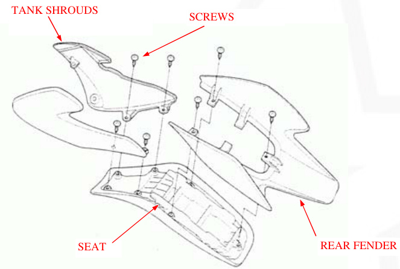

# DISASSEMBLY / ASSEMBLY

# FRONT FENDER

Remove the three bolts and the front fender. Installation is in the reverse order of removal.

# EXHAUST SYSTEM

## WARNING

Serious burns may result if the exhaust system is not allowed to cool before components are removed or serviced.

## REMOVAL / INSTALLATION

- Remove the seat assembly (page 2-2).
- Remove the exhaust pipe joint nuts.
- Remove the mounting bolt and the muffler.
- Remove the exhaust pipe joint gasket.

For spark arrester maintenance, refer to page 3-17.

Install a new joint gasket into the exhaust port. Set the exhaust pipe onto the engine by aligning the exhaust pipe flange with the cylinder head studs, then install the joint nuts and the mounting bolt.

Tighten the joint nuts.

Tighten the mounting bolt.

**TORQUE:** 26N.m (2.7kgf.m, 20lbf.ft).

Install the seat assembly (page 2-2).

# FRAME / BODY PANELS / EXHAUST SYSTEM

## SIDE STAND

### REMOVAL

Support the motorcycle securely with a hoist or equivalent. Retract the side stand and remove the following:
- Return spring
- Pivot nut
- Pivot bolt
- Side stand

### INSTALLATION

Apply grease to the side stand pivot and sliding surfaces.
Install the side stand with the pivot bolt.

Tighten the pivot bolt.

**TORQUE:** 10N.m (1.0kgf.m, 7lbf.ft)

Loosen the pivot bolt 45-90.
Install the pivot nut and tighten it while holding the pivot bolt.

Install the return spring as shown.

Check the side stand operation for freedom of movement.

# NUT AND BOLT

# MAINTENANCE

## SERVICE INFORMATION

| ITEM | SPECIFICATIONS |
|---|---|
| Sparkplug | |
| Standard | CR6HSA(NGK) |
| | U20FSR-U(DENSO)|
| For cold climate/below 41F/5C | CR5HSA(NGK) |
| | U16FSR-U(DENSO) |
| For extended high-speed riding | CR7HSA(NGK)|
| | U22FSR-U(DENSO)|

## WARNING

Gasoline iIt's extremely flammable and is explosive under certain conditions. Work in a well-ventilated area. Smoking or allowing flames or sparks in the work area or where the gasoline is stored can cause a fire or explosion.

When the engine must be running to do some work, make sure the area is well ventilated. Never run the engine in an enclosed area. The exhaust contains poisonous carbon monoxide gas that may cause loss of consciousness and lead to death. Run the engine in an open area or with an exhaust evacuation system in an enclosed area.

Place the motorcycle on level ground before starting any work.

## SPECIFICATIONS

| Item      | Specifications       |
|-----------|----------------------|
| Sparkplug |                      |
| Standard  | CR6HSA(NGK), U20FSR-U(DENSO) |
| Cold Climate | CR5HSA(NGK), U16FSR-U(DENSO) |
| High-Speed | CR7HSA(NGK), U22FSR-U(DENSO)  |

| ITEM                 |                    |                     | SPECIFICATIONS                                     |
|----------------------|------------------- |---------------------|----------------------------------------------------|
| Engine oil capacity  | Atdraining        | Atdisassembly       | 0.6L(0.6US qt, 0.5lmp qt) 0.8L(0.8US qt, 0.7Imp qt) |
| Recommended Engine oil | MANUFACTURE GN44-stroke oil or equivalent motor oil APL service classification SF or SG | |
| Engine idle speed | 1,500 ± 100 rpm | Viscosity: SAE 10W-30 | |
| Throttle grip free play | | | |
| Valve clearance | IN | 2.0-6.0mm(1/16-1/14 in) | |
|                      | EX | 0.05+0.02mm(0.002+0.001 in) | |
| Drive chain slack   | | 15-25mmmm(5/8-1 in) | |
| Drive chain size/link | | DID420MBK1/78 | |
| Brake lever free play | | 10-20mm(3/8-13 13/16 in) | |
| Brake pedal free play | 10-20mm(3/8-13 13/16 in) | | |
| TORQUE VALUES | | | |
| Fuel valve mounting bolt | 9N.m(0.9kgf.m,6.5ibf/ft) | | |
| Spark plug | 12N.m(1.2kgf.m,9ibf.ft) | | |
| Valve adjuster hole cap | | 12N.m(1.2kgf.m,9ibf.ft) Apply engine oil to the threads | |
| Valve adjuster lock nut | 9N.m(0.9kgf.m,6.5ibf.ft), 25N.m | | |
|                    | m(2.5kgf.m,18ibf.ft) |                       |                                                     |
|--------------------|----------------------|-----------------------|-----------------------------------------------------|
| Oil drain bolt     |                      |                       |                                                     |
| Clutch adjuster lock nut | 12N.m(1.2kgf.m,9ibf.ft) |             |                                                     |
| Rear axle nut      | 47N.m(4.8kgf.m,35ibf.ft) U-nut |             |                                                     |

**TOOLS**
- Valve adjusting wrench, 8x10mm
- Valve adjuster B
- Spoke wrench, 4.1x4.5mm

**MAINTENANCE**

**MAINTENANCE SCHEDULE**
Perform the PRE-RIDE INSPECTION in the Owner's Manual at each scheduled maintenance period.
1. Inspect and Clean, Adjust, Lubricate or replace if necessary.
   C: Clean R: Replace A: Adjust L: Lubricate

**FREQUENCY**

Should be serviced by your dealer, unless the owner has proper tools and service data and is mechanically qualified. In the interest of safety, we recommend these items be serviced only by your dealer.

**NOTE**
Service more frequently when ridden in wet or dusty conditions.

**FUEL LINE**

Check the fuel line for deterioration, damage or leakage.
Replace the fuel line if necessary.

**FUEL STRAINER SCREEN**

**WARNING**

Gasoline is extremely flammable and is explosive under certain conditions. Work in a well ventilated area. Smoking where the gasoline is stored can cause a fire or explosion.
Wipe spilled gasoline at once. Turn the fuel valve OFF.

Disconnect the fuel tube. Place a drain pan under the fuel tube and turn the fuel valve ON to drain the fuel tank.

After the tank has drained completely, remove the two bolts and collars, and remove the fuel valve and strainer screen.

Wash the fuel strainer screen in non-flammable or high flash solvent.

Check the O-ring is in good condition, reinstall the fuel valve.

Tighten the fuel valve mounting bolts to the specified torque.

TORQUE: 9N.m (0.9kgf.m, 6.5lbf.ft) After installation, check for fuel leaks.

# THROTTLE OPERATION

Check for smooth throttle grip full opening and automatic full closing in all steering positions. Check the throttle cable and replace it if it is deteriorated, kinked, or damaged. Lubricate the throttle cable if throttle operation is not smooth. Measure the free play at the throttle grip flange.

FREE PLAY: 2.0~4.0mm (1/16~3/16 in)

# MAINTENANCE

Throttle grip free play can be adjusted at the upper end of the throttle cable.

Remove the dust cover from the adjuster. Adjust the free play by loosening the lock nut and turning the adjuster. Tighten the lock nut and install the dust cover properly.

Recheck the throttle operation.

# AIR FILTER

# SPARK PLUG

## REMOVAL

Disconnect the spark plug cap. Remove the spark plug using a spark plug wrench or an equivalent. Inspect or replace as described in the maintenance schedule (page 3-3). Clean around the spark plug base with compressed air before removing and be sure that no
Debris is allowed to enter the combustion chamber.

## Inspection

Check the following and replace if necessary (recommended spark plug: page 3-1):
- Insulator for damage
- Electrodes for wear
- Burning condition
  - Dark to light brown indicates good condition.
  - Excessive lightness indicates malfunctioning ignition system or lean mixture.
  - Wet or black sooty deposit indicates over-rich mixture

## Reusing a Spark Plug

Clean the spark plug electrodes with a wire brush or special plug cleaner. Check the gap between the center and side electrodes with a wire type feeler gauge. If necessary, adjust the gap by bending the side electrode carefully.

Spark plug gap: 0.6-0.7mm (0.024-0.028 in)

## Caution

To prevent damage to the cylinder head, hand tighten the spark plug before using a wrench to tighten to the specified torque.

**Reinstall** the spark plug in the cylinder head and hand tighten, then torque it using a spark plug wrench.

Torque: 12N-m (1.2kgf.m, 9lbf.ft)

# Replacing a Spark Plug

Set the plug gap to specification with a wire type feeler gauge (see previous page).

**Caution:** Do not over-tighten the spark plug.

Install and hand tighten the new spark plug, then tighten it about 1/2 of a turn after the sealing washer contacts the seat of the plug hole.

Install the spark cap.

## Valve Clearance Inspection

Remove the valve adjuster hole caps.

Inspect and adjust the valve clearance while the engine is cold (below 95 F/35C).

Remove the left crankcase cover (page10-2).

Turn the crankshaft counterclockwise and align the "T" mark on the flywheel with the index notch on the left crankcase. Make sure the piston is at TDC (Top Dead Center) on the compression stroke. This position can be obtained by confirming that there is slack in the rocker arm. If there is no slack, rotate the crankshaft one full turn counterclockwise and match up the "T" mark again.

## Maintenance

Check the valve clearance by inserting a feeler gauge between the valve adjusting screw and valve stem. Valve clearance in/ex: 0.05 0.02mm (0.002 0.001in)

## Adjustment

Adjust by loosening the lock nut and turning the adjusting screw until there is a slight drag on a feeler gauge. Hold the adjusting screw and tighten the nut.

Tools:

Valve adjusting wrench, 8x9mm 07708-0030100 (equivalent commercially available in U.S.A) 07708-0030400 or 07908-KE90200

Valve adjuster B

Torque: 9.N.m (0.9kgf.m, 6.5lbf.ft)

Recheck the valve clearance.

Check the valve adjuster hole cap O-ring is in good condition, replace if necessary. Coat the O-ring with clean engine oil and install them in the valve adjuster hole caps. Apply clean engine oil to the threads. Install and tighten the valve adjuster hole caps to the specified torque.

Torque: 12N.m (1.2kgf-m, 9lb.ft)

Install the left crankcase cover (page 10-8).

## Engine Oil Level Inspection

Support the motorcycle in an upright position on level ground. Remove the oil filler cap/dipstick and wipe it clean. Check the oil level by inserting.Place the oil filler cap/dipstick into the oil filler hole without screwing it in.

## MAINTENANCE
The engine contains a sufficient amount of oil if the oil level is between the upper and lower level marks on the dipstick.
If the level is near or below the lower level mark, fill with the recommended oil up to the upper level mark.

## RECOMMENDED ENGINE OIL
4-stroke oil or equivalent motor oil API service classification: SF or SG Viscosity 10W-30

## NOTE
Other viscosities shown in the chart may be used when the average temperature in your riding area is within the indicated range.
Reinstall the filler cap/dipstick.

## ENGINE OIL CHANGE

## WARNING
When the engine must be running to do some work, make sure the area is well-ventilated. Never run the engine in an enclosed area.

Exhaust contains poisonous carbon monoxide gas that may cause loss of consciousness and lead to death. Run the engine in an open area or with an exhaust evacuation system in an enclosed area.

Warm up the engine
Stop the engine and remove the oil filler cap/dipstick and drain bolt.
Drain the oil completely.

Used oil may cause skin cancer if repeatedly left in contact with the skin for prolonged periods. Although this is unlikely unless you handle used oil on a daily basis. It is still advisable to thoroughly wash your hands with soap and water as soon as possible after handling used oil. KEEP OUT OF REACH OF CHILDREN.

# MAINTENANCE

Check that the sealing washer on the drain bolt is in good condition, replace if necessary.
Install and tighten the drain bolt.

TORQUE: 25N.m (2.5kgf-m, 18lbf.ft)

Fill the crankcase with recommended engine oil (page 3-8)

# OIL CAPACITY

0.6L (0.6USqt, 0.5lmp qt) at draining
0.8L (0.8USqt, 0.7lmp qt) at disassembly

Install the oil filler cap/dipstick

Start the engine and let it idle for 2 to 3 minutes.
Stop the engine and recheck the oil level.
Make sure there are no oil leaks.

# ENGINE OIL STRAINER SCREEN CLEANING

Remove the right crankcase cover (page 9-3)

Remove the oil strainer screen and the sealing rubber
Check the screen for damage and the sealing rubber for damage or deterioration.

Reinstall the oil strainer screen and right crankcase cover (page 9-17)

# ENGINE OIL CENTRIFUGAL FILTER CLEANING

Remove the right crankcase cover, ball ret# ainer, and clutch lifter lever (page 9-3)

Remove the four screws and clutch outer cover.

# MAINTENANCE

Clean the clutch outer cover and in the clutch outer cover using a clean lint-free cloth.

# CAUTION

Do not allow dust and dirt to enter the crankshaft oil passage.
Do not use compressed air.

Reinstall the clutch outer cover using a new gasket (page 9-13).

# ENGINE IDLE SPEED

# WARNING

When the engine must be running to do some work, ensure the area is well-ventilated. Never run the engine in an enclosed area. The exhaust contains poisonous carbon monoxide gas that may cause loss of consciousness and lead to death. Run the engine in an open area or with an

# Exhaust Evacuation System in an Enclosed Area

## Note

Inspect and adjust the idle speed after all other engine maintenance items have been performed and are within specifications. The engine must be warm for accurate idle speed inspection and adjustment. Warm up the engine for about ten minutes. Connect a tachometer. Turn the throttle stop screw as required to obtain the specified idle speed.

**Idle Speed:**

1. 700 ± 100 rpm

## Drive Chain Slack Inspection

### Warning

Never inspect and adjust the drive chain while the engine is running.

Turn off the engine, place the motorcycle on its side stand, and shift the transmission into neutral. Check the slack in the lower drive chain midway between the two sprockets.

**Chain Slack:**

15-25mm (5/8-1in)

### Caution

Excessive chain slack, 40mm (1-1/2in) or more, may damage the frame.

### Adjustment

Loosen the axle nut. Loosen the adjuster lock nuts and turn both adjusting nuts an equal number of turns until the correct drive chain slack is obtained. Make sure the index marks on both adjusters are aligned with the index lines on the swingarm. Tighten the rear axle nut to the specified torque.

**Torque:**

47 N.m (4.8 kgf.m, 34 lbf.ft)

Tighten both lock nuts. Recheck the drive chain slack and free wheel rotation. Check the rear brake pedal free play (page 3-15), adjust if necessary. Lubricate the drive chain. Wipe off the excess oil.

## Cleaning Inspection and Lubrication

If the drive chain becomes extremely dirty, it should be removed and cleaned prior to lubrication. Carefully remove the retaining clip with pliers. Remove the link plate and then the master link and now the drive chain can be removed from the sprockets.

## Maintenance

Clean the chain with non-flammable or high flash point solvent and wipe it dry. Be sure the chain has dried completely before lubricating. Lubricate the drive chain with #80-90 gear oil. Wipe off the excess gear oil.

Inspect the drive chain for possible damage or wear. Replace any chain tThe hat has damaged rollers, loose fitting links, or otherwise appears unserviceable.

Measure the drive chain length between a span of 41 pins (40 links) from pin center to pin center with the chain held taut and any kinked joint straightened.

**Service Limit:**

511mm (20.1in)

Installing a new chain on badly worn sprockets will cause the new chain to wear quickly. Inspect the teeth on both sprockets for wear or damage. Replace if necessary. Never use a new drive chain on worn sprockets. Both chain and sprockets must be in good condition, or the new replacement parts will wear rapidly.

## Install the Drive Chain

1. Install the drive chain onto the sprockets.
2. Install the master link and link plate.
3. Install the retaining clip so that its open end is opposite the normal rotation of the chain.

## Drive Chain Slider

Check the drive chain slider for wear or damage.

## Maintenance

Replace the drive chain slider if the wear limit guide lug is worn out or it has been damaged.

### Front Brake

Measure the front brake lever free play at the tip of the lever. FREE PLAY: 10-20mm (3/8-13/16 in).

### Rear Brake

Check the brake pedal free play. FREE PLAY: 10-20mm (3/8-13/16 in).

Adjust the brake pedal free play by turning the adjusting nut.
Make sure the cutout on the adjusting nut is seated on the joint pin.

### Clutch System

If the clutch does not operate properly, adjust by doing the following:
Loosen the clutch adjuster lock nut and turn the adjusting bolt one full turn counterclockwise.

## Side Stand

Support the motorcycle on a level surface.
Check the side stand spring for damage or loss of tension.
Check the side stand assembly for freedom of movement and lubricate the side stand pivot if necessary.

## Suspension Warning

Loose, worn, or damaged suspension parts impair motorcycle stability and control. Repair or replace any damaged components before riding. Riding a motorcycle with faulty suspension increases your risk of an accident and possible injury.

### Front Suspension Inspection

Refer to section 12 for fork service.

## Maintenance

### Rear Suspension Inspection

Support the motorcycle on a safety stand or box and raise the rear wheel off the ground.
Hold the swingarm and move the rear wheel sideways with force to see if the wheel bearings are worn.
Check for worn or loose suspension pivot components by grabbing the swingarm and attempting to move the swingarm side to side.
Check each fastener on the swingarm and shock absorber, if any looseness is noted.
Check the action of the shock absorber by compressing it several times.
Check the entire shock absorber assembly for signs of leaks, damage, or loose fasteners.
Replace damaged components which cannot be repaired. Tighten all nuts and bolts.
Refer to se# Section 13 for Shock Absorber and Swingarm Service.

# MAINTENANCE

## Wheels/Tyres Recommended Tyre Pressure and Tyre Size

|||Front|Rear|
|---|---|---|---|
|Tyre Pressure kPa (kgf/cm2, psi)|175(1.75,15)|175(1.75,18)|

Tyre pressure should be checked when the tyres are cold. Check the tyres for cuts, embedded nails, or other damage. Check the front and rear wheel for trueness (refer to section 12 and 13). Measure the tread depth at the center of the tyres. Replace the tyres when the tread depth reaches the following limits. Minimum tread depth: Front/Rear: 3.0mm (0.12in).

## Tool: Spoke Wrench, 4.1*4.5 mm 07701-0020100

# Steering Head Bearings

Support the motorcycle securely and raise the front wheel off the ground. Check that the handlebar moves freely from side to side. If the handlebar moves unevenly, binds, or has vertical movement, inspect the steering head bearing (pages 12-15). Check that the control cables do not interfere with handlebar rotation.

# Lubrication System Diagram

|Lubrication System Diagram|Troubleshooting|
|---|---|
|Service Information|Oil Pump|

When the engine must be running to do some work, make sure the area is well-ventilated. Never run the engine in an enclosed area. The exhaust contains poisonous carbon monoxide gas that may cause loss of consciousness and lead to death. Run the engine in an open area or with an exhaust evacuation system in an enclosed area. Used engine oil may cause skin cancer if repeatedly left in contact with the skin for prolonged periods. Although this is unlikely unless you handle used oil on a daily basis, it is still advisable to thoroughly wash your hands with soap and water as soon as possible after handling used oil. Keep out of reach of children.

The oil pump can be serviced with the engine installed in the frame. The service procedures in this section must be performed with the engine oil drained. If any portion of the oil pump is worn beyond the specified service limits, replace the oil pump as an assembly. After the oil pump has been installed, check that there are no oil leaks.

## Specifications

|Item|Standard|Service Limit|
|---|---|---|
|Engine oil capacity|||

# Troubleshooting

## Engine oil level too low or high oil consumption

- Oil contamination
- Normal oil consumption
- External oil leak
- Worn piston ring or incorrect piston ring installation
- Worn cylinder
- Worn valve guide or stem seal
- Oil pump worn or damaged
- Oil not changed often enough
- Worn piston ring or incorrect piston ring installation
- Worn valve guide or stem seal
- Clogged oil strainer screen

# LUBRICATION SYSTEM

## OIL PUMP

### REMOVAL
Remove the clutch assembly (page 9-4)

When the oil pump is ready to be disassembled, loosen the pump cover screws. Remove the three screws and oil pump assembly.

### DISASSEMBLY
Remove the three screws and oil pump cover. Remove the oil pump shaft, then remove the inner and outer rotors from the oil pump body.

### INSPECTION
Temporarily install the outer and inner rotors into the oil pump body.
Install the oil pump shaft.
Measure the tip clearance between the inner and outer rotors.

If any portion of the oil pump is worn beyond the specified service limit, replace the oil pump as an assembly.
SERVICE LIMIT: 0.20mm (0.008in)
Measure the pump body clearance between the outer rotor and pump body.
SERVICE LIMIT: 0.12mm (0.005in)

### ASSEMBLY

Install the inner and outer rotors into the oil pump body. Install the oil pump shaft aligning the flat surfaces of the shaft and inner rotor.
Fill the oil pump with 0.5-1cm3 of engine oil.

Install the oil pump cover and tighten the screws to the specified torque.
TORQUE: 5N.m (0.5kgf.m, 3.6lbf.ft)

### INSTALLATION

Install the rotor shaft collar into the crankcase. Install a new gasket onto the oil pump body.

Install the oil pump into the crankcase while aligning the pump shaft groove with the cam chain guide spindle lug.

Install and tighten the three screws to the specified torque.

TORQUE: 8N.m (0.8kgf.m, 5.8ibf.ft)

Install the clutch assembly (page 9-12)

# 5. Fuel System

| SERVICE INFORMATION | CARBURETOR ASSEMBLY |
|---------------------|---------------------|
| TROUBLESHOOTING     | CARBURETOR INSTALLATION |
| AIR CLEANER HOUSING | AIR SCREW ADJUSTMENT |
| CARBURETOR REMOVAL  | CRANKCASE BREATHER |
| CARBURETOR DISASSEMBLY | |

# Service Information

## General

**WARNING**

Gasoline is extremely flammable and is explosive under certain conditions. KEEP OUT OF REACH OF CHILDREN. Bending or twisting the control cable will impair smooth operation and could cause the cable to stick or bind resulting in loss of vehicle control.

Work in a well-ventilated area. Smoking or allowing flames or sparks in the work area or where gasoline is stored can cause a fire or explosion.

Refer to section 2 for fuel tank removal and in# Installation

When disassembling fuel system parts, note the location of the O-ring. Replace them with new ones on reassembly. Before disassembling the carburetor, place a suitable container under the carburetor drain tube. Loosen the screw and drain the carburetor.

After removing the carburetor, wrap the intake port of the engine with a towel or cover it to prevent any foreign material from dropping into the engine.

## Note

If the vehicle is to be stored for more than one month, drain the float bowl. Fuel left in the float bowl may cause clogged jets, resulting in hard starting or poor drivability.

## Troubleshooting

- Engine will not start
  - Too much fuel getting to the engine
    - Air cleaner clogged
    - Flooded carburetor
  - Intake air leak
  - Fuel contaminated or deteriorated
  - No fuel to carburetor
    - Fuel strainer clogged
    - Fuel tube clogged
    - Float level maladjusted
    - Fuel tank breather tube clogged

- Engine stall, hard to start, rough idling
  - Fuel line restricted
  - Ignition malfunction
  - Fuel mixture too lean or too rich
  - Fuel contaminated or deteriorated
  - Idle speed maladjusted
  - Float level maladjusted
  - Fuel tank breather tube clogged
  - Air screw maladjusted
  - Slow circuit clogged

### Lean Mixture

- Fuel jets clogged
- Float valve faulty
- Float level too low
- Fuel line restricted
- Carburetor air vent tube clogged
- Intake air leak
- Throttle valve faulty

### Rich Mixture

- Choke lever in CLOSED position
- Float valve faulty
- Float level too high
- Air jets clogged
- Air

## Fuel System

## Air Cleaner Housing

### Removal and Installation

**NOTE:** Refer to page 3-5 for air cleaner element service

Loosen the connection tube band screw. Remove the bolt and the air cleaner housing assembly.

## Tubes

Installation is in the reverse order of removal. At installation secure the ground eyelet with the air cleaner housing mounting bolt.

## Carburetor Removal

## Throttle Valve

Loosen the carburetor top.

Remove the carburetor top and throttle valve from the carburetor.

Remove the throttle cable from the throttle valve while compressing the throttle valve spring.

Remove the jet needle retainer and jet needle.

Check the throttle valve and jet needle for scratches, wear, or damage.

## Carburetor Body

**WARNING:** Gasoline is extremely flammable and explosive under certain conditions. Work in a well-ventilated area. Smoking or allowing flames or sparks in the work area or where the gasoline is stored can cause a fire or explosion.

Loosen the drain screw and drain the fuel from the float chamber into an approved gasoline container.

Disconnect the fuel tube, air vent tube, and drain tube from the carburetor body.

Loosen the carburetor connecting tube band screw. Remove# Carburetor Disassembly

Remove the carburetor mounting bolts, carburetor, and insulator.

Remove the screws and float chamber.

Remove the float pin, float, and float valve. Inspect the float for deformation or damage.

Inspect the float valve seat for scores, scratches, clogging, and damage. Check the tip of the float valve where it contacts the valve seat for stepped wear or contamination. Replace the valve if the tip is worn or contaminated. Check the operation of the float valve.

Remove the following:
1. Main jet
2. Needle jet
3. Throttle stop screw and spring

Turn the air screw in and carefully count the number of turns until it seats lightly. Make a note of this for use as a reference when reinstalling the air screw.

Remove the air screw and spring.

**CAUTION:**

Damage to the air screw seat will occur if the air screw is tightened against the seat.

Inspect each jet for wear or damage and replace if necessary.
Clean the jets with cleaning solvent and blow with compressed air.

# Fuel System

Blow open each air and fuel passage in the carburetor body with compressed air.

Install the following:
- Throttle stop screw and spring
- Needle jet
- Main jet

**CAUTION**

Handle all jets with care. They can easily be scored or scratched.

Install the air screw with the spring and return it to its original position as noted during removal. Perform the air screw adjustment procedure if a new air screw is installed (page 5-10).

Hang the float valve onto the float arm lip. Install the float and float valve in the carburetor body, then install the float pin through the body and float.

# Float Level Inspection

**NOTE:**

Set the float level gauge so that it is perpendicular to the float chamber face and in line with the main jet.

With the float valve seated and the float arm just touching the valve, measure the float level with the special tool as shown.

- FLOAT LEVEL: 19mm (0.75in)
- TOOL: Carburetor float level gauge 07401-001000

The float cannot be adjusted.
Replace the float assembly if the float level is out of specification. Install a new o-ring into the carburetor groove properly.
Install the float chamber.

Install and tighten the float chamber screws.

# Fuel System

CARBURETOR INSTALLATION CARBURETOR BODY

Install new o-ring into the insulator and carburetor body grooves.

INSULATOR

Install the carburetor body into the air cleaner connection tube and the insulator between the manifold and carburetor, then install the mounting bolts.
Tighten the connecting tube band screw and mounting bolts.

TORQUE:

- Connecting tube: 1N.m (0.1kgf.m, 0.7lbf.t)

# Fuel System

Install the jet needle into the throttle valve and secure it with the needle clip retainer.

Check the seal ring is in good condition, replace if necessary. Install the throttle valve spring onto the throttle cable.

Connect throttle cable to the throttle valve while compressing the throttle valve spring.

Install the throttle valve into the carburetor body, aligning its cut-out with the throttle stop screw.

# 6. ENGINE REMOVAL AND INSTALLATION

## SERVICE INFORMATION

GENERAL

During engine removal and installation, support the motorcycle securely using a hoist or equivalent. Support the engine using a jack or other adjustable support for ease of engine hanger bolts removal. The following components can be serviced with the engine installed in the frame:

1. alternator/cam chain tensioner (section 10)
2. clutch (section 9)
3. cylinder/piston (section 8)
4. cylinder head/valves (section 7)
5. gearshift linkage (section 9)
6. oil pump (section 4)

The crankshaft, transmission, and kickstarter require engine removal for service (section 11).

## SPECIFICATIONS

ITEM | SPECIFICATIONS |
--------------|----------------|
Engine dry weight | 21kg (46.3lbs)

## TORQUE VALUES

- Drive sprocket fixing plate bolt: 12N.m (1.2kgf.m, 9lbf.ft)
- Engine hanger nut (upper): 31N.m (3.2kgf.m, 23lbf.ft)
- Engine hanger nut (lower): 31N.m (3.2kgf.m, 23lbf.ft)

## ENGINE REMOVAL

Drain the engine oil (page 3-9).
Remove the following:
- exhaust system (page 2-5)
- left crankcase cover (page 10-2)

Disconnect the following:
- spark plug cap
- crankcase breather tube

Remove the following from the clamp:
- carburetor drain tube

Loosen the rear axle nut and drive chain adjusters to loosen the drive chain (page 3-12)

Remove the following:
- fixing plate bolts
- fixing plate
- drive sprocket
- intake manifold bolts
- O-ring

- brake pedal return spring
- four bolts and foot peg bar

Support the motorcycle securely.

## ENGINE# REMOVAL AND INSTALLATION

### Engine Hanger Nuts and Washers

Place the floor jack or other adjustable support under the engine.

Remove the hanger bolts and the engine from the frame.

## CAUTION

During engine assembly removal, hold the engine securely and be careful not to damage the frame and engine.

## ENGINE INSTALLATION

Install the engine into the frame in the reverse order of removal.

## NOTE

- Note the installation of the hanger bolts. All bolts are installed from the left side.
- The jack height must be continually adjusted to relieve stress from the hanger bolts.

Tighten the hanger nuts to the specified torque.

TORQUE: 31N-m (3.2kgf-m, 23lbf-ft)

Install the removed parts from the engine removal procedure (page 6-2 to 6-3) in the reverse order of removal.

## NOTE

- Replace the intake manifold O-ring with a new one.
- Note the installation of the brake pedal return spring.

TORQUE: Fixing plate bolt: 12N-m (1.2kgf-m, 9lbf-ft)

Install the following:

1. left crankcase cover (page 10-8)
2. exhaust system (page 2-5)

Adjust the drive chain slack (page 3-12)

Fill with the recommended engine oil (page 3-9)

# CYLINDER HEAD/VALVES

SERVICE INFORMATION

|  |  |
|--|--|
|CAMSHAFT REMOVAL|
|TROUBLESHOOTING|
|CYLINDER HEAD|
|CYLINDER COMPRESSION |
|CAMSHAFT INSTALLATION|

# SERVICE INFORMATION

## GENERAL

This section covers service of the cylinder head, valves, and camshaft.

The cylinder head, valves, and camshaft services can be done with the engine installed in the frame. When disassembling, mark and store the disassembled parts to ensure that they are reinstalled in their original locations.

Clean all disassembled parts with cleaning solvent and dry them off with compressed air before inspection.

Camshaft lubricating oil is fed through oil passages in the cylinder head. Clean the oil passages before assembling the cylinder head.

Be careful not to damage the mating surfaces when removing the cylinder head cover and cylinder head.

Refer to section 10 for cam chain tensioner service.

# SPECIFICATIONS

| ITEM | STANDARD |
| ---- | -------- |
| Cylinder compression | 981-1,177 kpa (10.0-12.0 kgf/cm2, 142-17lpsi) at 1,000 rpm |
| Cylinder head warpage IN | 0.05±0.02 (0.002±0.001) |
| Valve, valve guide |
| Valve clearance Valvestem O.D EX | 0.05±0.02 (0.002±0.001) |
| Valve clearance Valvestem O.D IN | 4.970-4.985 (0.1957-0.1963) |
| Valve guide I.D. EX | 4.955-4.970 (0.1951-0.1957) |
| Valve guide I.D. IN/EX | 5.000-5.012 (0.1969-0.1973) |
| Stem-to-guide clearance IN EX | 0.015-0.042 (0.0006-0.0017) 0.030-0.057 (0.0012-0.0022) |
| Valve seat width | 1.0-1.3 (0.04-0.05) |
| Valve spring free length IN/EX(1) | 32.78 |
| Rocker arm/shaft Rocker arm I.D. IN/EX(D) | 35.55 10.000-10.| 015 (0.3937-0.3943) |
|---|---|
| Rocker arm shaft O.D. IN/EX | 9.978-9.987 (0.3928-0.3932) |
| Camshaft Cam lobe height 90/110cc | IN 26.563-26.683 (1.046-1.051) |
| Camshaft Cam lobe height 90/110cc | EX 26.326-26.446 (1.036-1.041) |
| Camshaft Cam lobe height 125cc | IN 26.507-26.637 (1.044-1.048) |

11N.m (1.1 kgf.m, 8 lbf.ft)
10N.m (1.0 kgf.m, 7 lbf.ft)
9N.m (0.9 kgf.m, 6.5 lbf.ft)

# CYLINDER HEAD/VALVES

## TOOLS

| Tool                           | Part Number     |
|-------------------------------|---------------|
| Valve spring compressor          | 07757-001000  |
| Valve spring compressor attachment | 07959-KM30101 |
| Valve guide reamer,5.0mm         | 07742-MA60000 |
| Valve guide reamer,5.0mm         | 07984-MA60001 or 07984-MA6000C (U.S.A. Only) |
| Seat cutter,24mm(45.IN)         | 07780-0010600 |
| Seat cutter,20.5mm(45.EX)        | 07780-0011000 |
| Flat cutter,24mm(32.IN)         | 07780-0012500 |
| Flat cutter,21.5mm(32.EX)       | 07780-0012800 |
| Interior cutter.22mm(60IN/EX)  | 07780-0014202 or 07781-0010400|

## TROUBLESHOOTING

Engine top-end problems usually affect engine performance. These problems can be diagnosed by a compression gauge or by tracing engine noises to the top-end with a sounding rod stethoscope.
If the performance is poor at low speeds, check for white smoke in the crankcase breather tube. If the tube is smoky check for a seized piston ring (Section 8).

## Compression too low, hard starting or poor performance at low speed

### Valves

1. Incorrect valve clearance
2. Burned or bent valve
3. Incorrect valve timing
4. Broken valve spring
5. Uneven valve seating

### Cylinder head

- Leaking or damaged head gasket
- Warped or cracked cylinder head
- Worn cylinder, piston or piston rings (section 8)

## Compression too high, overheating or knocking

Excessive carbon build-up on piston crown or on combustion chamber

## Excessive noise

### Cylinder head

- Incorrect valve clearance
- Sticking valve or broken valve spring
- Damaged or worn camshaft
- Loose or worn cam chain
- Worn or damaged cam chain tensioner
- Worn cam sprocket teeth
- Worn rocker arm and/or shaft
- Worn cylinder, piston or piston rings (section 8)

## Rough idle

Low cylinder compression

## Excessive smoke

### Cylinder head

- Worn valve stem or valve guide
- Damaged stem seal
- Worn cylinder, piston or piston rings (section 8)

## CYLINDER COMPRESSION

Warm up the engine to normal operating temperature. Stop the engine and remove the spark plug (page 3-6)
Install a compression gauge.
Shift the transmission into neutral and open the choke lever (OFF).
Open the throttle all the way and crank the engine with the kickstarter until the gauge reading stops rising. COMPRESSION PRESSURE: 981-1,177 kPa (10.0-12.0 kgf/cm2, 142-171 psi) at 1,000 rpm. Low compression can be caused by:

- Blown cylinder head gasket
- Improper valve adjustment
- Valve leakage
- Worn piston ring or cylinder
- High compression# ssion

## Common Causes of Issues:
- Carbon deposits in combustion chamber or on piston head

## LEFT SIDE COVER
## CAMSHAFT REMOVAL

Drain the engine oil (page 3-9)

Remove the following:
- Valve adjuster hole cap (page 3-7)
- Left crankcase cover (page 10-2)
- Sealing bolt, tensioner spring, and tensioner push rod to
loosen the cam chain tensioner (page 10-4)

Disconnect the spark plug cap. Loosen the cylinder head side cover 6 mm bolt. Tap the head of the 6mm bolt and release the cylinder head left side cover from the cylinder head. Remove the 6mm bolt, sealing washer, and cylinder head left side cover.

Turn the crankshaft counterclockwise and align the "0" mark on the cam sprocket with the index notch on the cylinder head.

Remove the bolts, cam sprocket, and dowel pin. Secure the cam chain
with a piece of wire
to prevent it from
falling into the cylinder.

## 7. CYLINDER HEAD/VALVES

Loosen the valve adjusting screw fully to make a valve clearance maximum (page 3-8). Temporarily install the cam sprocket bolts into the camshaft and remove the camshaft from the cylinder head while holding the rocker arms.

## INSPECTION

Turn the outer race of each camshaft bearing with your finger. The outer race should turn smoothly and quietly. Also check that the bearing inner race fits tightly on the camshaft. Replace the camshaft assembly if the outer race does not turn smoothly and quietly or if it fits loosely on the camshaft.

Using a micrometer, measure each cam lobe height.

SERVICE LIMITS: 90/110/125cc :IN:26.22mm (1.032in) EX:25.98mm (1.023in)

Remove the intake manifold bolts.

Remove the following:
- Cap nuts/seating washers
- Nut/sealing washer
- Cylinder head cover
- Gasket

Remove the cylinder head mounting bolt and cylinder head.

Remove the following:
- Gasket
- Dowel pins
- Collar
- O-ring

## DISASSEMBLY

Remove the spark plug. Remove the bolts and cylinder head right side cover.

Temporarily install an 8mm bolt to the rocker arm shaft and remove the rocker arm shafts and rocker arms.

## 7. CYLINDER HEAD/VALVES

Remove the valve springs using the special tools as shown.

TOOLS: Valve spring compressor 07757--0010000. Valve spring compressor attachment 07959--KM30101

**CAUTION: To prevent loss of tension, do not compress the valve springs more than necessary to remove the cotters.**

Remove the following:
- Spring retainer
- Valve spring
- Valve
- Stem seal
- Valve spring seat
- Cotters

## INSPECTION
CYLINDER HEAD Remove carbon deposits from the combustion chamber.

## Spark Plug Hole and Valve Areas

Check for cracks in the spark plug hole and valve areas. Avoid damaging the gasket surface. Check the cylinder head for warpage with a straight edge and feeler gauge.

SERVICE LIMIT: 0.05mm (0.002 in)

## Cylinder Head/Valves

### Rocker Arm
Inspect the rocker arm slipper surfaces for wear or damage. Also, check that the oil holes are not clogged. Measure the rocker arm I.D. If either rocker arm requires service or replacement, inspectInspect the cam lobes for scoring, chipping, or flat spots.

**SERVICE LIMIT: IN/EX > 10.10mm (0.398 in)**

Inspect the rocker arm shafts for wear or damage. Measure the O.D. of the rocker arm shaft.

**SERVICE LIMIT: IN/EX: 9.91mm (0.390 in)**

#### Valve Spring

Measure the free length of the inner and outer valve springs.

**SERVICE LIMITS: IN/EX: 31.8mm (1.25 in)**

Replace the springs if they are shorter than the service limits.

#### Valve

Inspect each valve for bending, burring, or abnormal stem wear. Check valve movement in the guide. Measure and record each valve stem O.D.

**SERVICE LIMIT: IN/EX: 4.92mm (0.194 in)**

Ream the guides to remove any carbon deposits before measuring the guide. Insert the reamer from the combustion chamber side of the head and always rotate the reamer clockwise.

**TOOL: Valve guide reamer, 5.0 mm 07984--MA60001 or 07984--MA6000C (U.S.A only)**

Measure and record each valve guide I.D.

**SERVICE LIMIT: IN/EX: 5.03mm (0.198 in)**

Subtract each valve stem O.D. from the corresponding guide I.D. to obtain the stem-to-guide clearance.

**SERVICE LIMITS: IN: 0.08mm (0.003in), EX: 0.10mm (0.004in)**

If the stem-to-guide clearance is out of specification, determine if a new guide with standard dimensions would bring the clearance within tolerance. If so, replace any guides as necessary and ream to fit. If the stem-to-guide clearance is out of specification with a new guide, also replace the valve. Reface the valve seats whenever the valve guides are replaced (page 7-9).

### Valve Guide Replacement

Chill new valve guides in the freezer section of a refrigerator for about an hour. Heat the cylinder head to 212-302°F (100-150°C) with a hot plate or oven.

**Warning**

To avoid burns, wear heavy gloves when handling the heated cylinder head.

**Caution**

Do not use a torch to heat the cylinder head; it may cause warping. Support the cylinder head and drive out the valve guides from the combustion chamber side.

**TOOL: Valve guide driver, 5.0mm, 07492-MA60000**

Coat new O-rings with engine oil and install them onto new valve guides. While the cylinder is still heated, drive the guides in the cylinder head from the camshaft side until they are fully seated.

**TOOL: Valve guide driver, 5.0mm 07942-MA60000**

Let the cylinder head cool to room temperature.

Ream the new valve guide after installation. Insert the reamer from the combustion chamber side of the head and always rotate the reamer clockwise.

**TOOL: Valve guide reamer, 5.0mm 07984-MA600001 or 07984-MA60000C**

NOTE: Use cutting oil on the reamer during this operation.

Clean the cylinder head thoroughly to remove any metal particles.
Reface the valve seat (see below)

# VALVE SEAT INSPECTION/REFACING

Clean the intake and exhaust valves thoroughly to remove carbon deposits.
Apply a light coating of Prussian Blue to the valve seats. Lap the valves and seats using a rubber hose or other hand-lapping tool. Remove and inspect the valves.
CAUTION: The valves cannot be ground. If a valve face is burned or badly worn, or if it contacts the seat unevenly, replace the valve.

Inspect the width of each valve seat.
STANDARD: 1.0 - 1.3 mm (0.04 - 0.05 in)
SERVICE LIMIT: 2.0 mm (0.08 in)

If the seat is too wide, too narrow, or has low spots, the seat must be ground.

# VALVE SEAT REFACING

Valve seat cutters/grinders equivalent valve seat refacing equipment are recommended to correct worn valve seats.

NOTE: Follow the refacing manufacturer's operation instructions.

Use a 45-degree cutter to remove any roughness or irregularities from the seat. Reface the seat with a 45-degree cutter whenever a valve guide is replaced.

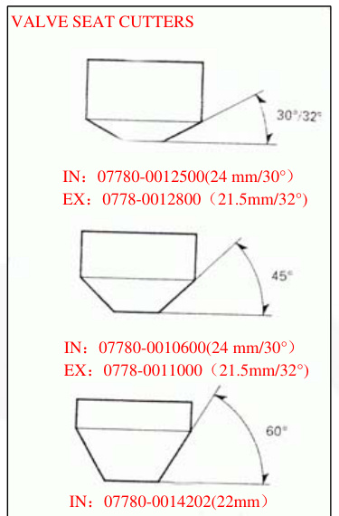

Use a 32-degree (IN:30) cutter to remove the top 1/4 of the existing valve seat material.

# CYLINDER HEAD/VALVES

Use a 60-degree cutter to remove the bottom 1/4 of the old seat. Remove the cutter and inspect the area you have refaced.
Install a 45-degree finish cutter and cut the seat to the proper width. Make sure that all pitting and irregularities are removed. Refinish if necessary.

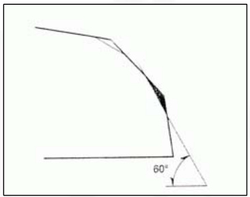

Apply a thin coating of Prussian Blue to the valve seat. Press the valve through the valve guide and onto the seat to make a clear pattern.
NOTE: The location of the valve seat in relation to the valve face is very important for good sealing. If the contact area is too high on the valve, the seat must be lowered using a 32-degree flat cutter. If the contact area is too low on the valve, the seat must be raised using a 60-degree cutter.

Refinish the seat to specifications using a 45-degree finish cutter.

# CYLINDER HEAD/VALVES

After cutting the seat, apply lapping compound to the valve face, and lap the valve using light pressure. Do not allow lapping compound to enter the guides.

After lapping, wash all residual compound off the cylinder head and valve.

# ASSEMBLY

Clean the cylinder head assembly with solvent and blow through all oil passages with compressed air.

Install the valve stems with engine oil and insert the valve into`the valve guide. To avoid damage to the stem seal, turn the valve slowly when inserting. Install the valve springs with the tightly wound coils facing the combustion chamber. Install the valve spring retainer.

# CYLINDER HEAD/VALVES

Install the valve cotters using the special tool as shown.

**TOOL:** Valve spring compressor 07757-0010000 Valve spring compressor attachment 07959-KM30101

# CAUTION

Support the cylinder head above the workbench so that the valve heads will not contact anything that can cause damage.

Apply engine oil to the rocker arm inner and slipper surfaces. Install the rocker arms and rocker arm shafts. Install the rocker arm shaft with its threaded end facing the right side.

Install a new gasket onto the cylinder head right side cover. Install the right side cover onto the cylinder head.

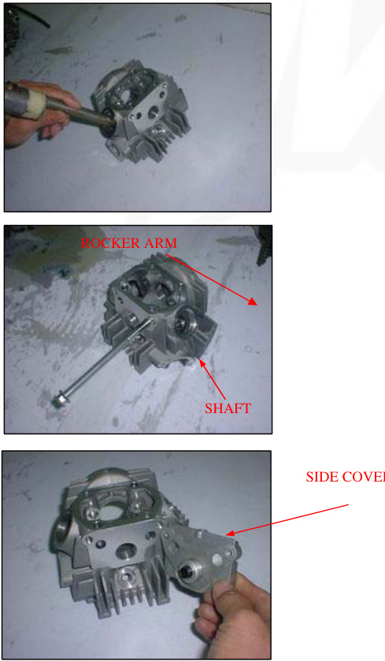

Install the right side cover bolts.

# INSTALLATION

Clean off the gasket material from the cylinder surface.

Install the following:
- New O-ring
- Collar
- Dowel
- New gasket

Route the cam chain through the cylinder head and install the cylinder head.

Install a new gasket onto the cylinder head and then install the cylinder head cover.

Install the cylinder head cover with its arrow mark facing down.

# CYLINDER HEAD/VALVES

Install the following:
- Cap nuts/new sealing washers
- Nut/new sealing washer

**NOTE:** Note the position of the washers and nuts.

Tighten the cylinder head cover nuts to the specified torque.

**TORQUE:** 11N.m(1.1 kgf.m, 8lbf.ft)

Install and tighten the cylinder head mounting bolt. If the cylinder was removed, tighten the cylinder mounting bolt. Install a new O-ring into the groove.
Move in the intake manifold.

## NUT

Install and tighten the intake manifold bolts. Install the following:

1. Spark plug (page 3-7)
2. Muffler (page 2-4)

### CAMSHAFT INSTALLATION

Apply clean engine oil to the camshaft lobes and bearings. Install the camshaft into the cylinder head with its cam lobes facing the combustion chamber while holding the rocker arms.

## CYLINDER HEAD/VALVES

Turn the crankshaft counterclockwise and align theAlign the "T" mark with the index notch on the left crankcase.

## CYLINDER HEAD/VALVES

Install the tensioner push rod, spring, and sealing bolt (page 10-5).

Adjust the valve clearance (page 3-7). Pour the recommended engine (page 3-9).

## CYLINDER/PISTON

| SERVICE INFORMATION | CYLINDER/PISTON INSPRCTION |
|---------------------|----------------------------|
| TROUBLESHOOTING     | PISTON INSTALLATION        |
| CYLINDER REMOVAL    | CYLINDER INSTALLATION      |
| PISTON REMOVAL      |                            |

## SERVICE INFORMATION

### GENERAL

The cylinder and piston service can be done with the engine installed in the frame. Camshaft lubrication oil is fed to the cylinder head through an orifice in the cylinder head, cylinder, and crankcase. Make sure that the orifice is not clogged and that the O-ring and dowel pins are in place before installing the cylinder.

### SPECIFICATIONS

| ITEM | STANDARD |
|------|----------|
| Cylinder | 39.005-39.015(1.5356-1.5360) |
| Out of round | |
| Taper | |
| Warpage Piston mark direction | |
| Piston rings | "IN" mark facing toward the intake side |
| | Piston O.D. measurement point Piston pin bore I.D. 8mm(0.3in) from bottom of skirt 13.002-13.008(0.5119-0.5121) |
| | Piston pin O.D. |
| | Piston-to-piston pin clearance 12.994-13.000(0.5116-0.5118) 0.002-0.014(0.0001-0.0006) |
| | Piston ring-to-ring Top/Second 0.015-0.050(0.0006-0.0020) |
| Parameter | Measurement Range |
|-----------|-------------------|
| Groove Clearance | Piston ring end gap |
| Top Second | 0.05-0.15(0.002-0.0016) |
| Oilsiderail | 0.05-0.20(0.002-0.0016) |
| Cylinder-to-piston clearance | 0.3-0.9(0.01-0.04) 0.010-0.040(0.0004-0.0016) |
| Connectingrod small end I.D Connectingrod-to-pistonpinclearance | 13.016-13.034(0.5124-0.5131) |
| | 0.016-0.040(0.0006-0.0016) |

## TORQUE VALUES
Cam chain guide roller in bolt

## TROUBLESHOOTING

If the performance is poor at low speeds, check for white smoke in the crankcase breather tube.
If the tube is smoky, check for a seized piston ring. Cylinder compression is too low, or engine is hard to start. Blown cylinder head gasket.
Worn, stuck, or broken piston ring.
Worn or damaged cylinder or piston.

**Piston sounds:**
Worn cylinder, piston, and/or piston ring.
Worn piston pin hole and piston pin.
Worn connecting rod small end.

Cylinder compression is too high, or engine overheats or knocks due to carbon deposits on the cylinder head and/or piston crown.

Excessive smoke from worn, stuck, or broken ring.# R REMOVAL

Remove the cylinder head (page 7-4)

Remove the cam chain guide roller bolt, washer, and guide roller. Remove the mounting bolt and cylinder.
Remove the following:
- Rubber packing
- Gasket
- Dowel pins

## PISTON REMOVAL

Remove the piston clip with pliers.
Press the piston pin out of the piston and remove the piston.

**Note:**
Do not let the piston pin clips fall into the crankcase.

Remove the piston rings.
Do not damage the piston rings during removal.

**SERVICE LIMIT:** 39.05mm(1.537in)

## CYLINDER/PISTON INSPECTION

Inspect the cylinder bore for wear or damage.
Measure the cylinder I.D. in X and Y axis at three levels.
Take the maximum reading to determine the cylinder wear. Calculate the piston-to-cylinder clearance.
Take a maximum reading to determine the clearance.
Refer to page 8-5 for measurement of piston O.D.

**SERVICE LIMIT:** 0.15mm(0.006in)
Calculate the taper and out of round at three levels in X and Y axis.
Take the maximum reading to determine them.
**SERVICE LIMIT:** Taper: 0.10mm(0.004in) Out of round: 0.10mm(0.004in)

The cylinder must be rebored, and an oversized piston fitted if the service limits are exceeded.

The following oversize pistons are available:
0.25mm(0.010in)
0.50mm(0.020in)

The piston-to-cylinder clearance for the oversize piston must be: 0.010-0.040mm(0.0004-0.0016in).

Inspect the top of the cylinder for warpage.

SERVICE LIMIT: 0.05mm(0.002in)

Remove any carbon deposits from the piston ring grooves, using an old piston ring as shown.

# CYLINDER/PISTON

Temporarily install the piston to their proper position with the mark facing up.

Measure the piston ring-to-ring groove clearance with the rings pushed into the grooves.

SERVICE LIMITS:
Top: 0.12mm(0.005in)
Second: 0.12mm(0.005in)

Inspect the piston for wear or damage.

Measure the diameter of the piston at 8mm(0.3in) from the bottom and 90 degrees to the piston pin hole.

SERVICE LIMIT: 38.90mm(1.531in)

Measure the piston pin bore.
SERVICE LIMIT: 13.06mm(0.514in)

Measure the O.D. of the piston pin.
SERVICE LIMIT: 12.98mm(0.511in)

Calculate the piston-to-piston pin clearance.
SERVICE LIMIT: 0.08mm(0.003in)

Measure the connecting rod small end I.D.
SERVICE LIMIT: 13.08MM(0.515in)

Calculate the connecting rod-to-piston pin clearance.
SERVICE LIMIT: 0.12mm(0.005in)

Insert the piston rings squarely into the bottom of the cylinder and measure the ring end gap.

SERVICE LIMITS:
Top: 0.5mm(0.02in)
Second: 0.5mm(0.02in)
Oil side rail: 1.1mm(0.04in)

Push the ring into the cylinder with the top of the piston to be sure they are squarely in the cylinder.

# PISTON RING INSTALLATION

Clean the piston ring grooves thoroughly and install the piston rings.

**NOTE:**

- Apply oil to the piston rings.
- Avoid piston and piston ring damage during installation.
- Install the piston rings with their marking facing up.
- Do not confuse the top and second rings.
- Space the piston ring end gaps 120 degrees apart.
- Do not align the gaps in the oil rings side rails.

After installation, the rings should rotate freely in the ring grooves.

# PISTON INSTALLATION

Apply oil to the piston pin outer surface.
Install the piston with its "IN" mark facing the intake side.
Install the piston pin and secure it with new piston pin clips.

**NOTE:**

- Do not align the piston pin clips end gap with the piston cut-out.
- Do not let the piston pin clips fall into the crankcase.

# CYLINDER INSTALLATION

Clean off any gasket materials from the crankcase surface.

Install the dowel pins, new gasket, and new rubber packing.

Coat the cylinder bore, piston outer surface, and piston ring grooves with clean engine oil. Route the cam chain through the cylinder and install the cylinder while compressing the piston rings.

NOTE: Avoid piston ring damage during installation. Do not let the cam chain fall into the crankcase.

Apply engine oil to the guide roller inner surface.
Install the cam chain guide roller, new sealing washer, and pin bolt.
Tighten the cam chain guide roller pin bolt to the specified torque.

TORQUE: 10N.m (1.0kgf.m, 7lbf.ft)

Install the cylinder mounting bolt but do not tighten it yet.
Install the cylinder head (page 7-14).

# SERVICE INFORMATION

## GENERAL

This section covers service of the clutch and gearshift linkage. All service can be done with the engine installed in the frame.

Use care not to allow dust or dirt to enter the engine.

Transmission oil viscosity and level have an effect on clutch disengagement. When the clutch does not disengage or the motorcycle creeps with the clutch disengaged, inspect the transmission oil level before servicing the clutch system.

## SPECIFICATIONS

| ITEM                            | STANDARD                | SERVICE LIMIT      |
|---------------------------------|-------------------------|--------------------|
| Clutch disc thickness A         | A: 1.52-1.68 (0.060-0.066) | 1.3 (0.051)         |
|                                 | B: 3.42-3.58 (0.135-0.141) | 3.2 (0.126)         |
| Clutch plate warpage             |                         | 0.20 (0.008)        |
| Centrifugal clutch spring free length | 19.5 (0.77) : 20 (0.79) |                    |
| Pri| Part                            | Measurement (in mm and inch)                   | Actual Measurements (in mm and inch)   |
| ------------------------------- | --------------------------------------------- | ------------------------------------- |
| Mary drive gear                | 21.0000-21.021 (0.8268- 0.8276)               | 19.4 (0.76)                           |
| Clutch center guide            | L.D 16.988-17.006 (0.6688-0.6695) O.D 20.930-20.950 (0.8240-0.8248) | 21.05 (0.829) 17.04 (0.671) |
| Crankshaft O.D. at clutch center guide | 16.966-16.984 (0.6680-0.6687)              | 20.9 (0.823) 16.9 (0.665)             |

## TORQUE VALUES

- Clutch outer cover screw: 5N.m (0.5kgf.m, 3.6lbf.ft)
- Clutch lock nut
- Clutch assembly screw
- Shift drum stopper arm bolt
- Shift return spring pin bolt
- Gearshift cam plate bolt: 42N.m (4.3kgf.m, 31lbf.ft)

| bf.ft | Torque Values                                    |
| ----- | ------------------------------------------------ |
|       | 6 N.m (0.5 kgf.m, 3.6 lbf.ft)                   |
|       | 13 N.m (1.3 kgf.m, 9 lbf.ft)                    |
|       | 29 N.m (3.0 kgf.m, 22 lbf.ft)                   |
|       | 17 N.m (1.7 kgf.m, 12 lbf.ft)                   |

## TOOLS

- Flywheel holder
- Lock nut wrench, 20x24mm
- Extension bar
  - 07725-0040000
  - 07716-0020100
  - 07716-0020500

## CLUTCH / GEARSHIFT LINKAGE TROUBLESHOOTING

### Clutch slips when accelerating

- Incorrect clutch adjustment
- Worn clutch disc
- Weak clutch spring
- Faulty clutch weight
- Transmission oil mixed with molybdenum or graphite additive

### Hard to shift

- Incorrect clutch adjustment
- Loose stopper plate bolt
- Damaged stopper plate bolt
- Damaged stopper plate and pin

### Motorcycle creeps with clutch disengaged

- Incorrect clutch adjustment
- Clutch plate warped
- Faulty clutch lifter
- Faulty clutch weight
- Incorrect engine oil weight

### Transmission jumps out of gear

- Worn shift drum stopper arm
- Weak or broken shift arm return spring
- Loose stopper plate bolt

### Gearshift pedal will not return

- Weak or broken gearshift spindle return
- Bent gearshift spindle

## RIGHT CRANKCASE COVER REMOVAL

- Drain the engine oil (page 3-9)
- Remove the foot peg bar (page 6-3)
- Remove the bolt kickstarter pedal
- Unhook the brake pedal return spring
- Loosen the rear brake pedal adjusting nut and lower the brake pedal
- Remove the eight bolts and right crankcase cover

- Remove the gasket and dowel pins
- Remove the clutch adjusting nut, washer, and O-ring
- Remove the clutch lifter/adjusting bolt assembly

- Check the kickstarter oil seal for damage, replace if necessary

## REMOVAL

- Remove the ball retainer and spring
- Remove the clutch lifter lever

## CLUTCH

- Remove the oil through and spring
- Remove the clutch lifter cam plate

- Remove the screws and clutch outer cover and bearing
- Straighten the tab of the lock washer
- Hold the clutch outer with the flywheel holder and remove the lock nut using the special tools as shown

TOOLS: 07725-0040000 Flywheel holder

![Image 4](../../../static/img/90bc06503b5b12cb6831Extension bar
- 07716-0020100
- 07716-0020500

- Remove the lock washer B, 14mm lock washer, and clutch assembly
- Remove the primary drive gear

## CLUTCH / GEARSHIFT LINKAGE

- Remove the clutch center guide
- Remove the snap ring and primary driven gear from the mainshaft
- Remove the collar from the crankshaft

## DISASSEMBLY

- Remove the following
  - Set ring
  - Clutch plate B
  - Clutch disc A
  - Clutch disc B
  - Clutch disc A
  - Free springs
  - Clutch plate A
- Remove the clutch center and drive gear outer

## CLUTCH / GEARSHIFT LINKAGE
- Remove the four dam

Remove the four screws and plain washers.

Remove the drive plate assembly and clutch springs.

Remove the clutch weight stopper ring.
Remove the clutch weight/center ring.

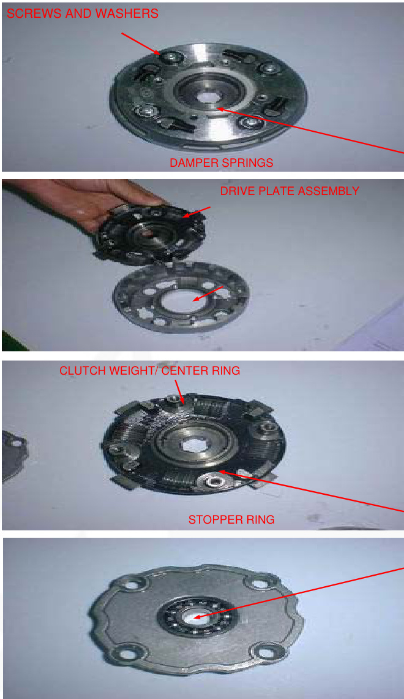

## INSPECTION

### Clutch lifter bearing

Turn the inner race of the lifter bearing with your finger. The bearing should turn smoothly and freely without excessive play.
Also check that bearing fits tightly in the clutch outer cover.
If necessary replace the bearing.

### CLUTCH / GEARSHIFT LINKAGE

### Clutch spring

1. Measure the clutch spring free length.
   - SERVICE LIMIT: 19.4mm (0.76in)

### Clutch disc

Replace the clutch discs if they show signs of scoring or discoloration.

Measure the disc thickness of disc.
- SERVICE LIMITS:
  - Clutch disc A: 2.3 mm (0.09 in)
  - Clutch disc B: 3.0 mm (0.12 in)

Check each disc plate for warpage on a surface plate using a feeler gauge.
- SERVICE LIMIT: 0.20mm (0.008in)

Primary drive gear/clutch center guide
Check the primary drive gear and clutch center guide for excessive wear or damage.
Measure the I.D. of the primary drive gear.

- SERVICE LIMIT: 21.05mm (0.829 in)
Measure the O.D. and I.D. of the clutch center guide.
- SERVICE LIMITS:
  - I.D.: 17.04mm (0.671 in)
  - O.D.: 20.90mm (0.823 in)

### CLUTCH / GEARSHIFT LINKAGE

Crankshaft Measure the crankshaft O.D at clutch center guide.
- SERVICE LIMIT: 16.90mm (0.665in)

### Drive gear outer / clutch center

Check the dive gear outer and clutch center for excessive wear or damage.

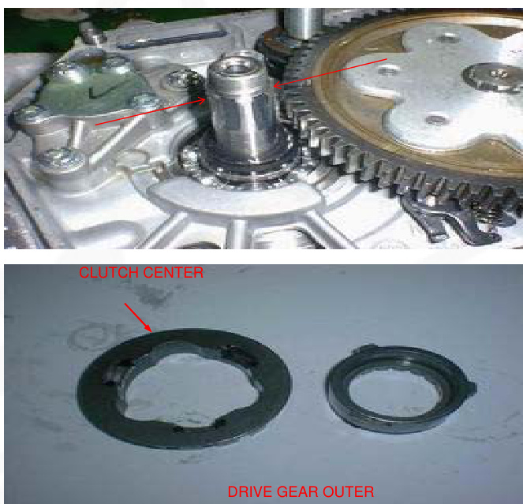

## ASSEMBLY

### CLUTCH / GEARSHIFT LINKAGE

Install the clutch weight/center ring onto the drive plate by aligning the ring end with the plate hole. Install the stopper ring by aligning the ring end with the plate groove.

Install the clutch spring onto the clutch outer holes. Install the drive plate assembly into the clutch outer aligning its bosses with the clutch springs.

Install the plain washers and screws. Tighten the screws in a crisscross pattern in 2-3 steps.

- TORQUE: 6 N.m (0.6kgf.m, 4.3 lbf.ft)

Install the damper springs as shown.

Install the drive gear outer and clutch center.

Install the following:

- Clutch plate A
- Free springs
- Clutch disc A
- Clutch disc B
- Clutch disc A
- Clutch plate B

## NOTE

Install the clutch disc

a. Install the clutch plate with its chamfered side facing the clutch disc.
b. Install the clutch set ring with its chamfered side facing the clutch plate.

# Installation

1. Install the collar onto the crankshaft.
2. Install the primary driven gear onto the mainshaft and secure it with the snap ring.
3. Apply engine oil to the clutch center guide and install it onto the crankshaft.

4. Install the clutch assembly onto the crankshaft.
5. Install a new 14mm lock washer by aligning its short tabs with the grooves in the dive plate.
6. Install the primary drive gear.
7. Install the lock washer B with its "OUT SIDE" mark facing out.

8. Install the lock nut.
   Hold the clutch outer with the flywheel holder and tighten the lock nut to the specified torque using the special tools as shown below.

**Tools:**

- Flywheel holder 07725-0040000
- Lock nut wrench, 20x24mm Extension bar 07716-0020100

**Torque:** 42N.m (4.3kgf.m, 31 lbf.ft)

If the lock nut groove does not align with the lock washer tab, further tighten the lock nut and align.

Bent up the tab of the 14mm lock washer into the groove of the lock nut.

Clean the inside of the clutch outer and outer cover (page 3-10).
Install the bearing and a new gasket onto the clutch outer cover.

# Clutch/Gearshift Linkage

- Install the clutch outer cover and tighten the screws to the specified torque.
  **Torque:** 5N.m (0.5kgf.m, 3.6lbf.ft)
- Install the clutch lifter cam plate.
- Install the oil through spring and oil through.
- Install the spring, ball retainer, and clutch lifter lever.
- Install the right crankcase cover (page 9-17).

## Gearshift Linkage Removal

- Remove the clutch and primary driven gear (page 9-4).
- Remove the bolt and gearshift pedal.

# Clutch/Gearshift Linkage

- Remove the bolt, stopper arm, and return spring.
- Pull down the gearshift arm, then pull out the gearshift spindle from the crankcase.
- Remove the bolt and shift cam plate.
- Remove the dowel pins and gearshift drum pins.

## Clutch/Gearshift Linkage Inspection

Check the gearshift spindle for bends or other damage.

- **Installation:** Install the four gearshift drum pins and two dowel pins.
- Install the cam plate and tighten the bolt to the specified torque.
- **Torque:** 17N.m (1.7kgf.m, 12lbf.ft)

Install the gearshift spindle into the crankcase by aligning the return spring ends with the spring pinwheel pushing down the gearshift arm and set the gearshift arm to the shift drum pins.

Install the return spring and stopper arm as shown and tighten the bolt to the specified torque.

**TORQUE:** 13N.m (1.3kgf.m, 9lbf.ft)

Install the gearshift pedal so that it is the same height as the foot peg.
Install the pinch bolt and tighten it.
Install the driven gear and clutch assembly (page 9-12).

# Right Crankcase Cover Installation

Install the clutch lifter plate/adjusting bolt into the right crankcase cover by aligning its pin with the hole in the crankcase cover.

Coat a new O-ring with engine oil and install it into the cover groove properly.
Install the washer and lock nut.

Install the dowel pins and a new gasket.
Install the right crankcase cover.
Install and tighten the eight cover bolts in a cross pattern in several steps.

Install the kickstarter as shown and tighten the bolt.
Hook the return spring to the brake pedal and the spring holding pin as shown.
Install the foot peg bar (page 6-4).
Adjust the brake pedal free play (page 3-15).
Pour the recommended engine oil (page 3-9).
Adjust the clutch (page 3-16).

System Diagram: 14-0
Ignition Coil: 14-6
Service Information: 14-1
Ignition Control Module: 14-6
Troubleshooting: 14-2
Engine Stop Switch/Ignition Switch: 14-7
Ignition System Inspection: 14-3
Ignition Timing: 14-7

# Service Information

# General

# Warning

When the engine must be running to do some work, ensure the area is well-ventilated. Never run the engine in an enclosed area. The exhaust contains poisonous carbon monoxide gas that may cause unconsciousness and potentially lead to death. Run the engine in an open area or use an exhaust evacuation system in an enclosed area.

When servicing the ignition system, always follow the steps in the troubleshooting sequence.On page 14-3. The CDI ignition system uses an electrically controlled ignition timing system. No adjustments can be made to the ignition timing.

The ICM may be damaged if dropped. Also if the connector is disconnected when current is flowing, the excessive voltage may damage the module.

A faulty ignition system is often related to poor connections. Check those connections before proceeding. Use a spark plug of the correct heat range. Using a spark plug with an incorrect heat range can damage the engine. For alternator and ignition pulse generator removal and installation

## SECTION 10

# SPECIFICATIONS

| ITEM | SPECIFICATIONS |
|---|---|
| Spark plug (Standard) | CR6HSA(NGK), U20FSR-U(DENSO) |
| Spark plug (For cold climate/below 41F/5C) | CR5HSA(NGK), U16FSR-U(DENSO) |
| Spark plug (For extended high-speed riding) | CR7HSA(NGK), U22FSR-U(DENSO) |
| Spark plug gap | 0.60-0.70mm(0.024-0.028in) |
| Ignition coil peak voltage | 100V minimum |
| Ignition pulse generator peak voltage | 0.7V minimum |
| Alternator exciter coil peak voltage | 100V minimum |
| Ignition timing("F" mark) | 27BTDC at idle |

TORQUE VALUES

- Ignition coil mounting bolt 6N.m(0.6 kgf.m, 4.3lbf.ft)

TOOLS

- Peak voltage tester (U.S.A. only) or
- Peak voltage adapter
- 07HGJ-0020100 (not available in U.S.A.) with commercially available digital multimeter (impedance 10M/DCV minimum)

# TROUBLESHOOTING

Inspect the following before diagnosing the system:
- Faulty spark plug
- Loose spark plug cap or spark plug wire connections
- Water got into the spark plug cap (leaking the ignition coil secondary voltage)

No spark at spark plug usual condition Probable cause (Check in numerical order)

| Ignition coil primary voltage |
|---|
| Low peak voltage |
| 1. Incorrect peak voltage adapter connections (system is normal if measured voltage is over the specifications with reverse connections). |
| 2. The multimeter impedance is too low; 10MΩ/DCV. |3. Cranking speed is too low (operating force of the kickstarter is weak).
4. The sampling timing of the tester and measured pulse were not synchronized (system is normal if measured voltage is over the standard voltage at least once).
5. Poorly connected connectors or an open circuit in the ignition system
6. Faulty exciter coil (Measure peak voltage.)
7. Faulty ignition coil. No peak voltage
8. Faulty ICM (in case when above no. 1-7 are normal).
1. Incorrect peak voltage adaptor connections (system is normal if measured voltage is over the specifications with reverse connections).
2. Short circuit in ignition switch wire or engine stop switch wire (black/white).
3. Faulty ignition switch wire or engine stop switch wire (black/white).
4. Loose or poorly connected ICM connectors.
5. Open circuit or poor connection in the ground wire (green) of the ICM
6. Faulty exciter coil (measure peak voltage.)

### Exciter Coil
1. No spark jumps: faulty ignition coil.
2. Faulty ICM (in case when above no. 1-8 are normal)

### Low peak voltage
1. The multimeter impedance is too low: 10MO/DCV.
2. Cranking speed is too slow (operation force of the kickstarter is weak).
3. The sampling timing of the tester and measured pulse were not synchronized.

### Ignition Pulse Generator
1. Low peak voltage: The multimeter impedance is too low: 10MO/DCV.
2. Cranking speed is too slow (operation force of the kickstarter is weak).
3. The sampling timing of the tester and measured pulse were not synchronized.
4. Faulty exciter coil (in case when above no. 1-3 are normal).

### No Peak Voltage
1. Faulty ignition pulse generator.

### Faulty Peak Voltage Adaptor
1. Faulty ignition pulse generator (in case when above no. 1-3 are normal).

IGNITION SYSTEM INSPECTION NOTE: If there is no spark at plug, check all connections for loose or poor contact before measuring each peak voltage.

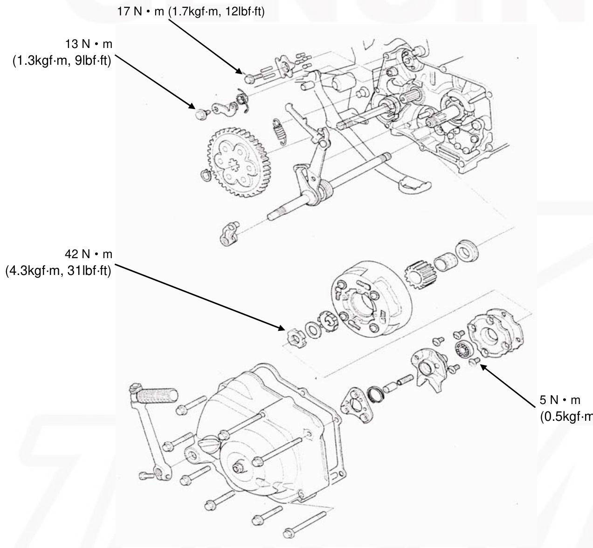

# SERVICE INFORMATION

## GENERAL

This section covers service of the clutch and gearshift linkage. All service can be done with the engine installed in the frame.
Use care not to allow dust or dirt to enter the engine.
Transmission oil viscosity and level have an effect on clutch disengagement. When the clutch does not disengage or the motorcycle creeps with the clutch disengaged, inspect the transmission oil level before servicing the clutch system.

## SPECIFICATIONS

### Clutch Disc Thickness
- A: SUPER: 1.52-1.68 (0.060-0.066) / 1.3 (0.051)
- B: 3.42-3.58 (0.135-0.141) / 3.2 (0.126)
- JNR: A: 2.67-2.83 (0.105-0.111)14) / 2.45 (0.096)
- B: 3.42-3.58 (0.135-0.141) / 3.2 (0.126)
- B: 3.32-3.48 (0.131-0.137) / 3.0 (0.12)

#### Clutch Plate Warpage
- 0.20 (0.008)

#### Centrifugal Clutch Spring Free Length
- SUPER: 19.5 (0.77) / JNR: 20 (0.79) / 19.4 (0.76)

#### Primary Drive Gear

Component | Specification
--- | ---
Clutch hub inner guide | 21.0000-21.021(0.8268-0.8276)
Clutch center guide - L.D. | 16.988-17.006(0.6688-0.6695)
Clutch center guide - O.D. | 20.930-20.950(0.8240-0.8248)
Crankshaft O.D at clutch center | 16.966-16.984(0.6680-0.6687)

### Torque Values
1. Clutch outer cover screw: 5N.m(0.5kgf.m, 3.6lbf.ft)
2. Clutch lock nut: 42N.m(4.3kgf.m, 31lbf.ft)
3. Clutch assembly screw: 6N.m(0.5kgf.m, 3.6lbf.ft)
4. Shift drum stopper arm bolt: 13N.m(1.3kgf.m, 9lbf.ft)
5. Shift return spring pin bolt: 29N.m(3.0kgf.m, 22lbf.ft)
6. Gearshift cam plate bolt: 17N.m(1.7kgf.m, 12lbf.ft)

### Tools
- Flywheel holder 07725-0040000
- Lock nut wrench, 20-24mm 07716-0020100
- Extension bar 07716-0020500

### Troubleshooting

#### Clutch Slips When Accelerating
- Incorrect clutch adjustment
- Worn clutch disc
- Weak clutch spring
- Faulty clutch weight
- Transmission oil mixed with molybdenum or graphite additive
- Motorcycle creeps with clutch disengaged
- Incorrect clutch adjustment
- Clutch plate warped
- Faulty clutch lifter
- Faulty clutch weight
- Incorrect engine oil weight

#### Hard to Shift
- Incorrect clutch adjustment
- Loose stopper plate bolt
- Damaged stopper plate bolt
- Damaged stopper plate and pin

#### Transmission Jumps Out of Gear
- Worn shift drum stopper arm
- Weak or broken shift arm return spring
- Loose stopper plate bolt

#### Gearshift Pedal Will Not Return
- Weak or broken gearshift spindle return
- Bent gearshift spindle

### Right Crankcase Cover Removal
Drain the engine oil (page 3-9)
Remove the foot peg bar (page 6-3)

Remove the bolt kickstarter pedal

Unhook the brake pedal return spring. Loosen the rear brake pedal adjusting nut and lower the brake pedal.

Remove the eight bolts and right crankcase cover.

Remove the gasket and dowel pins. Remove the clutch adjusting nut, washer, and O-ring

Remove the clutch lifter/adjusting bolt assembly.

### Clutch/Gearshift Linkage
Check the kickstarter oil seal for damage, replace if necessary.

#### Clutch Removal
- Remove the ball retainer and spring
- Remove the clutch lifter lever
- Remove the oil through and spring
- Remove the clutch lifter cam plate

Remove the screws and clutch outer cover and bearing

StraightenIn the tab of the lock washer

Hold the clutch outer with the flywheel holder and remove the lock nut using the special tools as shown

TOOLS:
- 07725-0040000 Flywheel holder
- Lock nut wrench,20x24mm 07716-0020100
- Extension bar 07716-0020500

Remove the lock washer B,14mm lock washer, and clutch assembly.

Remove the primary drive gear.

Remove the drive gear.

Remove the snap ring and primary driven gear from the mainshaft. Remove the collar from the crankshaft.

# DISASSEMBLY

Remove the following:
- Set ring
- Clutch plate B
- Clutch disc A
- Clutch disc B
- Clutch disc A
- Free springs
- Clutch plate A

Remove the clutch center and drive gear outer.

Remove the four damper springs. Remove the four screws and plain washers.

Remove the drive plate assembly and clutch springs.

Remove the clutch weight stopper ring. Remove the clutch weight/center ring.

# INSPECTION

## Clutch lifter bearing

Turn the inner race of the lifter bearing with your finger. The bearing should turn smoothly and freely without excessive play.
Also, check that the bearing fits tightly in the clutch outer cover.
If necessary, replace the bearing.

Measure the clutch spring free length.

## Clutch Spring

SERVICE LIMIT: 19.4mm(0.76in)

## Clutch Disc

Replace the clutch discs if they show signs of scoring or discoloration.

Measure the disc thickness of the disc.

SERVICE LIMITS: Clutch disc A: 2.3mm (0.09 in) Clutch disc B: 3.0mm (0.12 in)

Check each disc plate for warpage on a surface plate using a feeler gauge.
SERVICE LIMIT: 0.20mm (0.008in)

Primary drive gear/clutch center guide
Check the primary drive gear and clutch center guide for excessive wear or damage.

Measure the I.D. of the primary drive gear.

SERVICE LIMIT: 21.05mm (0.829 in) Measure the O.D. and I.D of the clutch center guide.
SERVICE LIMITS: I.D.: 17.04mm (0.671 in) O.D.: 20.90mm (0.823in)

## Crankshaft

Measure the crankshaft O.D at the clutch center guide.

SERVICE LIMIT: 16.90mm (0.665 in)

## Drive gear outer/clutch center

Check the drive gear outer and clutch center for excessive wear or damage.

# ASSEMBLY

1. Install the clutch weight/center ring onto the drive plate by aligning the ring end with the end slot on the drive plate.plate hole. Install the stopper ring by aligning the ring end with the plate groove.

1. Install the clutch spring onto the clutch outer holes. Install the drive plate assembly into the clutch outer aligning its bosses with the clutch springs.
2. Install the plain washers and screws. Tighten the screws in a crisscross pattern in 2-3 steps. TORQUE: 6 N.m (0.6 kgf.m, 4.3 lbf.ft)

    
3. Install the damper springs as shown.
4. Install the drive gear outer and clutch center.

    
5. Install the following:

    - Clutch plate A
    - Free springs
    - Clutch disc A
    - Clutch disc B
    - Clutch disc A
    - Clutch plate B

**NOTE**

Install the clutch disc A with its flat surface facing the clutch disc B.
Install the clutch plate B with its chamfered side facing the clutch disc A.

1. Install the clutch set ring with its chamfered side facing the clutch plate B.

    

# INSTALLATION

1. Install the collar onto the crankshaft.
2. Install the primary driven gear onto the mainshaft and secure it with the snap ring.
3. Apply engine oil to the clutch center guide and install it onto the crankshaft.
4. Install the primary drive gear.

    
5. Install the clutch assembly onto the crankshaft.
6. Install a new 14mm lock washer by aligning its short tabs with the grooves in the dive plate.
7. Install the lock washer B with its "OUT SIDE" mark facing out.

    

**TOOLS**

- Lock nut wrench, 20x24mm 07716-0020100
- Extension bar
- Flywheel holder

TORQUE: 42 N.m (4.3 kgf.m, 31 lbf.ft)

1. Install the lock nut.
   Hold the clutch outer with the flywheel holder and tighten the lock nut to the specified torque using the special tools as shown.
   Bent up the tab of the 14mm lock washer into the groove of the lock nut.
2. Clean the inside of the clutch outer and outer cover (page 3-10).
   Install the bearing and a new gasket onto the clutch outer cover.

   

4. Install the clutch outer cover and tighten the screws to the specified torque. TORQUE: 5N.m (0.5kgf.m, 3.6lbf.ft)
5. Install the cluAttach lifter cam plate. Insert oil through spring and oil through.

OIL THROUGH

Insert the spring, ball retainer, and clutch lifter lever. Insert the right crankcase cover (page 9-17).

LIFTER LEVER

# GEARSHIFT LINKAGE

## REMOVAL

1. Detach the clutch and primary driven gear (page 9-4).
2. Detach bolt and gearshift pedal.

Clean gearshift spindle end to avoid dirt entering the crankcase.

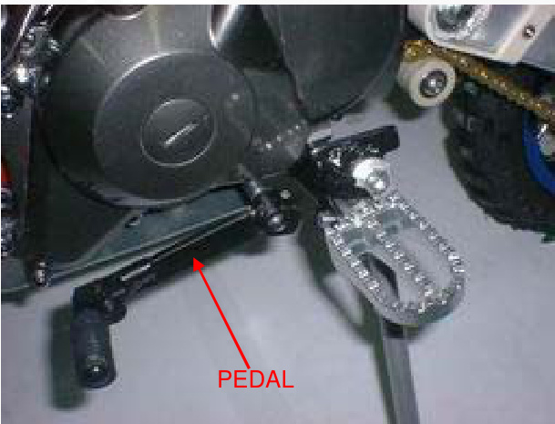

Detach the bolt, stopper arm, and return spring.

Pull down the gearshift arm, then extract the gearshift spindle from the crankcase.

GEARSHIFT SPINDLE

Remove the bolt and shift cam plate.

Detach the gearshift drum pins.

## INSPECTION

Inspect the gearshift spindle for bends or other damage.

## INSTALLATION

Insert the four gearshift drum pins.

Install the cam plate and tighten the bolt to the mentioned torque. TORQUE: 17N.m (1.7kgf.m, 12lbf.ft).

Insert the gearshift spindle into the crankcase by aligning the return spring ends with the spring pin while pushing down the gearshift arm and set the gearshift arm to the shift drum pins.

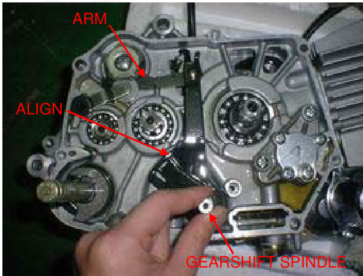

Insert the return spring and stopper arm as shown and tighten the bolt to the mentioned torque. TORQUE: 13N.m (1.3kgf.m, 9lbf.ft).

Insert the gearshift pedal so that it is the same height as the foot peg.

Insert the pinch bolt and tighten it.

Insert the driven gear and clutch assembly (page 9-12).

# RIGHT CRANKCASE COVER INSTALLATION

- Hold the washer and lock nut
- Insert the dowel pins and a new gasket
- Install the right crankcase cover
- Insert and tighten the eight cover bolts in a crisscross pattern in multiple steps

Insert the kickstarter as shown and tighten the bolt. Hook the return spring to the brake pedal and spring holding pin as shown.

Insert the foot peg bar (page 6-4). AdjAdjust the brake pedal free play (page 3-15). Pour the recommended engine oil (page 3-9). Adjust the clutch (page 3-16).

# Service Information

## General

This section covers service of the flywheel, alternator, and cam chain tensioner. All the service can be done with the engine installed in the frame. Please refer to section 14 for alternator stator inspection.

## Specifications

ITEM | STANDARD | SERVICE LIMIT
--- | --- | ---
Cam chain tensioner Push rod O.D | 11.985-12.000(0.4718-0.4724) | 11.94(0.470)
Spring free length | 111.7(4.40) | 100(3.9)

# Torque Values

* Flywheel nut: 41 N.m (4.2 kgf.m, 30 lbf.ft)
* Cam chain tensioner sealing bolt: 23 N.m (2.3 kgf.m, 17 lbf.ft)
* Cam chain tensioner pivot bolt: 16 N.m (1.6 kgf.m, 12 lbf.ft)

## Tools

* Universal holder: 07725-0030000
* Flywheel puller: 07933-GE0000 (Only available in U.S.A OR 07933-0010000 U.S.A)

## Troubleshooting

* Excessive engine noise
  * Worn or damaged chain tensioner
  * Clogged one-way valve
  * Weak or damaged cam chain tensioner spring
  * Loose cam chain
  * Improper push rod operation
  * Air in cam chain tensioner chamber

# Flywheel/Stator Removal

* Disconnect the alternator and ignition pulse generator connectors
* Remove the bolt and gearshift pedal

* Remove the three bolts and left crankcase cover
* Hold the flywheel using the universal holder and remove the flywheel nut

Universal holder 07725-0030000

## Tool

* Remove the washer

* Remove the flywheel using the special tool

## Tools

* Flywheel puller 07933-GE00000 (Not available in U.S.A)
* Flywheel puller 07933-0010000 (U.S.A. only)

* Remove the woodruff key
* Remove the bolt and wire clamp
* Release the wire grommet from the crankcase groove
* Remove the four mounting bolts and wire clamp, and the ign

# Stator Assembly Removal

Drain the engine oil (page 3-9) Remove the screws and stator base.

Remove the O-rings.

# Cam Chain Tensioner Removal

Remove the stator base (page 10-2)

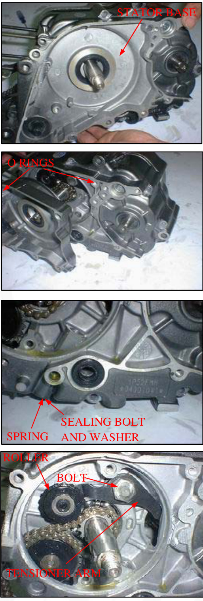

Remove the sealing bolt, tensioner spring, and push rod.

Remove the pivot bolt, tensioner arm, and tensioner roller.

# Inspection

Check the push rod for wear or damage. Measure the push rod O.D.
Service Limit: 11.94 mm (0.470in)
Measure the tensioner spring free length.
Service Limit: 100mm (3.9in)

Install the cam chain tensioner roller, tensioner arm, and pivot bolt. Tighten the pivot bolt to the specified torque.

Torque: 23N.m (2.3kgf.m, 17lbf.ft)
Torque: 16N.m (1.6kgf.m, 12lbf.ft

# Installation

Check the sealing washer is in good condition, replace if necessary. Install the push rod, spring, washer, and sealing bolt. Tighten the sealing bolt to the specified torque.

Remove the crankcase sealing bolt and washer. Fill the push rod with 1-2 cm3 of engine oil through the filler hole.

# Stator/Flywheel Installation

Check the sealing washer is in good condition and install the sealing washer and bolt. Tighten the bolt securely.

Check the stator base oil seal for damage, replace if necessary. Apply engine oil to the lip of the oil seal.

Apply engine oil to new O-rings, install them into the crankcase grooves and stator base groove.

Install the stator base and tighten the screws securely.

CAUTION: Be careful not to damage the oil seal lips.

Install the stator and ignition pulse generator with the wire clamp and tighten the bolts securely.

Set the wire grommet into the crankcase groove. Install the wire clamp and tighten the bolt.

Clean any oil from the tapered portion of the crankshaft and flywheel. Install the woodruff key into crankshaft.

Install the flywheel by aligning the keyway in the flywheel with woodruff key on the crankshaft. Install the washer and flywheel nut.

Hold the flywheel using the universal holder and tighten the nut to the specified torque.

Tool: Universal holder
Torque: 41N.m (4.2kgf.m, 30lbt.ft)

Install the left crankcase cover and tighten the two bolts.

Install the gearshift pedal so that same height as the footpeg. Install the pinch bolt and tighten it.

Connect the ignition pulse generator and alternator connectors.

# Service Information

- The crankcase must be separated to service the crankshaft, transmission, and kickstarter.
- The following parts must be removed before separating the crankcase:
  - Alternator/cam chain tensioner (Section 10)# Clutch/gearshift linkage (Section 9)
 1. Cylinder head (Section 7)
 2. Cylinder/piston (Section 8)
 3. Engine (Section 6)
 4. Oil pump (Section 4)

# SPECIFICATIONS

Unit: mm (in)

 ITEM          | STANDARD                     | SERVICE LIMIT
 ---           | ---                          | ---
 Crankshaft    |                             |
 Side clearance| 0.010-0.350(0.0004-0.0138) | 0.6(0.024)
 Radial clearance | 0-0.012(0-0.005)         | 0.05(0.002)
 Run out       |                             | 0.10(0.004)
 Shift fork    | 1.D                         | 34.075-34.100(1.3415-1.3425)
               |                             | 34.14(1.344)

# TORQUE VALUES

- Shift drum bolt: 12N.m(1.2kgf-m, 9lbf-ft)

# TOOLS

- Driver: 07749-0010000
- Attachment, 37-40mm: 07746-0010200
- Pilot, 17mm: 07746-0040400

# TROUBLESHOOTING

**Hard to shift**
- Incorrect clutch adjustment
- Bent shift fork
- Bent fork claw
- Damaged shift drum cam groove
- Incorrect transmission oil weight

**Transmission jumps out of gear**
- Worm gear dogs and slots
- Bent fork shaft
- Broken shift drum stopper

**Excessive noise**
- Worn crankshaft big end bearing
- Worn crankshaft journal bearing

# CRANKCASE SEPARATION

**NOTE**

Refer to Service Information (page 11-1) for removal of necessary parts before separating the crankcase

Remove the snap ring from the kickstarter spindle. Unhook the return spring and remove the retainer and return spring.

Remove the rubber cap.

Remove the shift drum bolt and washer.

Remove the cam chain.

Loosen the seven crankcase bolts in a crisscross pattern in 2-3 steps and remove them.

Place the crankcase with the left side down.
Separate the right and left crankcase halves.

Remove the gasket and dowel pins.

# CRANKSHAFT

## REMOVAL

Remove the crankshaft from the left crankcase.

If necessary, remove the cam chain guide spindle and guide sprocket.

## INSPECTION

Measure the connecting rod big end side clearance with a feeler gauge.
SERVICE LIMIT: 0.6 mm (0.024 in)

Measure the connecting rod big end radial clearance at symmetrical points as shown.
SERVICE LIMIT: 0.05 mm (0.002 in)

Turn the outer race of the crankshaft bearing with your finger.
The bearing should turn smoothly and quietly. Also check that the inner race of the bearing fits tightly on the crankshaft.

Check the timing sprocket for wear or damage.

If you're replacing the timing sprocket, align the center of the sprocket teeth with the center of the woodruff key groove as shown.

# SPROCKET

The measuring locations are shown in the illustration SERVICE LIMIT: 0.10mm (0.004 in)

Place the crankshaft on a stand or V-blocks and measure the runout using a dial gauge.

# INSTALLATION

Install the guide sprocket and guide spindle.
Remove the mainshaft, countershaft, and shift drum as an assembly.
Pour 1-2 cm3 of engine oil into the connecting rod big end bearing. Install the crankshaft into the left crankcase, being careful not to interfere with the connecting rod with the crankcase. Assemble the crankcase halves (page 11-14).

# TRANSMISSION

## REMOVAL

Remove the kickstarter spindle (page 11-12).

## DISASSEMBLY

Disassemble the mainshaft, countershaft, and shift drum.

SERVICE LIMITS: M2: 17.10mm (0.673 in) C1: 23.10mm (0.909 in) C3: 20.10mm (0.791 in)
Check the gear dogs, dog holes,Check teeth for abnormal wear or lack of lubrication. Measure the I.D. of each gear. Measure the I.D. and O.D. of C1 gear bushing. Check the shifter groove of the shifter gear for excessive wear or damage.

## INSPECTION

SERVICE LIMIT: O.D: 22.93mm (0.903in) I.D: 20.08mm (0.791in). Calculate the CI gear-to-bushing clearance. SERVICE LIMIT: 0.10mm (0.004in). Measure the O.D. of the mainshaft and countershaft.

SERVICE LIMITS:
* At M2 gear: 16.95mm (0.667in)
* At C1 gear: 19.94mm (0.785in)

Calculate the M2 gear-to-shaft clearance. SERVICE LIMITS: 0.10mm (0.004in). Calculate the C1 gear bushing-to-shaft clearance. SERVICE LIMITS: 0.10mm (0.004in)

# CRANKSHAFT/TRANSMISSION/KICKSTARTER

## ASSEMBLY

## GEARSHIFT DRUM DISASSEMBLY

Remove the guide pin clips. Remove the guide pins, then remove the shift forks. Inspect the shift drum grooves for wear or damage. Measure the O.D. of the shift drum.
SERVICE LIMIT: 33.93mm (1.336in)

## CRANKSHAFT/TRANSMISSION/KICKSTARTER

Apply engine oil to the shift drum outer surface. Install the shift forks onto the gearshift drum. Install the guide pins and secure them with the clips. If the washer has been removed, install a new washer and bend the tab to lock the washer.

## BEARING REPLACEMENT

Turn the inner race of each bearing with your finger. The bearings should turn smoothly and quietly. Check that the bearing outer race fits tightly in the crankcase. Remove and discard the bearing if the race does not turn smoothly, quietly, or fits loosely in the crankcase.

# Remove the countershaft oil seal

1. Drive the mainshaft bearing out of the right crankcase
2. Drive the countershaft bearing out of the left crankcase
3. Drive new bearings into the crankcases using the special tools as shown:

TOOLS:
* Drive 07749-0010000 Attachment
* 37*40mm 07746-0010200 Pilot,17mm 07746-0040400

Apply engine oil to a new countershaft oil seal lip. Install the countershaft oil seal.

# Transmission Installation

Apply clean engine oil to the transmission gears and shift drum. Set the right fork into the M3 gear and the left fork into the C2 gear to assemble the mainshaft, countershaft, and shift drum. Install the mainshaft, countershaft, and shift drum as an assembly into the left crankcase. Rotate the shift drum to check the transmission operation. Install the kickstarter spindle (page 11-14).

# Kickstart Assembly

Remove the kickstarter spindle from the right crankcase.

# Removal & Disassembly

1. Remove the washer.
2. Remove the snap ring and starter ratchet/spring.
3. Remove the snap ring, washer, and starter pinion gear.nion gear

1. Check the kickstarter spindle for bending
2. Check the friction spring for fatigue

## Inspection

Check each part for wear or damage, replace if necessary Assembly is in the reverse order of disassembly

## Installation

Install the kickstarter spindle by aligning its friction spring with the groove in the left crankcase Assemble the crankcase halves

## Note

Dress the surfaces with an oil stone if necessary to correct any minor roughness or irregularities Install the dowel pins and a new gasket onto the left crankcase Install the right crankcase over the left crankcase

## Crankcase Assembly

Clean the crankcase mating surfaces before assembling Apply engine oil to the cam chain and install it Make sure that the gasket stays in place Install the seven bolts with the clamp and tighten them in a crisscross pattern in 2-3 steps

Install the washer and bolt to the shift drum, then tighten the bolt to the specified torque (12N.m, 1.2 kgf.m, 9lbf.ft) Install the rubber cap Install the return spring and retainer onto the kickstarter spindle Temporarily install the kickstarter pedal Install the spring ends onto the retainer and crankcase lug as shown and press the retainer to set its edge against the stepped part of the crankcase while turning the pedal counterclockwise.

Install the snap ring into the groove in the kickstarter spindle securely.

## SERVICE INFORMATION

A contaminated brake drum or shoe reduces stopping power. Discard contaminated shoes and a contaminated drum with a high quality brake degreasing agent.

* When servicing the front wheel, brake, fork, or steering stem, support the motorcycle using a safety stand or ho

## SPECIFICATIONS

Unit:mm(in)

| ITEM | STANDARD | SERVICE LIMIT |
|------|----------|---------------|
| Minimum tire tread depth | | 3.0(0.12) |
| Cold tire pressure | 100kpa(1.0kgf/cm2,15psi) | |
| Axle runout | | 0.20(0.008) |
| Wheel rim-to-hub distance | 6.3±1.0(0.25±0.04) | |
| Radial Wheel rim runout | | 2.0(0.08) |
| Brake | | |
| Axial | | 2.0(0.08) |
| Brake lever free play | 10-20mm(3/8-13/16in) | |
| Brake plate Spring free length | 4 | 3 |
| Fork | 376(14.8) | 373.5(14.7) |

## TORQUE VALUES

- Handlebar mounting nut: 20N.m(2.0kgf.m, 14ibf.ft)
- Engine stop switch holder screw: 3N.m(0.3kgf.m, 2.2lbf.ft)
- Brake lever pivot nut: 3N.m(0.3kgf.m, 2.2lbf.ft)
- Spoke nipple: 2N.m(0.2kgf.m, 1.4lbf.ft)
- Front axle nut: 47N.m(4.8kgf.m, 35ibf.ft)
- Front brake arm pinch bolt: 6N.m(0.6kgf.m, 4.3lbf.ft)
- Steering stem nut: 74N.m(7.5kgf.m, 54lbf.ft)
- Steering stem top thread: See Page 12-17

## FRONT WHEE
# L/BRAKE/SUSPENSION/STEERING

# TOOLS

- Spoke wrench: 4.1 x 4.5 mm
- Bearing remover shaft
- Bearing remover head: 12 mm
- Driver
- Attachment: 32 x 35 mm
- Pilot: 12 mm
- Pin spanner
- Ball race remover
- Attachment: 37 x 40 mm
- Steering stem driver

Tools:
- 07707-0020100
- 07746-0050100
- 07746-0050300
- 07749-0010000
- 07746-0010100
- 07746-0040200
- 07702-0020001
- 07944-1150001
- 07746-0010200
- 07946-gc40000

or Steering stem driver 07946-MB00000 with Steering stem driver attachment 07946-GC4000a(U.S.A. only)

# TROUBLESHOOTING

## Hard steering

- Faulty or damaged steering head bearings.
- Insufficient tire pressure
- Steering stem top thread too tight

## Wheel turns hard

- Faulty wheel bearing
- Bent front axle
- Brake drag

## Steers to one side or does not track straight

- Bent fork
- Bent axle
- Wheel installed incorrectly
- Faulty steering head bearings
- Bent frame
- Worn wheel bearing
- Worn swingarm pivot components

## Suspension Issues

Soft suspension:
- Weak fork springs
- Tire pressure too low

Hard suspension:
- Bent fork tubes

Front suspension noisy:
- Damaged or bent fork tubes
- Loose fork fasteners

# Front wheel wobbling

- Bent rim
- Worn front wheel bearings
- Faulty tire
- Unbalanced tire and wheel

# Improper brake performance

- Incorrect adjustment of lever
- Contaminated brake shoes
- Worn brake shoes
- Worn brake cam
- Worn brake drum
- Improperly engaged brake arm serrations

Remove the fuel tank breather tube from the number plate and the number plate from the steering stem nut.

Remove the wire bands.

Remove the two screws and engine stop switch/throttle housing from the handlebar.

# REMOVAL

## HANDLEBAR

Disconnect the throttle cable and remove the throttle grip.

Remove the left handlebar grip.

Remove the two nuts and handlebar.

## INSTALLATION

Install the handlebar into the fork top bridge and tighten the mounting nuts.

**TORQUE:** 20N.m(2.0kgf.m,14lbf.ft)

Clean the inside surface of the left handlebar grip and the outside surface of left handlebar.

Apply Manufacturer Bond A or equivalent to the inside surface of the left handlebar grip and to the outside surface of the left handlebar. Wait 3-5 minutes and install the grip.

Rotate the grip for even application of the adhesive.

**NOTE:** Allow the adhesive to dry for an hour before using.

Apply grease to the throttle grip pipe flange and install the throttle grip onto the right handlebar. Connect the throttle cable to the throttle grip pipe flange.

Tighten the forward screw first, then the rear screw.
**TORQUE:** 3N.m(0.3kgf.m,2.2lbf.ft)

Install the engine stop switch/throttle housing onto the handlebar, aligning the mating surface with the punch mark on the handlebar.

Secure the engine stop switch wire with the wire bars properly.

Install the number plate over the steering stem nut and insert the breather tube into the hole in the number plate.

Check the throttle grip operation and free play (page 3-4)

# FRONT WHEEL REMOVAL

## WARNING

A contaminated brake drum or shoe reduces stopping power. Discard contaminated shoes and clean a contaminated drum with a high-quality brake degreasing agent…

Support the motorcycle securely using safety stand or a hoist. Remove the axle nut, axle, and front wheel.

Remove the side collar from the wheel hub.

# INSPECTION

## Axle

Set the axle in v-blocks and measure the runout. Actual runout is 1/2 the total indicator reading. **SERVICE LIMIT:** 0.20

Turn the inner race of each bearing with your finger. The bearing should turn smoothly and quietly. Also, check that the bearing outer race fits tightly in the hub. Remove and discard the bearings if they do not turn smoothly, quietly, or if they fit loosely in the hub.

## Wheel Bearing

## Wheel Rim Runout

Check the rim runout by placing the wheel in a turning stand.

Spin the wheel by hand, and read the runout using a dial indicator.

Actual runout is 1/2 the total indicator reading.

SERVICE LIMITS:
Radial: 2.0mm (0.08in)
Axial: 2.0mm (0.08in)

## DISASSEMBLY

1. Remove the dust seal.
2. Install the bearing remover head into the bearing.
3. From the opposite side, install the bearing remove shaft and drive the bearing out of the wheel hub. Remove the distance collar and drive out the other bearing.

## TOOLS

- Bearing remover head, 12mm
- Bearing remover shaft
- 07746-0050300 (equivalent commercially available in U.S.A.)
- 07746-0050100 (equivalent commercially available in U.S.A.)

## ASSEMBLY

### RIGHT WHEEL BEARING

Never install the old bearing once the bearings have been removed; the bearings must be replaced with new ones.

Pack each wheel bearing cavity with grease.
Drive in a new left bearing squarely with its sealed side facing out.
Install the distance collar and drive in a new right bearing using the same tools.

TOOLS:
- Driver
- Attachment, 32x35mm
- Pilot, 12mm
- 07749-0010000
- 07746-0010100
- 07746-0040200

## Wheel Center Adjustment

Place the rim on the workbench.

Place the hub with the right side down and beginWhen replacing with new spokes, adjust the hub position so that the distance from the hub left end surface to the side of the rim is 6.3 ± 1mm (0.25 ± 0.04 in) as shown.

### Tool
- Spoke wrench, 4.1x4.5mm 07701-0020100 (Equivalent commercially available in U.S.A.)
- TORQUE: 2N.m (0.2kgf, 1.4lbf.ft)

Check the rim runout (page 12-8).

Apply grease to a new dust seal lips, then install it into the right wheel hub.

Install the side collar into the right wheel hub.

Install the front wheel between the fork legs.

Apply a thin layer of grease to the front axle surface.
Install the front axle from the right side.
Hold the axle and temporarily tighten the axle nut.

With the front brake applied, pump the fork up and down several times to seat the axle and check brake operation. Tighten the axle nut to the specified torque.

TORQUE: 47N.m(4.8kgf.m, 35lbf.ft)

# Front Brake Assembly

1. FR. Wheel Rim Comp
2. Flap. FR. Wheel
3. Inner Tire 2.50-10
4. Outer Tire 2.50-10
5. Bearing
6. Distance Collar
7. Bush A
8. Bush B
9. FR. Wheel Axle
10. Grip Nut M12
11. Bolt
12. FR. Brake Disk
13. FRONT WHEEL ASSY
14. Spoke

Apply grease to the brake cam spindle. Install the brake cam into the brake panel.

**Notice**: Check the brake liquid every time when you drive it.

1. Master Cylinder Body
2. Oil Pipe
3. Brake Clamp Assembly
4. Friction Pad
5. FR. Brake lever
6. FRONT BRAKE SWITCH
7. Holder, Master Cylinder
8. Lid, Master Cylinder
9. Gasket
10. Fixing Bolt
11. Bolt M6-25
12. Nut M6
13. SCREW
14. Screw
15. FRONT BRAKE ASSEMBLY

# Front Wheel Brake Suspension Steering

**Notice**: Check the Friction Pad when you drive it.

1. FR. L. Shock Absorber
2. FR. R. Shock Absorber
3. Bolt
4. Holder, FR. Pipe
5. RR. Shock Absorber
6. Rubber Cap
7. Flange Bolt M6-12
8. Flange Bolt M8-25
9. REAR SHOCK ABSORBER
10. R.FRONT SHOCK ASSEMBLY
11. L.FRONT SHOCK ASSEMBLY

# Installation

Install the front wheel (page 12-8)

# Fork Disassembly

Remove the front wheel (page 12-5) Loosen the brake cylinder bolt and remove the brake cylinder from the fork stem. Remove front wheel axle from the fork. Remove the fork top bolt and washer and pull the fork slider down to remove the fork assembly. Drive out the bolt. Remove the following from the fork slider: spring, other parts.

1. FR.L. Shock Absorber
2. FR.R. Shock Absorber
3. Bolt
4. Holder, FR. Brake Pipe
5. RR. Shock Absorber
6. Rubber Cap
7. Flange Bolt M6-12
8. Flange Bolt M8-25
9. REAR SHOCK ABSORBER
10. R.FRONT SHOCK ASSEMBLY# CK ASSEMBLY
## 11. L.FRONT SHOCK ASSEMBLY

## INSPECTION

Visually inspect each part for excessive wear or damage. Measure the fork spring free length.

## ASSEMBLY FRONT WHEEL BRAKE SUSPENSION STEERING

Install the following onto the fork slider: new dust seal (apply grease to the lips), stopper ring (with the chamfered side facing up), back up ring, slider guide (apply 5-6g of grease to the slider guide sliding surface of the fork slider).

1. FR. L. Shock Absorber
2. FR. R. Shock Absorber
3. Bolt
4. Holder, FR. Brake Pipe
5. RR. Shock Absorber
6. Rubber Cap
7. Flange Bolt M6*12
8. Flange Bolt M8*25
9. REAR SHOCK ABSORBER
10. R. FRONT SHOCK ASSY
11. L. FRONT SHOCK ASSY

Install the slider piston and fork spring/holder as shown.

Align the pin holes in the piston, fork slider, and spring holder so that the locating pin on the upper spring holder is facing inside of the fork slider and drive the spring pin to secure them, using a 4mm pin driver.

Be sure that the spring pin does not project out of the piston outer surface

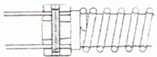

Apply 5-6g of grease to the slider guide outer groove. Pack the fork spring with 14g of grease. Install the fork assembly by aligning the locating pin with the groove in the outer tube.

Install the fork top bolt and washer and tighten it. Wipe any excess grease off the outer tube.

1. Steering Column Comp
2. Upper Panel
3. Lower Holder, Handle Pipe
4. Upper Holder, Handle Pipe
5. Front Cover
6. Nut
7. Adjusting Nut
8. Dust Cap
9. Upper Cone Race
10. Ball
11. Ball Race
12. Bottom Cone Race
13. Dust Seal
14. Flange Bolt 16*12
15. Flange Bolt M8*25
16. Flange Bolt M8*25
17. Bolt M8*30

Install the stopper ring into the groove in the outer tube properly. Install the dust seal over the outer tube. Wipe any excess grease off the fork slider. Install the brake cable onto the fork slider and secure it by tightening the cable nut. Install the front wheel (page 12-10)

12. Bottom Cone Race
13. Dust Seal
14. Flange Bolt M6*12
15. Flange Bolt M8*25
16. Flange Bolt M8*25
17. Bolt M8*30
18. Steering Column Comp
2. Upper Panel
19. Lower Holder, Handle Pipe
20. Upper Holder, Handle Pipe
21. Front Cover
22. Nut
23. Adjusting Nut
24. Dust Cap
25. Upper Cone Race
26. Ball
27. Ball Race

## STEERING STEM REMOVAL

Remove the following:
- Number plate (page 2-3)
- Handlebar (page 12-3)
- Front wheel (page 12-5)
- Front fender (page 2-3)
- Steering stem nut and washer
- Fork top bolts and washers
- Top bridge

Remove the steering stem top thread using the special tool.

TOOL: Pin spanner

07702-0020001

Remove the following:
- Upper bearing inner race
- Upper bearing
- Steering stem
- Lower bearing

## BEARING REPLACEMENT

Drive out the upper and lower bearing outer races using the special tool.

TOOL: Ball race remove07944-1150001

Always replaceReplace the bearings and races as a set.

#### Install New Upper and Lower Bearing Outer Races into the Steering Head Pipe

Use the special tools as shown to drive the new upper and lower bearing outer races into the steering head pipe.

**TOOLS:**
- Driver 07749-0010000 Attachment
- 37x07746-0010200

Temporarily install the steering stem nut onto the stem to prevent the threads from being damaged when removing the lower bearing inner race from the stem.

Remove the lower bearing inner race with a chisel or equivalent tool, being careful not to damage the stem.

Remove the dust seal and washer.

1. Steering Column Comp
2. Bottom Cone Race
3. Upper Panel
4. Dust Seal
5. Lower Holder, Handle Pipe
6. Flange Bolt M6x12
7. Upper Holder, Handle Pipe
8. Flange Bolt M8x25
9. Front Cover
10. Flange Bolt M8x25
11. Nut
12. Adjusting Nut
13. Dust Cap
14. Upper Cone Race
15. Ball
16. Ball Race

# Installation

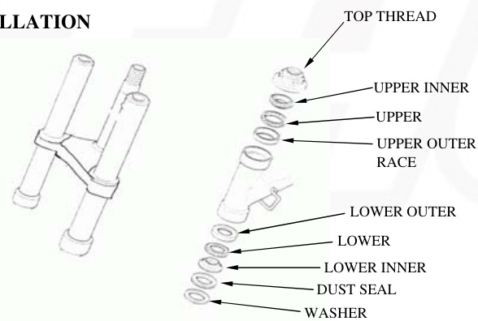

Apply grease to upper and lower bearings and races.
Install the lower bearing onto the lower bearing race.
Insert the steering stem into the steering head pipe.

Install upper bearing, inner race, and top thread.

Hold the steering stem and tighten the stem top thread to the initial torque.

**TORQUE: 25 N.m (2.5 kgf.m, 18 lbf.ft)**

Move the steering stem right and left, lock-to-lock several times to seat the bearings.
Loosen the top thread.
Re-tighten the top thread to the specified torque.

**TORQUE: 3 N.m (0.3 kgf.m, 2.2 lbf.ft)**

Install the top bridge.
Install the stem nut and fork top bolts with the washers and tighten them.

TORQUE: stem nut: 74 N.m (7.5 kgf.m, 54 lbf.ft)

Make sure that the steering stem moves smoothly without play or binding.

Install the following:
- Front fender
- Front wheel
- Handlebar
- Number plate
- Steering Column Comp
- Lower Holder, Handle Pipe
- Upper Holder, Handle Pipe
- Front Cover
- Nut
- Adjusting Nut
- Dust Cap
- Upper Cone Race
- Bottom Cone Race
- Dust Seal
- Flange Bolt M6x12
- Flange Bolt M8x25 (x2)
- Bolt M8x30

# Rear Wheel/Brake/Suspension

**SERVICE INFORMATION**

| GENERAL | |
| --- | --- |
| WARNING | |

**SPECIFICATIONS**

| ITEM STANDARD | SERVICE LIMIT |
| --- | --- |
| Minimum tire tread depth | 3.0 (0.12) |
| Cold tire pressure | 125kpa (1.25kgf/cm2 , 18psi) |
| Axle run out | 0.20 (0.008) |
| Wheel rim runout Radial | 2.0 (0.08) |

# TORQUE VALUES

| Component | Torque |
| --- | --- |
| Spoke nipple | 2N.m (0.2kgf.m,1.4lbf.ft) |
| Rear axle nut | 47N.m (4.8kgf.m,35lbf.ft) U-nut |
| Driven sprocket nut | 32N.m (3.3kgf.m,24lbf.ft) U-nut |
| Swingarm pivot nut | 39N.m (4.0kgf.m,29lbf.ft) Apply grease to the seating surface/U-nut |
| Shock absorber mounting nut | 34N.m (3.5kgf.m,25lbf.ft) U-nut |
| Drive chain slider nut | 12N.m (1.2kgf.m,9lbf.ft) U-nut |

# TOOLS

- Spoke wrench 4.`1 x 4.5 mm`
- Bearing remover shaft
- Bearing remover head, 12 mm
- Drive spanner, 32 x 35 mm
- Pilot, 12 mm

Equivalent commercially available in U.S.A.
- 07701-0020100
- 07746-0050100
- 07746-0050300
- 07749-0010000
- 07746-0010100
- 07746-0040200

# TROUBLESHOOTING

## Soft suspension

- Weak shock absorber spring
- Oil leakage from sampler unit
- Tire pressure too low

## Hard suspension

- Bent damper rod
- Damaged swingarm pivot bushings
- Bent swingarm pivot
- Tire pressure too high

## Rear wheel wobbling

- Bent rim
- Worn rear wheel bearings
- Faulty tire
- Unbalanced tire and wheel
- Tire pressure too low
- Faulty swingarm pivot bushings

## Steers to one side or does not track straight

- Bent rear axle
- Axle alignment/chain adjustment not equal on both sides

# REAR WHEEL

REMOVAL

Support the motorcycle securely using a hoist or equivalent and raise the rear wheel off the ground

Loosen the drive chain adjuster lock nuts and adjusting nuts. Remove the axle nut and drive chain adjuster.

Push the rear wheel forward and derail the drive chain from the driven sprocket.

Remove the axle from the left side and remove the rear wheel.

Remove the left side collar and the left wheel hub.

# INSPECTION

## Axle

Place the axle in V-blocks and measure the run out. Actual run out is 1/2 the total indicator reading.

SERVICE LIMIT 0.20mm(0.008 in)

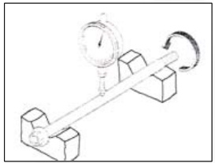

## Wheel bearing

Turn the inner race of each bearing with your finger. Bearings should turn smoothly and quietly. Also check that the bearing outer race fits tightly in the hub.

Remove and discard the bearings if the races do not turn smoothly and quietly, or if they fit loosely.
In the hub, replace the wheel bearings in pairs.
Wheel rim run out
Check the rim run out by placing the wheel in a turning stand.
Spin the wheel slowly and read the run out using a dial indicator.
Actual run out is 1/2 the total indicator reading.

# SERVICE LIMITS

- Radial: 2.0 mm (0.08 in)
- Axial: 2.0 mm (0.08 in)
- Driven sprocket

Check the condition of the final driven sprocket teeth. Replace the sprocket if worn or damaged.

# NOTE:

- If the final driven sprocket requires replacement, inspect the drive chain and drive sprocket.
- Never install a new drive chain on a worn sprocket or a worn chain on new sprockets. Both chain and sprocket must be in good condition or the replacement chain or sprocket will wear rapidly.

# DISASSEMBLY

Remove the nuts, bolts, and driven sprocket. Remove the left dust seal.

# Wheel bearing removal

Install the bearing remover head into the bearing. From the opposite side, install the bearing remover shaft and drive the bearing out of the wheel hub. RemRemove the distance collar and drive out the other bearing.

TOOLS:
* Bearing remover head, 12mm 07746-0050300 (Equivalent)
* Bearing remover shaft, 07746-0050100 (Equivalent)

## ASSEMBLY

## CAUTION

Never install the old bearings. Once the bearings have been removed, the bearings must be replaced with new ones. Pack each wheel bearing cavity with grease. Drive in a new right bearing squarely with the sealed side facing up using the special tools as shown.

TOOLS:
* Driver Attachment, 32x35 mm
* Pilot, 12mm

07746-0040200

Install the distance collar and drive in a new left bearing using the same tools.

## Wheel center adjustment

Place the rim on the workbench. Place the hub with the left side down and begin lacing with new spokes. Adjust the hub position so that the distance from the hub right end surface to the side of the rim is 25±1 mm (1.0±0.04 in) as shown.

TOOL:
* Spoke wrench, 4.107701-0020100 (Equivalent)

TORQUE: 2N.m (0.2kgf.m, 1.4lbf.ft)
Check the rim run out (page 13-4).

Apply grease to new dust seal and install it into the left wheel hub. Install the driven sprocket, bolts, and nuts and tighten them.

TORQUE: 32N.m (3.3kgf.m, 24lbf.ft)

## INSTALLATION

Install the left side collar into the left wheel hub.

Place the rear wheel into the swingarm.

Install the drive chain over the driven sprocket. Apply a thin layer of grease to the axle. Install the axle with the right drive chain adjuster from the right side. Install the left drive chain adjuster and axle nut.

## SHOCK ABSORBER

### REMOVAL

Support the motorcycle securely using a hoist or equivalent and raise the rear wheel off the ground. Remove the seat (page 2-2). Remove the shock absorber lower mounting nut and bolt.

Remove the upper mounting nut and bolt and the shock absorber.

### INSPECTION

Visually inspect the following:
* Spring for fatigue or damage
* Damper rod for bend or damage
* Damper unit for deformation or oil leaks
* Bump rubber for wear or damage
* Mounting bushings for damage
Replace the shock absorber assembly if necessary.

### INSTALLATION# TION

Install the shock absorber into the frame and swingarm.

Install the upper and lower mounting bolts from the left side. Install the nuts and tighten them to the specified torque.

**TORQUE: 34N.m (3.5kgf.m, 25lbf.ft)**

# SWINGARM REMOVAL

Remove the following: Rear wheel (page 13-3), Drive chain (page 3-12).

Remove the bolts and drive chain cover. Remove the bolts, nuts, and drive chain guard.

Remove the shock absorber lower mounting nut and bolt. Remove the swingarm pivot nut, bolt, and swingarm. Remove the nut and bolt and the drive chain slider.

## INSPECTION

Inspect the swingarm for wear or damage.
Inspect the pivot bushings for wear or damage.

Install the drive chain slider and tighten the nut.

## INSTALLATION

**TORQUE: 12N.m (1.2kgf.m, 9lbf.ft)**

Install the swingarm over the frame, then install the pivot bolt from the right side and the shock absorber lower mounting bolt from the left side.

Apply grease to the seating surface of the swingarm pivot nut. Install and tighten the nuts to the specified torque.

# TORQUE: swingarm: 39N.m (4.0kgf.m, 29lbf.ft) Shock absorber: 34N.m (3.5kgf.m, 25lbf.ft)

# BRAKE PEDAL REMOVAL

Remove the rear brake adjusting nut.

Remove the cotter pin, joint pin. Unhook the brake pedal return spring from the spring holding pin.

Remove the cotter pin, washer, and brake pedal.

## INSTALLATION

Apply grease to the pivot groove and install the brake pedal.

Install the washer and a new cotter pin to secure the brake pedal. Install the return to the brake rod the joint pin into the brake arm
Install the rod to the brake arm with the adjusting nut.

Connect the brake rod to the pedal with the joint pin and secure it with a new cotter pin. Adjust the brake pedal free play (page 3-15).

BRAKE

When the engine must be running to do some work, make sure the area is well-ventilated. Never run the engine in an enclosed area. The exhaust contains poisonous carbon monoxide gas that may cause loss of consciousness and lead to death. Run the engine in an open area or with an exhaust evacuation system in an enclosed area.

1. When servicing the ignition system, always follow the steps in the troubleshooting sequence on page 14-3.
The CDI ignition system uses an electrically controlled ignition timing system. No adjustments can be made to the ignition timing.
- The CDI may be damaged if dropped. Also, if the connection has been disrupted, it may lead to a malfunction.If a conductor is disconnected when current is flowing, the excessive voltage may damage the module.
A faulty ignition system is often related to poor connections. Check those connections before proceeding.
Use a spark plug of the correct heat range. Using a spark plug with an incorrect heat range can damage the engine. For alternator and ignition pulse generator removal and installation, see section 10.

**SPECIFICATIONS**

| ITEM | SPECIFICATIONS | | | |
| - | - | - | - | - |
| Spark plug | Standard | | CR6HSA(NGK) | U20FSR-U(DENSO) |
| | For cold climate/below 4°F/5°C | | CR5HSA(NGK) | U16FSR-U(DENSO) |
| | For extended high-speed riding | | SR7HSA(NGK) | U22FSR-U (DENSO) |
| Spark plug gap | | | | 0.60-0.70mm (0.024-0.028in) |
| Ignition coil peak voltage | | | | 100V minimum |
| Ignition pulse generator peak voltage | | | | 0.7V minimum |
| Alternator exciter coil peak voltage | | | | 100V minimum |
| Ignition timing ("F" mark) | | | | 270 idle BTDC |

# TORQUE VALUES

Ignition coil mounting bolt 6N.m (0.6 kgf.m, 4.3 lbf.ft)

# TOOLS

Peak voltage tester (U.S.A. only) or 07HGJ-0020100 (not available) Peak voltage adaptor available digital multimeter (impede)

# TROUBLESHOOTING

Inspect the following before diagnosing the system.

- Faulty spark plug
- Loose spark plug cap or spark plug wire connections
- Water got into the spark plug cap (leaking the ignition coil secondary voltage)

No spark at spark plug

# Ignition System Inspection

## Note

- If there is no spark at the plug, check all connections for loose or poor contact before measuring each peak voltage.
- Use re

| Unusual condition | Probable Cause (Check in numerical order) |
| - | - |
| Ignition coil primary voltage: Low peak voltage | 1. Incorrect peak voltage adaptor connections (system is normal if measured voltage is over the specifications with reverse connections) |
| | 2. The multimeter impedance is too low; 10M/DCV |
| | 3. Cranking speed is too low (operating force of the kickstarter is weak) |
| | 4. The sampling timing of the tester and measured pulse were not synchronized |
| No peak voltage: (system is normal if measured voltage is over the standard voltage at least once) | 5. Poorly conneConnected connectors or an open circuit in the ignition system:

- Faulty exciter coil (Measure peak voltage)
- Faulty ignition coil
- Faulty ICM (In case when items 1-7 are normal)
- Incorrect peak voltage adapter connections (System is normal if measured voltage is higher than the specifications with reverse connections)
- Faulty ignition switch or engine stop switch
- Loose or poorly connected ICM connectors
- Open circuit or poor connection in the ground wire (green) of the ICM
- Faulty peak voltage adapter
- Faulty exciter coil (Measure peak voltage)
- Faulty ignition pulse generator (Measure peak voltage)

Peak voltage is normal but spark jumps at:

- Faulty ignition coil
- Faulty ICM (In case when items 1-8 are normal)
- Faulty spark plug or leaking ignition coil secondary current ampere

Exciter coil:

- Low peak voltage
- The multimeter is too low '10M/DCV'
- Cranking speed is too slow (Operation force of the kickstarter is weak)
- The sampling timing of the tester and measured pulse is not synchronized (The system is normal if the measured voltage is over the standard voltage at least once)
- No peak voltage
- Faulty exciter coil (In case when items 1-3 are normal)
- Faulty peak voltage adapter
- Faulty exciter coil

Ignition pulse Generator:

- Low peak voltage
- The multimeter impedance is too low '10M DCV'
- Cranking speed is too slow (Operation force of the kickstarter is weak)
- The sampling timing of the tester and measured pulse is not synchronized (The system is normal if the measured voltage is over the standard voltage at least once)
- No peak voltage
- Faulty ignition pulse generator (In case when items 1-3 are normal)
- Faulty peak voltage adapter
- Faulty ignition pulse generator

## Recommended Digital Multimeter

Use a recommended# d Digital Multimeter or Commercially Available Digital Multimeter with an Impedance of 10MΩ Minimum

- The display value differs depending upon the internal impedance of the multimeter.
- If using peak voltage tester (U.S.A. only), follow the manufacturer's instructions.
- Connect the peak voltage adapter to the digital multimeter, or use the peak voltage tester.

## Tools

- Peak voltage tester
- Peak voltage adapter 07HGJ-0020100 (not available in U.S.A.) with commercially available digital multimeter (impedance 10MΩ DCV minimum)

# Ignition Coil Primary Peak Voltage

## Warning
Avoid touching the spark plug and tester probes to prevent electric shock.

## Note

- Check all system connections before inspection. If the system is disconnected, incorrect peak voltage might be measured.
- Check cylinder compression and that the spark plug is installed correctly.

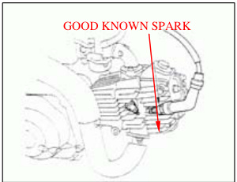

Disconnect the spark plug cap from the spark plug. Connect a known good spark plug to the spark plug cap and ground the spark plug to the cylinder as done in a spark test.

With the ignition coil primary wire connected, connect the peak voltage adapter or peak voltage tester probes to the ignition coil primary wire terminal and ground.

# Connection

- Black/yellow terminal (-) - Body ground (+)
- Turn the ignition switch ON and engine stop switch to "RUN".
- Shift the transmission into neutral.
- Crank the engine with the kickstarter and read ignition coil primary peak voltage.

# Peak Voltage

Minimum: 100V

If the peak voltage is abnormal, follow the checks described in the troubleshooting chart (page 14-2).

# Ignition Pulse Generator Peak Voltage Note

Check cylinder compression and that the spark plug is installed correctly.

Remove the seat assembly (page 2-2).

Disconnect the 4P connector from the ICM. Connect the peak voltage adapter or peak voltage tester probes to the connector terminals of the wire harness side.

## Tools

- Peak voltage tester
- Peak voltage adapter 07HGJ-00210100 (not available in U.S.A.) with commercially available digital multimeter (impedance 10MΩ DCV minimum)

# Connection

- Blue/Yellow terminal (+) - Green (-)
- Shift the transmission into neutral.
- Crank the engine with the kickstarter and read the peak voltage.

# Peak Voltage

Minimum: 0.7V

If the peak voltage measured at ICM connector is abnormal, measure the peak voltage at the pulse generator connector. Disconnect the ignition pulse generator connector (blue/yellow) and connect the peak voltage adapter or tester probes to the connector terminal of the ignition pulse generator side and ground. In the same manner as at the ICM connector, measure the peak voltage and compare it to the voltage measured at the ICM connector.

If the peak voltage measured at the ICM is abnormal and theThe text is already corrected and properly formatted in Markdown. Here is the translation:

One measured at the ignition pulse generator is normal, the wire harness has an open circuit or loose connection.
- If both peak voltages are abnormal, follow the checks described in the troubleshooting chart (page 14-2).

# ALTERNATOR EXCITER COIL PEAK VOLTAGE WARNING

Avoid touching the spark plug and tester probes to prevent electric shock.

## NOTE

Check cylinder compression and check that the spark plug is installed correctly.
Remove the seat assembly (page 2-2)

Disconnect the 3p and 2p connectors from the ICM. Connect the peak voltage adaptor or peak voltage tester probes to the connector terminals of the wire harness side.

# TOOLS

- Peak voltage tester
- Peak voltage adaptor 07HGJ-0020100 (not available in US)
- Commercially available digital multimeter (impedance 10M/DCV minimum)

CONNECTION: Black/Red terminal (+) - Green (-)

Shift the transmission into neutral. Crank the engine with kickstarter and read the peak voltage.

PEAK VOLTAGE: 100V minimum

If the peak voltage measured at the ICM connector is abnormal, measure the peak voltage at the alternator exciter coil connector.

Disconnect the alternator exciter coil connector (black/red) and connect the peak voltage adaptor or tester probes to the connector terminal of the exciter coil side and ground.

In the same manner as at the ICM connector, measure the peak voltage and compare it to the voltage measured at the ICM connector.

If the peak voltage measured at the ICM is abnormal and the one measured at the alternator exciter coil is normal, the wire harness has an open circuit or loose connection. If both peak voltages are abnormal, follow the checks described in the troubleshooting chart (page 14-2).

# IGNITION COIL REMOVAL/INSTALLATION

Disconnect the spark plug cap from the plug.
Disconnect the wires from the ignition coil.
Remove the bolt and ignition coil.

Installation is in the reverse order of removal.

**TORQUE: 6N m (0.6kgf m, 4.3 lbf.ft)**

# IGNITION CONTROL MODULE REMOVAL/INSTALLATION

Remove the seat assembly (page 2-2)
Disconnect the Ignition Control Module (ICM) connectors.
Remove the ICM from the frame.

Installation is in the reverse order of removal.

# ENGINE STOP SWITCH / IGNITION SWITCH INSPECTION

Disconnect the switch connectors.
Check for continuity between the black/white and green/white terminals of the switch side connectors.

There should be continuity with the switch OFF and there should be no continuity when the engine stop switch

## IGNITION TIMING WARNING

When the engine must be running to do some work, make sureEnsure the area is well-ventilated. Never run the engine in an enclosed area. The exhaust contains poisonous carbon monoxide gas that may cause loss of consciousness and lead to death. Run the engine in an open area or with an exhaust evacuation system in an enclosed area.

Warm up the engine.
Stop the engine and remove the left crankcase cover (page 10-2).
Connect the timing light to the spark plug wire. Start the engine and let it idle.
* IDLE SPEED: 1,700±100rpm

Read the instructions for timing light operation.

The ignition timing is correct when the "F" mark aligns with the index notch on the left crankcase. Increase the engine speed by turning the throttle stop screw and make sure the "F" mark begins to move clockwise. Install the left crankcase cover (page 10-8).

## ENGINE DOES NOT START OR IS HARD TO START

### Possible Causes
1. Check the fuel flow to the carburetor - not reaching carburetor. Potential issues:
   - Clogged fuel line and strainer
   - Clogged fuel tank breathe tube

2. Perform a spark test. If there's a weak or no spark, check the following:
   - Fouled spark plug
   - Faulty ignition control module
   - Broken or shorted spark plug wire
   - Faulty ignition pulse generator
   - Faulty engine stop switch or ignition switch
   - Loose or disconnected ignition system wires
3. Remove and inspect spark for a flooded carburetor. Check:
   - Choke valve closed
   - Air cleaner dirty
4. Try normal engine start procedures:
   - Inspect for improper choke operation
   - Adjust carburetor if needed
   - Check for intake pipe leaks
   - Check ignition timing (look for faulty ignition coil or pulse generator)
   - Check fuel for contamination
5. Test for low cylinder pressure and inspect:
   - Valve clearance (should not be too small)
   - Stuck valve
   - Worn cylinder and piston ring
   - Damaged cylinder head gasket
   - Seized valve
   - Improper valve timing

### Possible Causes
1. Raise the wheel off the ground and spin - if the wheel does not spin freely, check:
   - Brake dragging by hand
   - Worn or damaged wheel bearing
2. Check tire pressure - if low, check:
   - Faulty tire valve
   - Punctured tire
3. Test acceleration from low engine speed. If it doesn't increase:
   - Check for clutch slipping
   - Check for worn or warped clutch discs/plates
   - Weak clutch spring
   - Additives in engine oil may be causing the issue
4. Test light acceleration - if engine speed does not increase, check:
   - Choke valve (should not be closed)
   - Clogged air cleaner
   - Restricted fuel flow
   - Clogged muffler
   - Pinched fuel tank breath

1. Check ignition timing:
   - If incorrect, inspect for a faulty ignition control module
2. Test cylinder compression:
   - If incorrect, check:
     - Valve clearance (should not be too small)
     - Worn cylinder and piston rings
     - Leaking head gasket
     - Improper valve timing
3. Check carburetor for clogging.g
- Clogged Carburetor not serviced frequently enough
- Not clogged

4. Remove spark plug
- Fouled or discolored plug not serviced frequently enough
- Not fouled or discolored
- Spark plug is in the incorrect heat range

5. Check oil level and condition
- Incorrect: Oil level too high
- Oil level too low
- Contaminated oil

6. Remove cylinder head cover
- Valve train not lubricated
- Clogged oil passage and inspect lubrication properly
- Clogged oil control orifice
- Valve train lubricated properly

7. Check for engine overheating
- Overheating
- Excessive carbon build-up in combustion chamber
- Not overheating
- Use of poor quality fuel
- Clutch slipping
- Lean fuel mixture
- Wrong type of fuel

8. Accelerate or run at light speed
- Engine knocks
- Worn piston and cylinder
- Wrong type of fuel
- Engine does not knock
- Excessive carbon build-up in combustion chamber
- Ignition timing too advanced (faulty ignition control module)
- Lean fuel mixture

## Possible cause

1. Check carburetor air screw
- Incorrect: See section 5 adjustment
- Correct

2. Check for leaking intake pipe
- Leaking
- Loose carburetor mounting bolts
- Damaged insulator
- Not leaking

3. Perform spark test
- Weak or intermittent spark
- Faulty or fouled spark plug
- Faulty ignition control module
- Faulty ignition coil
- Broken or shorted spark plug wire
- Faulty engine stop switch or ignition switch
- Faulty ignition pulse generator
- Loose or disconnected ignition system wires

4. Check ignition timing
- Incorrect: Improper ignition timing (faulty ignition control module)

# POOR PERFORMANCE AT HIGH SPEED

## Possible cause

1. Disconnect fuel tube and check the Fuel flow restriction
- Clogged fuel line fuel flow
- Clogged fuel tank breather tube
- Faulty fuel valve fuel flows freely
- Clogged fuel strainer

2. Remove the carburetor and check
- Clogged
- Clean for clogging
- Not clogged

3. Check valve timing
- Incorrect: Cam sprocket not installed properly
- Correct

4. Check ignition timing
- Incorrect: Faulty ignition control module
- Correct

5. Check valve spring
- Weak
- Faulty spring not weak

# POOR HANDLING

## Possible cause

1. If steering is heavy
- Steering stem adjusting nut too tight
- Damaged steering head bearings

2. If either wheel is wobbling
- Excessive wheel bearing play
- Bent rim
- Improperly installed wheel hub
- Swingarm pivot bushing excessively worn
- Bent frame

3. If the motorcycle pulls to one side
- Faulty shock absorber
- Front and rear wheel not aligned
- Bent fork
- Bent swingarm
- Bent axle

## DOWNLOAD PDF

  <iframe
    src="/file/ThumpstarServiceManual.pdf#toolbar=0&navpanes=0&scrollbar=0"
    style={{ position: 'absolute', top: 0, left: 0, width: '100%', height: '100%' }}
    frameBorder="0"
    scrolling="no">
  </iframe>

The document 'Thumpstar Service Manual' is available for download below

[Download the file](../../../static/file/ThumpstarServiceManual.pdf)
