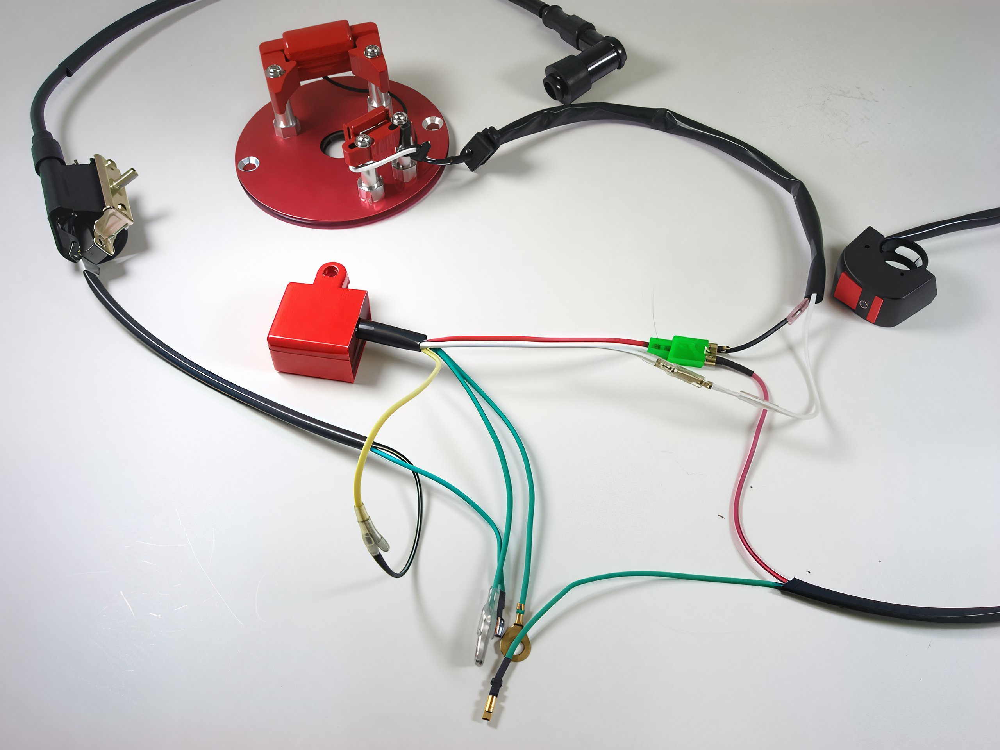

# China Inner Rotor Kit Wiring Information

1. The green wire with a loop fitting should be connected to the ground.
2. The green wire with a horseshoe fitting should be connected to the green terminal on the coil.
3. The yellow wire with a horseshoe fitting should be connected to the yellow terminal on the coil.
4. The brown wire should be connected to the white wire from the stator.
5. The red wire, which has two connections, should be connected to the black wire from the stator and also to a kill switch connection.
6. Position the IRK stator and pickup in the center of the adjustment range, maintaining an air gap equivalent to the thickness of a business card or approximately 0.012 inches.

**Note:** If difficulties persist, consider reversing the orientation of the stator.

### Troubleshooting

1. Substitute the spark plug with an alternative, as many have failed over time. Ensure the spark plug gap is set to 0.030 inches.
2. Adjust both the pickup (white wire device) and the stator (black wire device) to be 0.010-0.012 inches away from the rotor, using a business card for measurement.
3. Align both the pickup (white wire device) and the stator (black wire device) in the center of the slide screw adjustment.
4. Verify that the green ground wire is securely attached to the same bolt as the coil ground beneath the tank on the frame, ensuring the ground is free from debris.
5. As a last resort, consider flipping the stator.
