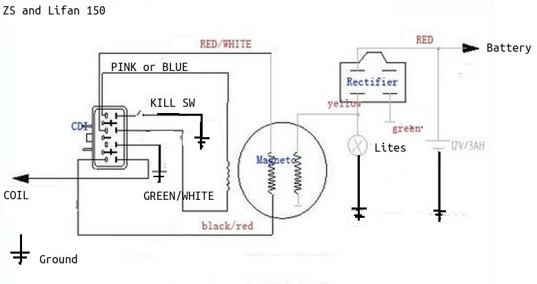
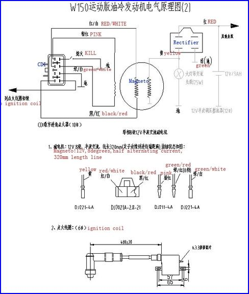

# Lifan and ZS External Rotor Wiring

### Instructions

1. Securely cap the yellow wire emerging from the engine.
2. Connect the two-wire female plug (red/white and black/red) from the engine to the corresponding harness.
3. Attach the solid black male connector from the engine to the pink female connector in the wiring harness.
4. Fasten the single green wire with the "eye" from the harness to the coil.
5. Connect the black/white and green wires from the harness to the kill switch.
