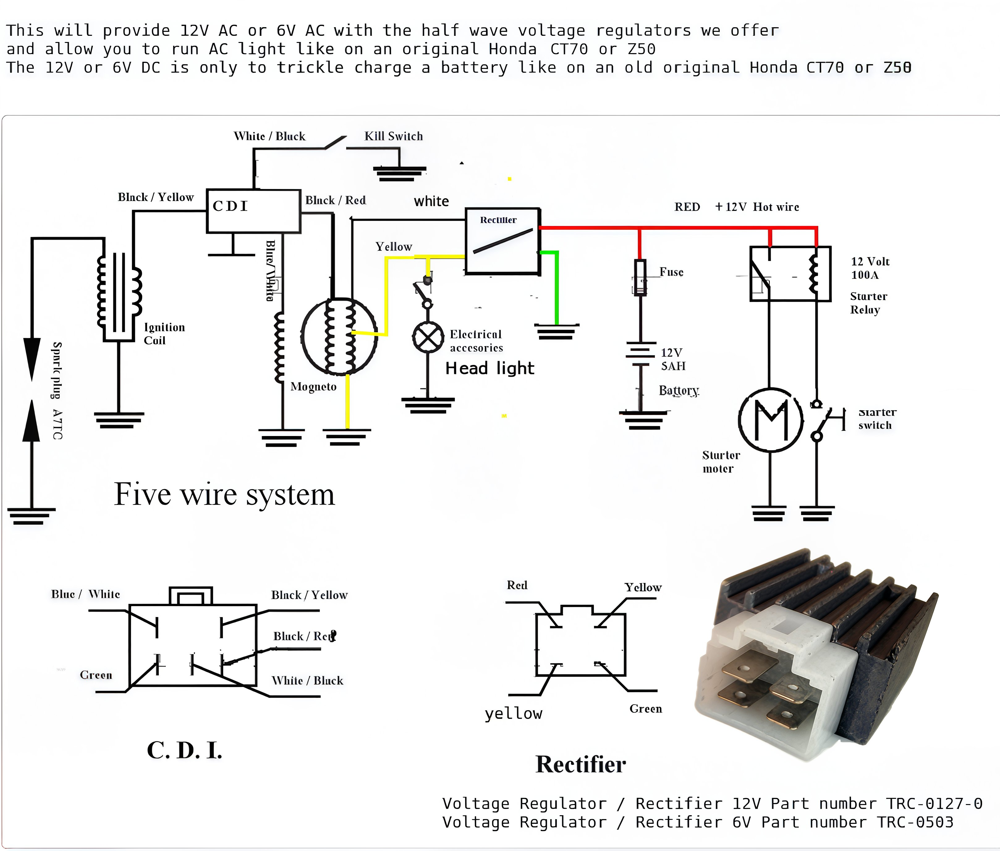
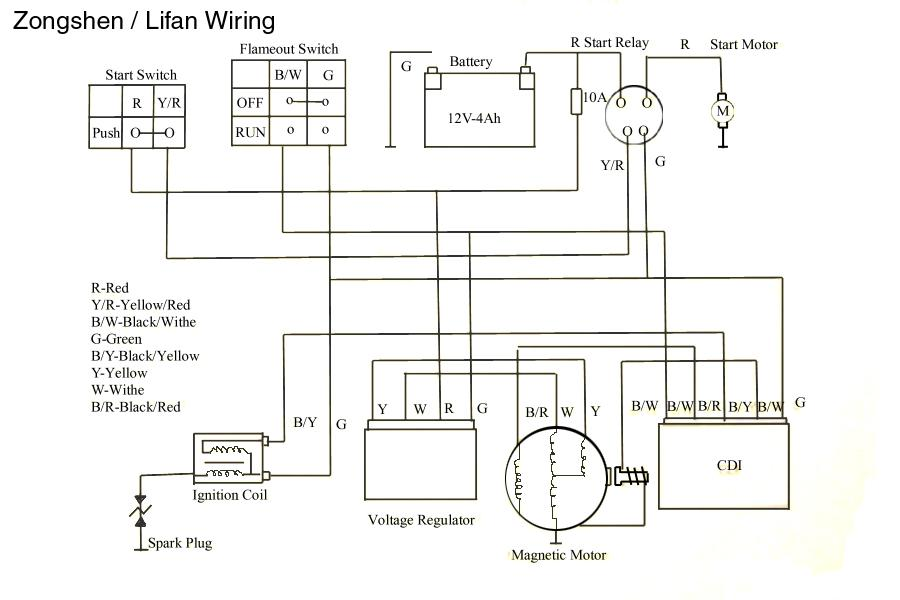
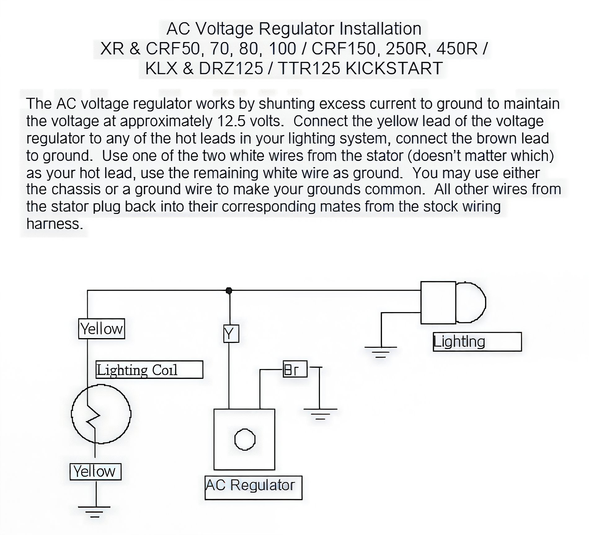
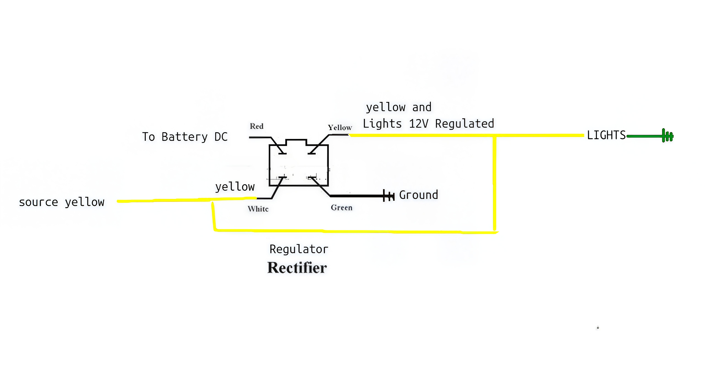

# Motorcycle Lighting Wiring Guide

## One Common Type of Pit Bike Wiring

## Another Common Type: Zongshen / Lifan Wiring

## Important Considerations

For YX stators equipped with two yellow auxiliary leads (as opposed to one yellow and one white), it is necessary to ground one yellow lead and utilize the other as your output. 

For Daytona models, ground the yellow/green lead and employ the yellow lead as the output.

The rectifier should be fed with the white lead, and the regulator with the yellow lead, both sourced from a single yellow lead from the engine. This setup provides an emulated DC to charge the battery, while the regulator dissipates voltages exceeding 12V to prevent light damage at high RPMs.

## AC Voltage Regulator Installation

## YX with Single Yellow Feed

Outlined below is the method to connect the four-wire voltage regulators to the YX single yellow feed.

