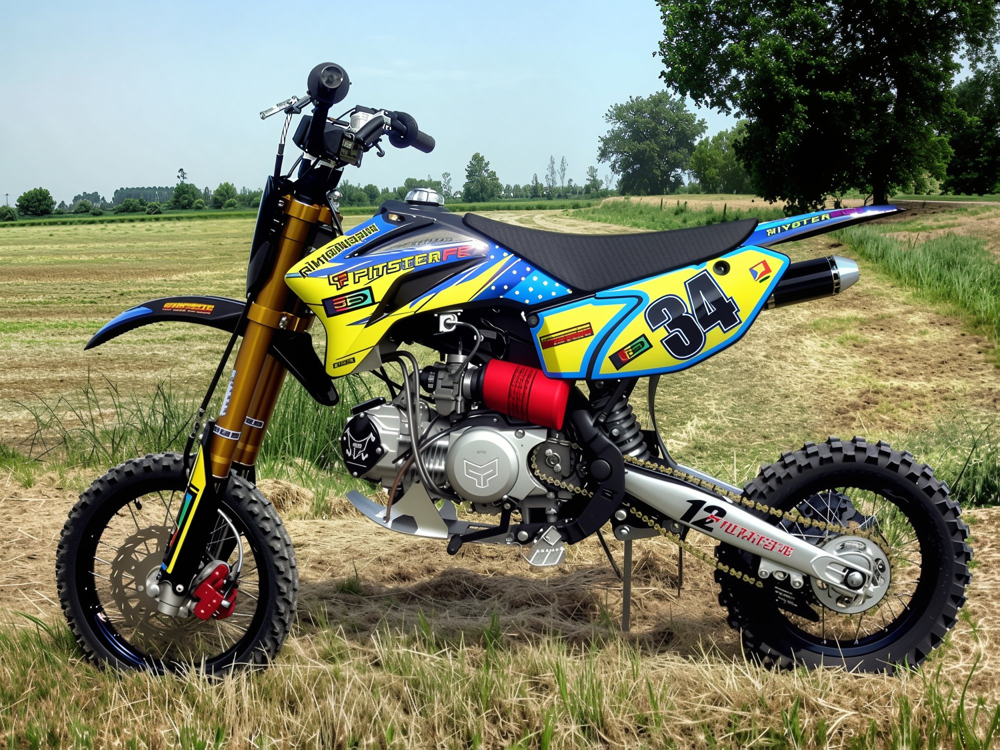
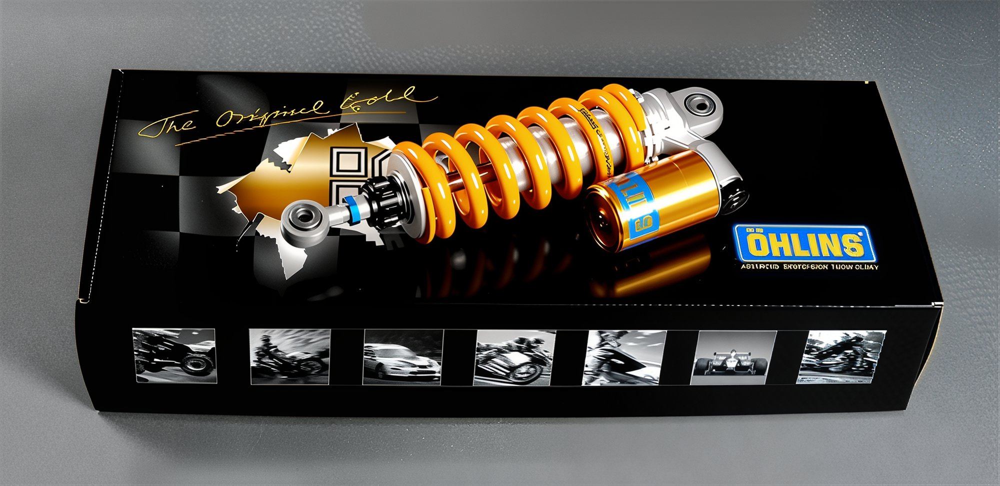
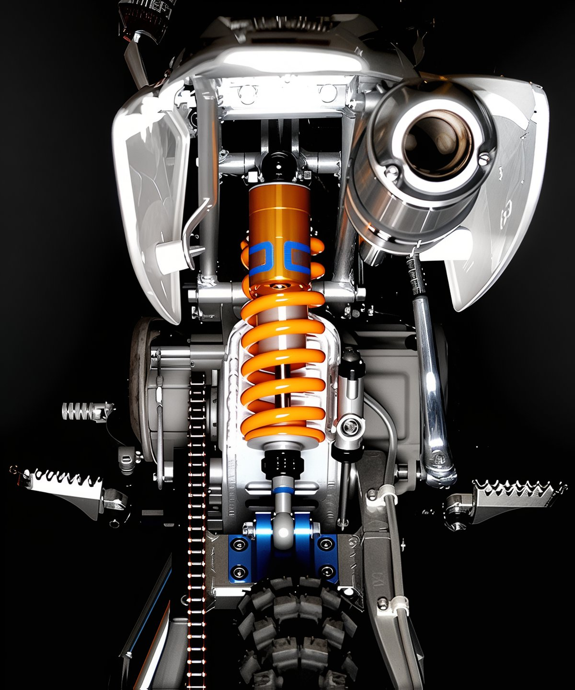

# Ohlins suspension for pit bikes

The Swedish company Ohlins, renowned for its superior shock absorbers for motocross, sport bikes, ATVs, as well as road motorcycles, has unveiled its innovations for the pit bike class.  The most advanced technological foundation and the meticulous attention of skilled craftsmen to each product allow for the production of unique shock absorbers with the finest characteristics. This ensures that racers experience unparalleled handling, while regular users enjoy maximum comfort and safety. Ohlins has introduced suspension tuning kits for pit bikes. These include front fork tubes for the PitsterPro LXR model.   And rear shock absorbers, depending on the pit bike model (whether it has a progressive linkage or not).    And for pit bikes with progressive suspension (such as the PitsterPro LXR) 