# Pit bike suspension tuning

Once the engine's power is maximized, the focus shifts to the chassis. In racing, controlling the motorcycle is crucial, as tracks vary greatly, and riders differ in weight and riding style. The suspension is arguably the second most important aspect after the engine's power. Following the lead of [Ohlins](http://mypitbike.ru/blog/tuning/38.html), other manufacturers from both Europe and China have begun offering their own shock absorber kits for pit bikes. 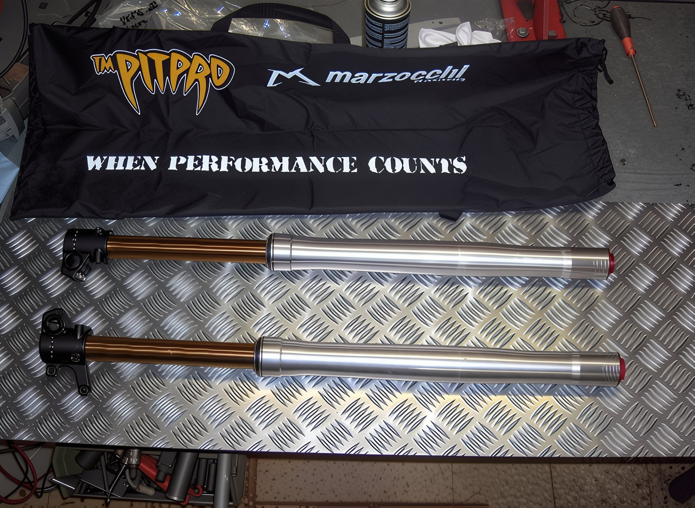 The Chinese company **DNM** produces a wide range of shock absorbers for all types of vehicles, from scooters to ATVs, including kits for pit bikes. Their shock absorbers are frequently found on pit bikes in Russia, such as PitsterPro. This replica of the **Marzocchi** fork set is priced at **350 euros**. 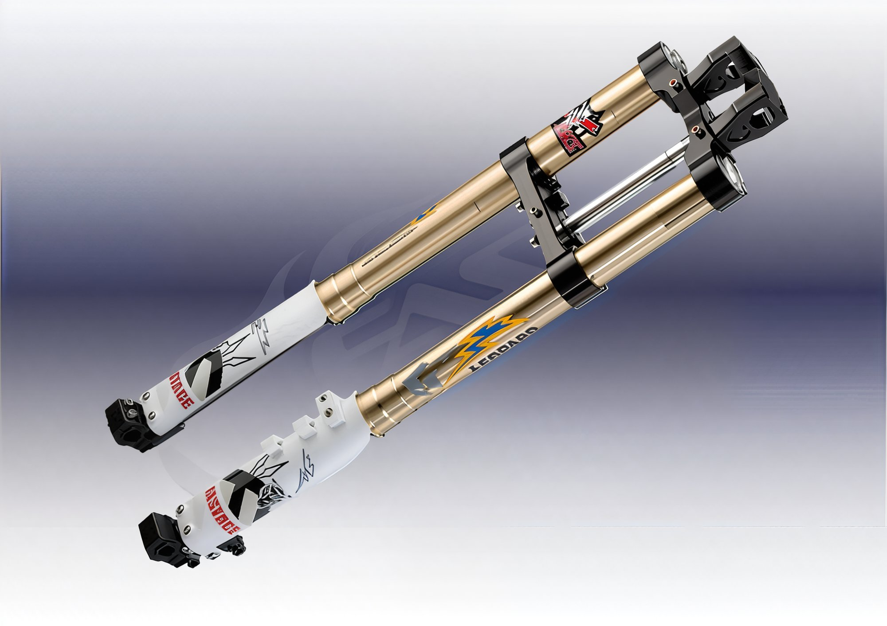 Another Asian suspension kit manufacturer is **Fastace**. Alongside DNM, they rightfully hold a leading position in popularity among the public and pit bike manufacturers. Almost all **BSE** motorcycles are equipped with shock absorbers from this company. Recently, Fastace introduced a top-tier front fork set called **Leopard**, priced at **400 euros**. Next come the renowned European manufacturers. 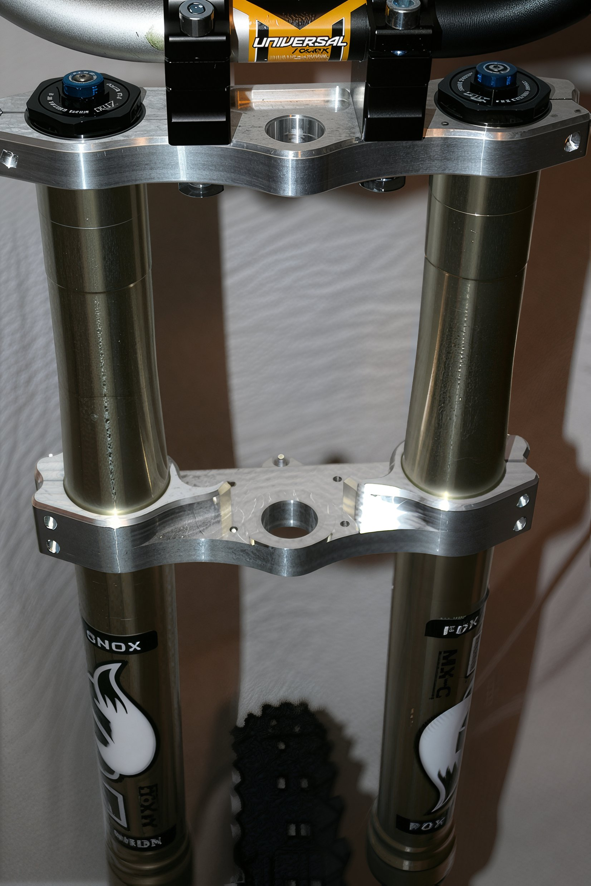 A fork set from **FOX**. The price is unknown. 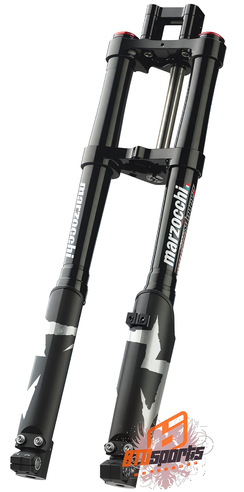 The Italian company **Marzocchi** offers its top-tier fork set with a triple clamp for **1200 euros**. 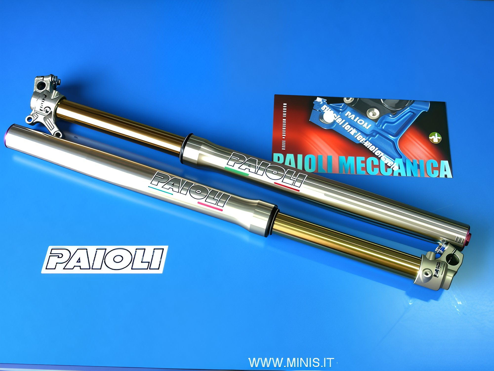 This fork set is also from an Italian manufacturer, **Paioli**. 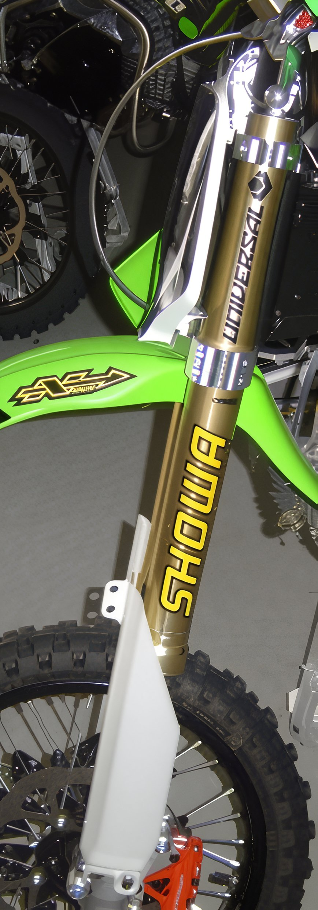 The Japanese company **Showa** has also joined the fray. The range of rear shock absorbers is equally comprehensive. 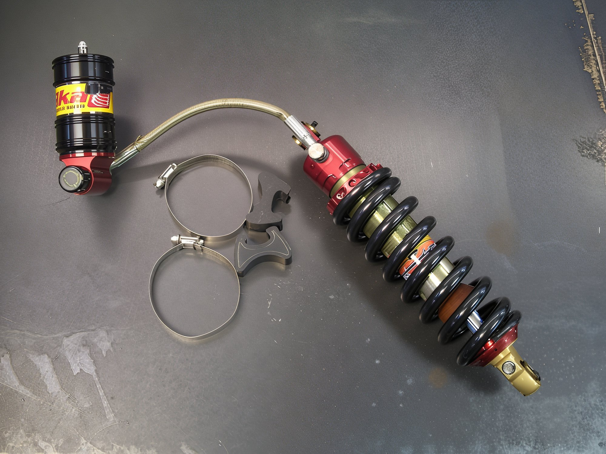 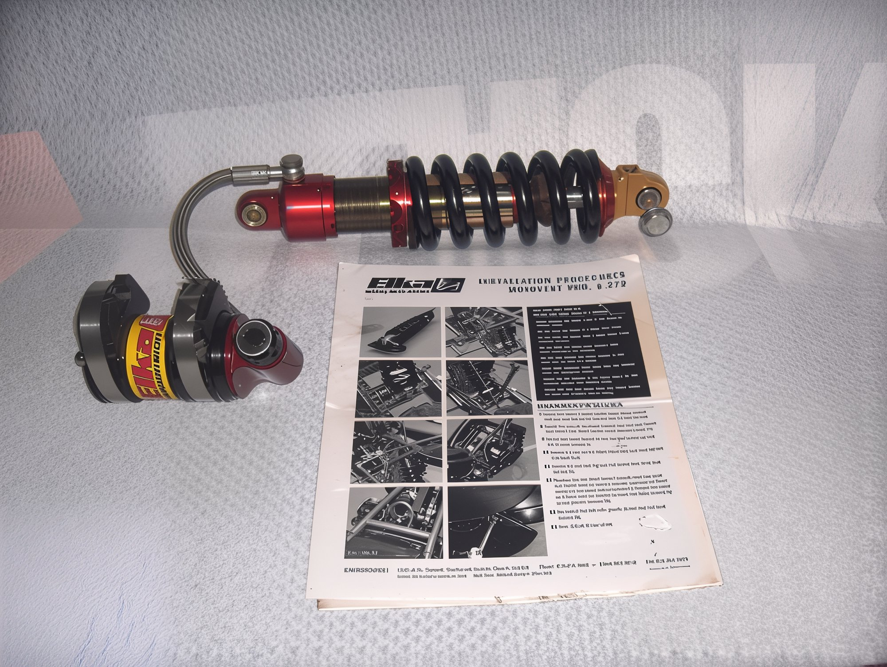 **Elka Suspension** - 350 euros. 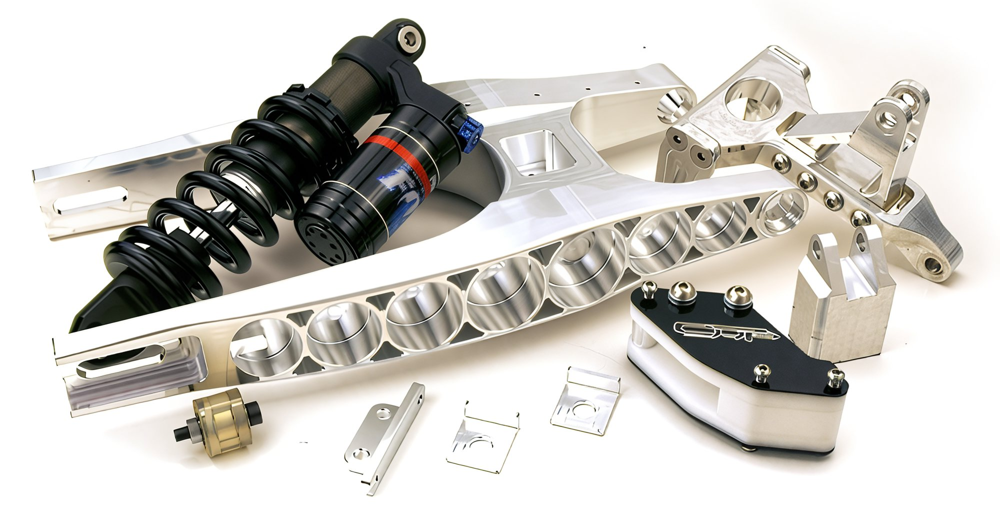 **FOX** - 500 dollars.  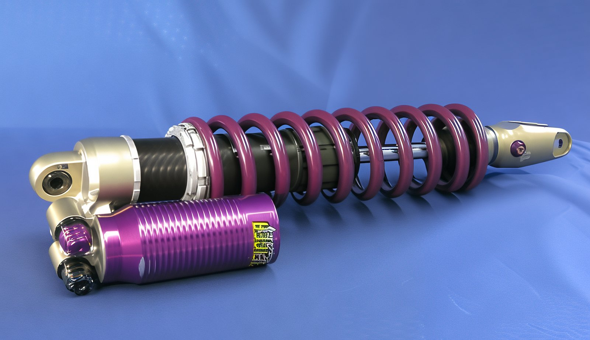 **Reiger** for pit bikes with progressive linkage - 600 euros. 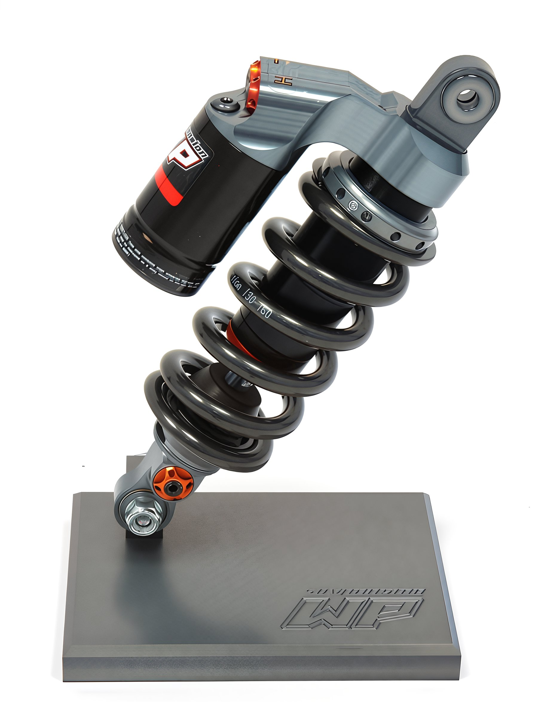 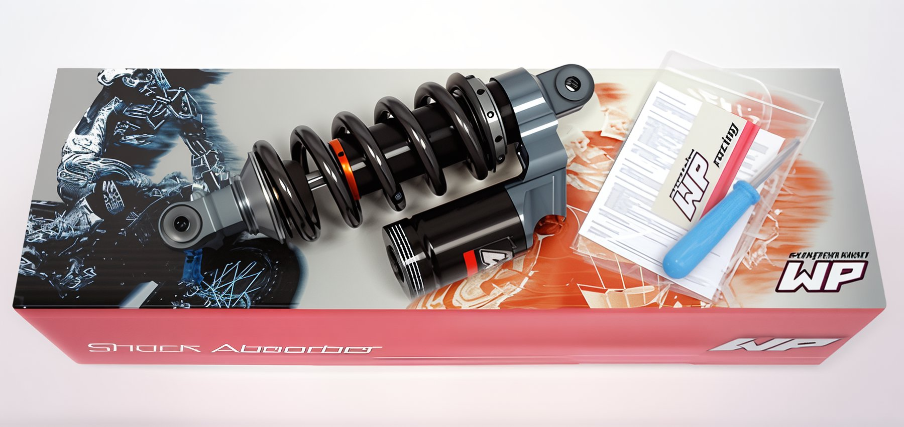 **WP (White Power)** offers a remarkable shock absorber with numerous adjustments, priced at 765 euros.