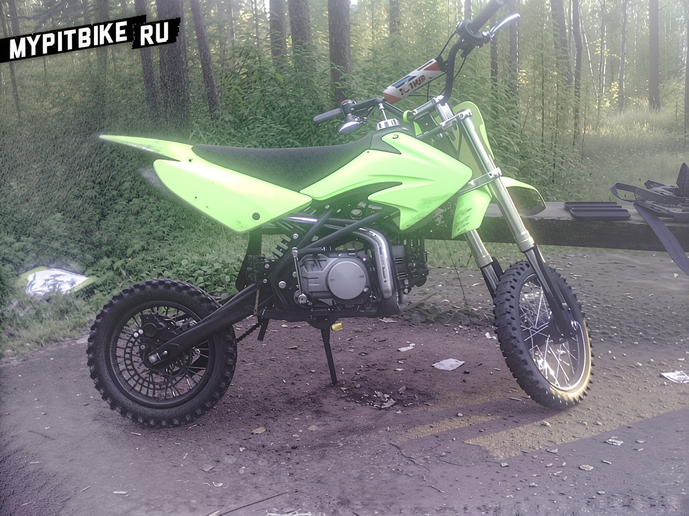
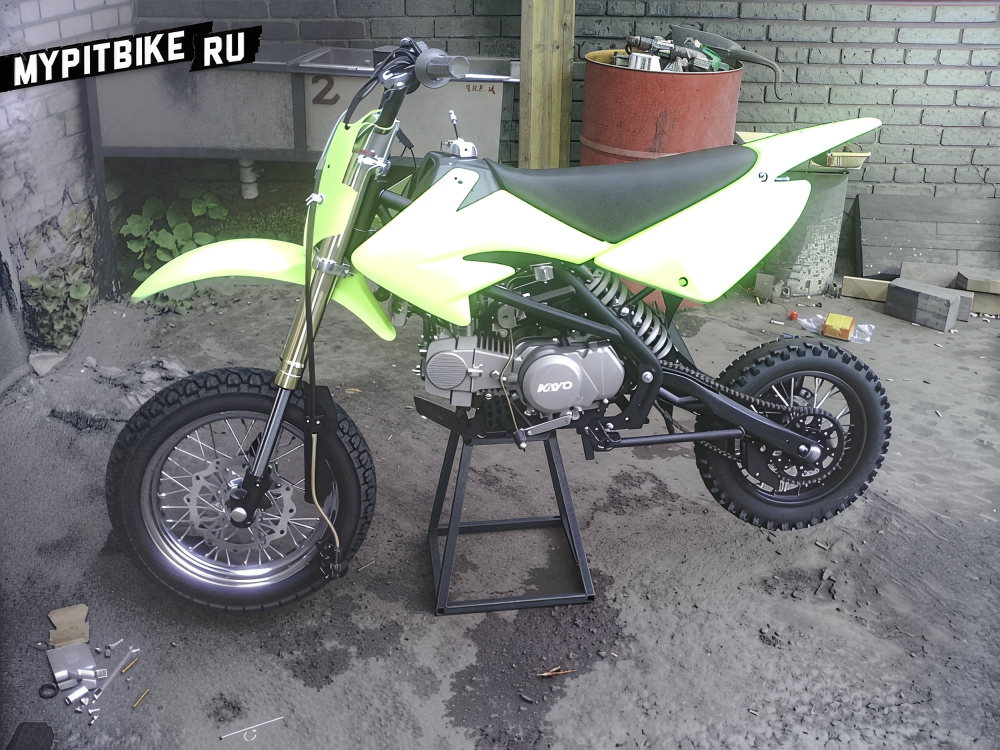
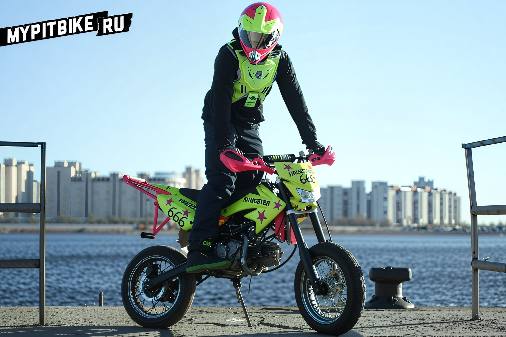

# Pitbike project: kayoster 190cc 4v sm

Today, we shall delve into an intriguing project: the transformation of a **supermoto pit bike based on the Kayo 140cc**, equipped with a **Zongshen 160** cc engine and a customized **four-valve Devil Head cylinder head**. The project was undertaken during the winter of 2013-2014. The foundation was a pit bike, the **Kayo 140cc**, which came with 12"/14" cross wheels, fully assembled and tuned from the store.  The pit bike exhibited acceleration lags and jerks when starting, indicating a poor mixture and an unadjusted clutch. The braking was inadequate; the rear brake was non-functional, and the front barely engaged. Most issues were resolved after the initial maintenance. The pit bike was almost immediately repainted in a vibrant green hue. The plastic was sanded, degreased, followed by two layers of primer, two layers of paint, and finally, a lacquer finish.  The decision was made to abandon the cross tires, as the pit bike was primarily used on asphalt. The choice fell on 14-inch **supermoto wheels from PitsterPro** with a width of 3". Contrary to popular belief, the wheels did not fit without modifications. The axle bushings were incompatible, the front brake disc was oversized, and the rear wheel's sprocket was for a 428 chain. Many changes were necessary, but with skilled assistance, the wheels were successfully mounted. Surprisingly, the **standard Kayo triple clamp accommodated a 110 tire** without touching the fork legs.   After considerable time riding the modified pit bike, it became apparent that 140 cc was insufficient for urban use. The original engine was sold, replaced by a brand new **Zongshen 160R**. Research revealed that the engine could be enhanced with a **Devil Head Kit**, increasing the displacement to nearly 190 cc. The kit, featuring a four-valve head, a cylinder enlarged to 63mm, and a piston with a skirt shortened by 2mm, exceeded all expectations! The headlight was easily connected, thanks to the engine's pre-installed generator with an additional winding. With increased power, cooling became a critical issue. The decision was made to install not one, but **two oil radiators from PitsterPro**, akin to the setup on the **LXR model**. A **Mikuni VM26 carburetor** with a 107 jet was installed, but the exhaust required adjustments due to a different exhaust port angle. The exhaust pipe had to be bent further to fit correctly. For stunt riding, a crash cage was ordered from Moscow, and an economical version of a rear brake duplicator was developed independently. Instead of a full second caliper on the rear wheel, the brake pedal and master cylinder were removed, and the brake line was extended to a second brake lever on the handlebar. The pit bike is currently in the break-in phase, and its top speed and dynamics have yet to be measured. The owner notes a significant increase in compression and engine torque.  **Cost of main components:**

- Engine Zongshen 160 - 24,000 RUB
- Devil Head Kit 3 - 16,000 RUB
- Wheels assembly - 11,000 RUB
- Left brake lever + extended hose - 2,500 RUB
- Cage and pegs - 7,000 RUB
- 2 oil radiators - 3,600 RUB
- Mikuni VM26 + FNS + Jet kit - 3,200 RUB
- Front headlight - 1,500 RUB
- Handguards - 1,000 RUB
- Pitbike handlebar pad - 500 RUB
- Grips + 17-tooth front sprocket + Kill Switch - 1,500 RUB
- Magnetic drain bolt - 400 RUB
- RK chain - 1,600 RUB

The project author, [**Mishanya "FreakyMurder"**](http://vk.com/FreakyMurder), extends gratitude to FMC and MRT. We are confident that these are not the final modifications, and future stages of this project will be featured on our website!