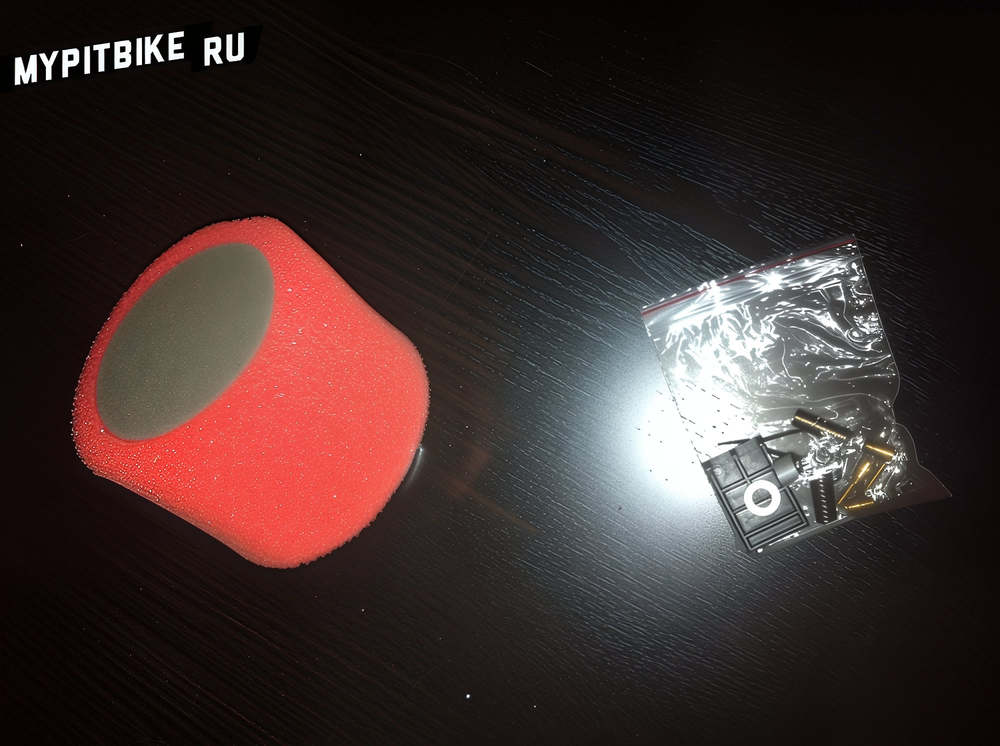
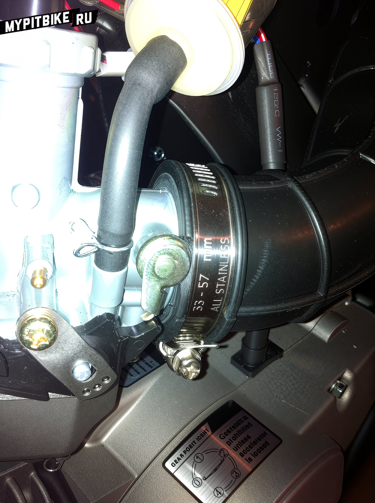
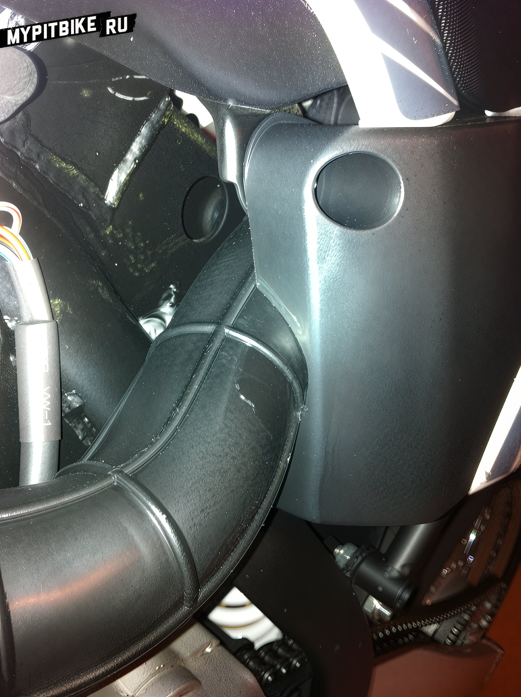
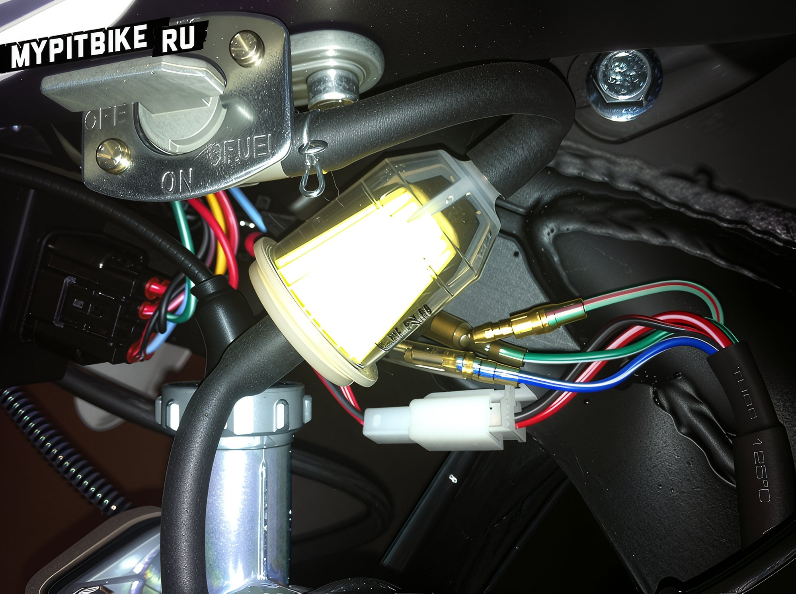
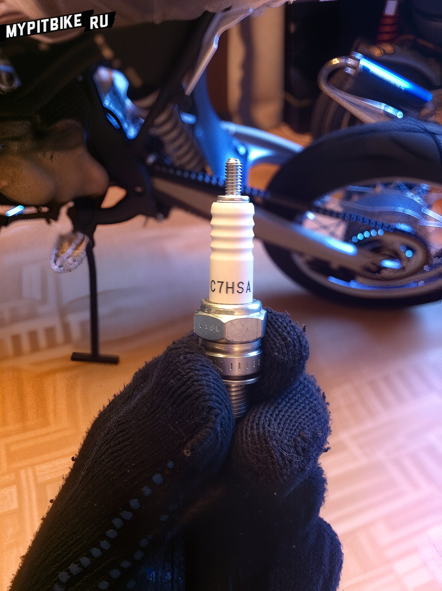
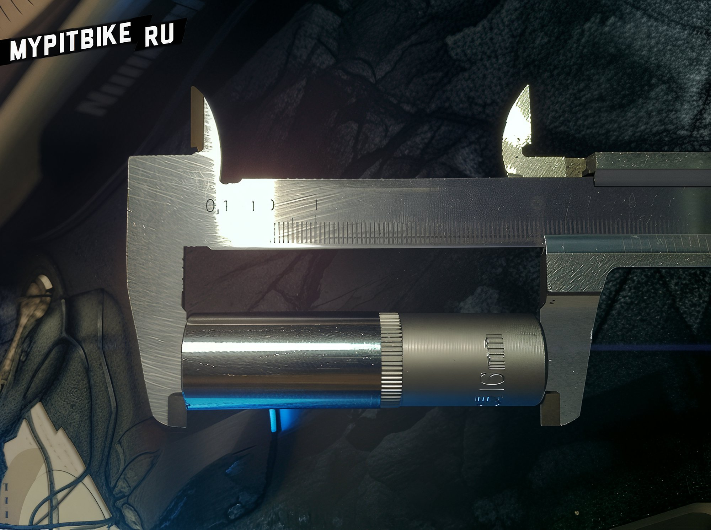

# Refinement of the pitsterpro pit bike

Today, we'll discuss upgrading a pit bike for long-term, trouble-free operation. We will be upgrading the **PitsterPro** pit bike straight "out of the box."

#### 1. Installing an Airbox

By default, all pit bikes now come with a high-flow air filter (also known as a zero-resistance filter). It has its pros and cons. The advantages are that air passes through **faster and in greater** volumes. The downside is that it needs frequent cleaning, and during rain, the **filter quickly gets wet** (since it's open), reducing air intake, fouling the spark plug, and causing the engine to stall. Without a spark plug wrench on hand to dry it, you might find yourself stranded in the rain kick-starting your stalled pit bike for ages.  There are various makeshift solutions, like covering the filter with a bottle or other protective sleeves, but we won't consider them. Manufacturers have already devised a solution for us: a **closed airbox** with a hose leading to the carburetor, mounted under the seat (like on full-sized motorcycles). The beauty here is that it's located in such a way that water would have a hard time reaching it, even if directly poured. It's enclosed by plastic side panels, protected by a rubber flap from below, and covered by the rider's seat from above. The box is not entirely sealed; it has an opening on top for air intake, which then flows through a sponge and into the carburetor. This design allows for **adequate breathing for the engine**. Before installation, open the box (by unscrewing three screws) and soak the filter element with special oil. I used a sticky **filter oil**. Squeeze out any excess by hand, then place the filter back, and reassemble the box. Once assembled, proceed to install it on the pit bike. You'll need to remove the left plastic side panel to access the mounting flanges. The airbox fits into its designated place without issues, though I encountered a problem with the hose.  Evidently, the carburetor on my pit bike was smaller than the required diameter, which caused the **hose to fit loosely**. I found two solutions. Firstly, wrap enough electrical tape around the carburetor to even out the size. Secondly, a more aesthetic solution: cut a rubber ring from the old high-flow filter and glue it inside the airbox hose. After some tweaking with a knife, sandpaper, and "Moment" glue, I had a reliable and sealed construction.  *Tip: Loosen the clamps, attach the hose to the carburetor first, then secure the airbox, and finally tighten the whole assembly with the clamps.*   Next, reattach the plastic side panel, but here's where the designers miscalculated. The edge of the plastic **pinches** the hose. The solution is simple: mark the diameter of the hose, draw a semicircle where the plastic interferes, then, using a hacksaw or rotary tool, cut out the marked semicircle, sand down the cut area, and test-fit. If it fits nicely and is at the correct spot, bolt the side panel back in place. 

#### 2. Installing a Fuel Filter

A seemingly trivial part like a **fuel filter** is omitted by default in manufacturing. The absence of a filter means impurities can be washed into the carburetor from the fuel tank during the first refuel, **clogging the jets**. There's debate regarding fuel filters supposedly allowing fuel to pass too slowly, resulting in an empty float chamber. Personally, I haven't encountered this issue, and pit bike engines aren't exactly high-displacement to consume fuel at such rate.  Visit any auto/moto shop and buy a small fuel filter. Install it in-line with the hose running from the fuel tap to the carburetor. **The filter is directional!** Ensure the arrow on the filter points towards the carburetor, following the fuel flow.

#### 3. Replacing the Spark Plug

Not everyone might know how to do this, so here's how. Immediately replacing isn't necessary. On my pit bike, it came with a **NGK C7HSA** spark plug.   However, if you need to replace it (perhaps your bike has a subpar Chinese plug by default), you'll need a spark plug wrench or a **16mm deep socket**, available in any hardware store with tools.  Start by removing the plug wire cap, then turn the plug counterclockwise, note the marking, head to an auto/moto shop to buy the correct plug, screw it in clockwise (moderately), replace the plug wire cap, and ride away.

#### 4. Installing an Hour Meter

This is a useful gadget. It helps track maintenance intervals, indicating when to **change the oil** in the engine. It costs around 1000 rubles. Available at motocross-focused shops and widely on **Ebay** and other online stores/auctions. It consists of a small box with a display and a wire. The box works with an internal battery. Installation is straightforward. Secure the box using double-sided tape or cable ties in a convenient spot, measure the wire length to the spark plug cap with a 5-6 coil reserve, and cut off any excess.  Wrap the end around the high-voltage wire for five turns and secure it with either electrical tape or a zip tie, as I did. Now the display will update based on the engine's running hours. **Change oil as per the manual.**  **That's all for today ;)**