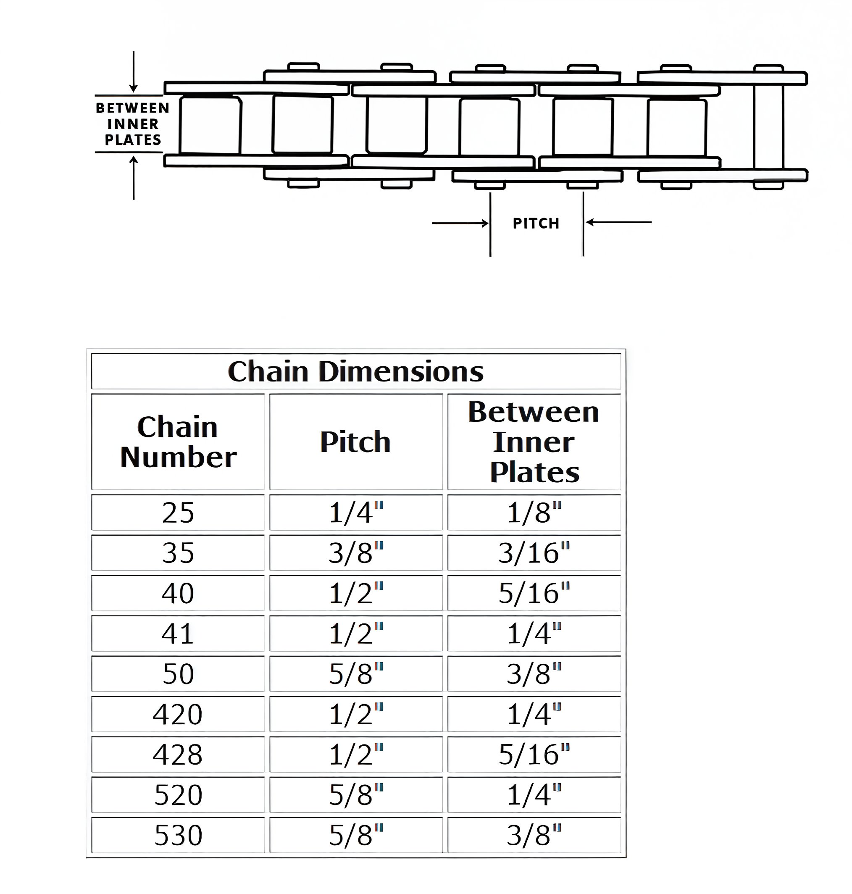

---
tags:
- chain
- specs
---

# Chain Sizing

## Common Chain Size for Pit Bikes

Most pit bikes utilize 420 chains, including models such as:
- CRF50
- XR50

## Roller Sizing Details

- **420 Chain**: 7.7mm
- **428 Chain**: 8.5mm

| Chain Dimensions     |       |          |
|----------------------|-------|----------|
| **Chain Number**     | **Pitch** | **Between Inner Plates** |
| 25                   | 1/4"  | 1/8"    |
| 35                   | 3/8"  | 3/16"   |
| 40                   | 1/2"  | 5/16"   |
| 41                   | 1/2   | 1/4"    |
| 50                   | 5/8"  | 3/8"    |
| 420                  | 1/2'  | 1/4"    |
| 428                  | 1/2"  | 5/16"   |
| 520                  | 5/8"  | 1/4"    |
| 530                  | 5/8"  | 3/8"    |

