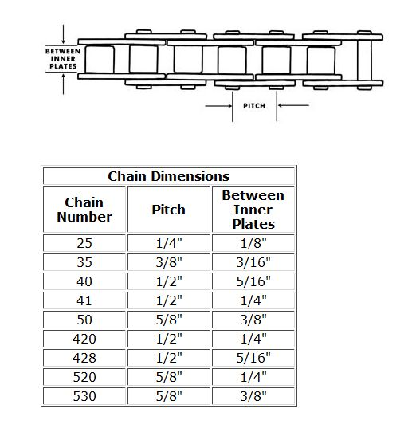

---
tags:
- chain
- specs
---

# Chain Sizing

## Common Chain Size for Pit Bikes

Most pit bikes utilize 420 chains, including models such as:
- CRF50
- XR50

## Roller Sizing Details

- **420 Chain**: 7.7mm
- **428 Chain**: 8.5mm

