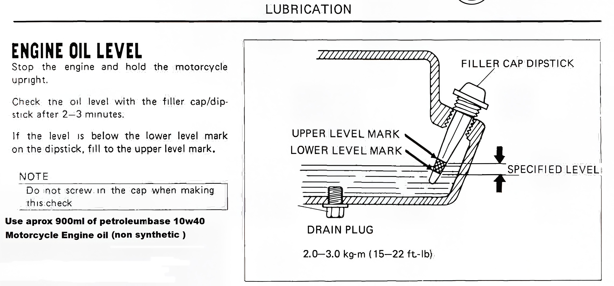

---
tags:
- oil
- engine
---

# Checking Oil Level

Stop the engine and hold the motorcycle upright.
Check the oil levet with the filler cap/dipstick aften 2-3 minutes.
1f the leve1 is below the lower leyel mark on the dipstick, fill to the upper level mark.

> Do inot screw in the cap when making this check
> Use aprox 900ml of petroleumbase 10w40 Motorcycle Engine oil (non synthetic )

