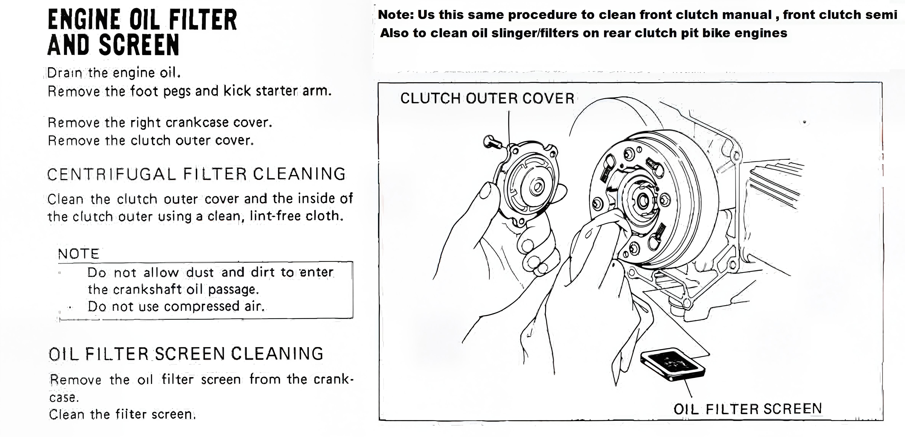

---
tags:
- oil
- engine
---

# Cleaning and Maintenance Oil Filter and Oil Slinger

Drain the engine oil.   
Remove the foot pegs and kick starter arm. Remove the right crankcase cover.   
Remove the clutch outer cover.

CENTRIFUGAL FILTER CLEANING 

Clean the clutch outer-cover and the inside ot the clutch outer using a clean, lint-free cloth.

> Do not allow dust and dirt to enter the crankshaft oil passage. Do not use compressed air.

**Note:** Us this same procedure to clean front clutch manual, front clutch semi. Also to clean oil slinger/filters on rear clutch pit bike engines

OIL FILTER SCREEN CLEANING

Remove the oil filter screen from the crankcase.
Clean the filter screen.

