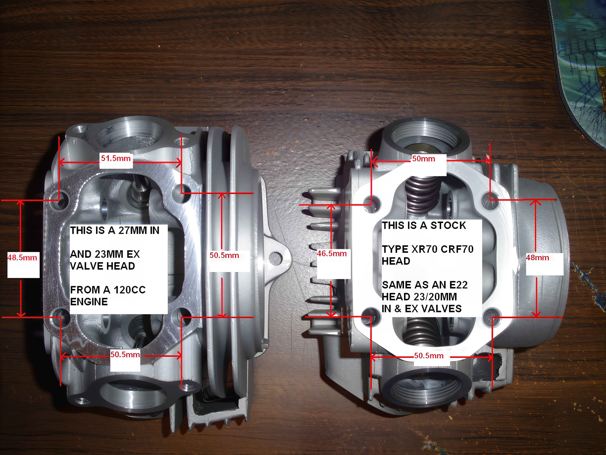

---
tags:
- engine
- head
---

# Comparison of Engine Heads

GPX/YX/LIFAN 120/124/140/150cc Type (Left) vs. Stock Honda CRF50/70 & Small China 50cc-110cc e22 Type (Right)

All of these engine heads are compatible with CRF type exhaust pipes and intake manifolds.

