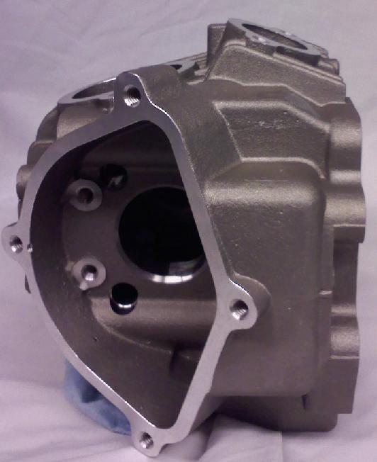

# Cylinder Head Types

This cylinder head design accommodates CRF50 and Lifan-style intake manifolds and exhaust systems. Notable features include an intake port that is nearly level on the top, akin to a CRF50 or Lifan engine. Additionally, the exhaust studs measure 6mm.

## YX 150/160, ZS155, TB V2 & Takagawa +R (KLX-Type)

This variant features KLX110-style ports, with a 17-degree rearward slant on the intake and 8mm head studs. It is compatible with KLX110-style intake manifolds and exhaust systems.

