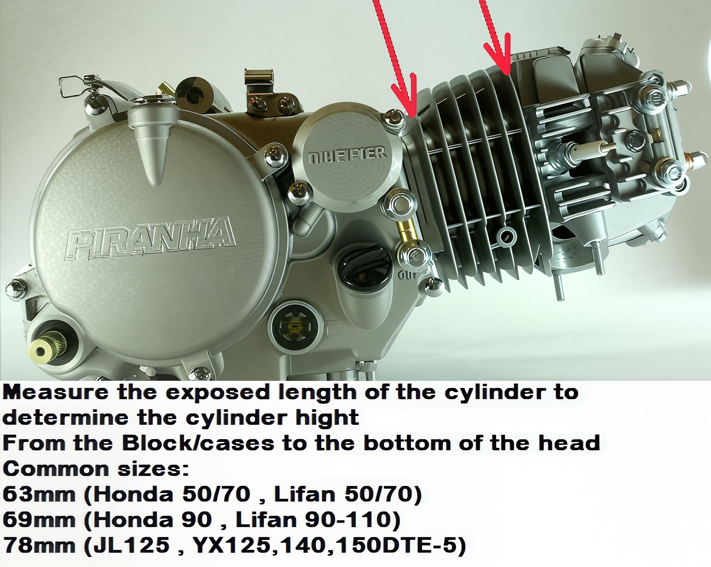

---
tags:
- cylinder
- specs
---

# Cylinder Sizing

Measure the exposed length of the cylinder to determine the cylinder hight.
From the Block/cases to the bottom of the head.

**Common sizes:**   
63mm (Honda 50/70 , Lifan 50/70)   
69mm (Honda 90 , Lifan 90-110)   
78mm (JL125 , YX125,140,150DTE-5)

