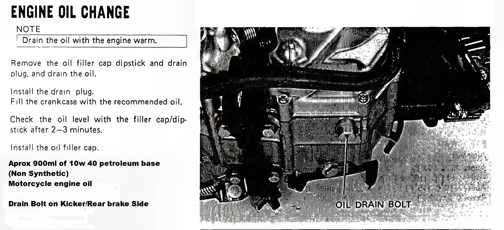

---
tags:
- engine
- oil
---

# Engine Oil Change

> Drain the oil with the engine warm.

1. Remove the oil filler cap dipstick and drain plug, and drain the oil.
2. Install the drain piug.
3. Fill the crankcase with the recommended oil.
4. Check the oil level with the filler cap/dip stuck after 2-3 minutes.
5. Install the oil filler cap.

**Aprox 900ml of 10w 40 petroleum base (Non Synthetic) Motorcycle engine oil.**

Drain Bolt on Kicker/Rear brake Side.

