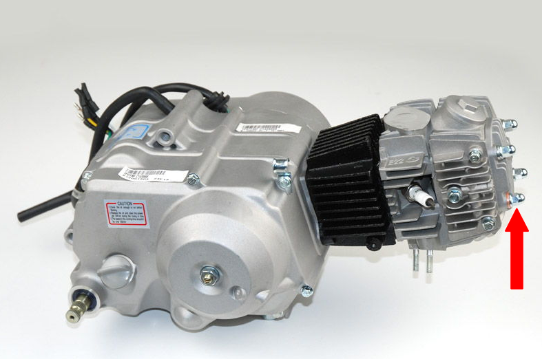
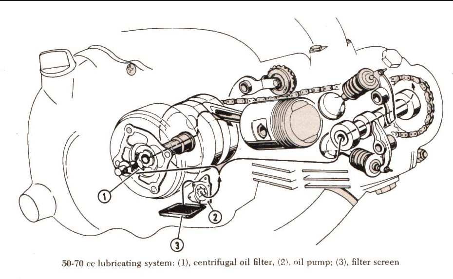

# Engine Oil Circuit and Oil Flow Test Tech

## Honda Z50, XR50, CRF50, CT70, XR70, CRF70, and Other 70s

All these models draw their oil from a common location within the crankcase, situated near the drain bolt and oil screen. 

### Testing Oil Pump Functionality

To verify the operation of the oil pump without the engine running and with the spark plug removed, follow these steps:

1. Loosen the head nut that is equipped with a copper washer.
2. Kick the bike over repeatedly until oil begins to seep from the area around the washer.

