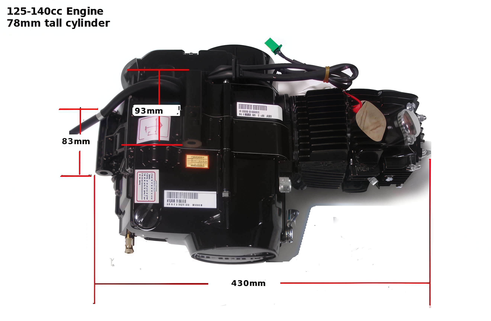

---
tags:
- engine
- specs
---

# Engine size

Pit bike engines are fundamentally derived from the Honda 70 series engines. These engines are currently utilized in Honda CRF50 and CRF70 models. The primary motor mounts and the four lower mounting points, known as peg mounts, are consistent across all pit bike engines. These engines are compatible with all Chinese pit bikes and most older or current Honda models equipped with horizontal OHC engines, excluding the KLX110 and DRZ110.

## Key Sizing Variations

1. Engines with a displacement of 90-110cc are 9mm taller at the head, attributed to a longer cylinder.
2. Engines with a displacement of 120cc and above are 15mm taller due to an extended cylinder length.

This diagram provides measurements for engine mounts on a motorcycle engine, highlighting locations for the top motor mount and back lower mount. It shows crank and cam center alignment, with all dimensions in millimeters.

### Engine Mount Measurements

| Feature              | Measurement (mm) |
|----------------------|------------------|
| Top Motor Mount      | -                |
| Back Lower Mount     | 107              |
| Engine Length        | 450              |
| Engine Height        | 230              |
| Crank & Cam Center   | -                |

Note: Measurements are approximate as detailed in the diagram.

## Motor Mount Information

**The approximate width of pit bike engines is 11 inches (280mm).**
