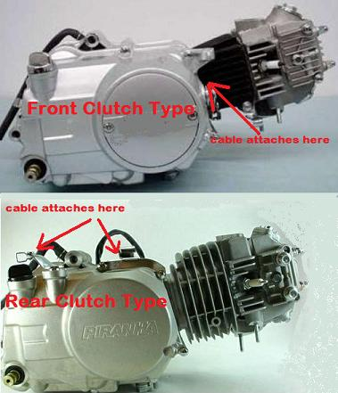
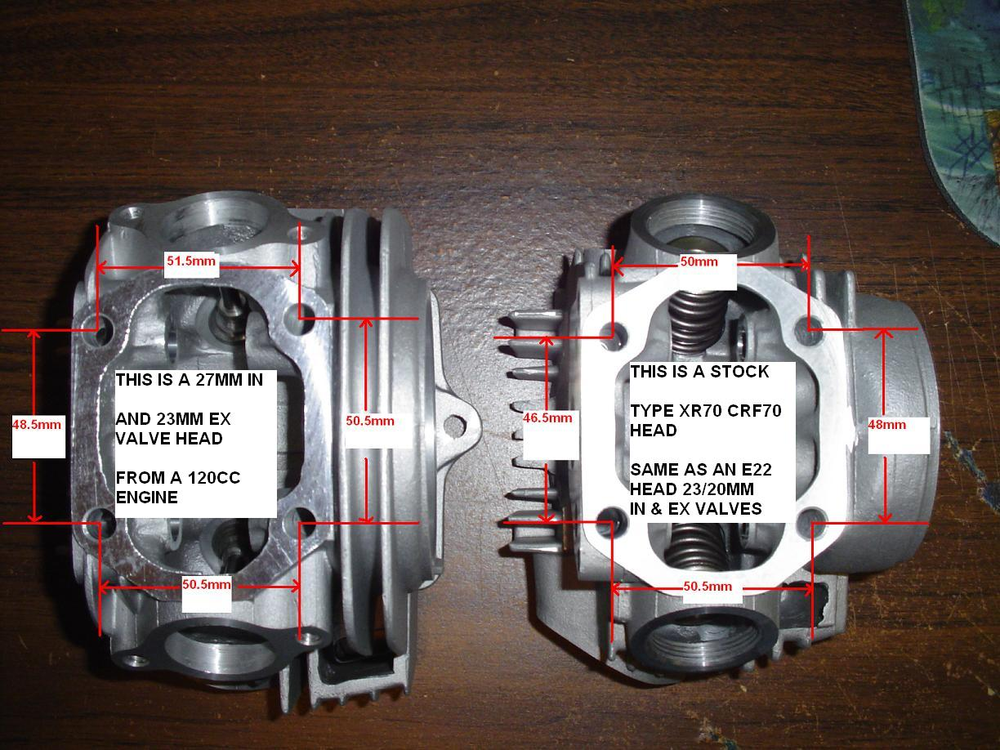
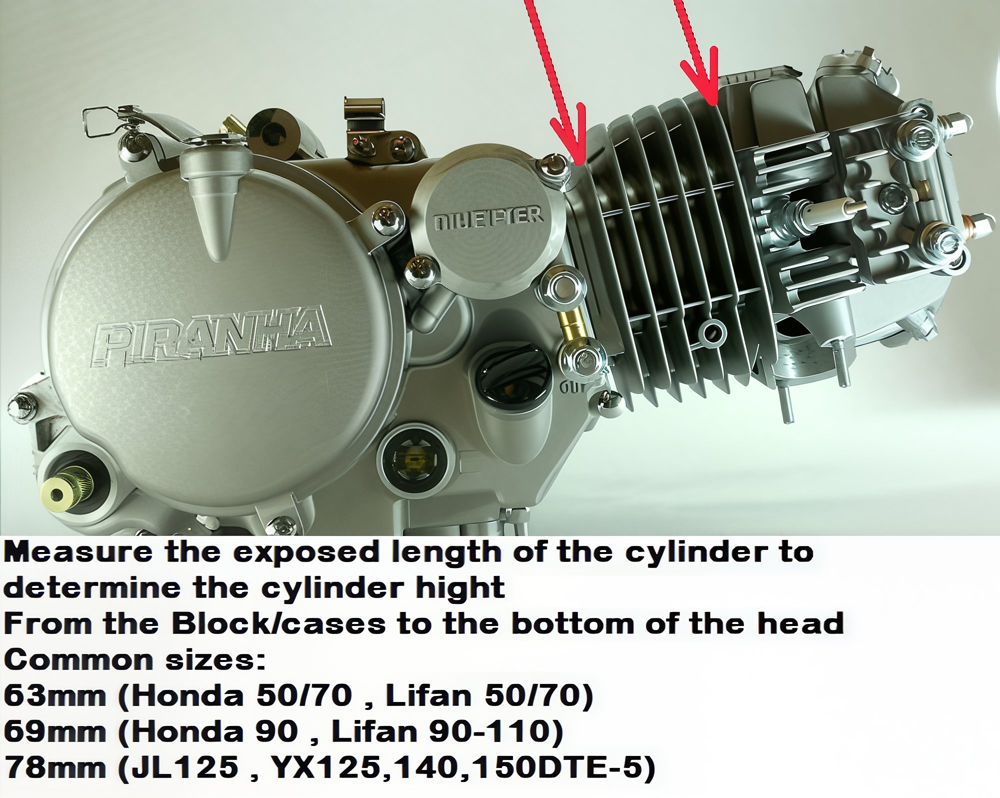

---
tags:
- engine
---

# Pit Bike Engine Types

When considering the various types of pit bike engines, such as the GPX124cc and YX160cc, some are straightforward to recommend kits for, as we have experience building these. However, other engines present more challenges, and simply knowing the bike or model will not suffice. Engine numbers are also unhelpful, as we lack references for these identifiers.

To determine the appropriate kit, consider the following key factors, which will help narrow down the options to those that are truly compatible:

1. **Clutch Position**: Identify whether the clutch is located at the front on the crankshaft or at the rear on the transmission main shaft.  
   

2. **Stud Pattern**: Determine if the engine uses a Honda 50 stud pattern or a larger Lifan GPX type.  
   

3. **Cylinder Size**: Measure the cylinder size, which could be 63mm, 69mm, 78mm, 81mm, or another dimension.  
   

4. **Piston Wrist Pin Size**: Check the size of the piston wrist pin, which may be 13mm, 14mm, or 15mm.

5. **Spigot or Case Hole Diameter**: Measure the inside diameter of the spigot hole or case hole.

6. **Camshaft Sprocket Tooth Count**: Identify the tooth count on the camshaft sprocket, with 28T or 32T being common.

7. **Head Markings**: Look for any markings on the head, such as "e22," which is common on 50-110cc Chinese heads.

8. **Cylinder Markings**: Check for any markings on the cylinder that indicate the bore size.

9. **Spigot Hole Measurement**: Measure the spigot hole, which is the opening created by the cases once the cylinder is removed. Most kits will fit directly into this hole. If the new kit cylinder does not fit the spigot hole, a case bore will be necessary.
