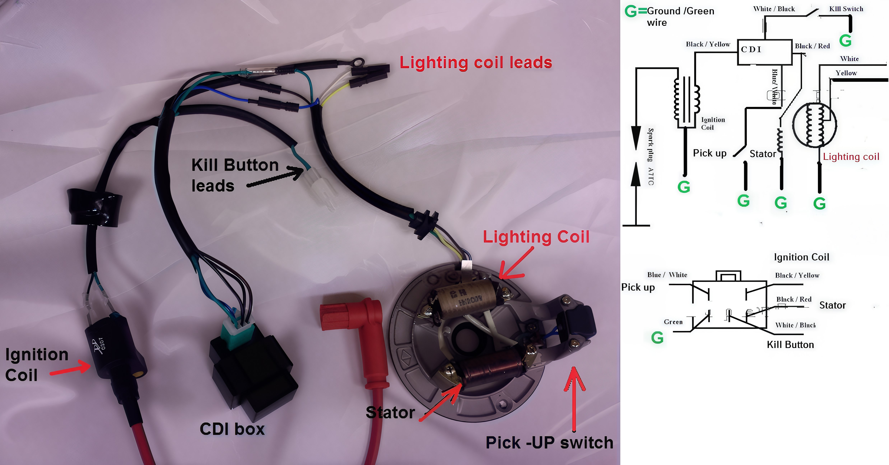

---
tags:
- engine
- wiring
---

# Engine Wiring

Electricity is indifferent to color coding. Examine the CDI box and trace the wire from the correct pin location to the appropriate component.

## Initial Setup

It is advisable to first install all necessary components to operate the engine. Only after successfully starting the engine should you proceed to integrate the chassis wiring, which includes elements such as lighting.

### Requirements for Engine Operation

To initiate the engine, you will require the following connections from the engine:

- Three wires:
  - stator
  - pickup
  - and ground

**Example:**  
The bottom right pin of the CDI connects to the stator.

