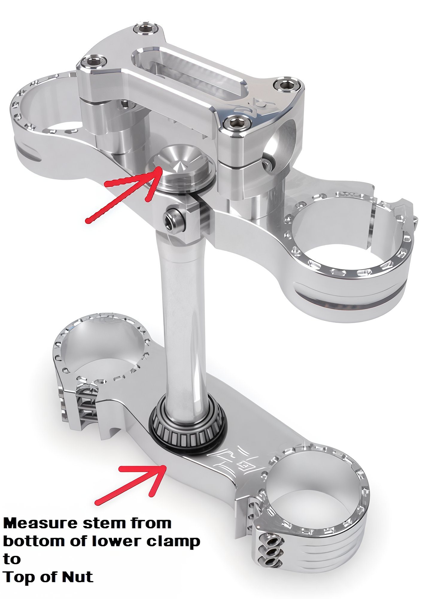

# Fork Measurements

To ensure the correct fit when acquiring new forks or components, precise measurements in millimeters (mm) are essential. Follow these steps to obtain the necessary dimensions:

1. **Outer Diameter (OD) of the Fork Legs at the Top Clamp**  
   Measure the outer diameter of the fork legs where they meet the top clamp. Common measurements are 48mm or 45mm.

2. **Outer Diameter (OD) of the Fork Legs at the Bottom Clamp**  
   Determine the outer diameter of the fork legs at the bottom clamp.

3. **Overall Length from Center of Axle to Top of Leg**  
   Measure the total length from the center of the axle to the top of the fork leg.

## Measuring the Overall Stem Length

