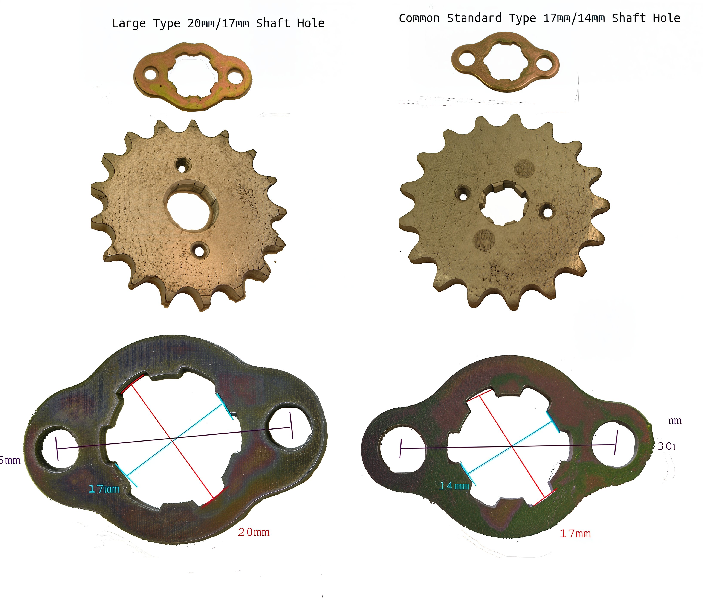

---
tags:
- gears
- specs
---

# Front Sprockets

China Pit bikes are equipped with two distinct types of front sprockets, also known as countershaft sprockets. The majority of pit bikes utilize a standard or smaller shaft, measuring 17mm/14mm. This specification is common among various models, including:

- YX Piranha motors
- SSR models: 70, 140, 150, 160
- Pitster Pro models: 70, 140, 155
- HO 155

Conversely, a select few engines, such as the Lifan 125cc, require a larger shaft, which measures 20mm/14mm. This specification is applicable to models like the SSR 125TR.

